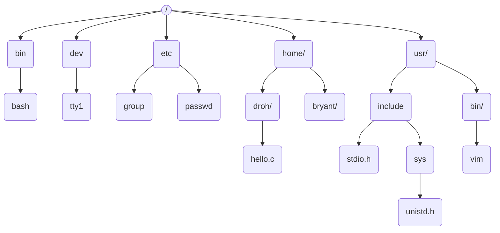

#  20250915-Week2-虚拟机 & Shell

*Updated 2025-09-16 14:29 GMT+8*  
 *Compiled by Hongfei Yan (2025 Fall)*    

https://github.com/GMyhf/2025fall-cs201/


logs：

>  熟练掌握 Linux 系统、Shell 命令、OJ 测试数据处理、Markdown 编写及 GitHub 使用，是必备的基础技能。
>
>  
>
>  写程序时，通常打开终端（terminal），通过 SSH 登录到服务器，使用 vi 编辑代码，并借助 python/g++/gcc 进行解释、编译和调试。
>
>  现在，北京大学为大家提供了这样的实际环境——每位同学和老师都可以领取并使用一台云端虚拟机。该虚拟机配置为 4GB 内存、100GB SSD 硬盘，支持安装 Linux 系统，供大家自由探索和学习。
>
>  👉 申请地址：https://clab.pku.edu.cn/
>  💬 答疑渠道：QQ群 432191140，入群问题答案：linuxclub@pku.edu.cn


# 0 操作系统入门

**Windows、macOS 与 Linux**

作为计算机学习的基础，大家需要了解不同操作系统（Operating System, OS）的特点与使用方式。课堂和作业环境以 **Linux (clab 云虚拟机)** 为统一平台，但同学们的本地电脑可能是 **Windows** 或 **macOS**。掌握三者的差异与联系，有助于后续课程中无障碍切换环境。


## 0.1 Windows

- **特点**
  - 全球使用人数最多的桌面操作系统，界面友好。
  - 广泛用于办公、游戏和通用应用。
  - 软件兼容性最强（Office、QQ、微信、IDEA、VS 等）。
- **优点**
  - 图形化界面直观，上手门槛低。
  - 丰富的商业软件生态。
- **不足**
  - 系统底层封闭，命令行环境（PowerShell / CMD）相对弱于 Linux。
  - 部分开发环境需要额外配置（如编译器、包管理器）。
- **建议**
  - 日常可用 Windows 完成基础办公。
  - 开发课程项目时推荐：
    - **使用 WSL (Windows Subsystem for Linux)** 安装 Ubuntu，体验接近原生的 Linux 环境。
    - 或者直接使用学校提供的 **clab 云虚拟机**。

------

## 0.2 macOS

- **特点**

  - 苹果电脑专属操作系统，基于 UNIX，内置强大的命令行（Terminal + zsh/bash）。
  - 稳定、安全，适合开发与科研。

- **优点**

  - <mark>与 Linux 命令体系接近，学习 Shell 命令几乎可以无缝迁移</mark>。
  - 自带开发工具链（clang、git、ssh、python）。
  - 适合开发 AI/科研项目，M1/M2/M3 芯片性能强劲。

- **不足**

  - 硬件价格较高。
  - 部分软件兼容性弱（尤其是 Windows 独占软件或游戏）。

- **常用命令**

  - `ls`, `cd`, `pwd`, `ssh` 与 Linux 完全一致。

  - 包管理器推荐安装 **Homebrew**：

    ```bash
    /bin/bash -c "$(curl -fsSL https://raw.githubusercontent.com/Homebrew/install/HEAD/install.sh)"
    brew install git python vim
    ```

------

## 0.3 Linux

- **特点**
  - 开源、免费的类 UNIX 系统。
  - 广泛用于服务器、科研和云计算，是程序员和科研人员必备技能。
  - 课程统一环境（clab 虚拟机）即为 Linux。
- **优点**
  - 命令行（Shell）功能强大，脚本化、自动化能力突出。
  - 软件包丰富，社区支持活跃（如 Ubuntu、Fedora、RockyLinux）。
- **不足**
  - 图形界面体验较弱（但本课重点在命令行操作）。
  - 对初学者有一定学习曲线。
- **典型发行版**
  - **Ubuntu**：最常见，适合新手。
  - **Fedora / RockyLinux**：学校云虚拟机采用的企业级发行版。
  - **Arch Linux**：极客最爱，灵活但需要深厚功底。

------

## 0.4 三者比较

| 特点         | Windows                       | macOS                        | Linux (课程环境)                  |
| ------------ | ----------------------------- | ---------------------------- | --------------------------------- |
| 内核         | Windows NT                    | UNIX                         | Linux Kernel (开源)               |
| 用户界面     | 图形界面为主，命令行较弱      | 图形界面优雅，命令行功能强大 | 以命令行为核心                    |
| 学习曲线     | 最容易上手                    | 对程序员友好                 | 需要练习，但最接近服务器/科研环境 |
| 软件生态     | 办公/游戏丰富，开发需额外配置 | 原生开发工具链 + Apple 生态  | 包管理器安装一切，科研/服务器常用 |
| 推荐使用场景 | 日常学习、办公、娱乐          | 开发、科研、跨平台学习       | 服务器、OJ、分布式、AI项目        |

------

👉 **结论**

- **课堂/作业统一在 Linux (clab VM) 环境完成**，确保一致性与可移植性。
- **Windows 用户**：推荐学习 WSL 或直接用云虚拟机。
- **macOS 用户**：几乎可以无缝衔接 Linux，日常开发可直接在 Mac 上完成。
- **Linux 用户**：本课程就是你的主场。


# 1 虚拟机

虚拟机（Virtual Machine, VM）是一种通过软件模拟的、具有完整硬件系统功能的计算机系统，运行在一个完全隔离的环境中。虚拟机可以运行在物理计算机之上，允许用户在同一台硬件上运行多个操作系统和应用程序，极大地提高了资源利用率和灵活性。

**常见的本地虚拟机软件**

1. **Parallels Desktop**：主要为Mac用户提供了一个运行其他操作系统（如Windows、Linux等）的解决方案。

2. **VirtualBox**：是一款开源的虚拟化产品，由Oracle公司提供支持。它可以安装在多种操作系统上（如Windows、Linux等），并能够运行大量的客户操作系统。VirtualBox因其免费受到广泛欢迎。

**云端虚拟机**

- **clab.pku.edu.cn**：CLab 是服务北大师生的云计算平台。提供基于云的虚拟实验室环境，供学生和研究人员用于教学、学习和科研目的。用户可以通过互联网访问这些虚拟机，执行编程实验、模拟等任务。

无论是本地还是云端的虚拟机，它们都提供了灵活的计算资源分配方案，帮助用户测试软件、开发新应用或进行研究工作，而无需投资额外的硬件设施。随着云计算技术的发展，越来越多的服务迁移到了云端，使得用户可以从任何地方访问高性能的计算资源。

#### Q1. 部署虚拟机意义？

既然第三步大模型安装和测试，可以不用虚拟机，这一步部署虚拟机意义？


> 部署虚拟机提供了一个分布式计算环境，在这个环境中每个虚拟机都可以作为一个独立的计算节点运行。当你有一个需要大量计算资源的任务时（比如分治任务），可以将这个任务分解成多个较小的子任务，并将这些子任务分配给不同的虚拟机来并行处理。这样做的好处是可以大幅减少总计算时间，因为多个子任务可以同时在不同的机器上执行。
>
> 利用部署的虚拟机集群来执行具体的计算任务。具体来说，一旦所有虚拟机都设置好并且可以通过SSH访问（即公钥已经添加到各个虚拟机的`authorized_keys`文件中），就可以通过编写脚本自动登录各个虚拟机、分发任务以及收集结果。

100个选课学生创建的虚拟机可以形成一个分布式系统

Clab.pku.edu.cn 云虚拟机，为每个用户提供 4 CPU, 4 GB RAM, 100 GB Disk。每个虚拟机的 .ssh/authorized_keys，保存了可以ssh 登录虚拟机的公钥。我们班100人，共 440 CPU, 440 GB, 11000 GB Disk。如果大家互相把每人的公钥（保存在各位本地机器 .ssh/id_ed25519.pub中的字符串），加入虚拟机的 authorized_keys，则 100个虚拟机可以形成一个分布式系统，可以用来计算分治任务。 

> <mark>分治任务</mark>是一种将问题分解成更小的子问题，分别求解这些子问题，然后合并这些子问题的解来得到原问题解的方法。一个典型的例子是计算一个大数组中所有元素的和。我们可以将这个数组分割成若干个较小的数组，每个虚拟机负责计算其对应的小数组的和，最后再将这些结果汇总起来得到整个数组的和。
>
> 登录云端服务器并利用云端计算资源，是现代开发和计算任务中常见的工作方式。一旦掌握了相关技能，便可以高效地使用云端服务器，拓展更多应用场景和计算任务。相比之下，本地设备通常性能有限，更适用于日常开发和基础调试。
>


> 部署虚拟机的意义主要体现在以下几个方面：  
>
> 1. **与云端环境接轨，培养云计算使用习惯**  
>  - 现代 AI 计算通常依赖云端 GPU 资源（如 AWS、Google Cloud、Azure），本地机器性能有限，无法高效运行大模型。  
>     - 通过虚拟机模拟远程服务器环境，让大家<mark>熟悉 SSH 登录、环境配置、远程代码执行等操作</mark>，为后续使用云端资源打下基础。  
>
> 2. **隔离环境，避免污染本地系统**  
>   - <mark>大模型部署涉及大量 Python 依赖（如 CUDA、PyTorch、Transformers），可能与本地已有环境冲突</mark>。  
>    - 在虚拟机或 Docker 容器中运行，可以隔离依赖，避免影响日常工作环境。  
> 
> 3. **统一环境，减少兼容性问题**  
>   - 本地机器硬件和系统差异较大（Windows/Linux/Mac），直接安装可能遇到驱动、CUDA 版本兼容性问题。  
>    - <mark>通过虚拟机，大家可以在统一的 Linux 服务器环境下测试，确保配置一致，提高稳定性</mark>。  
> 
> 4. **便于迁移到云端服务器**  
>   - 如果在本地虚拟机上调试成功，可以无缝迁移到真正的云服务器，而无需重新配置环境。  
>    - 这样可以降低云端服务器的调试成本，提高使用效率。  
> 
> **结论**  即使本地能跑通大模型，使用虚拟机仍然有 **环境隔离、与云端兼容、避免污染本机、提高可移植性** 等重要作用。部署虚拟机不仅是为了当前测试，更是为未来高效使用云端计算资源做准备。


#### Q2.时间复杂度**和**空间复杂度

> **Q2. 推荐力扣每日一题，简单、中等的都挺好。力扣的简单题目，力争提交后，击败超过 50%。**
>
> 感觉力扣波动挺大的，有的时候差一两毫秒就是10%和80%的区别，两次提交一样的代码就能差三四毫秒。
>
> A. 这是**事后测量**，其结果受到多个因素的影响，包括输入数据规模、编程语言的执行效率、以及系统当时的负载情况（如是否有其他任务在运行）。由于这些因素具有不确定性，测量结果难以精准预测，因此更常采用**事前估计**的方法，即 <mark>**大 O 表示法（Big-O Notation）**</mark>。它主要用于分析算法的**时间复杂度**和**空间复杂度**。  
>
> 在算法优化中，**时间复杂度**和**空间复杂度**通常难以同时达到最优，优化策略往往遵循“**以空间换时间**”的原则，而不是“**以时间换空间**”。这是因为：  
>
> 1. **空间资源相对廉价且可回收**：随着硬件的发展，存储成本不断降低，而计算时间却依然是关键瓶颈。  
> 2. **内存可复用**：算法执行完毕后，占用的内存可以释放，再用于后续任务，因此合理使用额外空间（如哈希表、缓存）通常是值得的。  
>
> 因此，在优化算法时，应优先考虑通过增加适量的空间占用（如使用缓存、预计算等），来减少计算时间，从而提升整体运行效率。
>
> 
>
> > LeetCode 的提交排名确实有较大的波动，这是由多个因素导致的，包括：  
> >
> > 1. **服务器负载**：LeetCode 的评测服务器可能在不同时间段运行不同的任务，影响执行时间。  
> > 2. **输入数据**：即使是同一个测试用例，底层执行可能受到缓存、内存分配等因素的影响。  
> > 3. **编程语言**：C++、Java、Python 的执行效率不同，比如 Python 由于解释执行，通常比 C++ 慢。  
> > 4. **JIT 优化**：某些语言（如 Java、PyPy）可能在运行过程中进行 Just-In-Time (JIT) 编译，导致运行时间有所浮动。  
> > 5. **CPU 调度**：服务器运行多个代码提交，CPU 资源可能被分配给其他任务，影响你的代码执行时间。  
> >
> > <mark>**如何更稳定地优化代码？**</mark>
> >
> > 因为测不准原理（执行时间有波动），我们不能只依赖测量结果，而是要使用**事前估计**的方法，即 **时间复杂度分析**（Big-O notation）。  
> >
> > - **时间复杂度**（Time Complexity）：分析算法的执行时间随输入规模 \( n \) 增长的变化，例如：
> >   - 线性时间  $O(n)$ ：遍历数组。
> >   - 对数时间  $O(\log n)$ ：二分查找。
> >   - 二次时间  $O(n^2)$ ：双层循环。
> >   - 指数时间  $O(2^n)$ ：递归爆炸增长（如暴力搜索）。  
> >
> > - **空间复杂度**（Space Complexity）：分析算法所需的额外内存。例如：
> >   -  $O(1)$ ：仅使用几个变量。
> >   -  $O(n)$ ：存储数组或哈希表。
> >   -  $O(n^2)$ ：存储邻接矩阵。  
> >
> > **LeetCode 提交如何击败 50%+？**
> >
> > 1. **优化时间复杂度**：优先选用更优的算法。例如：
> >    - **哈希表代替嵌套循环**（从  $O(n^2)$  优化为  O(n) ）。
> >    - **二分查找代替遍历**（从  O(n)  优化为  $O(\log n)$ ）。
> >    - **动态规划优化递归**（避免指数增长）。  
> >
> > 2. **减少不必要的计算**：
> >    - **缓存计算结果**（如 Memoization）。
> >    - **提前终止循环**（如 `break`、`continue`）。
> >    - **避免重复计算**（如 `set` 记录已访问值）。  
> >
> > 3. **选择合适的数据结构**：
> >    - **查找问题**：用哈希表 (`dict` / `unordered_map`) 代替数组遍历。
> >    - **队列 / 栈**：BFS / DFS。
> >    - **堆**：求前 K 大 / K 小值。  
> >
> > 4. **语言优化技巧**：
> >    - **Python**：使用 `map()`、`zip()`、`sum()` 等内置函数，避免手写循环。
> >    - **C++**：`vector` 预分配 (`reserve()`)，避免动态扩容。
> >    - **Java**：`StringBuilder` 代替 `String + String`，减少字符串拼接开销。  
> >
> > **总结**：如果代码能<mark>在理论上达到最优复杂度（如从  $O(n^2)$  降到  $O(n)$ ）</mark>，即使排名偶尔波动，长期来看仍能稳定击败 50% 以上的提交。


## 1.1 创建云端虚拟机

访问 https://clab.pku.edu.cn

⚠️：要用好云端虚拟机，需要熟悉Linux Shell命令，可以参考之后节内容 `2 Linux Shell 使用`

> 同时打开入门文档，https://clab.pku.edu.cn/docs/getting-started/introduction
>
> 我是在mac机器操作
>
> 在terminal中查看是否有公钥，
>
> ```
> ls .ssh/id_ed25519.pub
> ```
>
> 如果没有，运行 
>
> ```
> ssh-keygen -t ed25519
> ```
>
> - **保密通信**：`发送方` 用 `接收方的公钥` **加密** -> `接收方` 用 `自己的私钥` **解密**。
> - **身份验证（数字签名）**：`发送方` 用 `自己的私钥` **签名** -> `接收方` 用 `发送方的公钥` **验证**签名。


点击”云主机”,点击“创建云主机”按钮

可用域：nova

架构：X86

类别：labs_and_courses, l3,  4CPU, 4.00GiB

启动源：镜像

操作系统：RockyLinux 9.5

> Clab PKU 推荐的镜像是 RockyLinux 9，是一个基于 RHEL 的 Linux 发行版，有着良好的兼容性和稳定性。Ubuntu 24.04.1 和 Ubuntu 20.04 也是非常好的选择，有着良好的社区支持。
>
> 对于新手来说，Ubuntu 或 Linux Mint 可能是最好的起点，而对于寻求最新技术和功能的用户，Fedora 或 Arch Linux 则可能是更好的选择。对于企业级应用，CentOS Stream 或 openSUSE Leap 可以提供所需的支持和稳定性。

从云硬盘启动：是

系统盘：类型SSD，容量100GiB。直接用满100GB，这样省事，否则之后还要挂接数据盘。


点击页面右下角的“下一步”按钮，进入网络设置

共享网络：pku-new

虚拟网卡：默认值

安全组：默认值


点击页面右下角的“下一步”按钮，进入名称和密钥设置

名称：YouNameOne

登录凭证：默认值

SSH密钥对: 点“导入密钥”，名称：YouNameOne,  公钥：把`.ssh/id_ed25519.pub` 文件中内容贴进来

确认云主机的配置


#### Q3.unix上ssh登录，与RSA的公钥密钥关系？

> 在Unix系统上使用SSH进行登录时，RSA公钥和私钥的关系是非常重要的，因为它们是实现安全远程登录的基础。下面我将详细解释这个关系，并引用相关资料来支持说明。
>
> **SSH登录与RSA密钥对**
>
> 当用户希望通过SSH协议安全地连接到远程服务器时，可以采用两种主要的认证方式：口令认证和基于密钥的认证（也称为公钥认证）。这里我们关注的是基于密钥的认证，因为它更安全且便捷。
>
> **公钥认证流程**
>
> 1. **生成密钥对**：首先，在客户端机器上，用户需要生成一对RSA密钥（或其它非对称加密算法的密钥对），这可以通过`ssh-keygen -t rsa`命令完成。该命令会生成一个私钥文件（默认为`~/.ssh/id_rsa`）和一个对应的公钥文件（默认为`~/.ssh/id_rsa.pub`）。
>
> 2. **部署公钥**：然后，用户的公钥需要被添加到想要登录的远程服务器上的`~/.ssh/authorized_keys`文件中。这可以通过手动复制粘贴或者使用`ssh-copy-id user@remote_host`命令自动化完成。
>
> 3. **发起连接请求**：当用户尝试通过SSH连接到服务器时，客户端会发送其公钥给服务器进行验证。
>
> 4. **服务器验证**：服务器收到公钥后，会在`authorized_keys`文件中查找是否有匹配的公钥。如果有匹配项，则服务器会生成一个随机字符串并用找到的公钥加密后发送给客户端。
>
> 5. **客户端解密**：客户端收到加密后的字符串后，使用自己的私钥对其进行解密，并将解密后的结果发回给服务器。
>
> 6. **确认身份**：如果服务器能够验证返回的结果确实是之前发送的随机字符串，则认为客户端的身份得到了验证，允许登录。
>
> **RSA公钥和私钥的作用**
>
> - **公钥**：用于加密数据，任何人都可以获得它，因为它不包含任何敏感信息。在SSH场景下，公钥被用来加密服务器生成的挑战字符串。
>   
> - **私钥**：必须保密，只有持有者知道。私钥用于解密由公钥加密的数据。在SSH场景下，私钥被用来解密来自服务器的加密挑战字符串。
>
> **安全性考虑**
>
> 由于RSA加密算法的安全性依赖于大整数分解的困难性，因此确保私钥的安全至关重要。即使公钥公开，没有对应的私钥也无法解密数据。此外，为了进一步提高安全性，通常建议使用较长的密钥长度（如2048位或更高），以增加破解难度。
>
> 综上所述，SSH登录过程中使用的RSA公钥和私钥遵循非对称加密的基本原则，即公钥用于加密，私钥用于解密，这一机制保障了通信双方的身份验证和数据传输的安全性。


## 1.2 连接云主机 

云主机创建完成后，可以点击云主机的名称进入云主机详情页面。在这里可以看到云主机的状态、IP 地址等信息。我的IP是 `10.129.242.57`。


在terminal中登录云主机

```
ssh rocky@10.129.242.57
```

输入yes，回车


**在云端虚拟机中登陆网关，访问外网**

> 
>
> 

#### Q4. vi的使用？

> 需要会用vi编辑器，编辑文件。https://www.runoob.com/linux/linux-vim.html
>
>  vim
>
>  Vim (Vi IMproved), a command-line text editor, provides several modes for different kinds of text manipulation.
>
>  Pressing i in normal mode enters insert mode. Pressing <Esc> goes back to normal mode, which enables the use of Vim commands.
>
>  See also: vimdiff, vimtutor, nvim.
>
>  More information: https://www.vim.org.
>
>  \- Open a file:
>
>   vim path/to/file
>
> 
>
>  \- Open a file at a specified line number:
>
>   vim +line_number path/to/file
>
> 
>
>  \- View Vim's help manual:
>
>   :help<Enter>
>
> 
>
>  \- Save and quit the current buffer:
>
>   <Esc>ZZ|<Esc>:x<Enter>|<Esc>:wq<Enter>
>
> 
>
>  \- Enter normal mode and undo the last operation:
>
>   <Esc>u
>
> 
>
>  \- Search for a pattern in the file (press n/N to go to next/previous match):
>
>   /search_pattern<Enter>
>
> 
>
>  \- Perform a regular expression substitution in the whole file:
>
>   :%s/regular_expression/replacement/g<Enter>
>
> 
>
>  \- Display the line numbers:
>
>   :set nu<Enter>
>
> 
>
> Q. vi里面敲: help，如果提示Sorry, no help for help.txt
>
> 在 Linux 上，你可以安装完整版 Vim：
>
> ```
> sudo apt install vim        # Ubuntu/Debian
> sudo dnf install vim        # Fedora
> sudo yum install vim        # CentOS
> brew install vim            # macOS (使用 Homebrew)
> ```
>
> 如果你在 Windows 上使用 `vim.exe`，请确保安装的是完整版 Vim（如 gVim）。
>
> 
>
> 

```python
#!/usr/bin/env python3

import requests
import getpass

# 从命令行获取用户名和密码
username = input("请输入用户名: ")
password = getpass.getpass("请输入密码: ")

url = "https://its4.pku.edu.cn/cas/ITSClient"
payload = {
    'username': username,
    'password': password,
    'iprange': 'free',
    'cmd': 'open'
}
headers = {'Content-type': 'application/x-www-form-urlencoded'}

result = requests.post(url, params=payload, headers=headers)
print(result.text)
```

将程序保存为`login.py`，运行程序，根据提示输入用户名和密码，就可以登陆网关了。

运行程序

```
python login.py
```


> 要使用Vi编辑器粘贴并保存这段Python程序，并最终执行它，请按照以下步骤操作：
>
> **步骤 1: 打开终端**
>
> 首先，打开你的Linux终端。
>
> **步骤 2: 使用Vi创建新文件**
>
> 在终端中输入以下命令来使用Vi创建一个名为`login.py`的新文件：
> ```bash
> vi login.py
> ```
>
> **步骤 3: 进入插入模式**
>
> 进入Vi编辑器后，按下键盘上的 `i` 键进入插入模式（Insert Mode）。此时，你可以开始编辑文件内容了。
>
> **步骤 4: 粘贴代码**
>
> 将提供的Python代码复制到剪贴板中，然后在Vi编辑器内右键点击选择“粘贴”或者直接使用快捷键 `Ctrl+Shift+V` 来粘贴代码。确保所有代码都被正确地粘贴到了文件中。
>
> **步骤 5: 保存文件**
>
> 完成代码粘贴后，按下 `Esc` 键退出插入模式。然后输入以下命令保存文件并退出Vi编辑器：
> ```
> :wq
> ```
> 这里的 `:` 表示进入命令模式，`w` 是写入（保存）文件，`q` 是退出Vi编辑器。
>
> **步骤 6: 赋予执行权限**
>
> 为了能够运行这个Python脚本，你可能需要给它赋予执行权限。在终端中输入以下命令：
> ```bash
> chmod +x login.py
> ```
>
> **步骤 7: 执行程序**
>
> 最后，在终端中输入以下命令来运行这个Python程序：
> ```bash
> python3 login.py
> ```
> 注意：根据你的系统配置和安装的Python版本，可能需要使用 `python3` 而不是 `python` 来运行脚本。
>
> 现在，根据提示输入用户名和密码，就可以尝试登录网关了。


#### Q5.在输入密码的时候其它键都没反应？

在输入密码的时候其它键都没反应，只能敲回车然后跳出密码错误该怎么办？


A. 输入密码的时候不显示而已，正常输入就可以，这是为了保护你的密码


## 1.3 增加交换分区，扩展系统的可用内存

如果4GB内存够用，可以跳过此步。


```
sudo dd if=/dev/zero of=/swapfile bs=1M count=6144
sudo chmod 600 /swapfile
sudo mkswap /swapfile
sudo swapon /swapfile
sudo vi /etc/fstab
	在最后加一行 /swapfile none swap sw 0 0
sudo mount -a

```

> 通过上述操作所创建和配置的6GB是硬盘模拟的内存 。
>
> 虚拟内存是计算机系统内存管理的一种技术。它使得应用程序认为它拥有连续的可用的内存（一个连续完整的地址空间），而实际上，它通常是被分隔成多个物理内存碎片，还有部分暂时存储在外部磁盘存储器上，在需要时进行数据交换。
>
> 具体解释本次操作创建的虚拟内存
>
> · 创建交换文件：sudo dd if = /dev/zero of=/swapfile bs = 1M count = 6144 这条命令创建了一个大小为6GB（1M\times6144 = 6GB）的文件 /swapfile，这个文件的内容全部是0（因为 if=/dev/zero）。这个文件就是用来模拟内存空间的基础。
>
> · 设置权限：sudo chmod 600 /swapfile 设置文件权限，确保只有所有者可以读写该文件，保障数据安全。
>
> · 格式化为交换空间：sudo mkswap /swapfile 将创建的文件格式化为交换空间格式，使其能够被系统识别和使用。
>
> · 启用交换文件：sudo swapon /swapfile 激活这个交换文件，让它开始充当虚拟内存的角色。此时，系统在物理内存不足时，就会将部分暂时不使用的数据存储到这个交换文件中。
>
> · 配置开机自动挂载：通过编辑 /etc/fstab 文件并执行 sudo mount -a，确保系统重启后，这个交换文件依然能够自动挂载并生效。
>
> 当系统的物理内存不够用时，操作系统会将一部分暂时不使用的数据从物理内存移动到虚拟内存（即 /swapfile 文件）中，从而为当前需要运行的程序腾出物理内存空间。当这些数据再次需要被使用时，再从虚拟内存中调回到物理内存。
>
> 不过，虚拟内存的读写速度比物理内存慢很多，因为涉及到磁盘I/O操作。所以，在实际应用中，合理配置物理内存和虚拟内存的比例，对于系统的性能优化非常重要。
>
> 
>
> **虚拟内存**
>
> 虚拟内存是一种内存管理技术，它允许操作系统为每个进程提供一个独立、连续的地址空间，而无需考虑实际物理内存的布局或限制。通过虚拟内存，系统可以将数据存储在物理内存（RAM）和硬盘上的交换分区之间动态移动，以优化内存使用效率。
>
> **交换分区**
>
> 交换分区（或交换文件）是虚拟内存体系中的一个组成部分，主要用于扩展系统的可用内存。当系统的物理内存（RAM）不足时，不常用的内存页会被暂时移到交换分区上，从而释放物理内存供其他进程使用。这个过程称为“交换”（swapping）。因此，交换分区实际上是作为物理内存的一种补充，用于临时存放那些当前不活跃的数据。
>
> **关系**
>
> - **交换分区是实现虚拟内存的一部分**：虽然交换分区本身不是虚拟内存，但它对于支持虚拟内存机制至关重要。它是虚拟内存系统用来在物理内存不足时存储数据的地方。
> - **虚拟内存不仅仅包含交换分区**：虚拟内存还包括物理内存。虚拟内存系统会根据需要在物理内存和交换分区之间移动数据，以维持系统的高效运行。
> - **透明性**：对用户和应用程序而言，虚拟内存提供了统一的地址空间抽象，使得是否使用交换分区对它们来说是透明的。无论是位于物理内存还是交换分区上的数据，都通过相同的虚拟地址进行访问。
>
> 
>
> 在Linux系统中，虚拟内存并不对应硬盘上连续的单元。虚拟内存是一种内存管理技术，允许操作系统以为每个进程都有一个独立、连续且私有的地址空间的方式运行程序，但实际上这些地址空间可能映射到物理内存（RAM）的不同部分或硬盘上的交换分区（Swap space）。
>
> **虚拟内存的关键点包括：**
>
> - **非连续性**：虚拟内存地址与物理内存地址之间没有直接的一对一关系。操作系统通过页表（Page Table）来维护虚拟地址到物理地址之间的映射。这意味着即使虚拟地址空间看起来是连续的，它也可以映射到物理内存中的非连续区域。
>   
> - **分页机制**：虚拟内存通常以固定大小的块（称为“页”，一般为4KB）进行管理，并与物理内存中的相应块（也称为“帧”）进行映射。当物理内存不足时，某些页面会被保存到硬盘上的交换分区（Swap space），以便释放物理内存供其他更需要的进程使用。
>
> - **交换分区（Swap space）**：虽然交换分区位于硬盘上，但它并不是用来存储连续的虚拟内存块的。相反，它是作为物理内存的一个扩展，用于临时存放那些当前不活跃的内存页。因此，即使是交换分区本身，也不会保证虚拟内存页是以连续的形式存储的。
>
> 综上所述，虚拟内存的设计和实现确保了即便在物理层面上数据存储是非连续的，也能给用户和应用程序提供一个看似连续、一致的内存视图。这种抽象不仅提高了内存使用的灵活性和效率，还增强了系统的稳定性和安全性。


#### Q6. 请问成功与虚拟机连接上之后我们下一步要干什么?

A: 你多了台机器，想到做什么都可以的。这是学校送给你的机器，系统是Linux，可以在上面写程序、编译/解释/调试、运行，或者部署 从零构建模型 的代码等。

> 例如：
>
> 1）部署 从零构建大模型 的 代码。放到clab云虚拟机上了，可以从我本地机器通过浏览器访问。
>
> 
>
> 
>
> 2）我现在可以在浏览器里面写程序，实际上就是连到云虚拟机。
>
> 
>
> 这是浏览器的一个页面。类似于力扣提供的 Playground，但是不付费的化，只能开6个页面。我这云虚拟机可以开无数。
>
> 
>
> 3）把我有的OJ测试数据，也搬到云虚拟机上了。testing_code.py, offlinejudge.zsh都可以用的。
>
> ```python
> # testing_code.py
> import subprocess
> import difflib
> import os
> import sys
> 
> def test_code(script_path, infile, outfile):
>     command = ["python", script_path]  # 使用Python解释器运行脚本
>     with open(infile, 'r') as fin, open(outfile, 'r') as fout:
>         expected_output = fout.read().strip()
>         # 启动一个新的子进程来运行指定的命令
>         process = subprocess.Popen(command, stdin=fin, stdout=subprocess.PIPE)
>         actual_output, _ = process.communicate()
>         if actual_output.decode().strip() == expected_output:
>             return True
>         else:
>             print(f"Output differs for {infile}:")
>             diff = difflib.unified_diff(
>                 expected_output.splitlines(),
>                 actual_output.decode().splitlines(),
>                 fromfile='Expected', tofile='Actual', lineterm=''
>             )
>             print('\n'.join(diff))
>             return False
> 
> 
> if __name__ == "__main__":
>     # 检查命令行参数的数量
>     if len(sys.argv) != 2:
>         print("Usage: python testing_code.py <filename>")
>         sys.exit(1)
> 
>     # 获取文件名
>     script_path = sys.argv[1]
> 
>     #script_path = "class.py"  # 你的Python脚本路径
>     #test_cases = ["d.in"]  # 输入文件列表
>     #expected_outputs = ["d.out"]  # 预期输出文件列表
>     # 获取当前目录下的所有文件
>     files = os.listdir('.')
> 
>     # 筛选出 .in 和 .out 文件
>     test_cases = [f for f in files if f.endswith('.in')]
>     test_cases = sorted(test_cases, key=lambda x: int(x.split('.')[0]))
>     #print(test_cases)
>     expected_outputs = [f for f in files if f.endswith('.out')]
>     expected_outputs = sorted(expected_outputs, key=lambda x: int(x.split('.')[0]))
>     #print(expected_outputs)
> 
>     for infile, outfile in zip(test_cases, expected_outputs):
>         if not test_code(script_path, infile, outfile):
>             break
> 
> ```
>
> testing_code.py只能是测试数据是 0.in, 0.out, 1.in,1.out....这种数字文件名时候才能用，因为代码里面有个按照整数排序。如果测试文件是其他字母名字，不能用。
>
> 
>
> offlinejudge.zsh
>
> ```shell
> cd $2
> for i in *.in; do
> 	diff -y <(python3 "$1" < "$i")  "${i%.*}.out"
> done
> 
> ```
>
> 
>
> 
>
> offlinejudge.zsh都可以用，测试文件什么名字都可以。需要在 测试数据 所在目录中运行。
>
> 
>
> 
>
> **使用测试数据运行程序**
>
> 本书提供了一些题目的测试数据，见：
> https://github.com/GMyhf/2021fall-cs101/tree/main/cs101_test_data
>
> 下载并解压后，你会看到类似 `0.in`, `0.out` 的文件对。
>
> - `0.in` 是输入数据
> - `0.out` 是正确输出结果
>
> 将程序文件与测试数据放在同一目录下，然后在 **PowerShell** 中运行：
>
> ```powershell
> python 4A.py < 0.in > 0my.out
> ```
>
> 解释：
>
> - `< 0.in` 表示将 `0.in` 内容作为输入数据
> - `> 0my.out` 表示程序的输出结果写入到 `0my.out` 文件
>
> 此时，你只需对比 `0my.out` 与 `0.out`，即可发现程序与标准答案的差异，从而定位 bug。
>
> 
>
> **3. 在 macOS 中的操作**
>
> 在 **macOS** 下操作方式类似，也需要先确认 Python 的安装位置，然后使用同样的 `<` 与 `>` 重定向符号来运行和保存结果。
>
> 视频讲解参考：
>
> - Windows 环境：https://www.bilibili.com/video/BV1jT4y1B7eU
> - macOS 环境：https://www.bilibili.com/video/BV15341137sg


## 1.4 在云虚拟机部署《从零构建大模型》

《从零构建大模型》代码，https://github.com/rasbt/LLMs-from-scratch

RockyLinux / RHEL / Fedora 系统级的包管理器（类似于 Ubuntu 的 `apt`）。可以安装系统软件、库、Python 解释器。

Python 官方的包管理工具。可以安装 Python 生态里的库（numpy、torch、jupyter 等）。

uv是更高级的 Python 包管理器，创建虚拟环境并安装项目依赖（比 pip 快）。例如：创建虚拟环境：`uv venv`，安装依赖：`uv pip install -r requirements.txt`，运行程序：`uv run python train.py`


以下安装 Python3.11、uv、依赖、Jupyter。

### 1.安装 Python 3.11

RockyLinux 默认可能只有 Python 3.9，需要启用 **EPEL 和 CRB**，用 `dnf` 安装：

```bash
sudo dnf update -y
sudo dnf install -y epel-release
sudo dnf config-manager --set-enabled crb
sudo dnf install -y python3.11 python3.11-devel python3.11-pip
```

确认版本：

```bash
python3.11 --version
```

------

### 2.安装 uv（包管理工具）

和 Mac 一样用 pip：

```bash
python3.11 -m pip install --upgrade pip
python3.11 -m pip install uv
```

------

### 3.获取代码

```bash
wget https://github.com/rasbt/LLMs-from-scratch/archive/refs/heads/main.zip
unzip main.zip
cd LLMs-from-scratch-main
```

> 如果没有wget，可以 sudo dnf install wget 安装
>
> 如果网络速度慢，下载不到main.zip，可以从本地机器scp拷贝到云虚拟机。例如：
>
> scp LLMs-from-scratch-main.zip rocky@10.129.242.57:~/tmp/


### 4.创建虚拟环境

```bash
uv venv --python=python3.11
source .venv/bin/activate
```

验证：

```bash
which python
python --version
```

应该输出 `.venv/bin/python` 和 `3.11.x`。

### 5.安装依赖

```bash
uv pip install torch
uv pip install -r requirements.txt
```

为了之后程序能 import sklearn.xxx，

可以一并安装

```bash
uv pip install scikit-learn
```


### 6.设置新口令

```
jupyter server password
```

### 7.启动 Jupyter Lab

Linux 下和 Mac 一样：

```bash
uv run jupyter lab --no-browser --ip=0.0.0.0 --port=8888
```


然后局域网另外机器浏览器访问输出的 URL（通常是 `http://localhost:8888/lab`）。

http://10.129.242.57:8888/lab


#### Q6.字符界面，就是编程自由的意思。

字符界面（CLI, Command Line Interface）确实给编程带来了极大的自由度。在 Linux 下，使用终端可以方便地编写、编译、运行和调试各种语言的代码，比如 Python、C、C++ 等。以下是一些提升开发效率的技巧。


> **C++程序示例，C程序示例**
>
> 给我一个C++程序示例，一个C程序示例，以及在linux系统下编译、运行的方法。
>
> A. 以下是一个简单的 C++ 和 C 代码示例，并附上在 Linux 下的编译和运行方法。  
>
> ---
>
> **C++ 示例程序**
>
> 文件名：`hello.cpp`
>
> ```cpp
> #include <iostream>
> 
> int main() {
>     std::cout << "Hello, C++!" << std::endl;
>     return 0;
> }
> ```
>
> **编译 & 运行 (Linux)**  
>
> ```sh
> g++ hello.cpp -o hello_cpp
> ./hello_cpp
> ```
>
> ---
>
> **C 示例程序**
>
> 文件名：`hello.c`
>
> ```c
> #include <stdio.h>
> 
> int main() {
>     printf("Hello, C!\n");
>     return 0;
> }
> ```
>
> **编译 & 运行 (Linux)**  
>
> ```sh
> gcc hello.c -o hello_c
> ./hello_c
> ```
>
> 1. `g++` 用于编译 C++ 代码，而 `gcc` 用于编译 C 代码。
> 2. `-o` 选项用于指定输出的可执行文件名称。
> 3. `./hello_cpp` 和 `./hello_c` 运行编译生成的可执行文件。
>
> 
>
> 以下是一些提升开发效率的技巧：
>
> ---
>
> **1. Python（脚本语言）**
>
> Python 脚本不需要编译，直接运行：
>
> ```sh
> python3 script.py  # 运行 Python 脚本
> ```
>
> **工具**
>
> - `vim` / `nano` / `neovim`：终端文本编辑器
> - `ipython`：增强版 Python 交互环境
> 
>---
> 
>**2. C / C++（编译语言）**
> 
>在终端编写、编译和运行 C / C++ 程序：
> 
>**编译 & 运行 C**
> 
>```sh
> gcc program.c -o program
> ./program
> ```
> 
>**编译 & 运行 C++**
> 
>```sh
> g++ program.cpp -o program
> ./program
> ```
> 
>**工具**
> 
>- `gdb`：GNU 调试器
> 
> ---
> 
> **3. 调试**
>
> **C / C++ 调试**
>
> ```sh
>g++ -g program.cpp -o program
> gdb ./program
>```
> 
> **Python 调试**
> 
> ```sh
>python3 -m pdb script.py
> ```
>
> ---
> 
> **4. 高效开发环境**
>
> 在 Linux 终端下，可以结合多种工具提升开发体验：
>
> - **`tmux`** / **`screen`**：支持多窗口管理
>- **`vim` / `neovim`**：强大的代码编辑器，支持语法高亮
> - **`cmake`**：管理 C/C++ 项目构建
>- **`lldb`**：苹果推荐的调试工具（C++ / C）
> - **`autopep8`** / **`black`**：Python 代码格式化
> 
> ---
> 
> **5. 一键编译 & 运行（脚本化）**
>
> 对于 C/C++，可以写一个简单的 `run.sh` 脚本，自动编译和运行：
>
> ```sh
>#!/bin/bash
> g++ program.cpp -o program && ./program
>```
> 
> 然后赋予执行权限：
> 
> ```sh
>chmod +x run.sh
> ./run.sh
>```
> 
> ---
> 
> 字符界面让编程更加自由，不受 GUI 约束，适合高效开发和自动化。


#  2 Linux Shell使用

> linux-help（Linux Shell简介），
>
> https://pku.instructuremedia.com/embed/06bda1b0-3342-4705-9c77-e279638f1af2
>
> 学linux命令的小游戏，每次找下一级登录口令
>
> https://overthewire.org/wargames/bandit/

**定义**：在 Linux 或 Unix 系统中，Shell 是一个命令行解释器，它接收用户的命令并将其发送给操作系统内核。

**功能**：Shell提供字符界面，可以执行程序、编译代码、控制和监测计算机的运行状态。

**重要性**：<mark>大多数底层功能的高效执行需要基于Shell</mark>，而不是图形界面（GUI）。因此，Shell在计算机基础学习中不可或缺。使用Shell能够帮助你更好地利用你的设备，提高工作效率。

我们主要讨论的是Linux环境下的Bash，也称为BASH (Bourne Again Shell)。在打开BASH后，你会看到命令提示符，它由多个部分组成：用户名、主机名、工作目录和"$"符号作为命令提示符。

在这里是rocky。打印当前用户还有一种方法，是`whoami`。第二部分是主机名，可以理解为计算机的名字，在这里是jensen。

```
(base) hfyan@HongfeideMac-Studio ~ % ssh rocky@10.129.242.98
Last login: Sat Feb 15 07:50:12 2025 from 162.105.89.132
[rocky@jensen ~]$ whoami
rocky
[rocky@jensen ~]$ pwd
/home/rocky
[rocky@jensen ~]$ 
```

可以使用`pwd` (print working directory) 打印当前工作目录，在这里 `/home/rocky`是工作目录，意思就是我们当前处在这个目录中。其他命令还有 `echo`回显，`cal`是打印今天的日历，`clear`清屏。

## 2.1 快捷键和学习资源

使用快捷键来提升效率，快速编辑命令行内容。

**Ctrl + U**：删除光标前的所有字符。

**Ctrl + K**：删除光标后的所有字符。

**Ctrl + A**：定位到命令的首部。

**Ctrl + E**：定位到命令的尾部。

**Ctrl + R**：在命令历史记录中进行反向搜索。


快捷键可以减少你输入命令的麻烦。设想这样一种情况，键入了一个非常非常长的指令，但是敲到一半的时候，突然发现整个都错了，需要重新写，按退格键或者一直按着，但是这样子删光整一行，可能需要比较长的时间，可以使用快捷键  `ctrl + u`，删除光标下的所有字符一直到行首。与之相对应的 `ctrl + k`，删除光标下的字符直至行尾。

再比如安装软件如果发现 permission denied，因为你不是管理员用户，需要在前面加sudo。使用上下键来定位我们之前输入过的命令，然后 `ctrl + a` 定位到命令的首部，插入sudo，这时候你就可以直接按enter执行了。`ctrl + e` 回到整行的后面。

`trl + r`（reverse search in bash history）是一个非常重要的快捷键。

`ctrl + l` 与`clear`基本等效，但是它前面的东西都清除掉，不会清除当前行输入的命令。


对于学习资源，除了直接在命令后面加上`--help`获取简要信息外，还可以使用man指令查看详细的用户手册。比如说你不知道ls这个指令应该怎么用，可以直接 `ls --help`，更详细的，可以`man ls`。 man命令是“manual”的缩写，用于显示命令的手册页（manual pages），在这样的这个手册界面中，一般可以使用`vi`来定位浏览，j向下，k向上，如果你要在这个手册中搜索一些信息的话，可以先按正斜杠，然后再输入你要搜索的关键词，比如说line，然后按enter，这个时候所有的line都会被高亮，你再按n，也就代表next，就可以慢慢的向下搜索了。对于这些手册，可以用q来退出它，就是quit。

man也好，help也好，都不是非常的易读，也不是能在短时间内能够看完的，所以你就会想太长不看，有这样一个too long didn't read第三方软件。它可以提供简单常用的命令示例，而且只使用一句话来描述。比如说 `tldr ls`，就会看到打印了一些常用的参数组合。比如需要解压缩一个tar文件，参数都会比较长，初学可能都记不太住，`tldr tar`打印一些常见的解压缩以及压缩的指令的用法。

> 在 Linux 的 Shell 中，可以使用以下方法安装 `tldr`（命令行速查工具）：
>
> **方法 ：使用 npm 安装（推荐）**
>
> `npm` 是 Node.js 的包管理器，如果尚未安装，可以先安装 Node.js：
>
> ```
> sudo dnf install nodejs                         # Fedora
> 
> ```
>
> 然后安装 `tldr`：
>
> ```
> sudo npm install -g tldr
> ```


另外一个比较有用的命令叫info，以咨询一些信息。info是什么？叫做GNU Core Utils，是Linux中一些核心的小工具。

先安装

```
sudo npm install -g info
```

如果你运行 `info` 的话，会看到关于这个小工具的一个手册，里面有非常多有意思的工具。如果大家对shell的用法感兴趣的话可以探索，在网上也是有html版的，当你在这些文档中都找不到好用的信息的时候，可以上网搜索。推荐 https://unix.stackexchange.com/, https://stackoverflow.com/，比较容易能够获得有效的信息。


## 2.2 与文件系统交互

在shell中最基础的命令可能是同文件系统进行交互，也就是资源管理器的功能。Linux文件系统一般遵循文件系统层次化标准FHS，在该标准中系统中的一切事物都被视为文件，包括目录，但目录的文件名会有/以示区别，尽管输入目录名称时候，有时候会省略它。

文件以竖形的结构组织在以根目录/为根的文件树中。一般而言，根目录的下一集目录的名字都是固定的。例如所有用户的家目录都存储在home/下。




访问文件系统需要路径的概念，它是指文件树上从某个节点到另一个节点的路径上，所有文件名字符串的连接。从当前工作目录开始的路径称为相对路径，以根目录开始的路径则称为绝对路径。

例如考虑上图中的 `hello.c` 的绝对路径和相对路径，绝对路径是/home/droh/hello.c
而如果我们以`home`为工作目录，那么相对路径为`droh/hello.c`。如果我们在 droh 这个用户的家中，则可以直接用 `hello.c`这个相对路径直接访问它。

有几个特殊路径也是比较常用的，这包括 `\`根目录和 `~` 家目录以及 `.` 当前目录和 `..` 上一级目录


### 文件操作

有了路径的概念后，可以开始文件系统的相关操作。在文件系统中浏览和定位主要是用ls和cd两个指定

- **`ls`**：列出目录内容。list directory contents
  - **`ls -a`**：列出所有文件，包括隐藏文件。隐藏文件一般以 . 打头。
  - **`ls -l`**：以长列表形式列出文件详细信息。
  
- **`cd`**：更改工作目录。change directory
  
  - **`cd ..`**：返回上一级目录。
  - **`cd ~`**：返回家目录。
  - **`cd -`**：返回上一次访问的目录。
  
- **`mkdir`**：创建目录。make directory

- **`touch`**：创建空白文件或修改文件时间戳。

- **`rm`**：删除文件。remove directory
  - **`rm -r`**：递归删除目录及其内容。<mark>慎重使用，删除后无法通过常规手段恢复</mark>。
  
  - **`rm -f`**：强制删除，不提示确认。
  
    > 命令中的通配符，* 匹配任意常的字符串，? 匹配一个字符
    >
    > 例如： rm -rf proxylab/*   表示删除proxylab下面的所有文件
    >
    > rmdir proxy lab/   删除空目录
  
- **`mv`**：移动文件或重命名文件。

- **`cp`**：复制文件。
  - **`cp -r`**：递归复制目录及其内容。

### 文件查看和执行

- **`cat`**：打印文件内容。concatenate
- **`less`**：分页查看文件内容。以类似于手册的方式来观察比较长的文件。可以使用手册中的那种键盘操作，按q退出
- **`head`**、**`tail`**：查看文件的开头或结尾部分。
- **`./`**：执行文件。执行文件采用./再加路径的方式。例如：`./bomb`

有关文件的查看，还有wordcount,find,dif等指令。


### 环境变量

难道不应该使用`ls`的完整路径来执行吗？系统使用环境变量中的path变量来完成这件事。所谓环境变量，一般是指在操作系统中用来指定运行环境的一些参数，比如临时文件夹位置，系统文件夹位置等等。

`echo $HOSTNAME` 打印主机名，`echo $PATH`打印环境变量PATH的值，可以得到一些用冒号分隔的绝对路径。当我们进入一个指令的时候，系统会在这些路径中先顺序搜索可执行文件名，如果找到了就执行。

```
[rocky@jensen ~]$ echo $HOSTNAME
jensen.instance.cloud.lcpu.dev
[rocky@jensen ~]$ echo $PATH 
/home/rocky/.local/bin:/home/rocky/bin:/usr/local/bin:/usr/bin:/usr/local/sbin:/usr/sbin
```

使用export这样的指令来改写环境变量

- **`export`**：设置环境变量。
- **`which`**：查找命令的路径。

### 文件权限

观察 `ls -la`的输出，由十位组成，第一位表示是否目录，剩下三位为一组，分别代表用户，用户组和其他人对这个文件的权限。文件权限包括读、写、执行，分别用rwx来表示，如果是一个短横线 - 则表示没有这个权限。对于目录来说，执行权限就是搜索，简单的说就是否能够 `cd` 到这个目录里。

```
[rocky@jensen ~]$ ls -la
total 28
drwx------. 6 rocky rocky  190 Feb 15 10:02 .
drwxr-xr-x. 3 root  root    19 Feb 14 04:51 ..
-rw-------. 1 rocky rocky 1162 Feb 15 07:50 .bash_history
-rw-r--r--. 1 rocky rocky   18 Apr 30  2024 .bash_logout
-rw-r--r--. 1 rocky rocky  141 Apr 30  2024 .bash_profile
-rw-r--r--. 1 rocky rocky  492 Apr 30  2024 .bashrc
-rw-------. 1 rocky rocky   42 Feb 15 09:52 .lesshst
-rw-r--r--. 1 rocky rocky  483 Feb 14 05:06 login.py
drwxr-xr-x. 4 rocky rocky   72 Feb 15 09:55 .npm
drwxr-xr-x. 2 rocky rocky   21 Feb 14 06:52 .ollama
-rw-------. 1 rocky rocky    7 Feb 14 05:07 .python_history
drwx------. 2 rocky rocky   29 Feb 14 04:51 .ssh
drwxr-xr-x. 3 rocky rocky   19 Feb 15 10:02 .tldr

```


- **`ls -l`**：查看文件权限。
- **`chmod`**：更改文件权限。
  - **`chmod u+x`**：给用户添加执行权限。即 chmod u/g/o +/- r/w/x，表示为用户user，用户组group，其他人other来添加加+删除-减三种权限

### 文件打包和压缩

谈到权限我们顺道就可以说到tar这个指令，常会用到tar格式的存档文件，它和zip甚至win rar的区别是它可以保留linux中的文件权限。tar是tape archive的缩写，就是在备份文件的时候常会用到磁带机。用tar打包之后一般会再进行压缩，扩展名为tar.gz指经过gzip算法压缩，而tar.bz2则是经过bzip2算法压缩。

- **`tar`**：打包文件。
  - **`tar czvf`**：打包并压缩文件。
  - **`tar xzvf`**：解压文件。

### 文件重定向和管道

shell中的程序通常有三个流，也就是输入input stream，输出output stream和错误error stream。一般来说它们都是默认定项到终端中显示的，可以把它们重定向到文件中或者通过管道传输到另外一个程序中，以方便操作和观察。

- **`<`**：重定向输入到文件。

  例如：$ ./bomb < 0.in 用0.in这个文件作为bom的输入。

- **`>`**：重定向输出到文件。

  例如：echo hello > hello.txt 把echo的输出重定向到hello.text中，这时候 cat hello.txt 就看到hello.txt文件中出现了 hello 这样的文字。

- **`>>`**：追加输出到文件。

  例如：echo hello2 >> hello.txt

- **`2>`**：重定向错误输出。

  例如： grep a b 2> log.txt 在文件b中查找模式a

- **`&>`**：可以同时重定向错误和标准输出。

  例如：grep a b &> log.txt

- **`|`**：管道，将前一个命令的输出作为后一个命令的输入。

  例如：./bomb < phase | grep solution  从输出中打印那些恰好含有solution这个词的那些行


#### Shell脚本示例重定向 01017:装箱问题

http://cs101.openjudge.cn/practice/01017

提交代码Wrong Answer，借助测试数据找到哪里出错。


进到测试数据目录

```
[rocky@jensen 1017]$ ls -l
total 92
-rw-r--r--. 1 rocky rocky 31873 Oct  1  2023 aamy.out
-rw-r--r--. 1 rocky rocky   586 Nov 26  2008 d.c
-rw-r--r--. 1 rocky rocky 34950 Nov 26  2008 d.in
-rw-r--r--. 1 rocky rocky  7805 Nov 26  2008 d.out
-rw-r--r--. 1 rocky rocky   465 Oct 11 08:49 e1.py
-rw-r--r--. 1 rocky rocky   217 Dec  6  2008 me.cpp
-rw-r--r--. 1 rocky rocky  1355 Oct 11 09:24 testing_code.py
[rocky@jensen 1017]$ ls ../../offlinejudge.zsh 
```


其中e1.py保存的是WA的程序

```python
import math
determine_2with3=[0,5,3,1]

while True:
    n1,n2,n3,n4,n5,n6 = map(int,input().split())
    if n1+n2+n3+n4+n5+n6==0:
        break
    boxes = n4+n5+n6+math.ceil(n3/4)
    spaceleft_for_b = n4*5 + determine_2with3[n3%4]
    if n2 > spaceleft_for_b:
        boxes += math.ceil(n2-spaceleft_for_b/9)
    spaceleft_for_a = (boxes-n6)*36-n5*25-n4*16-n3*9-n2*4
    if n1 > spaceleft_for_a:
        boxes += math.ceil(n1-spaceleft_for_a/36)
    print(boxes)

```


offlinejudge.zsh 是Shell脚本

```bash
cd $2
for i in *.in; do
	diff -y <(python3 "$1" < "$i")  "${i%.*}.out"
done
```


> 这段 Bash 脚本用于批量对比 Python 脚本的输出与预期输出。以下是其工作原理的详细解析：
>
> **代码解析**
>
> ```bash
> cd $2
> ```
> - 进入用户提供的目录 `$2`（脚本的第二个参数）。
>
> ```bash
> for i in *.in; do
> ```
> - 遍历当前目录下所有以 `.in` 结尾的文件（即输入文件）。
>
> ```bash
> diff -y <(python3 "$1" < "$i")  "${i%.*}.out"
> ```
> - `"$1"` 是脚本的第一个参数，表示 Python 脚本的路径。
> - `python3 "$1" < "$i"`：运行该 Python 脚本，并使用 `$i` 作为输入文件（`*.in`）。
> - `<(...)` 是 **进程替换**，将 Python 脚本的输出作为 `diff` 命令的一个输入。
> - `"${i%.*}.out"` 解析如下：
>   - `"${i%.*}"` 移除 `$i` 文件名的最后一个 `.` 及其后缀，即 `input.in` → `input`。
>   - `"${i%.*}.out"` 生成相应的 `.out` 文件名（如 `input.out`）。
> - `diff -y`：
>   - `diff` 比较两个文件的内容。
>   - `-y` 以 **并排（side-by-side）** 方式显示差异，方便人工对比。
>
> ---
>
> **使用示例**
>
> 假设目录结构如下：
> ```
> 1017/
> │── aamy.out
> │── d.c
> │── d.in
> │── d.out
> │── e1.py
> │── me.cpp
> │── testing_code.py
> ```
> 执行：
> ```bash
> bash ../../offlinejudge.zsh e1.py ./
> ```
> 脚本会：
> 1. 进入 `./` 目录。
> 2. 遍历所有 `.in` 文件：
>    - 对 `d.in`，运行 `python3 e1.py < d.in`，并将其结果与 `d.out` 进行 `diff -y` 对比。
>
> ---
>
> **总结**
>
> 此脚本适用于**测试 Python 脚本的标准输入/输出是否符合预期**，特别是在编程竞赛、自动化测试或算法开发中。
>
> 
>
> 


#### Python脚本管道示例27300:模型整理

http://cs101.openjudge.cn/practice/27300/


Wrong Answer


e1.py

```python
# -*- coding: utf-8 -*-
"""
Created on Fri Feb 14 19:58:10 2025

@author: Liren Chen
"""

n = int(input())
mx,sj = [],{}
for i in range(0,n):
    a,b = input().split('-')
    if a not in sj:
        sj[a] = [[],[]]
        mx.append(a)
        if b[-1]=='B':
            if '.' in b:
                b = float(b[0:-1])
            else:
                b = int(b[0:-1])
            sj[a][1].append(b)
        else:
            if '.' in b:
                b = float(b[0:-1])
            else:
                b = int(b[0:-1])
            sj[a][0].append(b)
    else:
        if b[-1]=='B':
            if '.' in b:
                b = float(b[0:-1])
            else:
                b = int(b[0:-1])
            sj[a][1].append(b)
        else:
            if '.' in b:
                b = float(b[0:-1])
            else:
                b = int(b[0:-1])
            sj[a][0].append(b)
mx.sort()
for i in mx:
    sj[i][0].sort()
    sj[i][1].sort()
    if len(sj[i][0])==0:
        print(i+': '+', '.join(str(j)+'B' for j in sj[i][1]))
    if len(sj[i][1])==0:
        print(i+': '+', '.join(str(j)+'M' for j in sj[i][0]))
    else:
        print(i+': '+', '.join(str(j)+'M' for j in sj[i][0])+', '+', '.join(str(j)+'B' for j in sj[i][1]))

```


```
[rocky@jensen 27300]$ ls
0.in   10.in   11.in   12.in   13.in   14.in   15.in   16.in   17.in   18.in   19.in   1.in   2.in   3.in   4.in   5.in   6.in   7.in   8.in   9.in   e1.py
0.out  10.out  11.out  12.out  13.out  14.out  15.out  16.out  17.out  18.out  19.out  1.out  2.out  3.out  4.out  5.out  6.out  7.out  8.out  9.out
```


testing_code.py

https://github.com/GMyhf/2024fall-cs101/blob/main/code/testing_code.py

```python
# ZHANG Yuxuan
import subprocess
import difflib
import os
import sys

def test_code(script_path, infile, outfile):
    command = ["python", script_path]  # 使用Python解释器运行脚本
    with open(infile, 'r') as fin, open(outfile, 'r') as fout:
        expected_output = fout.read().strip()
        # 启动一个新的子进程来运行指定的命令
        process = subprocess.Popen(command, stdin=fin, stdout=subprocess.PIPE)
        actual_output, _ = process.communicate()
        if actual_output.decode().strip() == expected_output:
            return True
        else:
            print(f"Output differs for {infile}:")
            diff = difflib.unified_diff(
                expected_output.splitlines(),
                actual_output.decode().splitlines(),
                fromfile='Expected', tofile='Actual', lineterm=''
            )
            print('\n'.join(diff))
            return False


if __name__ == "__main__":
    # 检查命令行参数的数量
    if len(sys.argv) != 2:
        print("Usage: python testing_code.py <filename>")
        sys.exit(1)

    # 获取文件名
    script_path = sys.argv[1]

    #script_path = "class.py"  # 你的Python脚本路径
    #test_cases = ["d.in"]  # 输入文件列表
    #expected_outputs = ["d.out"]  # 预期输出文件列表
    # 获取当前目录下的所有文件
    files = os.listdir('.')

    # 筛选出 .in 和 .out 文件
    test_cases = [f for f in files if f.endswith('.in')]
    test_cases = sorted(test_cases, key=lambda x: int(x.split('.')[0]))
    #print(test_cases)
    expected_outputs = [f for f in files if f.endswith('.out')]
    expected_outputs = sorted(expected_outputs, key=lambda x: int(x.split('.')[0]))
    #print(expected_outputs)

    for infile, outfile in zip(test_cases, expected_outputs):
        if not test_code(script_path, infile, outfile):
            break
```

<mark>这个程序**实际上使用了管道（pipe）** 来捕获 Python 子进程的输出</mark>


> **代码功能：**
>
> 此 Python 脚本的主要目的是**自动测试另一个 Python 程序的输出是否与预期结果一致**，适用于多组测试用例的批量验证。  
>
> **执行流程解析：**
>
> ---
>
> ① **导入必要模块**
>
> ```python
> import subprocess  # 用于启动子进程，执行 Python 程序
> import difflib     # 生成输出的差异比较
> import os          # 文件和目录操作
> import sys         # 处理命令行参数
> ```
>
> ---
>
> ② **核心函数：`test_code()`**
>
> ```python
> def test_code(script_path, infile, outfile):
> ```
> 该函数用于执行目标 Python 脚本，并将其输出与预期结果进行比对。  
>
> **(1) 构建 Python 命令**
>
> ```python
> command = ["python", script_path]
> ```
> - 通过 `subprocess` 模块构造执行命令，`script_path` 是目标 Python 脚本路径。  
> - 假设输入为 `python class.py`，此处 `script_path` 指的是 `"class.py"`。
>
> **(2) 读取输入和预期输出**
>
> ```python
> with open(infile, 'r') as fin, open(outfile, 'r') as fout:
>     expected_output = fout.read().strip()
> ```
> - 打开输入文件 `infile` 和输出文件 `outfile`。
> - `expected_output` 保存了去除首尾空白字符的预期结果。
>
> **(3) 运行目标脚本**
>
> ```python
> process = subprocess.Popen(command, stdin=fin, stdout=subprocess.PIPE)
> actual_output, _ = process.communicate()
> ```
> - **`subprocess.Popen()`** 启动一个子进程，执行目标 Python 脚本。
>     - **`stdin=fin`**：将输入文件作为 Python 程序的输入。  
>     - **`stdout=subprocess.PIPE`**：捕获程序的输出，方便与预期结果比较。  
> - **`process.communicate()`**：等待子进程完成，获取输出结果。
>
> **(4) 输出对比**
>
> ```python
> if actual_output.decode().strip() == expected_output:
>     return True
> ```
> - 将子进程输出解码为字符串并去除空白字符，若与预期输出一致，返回 `True`，表示该用例通过。
>
> **(5) 生成差异报告**
>
> 如果输出不一致，则输出差异信息：
> ```python
> print(f"Output differs for {infile}:")
> diff = difflib.unified_diff(
>     expected_output.splitlines(),
>     actual_output.decode().splitlines(),
>     fromfile='Expected', tofile='Actual', lineterm=''
> )
> print('\n'.join(diff))
> return False
> ```
> - **`difflib.unified_diff()`**：生成统一格式的输出差异。
>     - `expected_output.splitlines()`：将期望输出按行分割。  
>     - `actual_output.decode().splitlines()`：将实际输出按行分割。  
>     - `fromfile='Expected'` 和 `tofile='Actual'`：差异报告的标签。
>     - `lineterm=''`：避免多余的换行符。  
> - 通过 `print()` 打印出详细的输出差异信息。
>
> ---
>
> ③ **主程序入口**
>
> ```python
> if __name__ == "__main__":
> ```
> 确保以下代码仅在脚本被直接运行时执行。
>
> **(1) 检查参数**
>
> ```python
> if len(sys.argv) != 2:
>     print("Usage: python testing_code.py <filename>")
>     sys.exit(1)
> ```
> - **`sys.argv`** 读取命令行参数。  
> - 如果没有提供目标 Python 脚本路径，程序会提示正确用法并退出。
>
> ---
>
> **(2) 获取输入和输出文件**
>
> ```python
> files = os.listdir('.')
> ```
> - **`os.listdir()`** 获取当前目录下的所有文件列表。
>
> **筛选 `.in` 和 `.out` 文件：**
> ```python
> test_cases = [f for f in files if f.endswith('.in')]
> expected_outputs = [f for f in files if f.endswith('.out')]
> ```
> - 过滤出以 `.in` 结尾的输入文件和 `.out` 结尾的输出文件。
>
> **按数字顺序排序：**
> ```python
> test_cases = sorted(test_cases, key=lambda x: int(x.split('.')[0]))
> expected_outputs = sorted(expected_outputs, key=lambda x: int(x.split('.')[0]))
> ```
> - 按文件名前缀的数字部分排序，确保输入和输出文件一一对应。
>     - 例如：`1.in` 对应 `1.out`，`2.in` 对应 `2.out`。
>
> ---
>
> **(3) 执行测试**
>
> ```python
> for infile, outfile in zip(test_cases, expected_outputs):
>     if not test_code(script_path, infile, outfile):
>         break
> ```
> - **`zip()`** 将输入和输出文件配对遍历。  
> - 对每个输入输出文件调用 `test_code()`，若输出不匹配，立即终止测试（通过 `break` 退出循环）。  
>
> ---
>
> ④ **执行示例**
>
> 1. 运行命令：
> ```bash
> python ../../testing_code.py e1.py
> ```
>
> 2. **输出情况**：
> - **若所有测试用例均通过**，无输出。  
> - **若有差异**，例如 `0.in` 失败，输出类似以下结果：
> ```
> Traceback (most recent call last):
>   File "/mnt/data/20071224-POJTestData/4000_/27300/e1.py", line 23, in <module>
>     b = float(b[0:-1])
> ValueError: could not convert string to float: '1.3B'
> Output differs for 0.in:
> --- Expected
> +++ Actual
> @@ -1,2 +0,0 @@
> -Bert: 110M, 340M
> -GPT: 350M, 1.3B, 175B
> 
> ```
>
> ---
>
> **总结**
>
> 该脚本自动化测试 Python 程序的输出，具有以下特点：
> 1. **批量测试**：对所有 `.in` 文件进行测试并与相应的 `.out` 文件比对。  
> 2. **差异报告**：使用 `difflib` 输出详细差异，方便调试。  
> 3. **自动终止**：若发现错误，立即终止后续测试，节省时间。  
> 4. **兼容性强**：适用于任何标准输入/输出形式的 Python 程序测试。
>
> 
>
> 
>
> 


我们介绍了Shell的基本概念、常用命令、快捷键、文件操作、环境变量、文件权限、打包压缩以及重定向和管道。


# 参考

1. Build a Large Language Model (From Scratch) (Sebastian Raschka)  这本书的程序，可以在  https://colab.research.google.com/ 用免费的GPU运行。https://github.com/rasbt/LLMs-from-scratch

   
