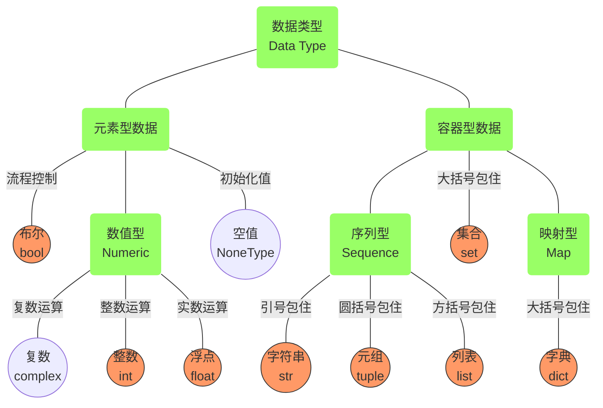

# 20250930-Week4-黎明/My flight

*Updated 2025-09-30 14:41 GMT+8*
 *Compiled by Hongfei Yan (2024 Spring)*


已经进入第四周了，这标志着一个学期的时间已经过去了四分之一，真是光阴似箭。

第一次月考：2025.10.09 周四 7-8节。支持 G++, Python3 & PyPy3 提交。

> 
>难度是Easy、Medium、Tough，参考CF的 900～1100, 1200~1400，1500～1600+。
> 
>题目安排：可能是 1E + 4M + 1T，或者 2E + 3M + 1T。每个题目：
> 1）时间限1000ms，内存限65536KB。可能调整。
> 2）题面有中英文双语，变量给出范围。月考不保证。
> 3）提供两组样例数据，及必要解释。月考不保证。
> 4）有知识点标签，如：sorting, string, implementation, greedy, brute force, matrix, two pointers, dict, stack, math等。
> 5）可原创，也可用原题，如取自 codeforces.com,  leetcode.cn, luogu.com.cn等平台。


> **2023fall 题目设计考虑**
>
> Updated 0934 GMT+8 Dec 25, 2023
>
> 1. 考察知识点：题目应涵盖语法、数据结构和算法等主要知识点，以测试学生对这些知识的理解和应用能力。
>
> 2. 难度控制：Easy题目大约需要10分钟完成；Medium题目大约需要20分钟完成；Tough题目因为每个学生的能力不同，因人而异。
>
> 3. 难度水平：题目的难度低于12份月考和平时最难的几次作业，以确保大多数学生都能够应对。
>
> 4. 简洁性：在题目设计时应避免设计过于繁琐的模拟题目，尽量保持简洁明了，突出重点。
>
> 5. 可解性：题目设计时应避免设计过于困难或者难以找到思路的题目，如高级贪心题目。学生应该能够有一定的思路来解决问题。
>
> 6. 知识点整合：可以将不同的知识点进行组合，例如结合数据结构、常规的贪心算法和动态规划等，以提高题目的综合性和难度。
>
> 7. 单一问题：除非特意增加难度，题目设计时尽量避免设计一题多问的情况，让学生集中精力解决一个问题。
>
> 8. 学生掌握情况：题目设计应根据班级大多数学生的掌握情况，确保题目的难度与学生的水平相匹配，既不过于简单也不过于困难。
>
> 9. 考试1小时52分钟：在考试前，学生应保持最佳状态，==充足的睡眠和身体健康非常重要==，这样才能发挥最佳水平。


# 一、Book 计算思维算法实践

引自《 计算思维算法实践》/Book_my_flight_202509.md 的 ch1, ch2 & ch3

## 前言

### **致使用本书的学生**

当我们阅读时，另一个人替我们思考：我们只是重复他的思维过程。

When we read, another person thinks for us: we merely repeat his mental process. 

——叔本华


​	计算思维离不开从数学和计算机的角度来考虑问题，有时还需要应用物理知识。许多题目是对现实问题的再现、简化或变形，因此解题是训练新手解决实际问题的一种有效手段。在解题过程中，学习者需要保持清晰的思路与缜密的逻辑，形成一套系统化的问题思考方式。通过日积月累的练习，自然而然地就能养成计算思维。下面摘录了两位初学者在培养计算思维过程中的心得体会。

​	“计算机思维与日常的数学逻辑思维紧密相关，但因处理问题数量级的不同而存在显著差异。**在日常生活中，我们很少设想自己能够以每秒上亿次的速度进行运算，因此我们在处理问题时的思维方式与计算机思维有着本质上的不同**。由此可以看出，随着计算能力的增强，不仅带来了处理规模的扩大，更重要的是引发了思维方式的革新。正如‘More is different’所揭示的那样，更多的资源可以带来全新的可能性。”

​	“数学思维在编程中至关重要，它可以帮助你简化题目并降低时间复杂度。有时候拿到题目立即动手并不是最佳选择。如果题目中给出了数据范围，应该先估计一下时间复杂度，确保所选算法能够在规定的时间内完成任务。
​	此外，使用Python这门语言时，虽然其丰富的函数库极大地方便了开发工作，但有时也可能限制了深入思考的机会。例如，在轻松使用 `sum()` 函数时，可能会忽视其背后的时间复杂度，在反复调用该函数时可能导致超时问题。因此，理解底层实现原理同样重要。”

​	我整理编程题目，形成“计算思维算法实践”题库，http://cs101.openjudge.cn/pctbook/，旨在提升学生的计算思维和算法解决能力。希望这些资源能够帮助学生们在学习编程的旅程中迈出坚实的一步，同时激发他们解决问题的热情和创造力。这些题目主要由我和我的助教团队为任教班级设计，涵盖了从基础到高级的不同难度级别。每个题目的编号前的大写字母（E/M/T）分别代表该题目的难度等级：Easy（简单）、Medium（中等）、Tough（挑战）。计算概论初级班的学生应能够完成超过50个 Easy 级别的题目，并尝试挑战部分 Medium 难度的题目。计算概论中高级班的学生则有望完成所有 Easy 级别和超过90个 Medium 级别的题目，并鼓励同学们攻克一些 Tough 级别的挑战题目。我为这些题目准备了详细的解答指南，链接是：
https://github.com/GMyhf/2020fall-cs101/blob/main/2020fall_cs101.openjudge.cn_problems.md

​	通过这种方式，本书旨在帮助学习者首先掌握编程语法的基础知识，然后通过适配其当前水平的题目进行思维训练，逐步提升解决问题的能力至更高的层次。这种方法不仅能够确保学习者的稳步进步，还能有效激发他们的学习兴趣和动力，使他们能够在解决实际问题的过程中不断深化对计算思维的理解。	

### 致使用本书的教师

​	本书的编写初衷在于系统梳理北京大学《计算概论B》课程多年积累的教学内容，致力于打造一本专注于培养计算思维与算法实践能力的理想教材。为便于教学工作者参考，表 P.1 附录了笔者在2024年秋季学期《计算概论B》课程中的具体教学安排：第1至第6周侧重理论基础与编程语法的掌握；第7至第14周集中学习各类常见算法，并开展计算思维与算法实践训练；第15至第16周则用于课程总结与知识整合。

​	此外，本书第3章包含三个附录：附录3A汇总了初学者在编程学习过程中常见的问题与解答；附录3B整理了AI助教系统中同学们提出的高频问题及回应，助力自主学习；附录3C则收录课程题目，供读者练习与参考。	

- 课程安排与练习题目。本课程为期16周，每周安排3个学时，期间学生将完成大约150至200道题目。

- 解题思路的重要性。简明的解题思路在启发思考、激活联想方面起着至关重要的作用。本书秉持“言简意赅”的原则，力求用一两句话清晰地传达核心思想，避免冗长叙述。基于这一理念，某些题目的解题思路精选自学习者的亲身体验，这些思路言简意赅且具有点睛之效，能够帮助读者迅速抓住问题的关键，激发创造性思维。


表P.1 北京大学2024年秋季学期《计算概论B》课程安排

| 1. 课程概述                     | 2. 计算机文化                   | 3. 开发环境和程序设计语言    |
| ------------------------------- | ------------------------------- | ---------------------------- |
| 4. 计算机原理                   | 5. 语法（1/2）：变量、操作符    | 6. 语法（2/2）：控制结构     |
| 7. 算法（1/6）：贪心和动态规划  | 8. 算法分析                     | 9. 信息传递和二维数组        |
| 10. 算法（2/6）：递归和动态规划 | 11. 算法（3/6）：递归和动态规划 | 12. 算法（4/6）：遍历（1/3） |
| 13. 算法（5/6）：遍历（2/3）    | 14. 算法（6/6）：遍历（3/3）    | 15~16. 课程总结（1/2、2/2）  |


## 第1章 计算机科学与智能时代

​	计算机文化这一概念的成型与广泛传播缺乏确切的考证时间，但其兴起大致可追溯至20世纪80年代后期。从最初的计算装置到独立学科，再到深刻影响人类社会的文化形态，计算机的演进轨迹堪称技术革命的典范。广义而言，计算机文化不仅指对技术操作的认知，更包含对计算本质的理解——即在合适场景中合理运用计算资源的能力。这种文化素养既需要技术操作层面的掌握，更要求使用者具备对计算技术适用性的判断力。

​	本章旨在帮助读者全面认识计算机科学作为一门独立学科的历史、组成与发展脉络，并引出人工智能（AI）作为当前计算科技前沿的核心方向。从图灵机理论到摩尔定律，从大数据涌现到分布式协同与智能模型演进，计算机不仅深刻改变了人类社会，也成为现代知识体系中连接自然科学与社会技术的桥梁。


### 1.1 计算机科学的学科体系与发展

#### 1.1.1 计算机科学的六大分支

​	计算机技术广泛渗透各行各业，其核心学科——计算机科学（Computer Science, CS），具有以下六大分支：`[1][2] `

- 计算机工程学（Computer Engineering），关注硬件与软件系统协同设计与优化。
- 计算机科学（Computer Science），聚焦计算理论与算法设计，探讨可计算性及效率，其衍生出人工智能、计算理论等众多子领域。
- 网络安全（Cybersecurity），保护数字资产，涵盖系统、人、组织多维度。
- 信息系统（Information Systems），研究组织级计算架构与管理策略。
- 信息技术（Information Technology），聚焦系统运维与服务支持。
- 软件工程学（Software Engineering），关注软件开发过程的系统性、可控性与质量保障。
- 数据科学（Data Science），整合统计学、机器学习处理海量数据，提取知识。

​	其中，CS作为本书核心领域，其权威组织包括 ACM（美国计算机协会）与 IEEE（电气与电子工程师协会）。该学科被定义为：系统研究信息处理的理论基础及其在计算系统中的实现技术，其核心在于对算法的系统性研究。学科分支涵盖理论计算（如计算复杂性理论）、应用计算（如计算机图形学）及人机交互等方向。

​	图灵机理论表明，各类计算设备在理论计算能力上具有等价性，但实际性能存在差异。尽管计算机科学以计算为核心，但正如E.W.戴克斯特拉（荷兰语：Edsger Wybe Dijkstra）所言："计算机科学并非仅关乎计算机，犹如天文学不单研究望远镜（Computer science is no more about computers than astronomy is about telescopes）"。这一学科融合了数学、语言学与工程学的精髓，自20世纪末逐步发展为独立学科。

​	计算机科学的独立学科地位历经长期演进。早期（1940-1960年代），虽然英国的剑桥大学等机构开设计算机科学课程，但将其归为数学或工程学的一个分支，并非独立的学科。首个计算机科学系是在 1962 年由美国的普渡大学设立，第一个计算机学院于 1980 年在美国的东北大学设立。现在，多数高校将计算机科学设为独立院系，部分院校根据学科特色与师资配置，将其与工程学院、应用数学系等联合设置。

​	在计算机科学领域，最高荣誉是ACM图灵奖（Turing Award），自1966年设立以来，它一直被誉为“计算机界的诺贝尔奖”。首位荣获此奖项的华人是姚期智教授，他在2000年因其对计算复杂性理论和密码学等领域的开创性贡献而获此殊荣。

​	近年来，随着机器学习和深度学习技术的发展，大语言模型成为了科技界的新宠。这些模型利用复杂的算法来理解和生成自然语言，展示了人工智能在处理人类语言方面的巨大潜力。值得一提的是，在2019年，约舒亚·本希奥（Yoshua Bengio）、杰弗里·欣顿（Geoffrey Hinton）以及杨立昆（Yann LeCun）共同获得了图灵奖，以表彰他们在推动人工智能领域深度学习技术方面所做出的杰出贡献。到了2024年，诺贝尔物理学奖被授予了约翰·霍普菲尔德（John Hopfield）和杰弗里·辛顿（Geoffrey Hinton），这是为了认可他们对于使用人工神经网络进行机器学习的基础性发现与发明。这一成就不仅突显了他们在各自领域的影响力，也强调了计算机科学与其他学科之间交叉融合的重要性。尽管图灵奖常被称为“计算机界的诺贝尔奖”，但它并不是诺贝尔奖的一部分，而是由美国计算机协会（ACM）颁发，专门用来奖励那些对计算机事业作出重大贡献的个人或团队。图灵奖的存在，极大地激励了全球计算机科学家们追求卓越，不断探索前沿技术的动力。 	

#### 1.1.2 摩尔定律与技术指数演进

​	贝尔实验室发明了晶体管，英特尔（Intel）和德州仪器（Texas Instruments）在20世纪70年代初开发微处理器，不久之后就发明了集成电路。摩尔定律（Moore's Law）由英特尔的创始人之一戈登·摩尔（Gordon Moore）提出，常被誉为计算机领域的第一定律。该定律指出，集成电路上可容纳的晶体管数目大约每两年就会翻一番。后来，这一观察被英特尔首席执行官大卫·豪斯（David House）修正为芯片性能大约每18个月提高一倍，这意味着随着集成度的增加，芯片不仅处理速度更快，而且整体性能也以类似指数级的速度增长。


<center>图1-1 电脑处理器中晶体管数目的指数增长曲线符合摩尔定律（A semi-log plot of transistor counts for microprocessors against dates of introduction, nearly doubling every two years）（注：图片来源为 wikipedia.org，2022年1月）</center>


​	自提出以来，半导体行业大致遵循着摩尔定律发展了超过半个世纪，对二十世纪后半叶的世界经济增长做出了巨大贡献，并推动了一系列科技创新、社会变革和生产力提升。几乎所有衡量数字电子设备能力的标准——包括处理速度、内存容量、乃至数字相机的像素数量——都与摩尔定律息息相关。个人电脑、互联网、智能手机等技术的发展和创新，皆离不开摩尔定律所描绘的技术进步趋势。这些进步显著提升了数字电子产品在全球经济各个领域的实用性。

​	戈登·摩尔于1929年1月3日出生在美国加州旧金山，拥有加州大学伯克利分校化学学士学位及加州理工学院物理和化学双博士学位。20世纪50年代中期，他与集成电路的发明者罗伯特·诺伊斯（Robert Noyce）共同在威廉·肖克利半导体公司工作。随后，他们与其他六位同事共同创立了仙童半导体公司（Fairchild Semiconductor），这成为现代Intel和AMD公司的前身。1968年，摩尔与诺伊斯离开仙童，共同创办了Intel公司。起初，Intel专注于数据存储领域，之后转向微型计算机的核心部件CPU的研发，奠定了其在计算机工业中的领导地位。


#### 1.1.3 多机协同与分布式计算

​	当我们探讨一台电脑能完成的任务时，或许它仅限于日常办公、娱乐或是简单的数据分析。然而，当我们将视角扩展至100台甚至整个数据中心的计算机群时，其潜力将呈指数级增长。早期，计算机处理复杂任务如科学研究或气象预报时，往往依赖于单一的强大机器，这不仅成本高昂，而且资源利用率有限。随着分布式计算（Distributed Computing）模式的发展，这一状况得到了根本性的改变。分布式计算通过整合成千上万台计算机的闲置计算能力，并借助互联网进行数据传输（通常称为志愿计算），使得大规模计算任务变得更为经济高效。

**分布式计算项目实例**

1. **Folding@home**  
   斯坦福大学化学系潘德实验室发起的Folding@home项目自2000年启动以来，专注于蛋白质折叠的研究，旨在揭示蛋白质结构与相关疾病之间的联系。面对庞大的计算需求，该项目利用了全球志愿者提供的计算资源，实现了惊人的计算能力，在2020年4月达到了2.43 exaflops的速度，成为首个突破exaflop大关的计算系统。

2. **世界社群网格（World Community Grid）**  
   IBM主持的世界社群网格项目始于2004年，致力于解决人类面临的重大健康和社会问题，包括艾滋病、癌症等疾病的治疗研究。截至2020年3月，已有超过450家机构和4万名活跃用户参与，累计贡献了超过200万年的计算时间。

3. **Distributed.net的密钥破解项目**  
   Distributed.net因其成功破解RC5-64加密算法而闻名，这是在2002年由全球超过33万名参与者共同努力的结果，展示了分布式计算在密码学领域的强大威力。

4. **动画制作**  
   在电影制作领域，梦工厂动画公司利用数百台HP工作站协作完成了《怪物史莱克2》和《马达加斯加》等影片的制作，展现了分布式计算在创意产业中的应用。

5. **谷歌搜索引擎**  
   谷歌作为全球最大的搜索引擎之一，其背后的技术基础设施支持着海量的数据处理需求。通过构建反向索引、MapReduce作业以及Percolator系统，谷歌能够持续更新搜索索引并提供快速响应。谷歌在全球设有多个数据中心，每个中心都配备了数千台服务器，确保了服务的高可用性和性能。

6. **阿卡迈科技（Akamai Technologies）**  
   Akamai是内容分发网络（CDN）领域的领导者，通过遍布全球的服务器网络为客户提供高速的内容交付服务。截至信息获取日期，Akamai拥有约32.5万台服务器，分布在130个国家和地区，极大地提升了互联网用户体验。

​	综上所述，从单机到多机乃至数据中心级别的协同工作，不仅改变了我们解决问题的方式，也推动了科技进步和社会发展。分布式计算模式通过有效整合分散资源，打破了传统计算能力的局限，开启了无限可能的新时代。


#### 1.1.4 数据的力量：从搜索引擎到社会变革

​	数据将会主宰未来社会，发挥巨大威力，数据的载体恰好是计算机。我们首先来看大数据技术在流感预警中的作用。流感是一种由病毒引起的呼吸道症状，流感具有传染性强，传播速度快的特点。对于流感，如果能提前预测其爆发，将会为卫生部门获取到宝贵的预防时间，对于降低危害，减少死亡率具有非常重要的作用。但要做到这一点，必须先知道这种流感出现在哪里。美国，和所有其他国家一样，都要求医生在发现新型流感病例时告知疾病控制与预防中心（CDC）。但由于人们可能患病多日实在受不了了才会去医院，同时这个信息层层报送疾控中心也需要时间，因此，发布新流感病例时往往会有一两周的延迟。而且，疾控中心每周只进行一次数据汇总。然而，对于一种飞速传播的疾病，信息滞后两周的后果将是致命的。这种滞后导致公共卫生机构在疫情爆发的关键时期反而无所适从。

​	2009 年 2 月 19 日，谷歌在 Nature 上面有一篇文章，“Detecting influenza epidemics using search engine query data”，论述了谷歌基于用户的搜索日志（其中包括，搜索关键词、用户搜索频率以及用户IP地址等信息）的汇总信息，成功预测了流感病人的就诊人数。它令公共卫生官员们和计算机科学家们感到震惊。文中解释了谷歌为什么能够预测冬季流感的传播：不仅是全美范围的传播，而且可以具体到特定的地区和州。谷歌通过观察人们在网上的搜索记录来完成这个预测，而这种方法以前一直是被忽略的。谷歌保存了多年来所有的搜索记录，而且每天都会收到来自全球超过 30 亿条的搜索指令，如此庞大的数据资源足以支撑和帮助它完成这项工作。

​	谷歌做的工作并不是实际意义上的预测什么时候流感来，而是将 CDC 已经获得但是没及时公布的数据提前给预测并公布出来。将得出的预测与 2007 年、2008 年美国疾控中心记录的实际流感病例进行对比后，谷歌公司发现，他们的软件找出了 45 条与流感高度相关的检索词的组合，如果这些词出现的规律用一个数学模型表示，则预测与官方数据的相关性高达 97%。和疾控中心一样，他们也能从用户检索数据中判断出流感是从哪里传播出来的，而且判断非常及时，不会像疾控中心一样要在流感爆发一两周之后才可以做到。

​	所以，2009 年甲型 H1N1 流感爆发的时候，与习惯性滞后的官方数据相比，谷歌成为了一个更有效、更及时的指示标。公共卫生机构的官员获得了非常有价值的数据信息。惊人的是，谷歌公司的方法甚至不需要分发口腔试纸和联系医生——它是建立在大数据的基础之上的。这是当今社会所独有的一种新型能力，即以一种前所未有的方式，通过对海量数据进行分析，获得有巨大价值的产品和服务，或深刻的洞见。基于这样的技术理念和数据储备，下一次流感来袭的时候，世界将会拥有一种更好的预测工具，以预防流感的传播。

​	我们再来看数据重构商业的威力。某网上交易平台，年成交量是 1 万亿，相当于 17 个省的 GDP。线上商业活动的活跃将导致以后的商铺租不出去，书店、服装店等实体店将减少50%。微信的出现让传统的电话短信业务不再成为通讯服务提供商的赢利点。 

​	据测算，从 2018 年到 2025 年，中国拥有的数据量将从 7.5ZB 增长到 48.6ZB，占全球的 27.8%，远高于美国的 17.5%。

​	国家数据局在 2025-04-29 发布的《全国数据资源调查报告(2024年)》中的官方统计显示：中国全年数据生产量 41.06ZB，同比 +25%；全国数据存储总量 2.09ZB，存储空间利用率 61%。我国已形成医疗、工业、教育等行业的高质量数据集335个，有效赋能人工智能大模型研发。在这个万物互联的世界，高速流动的数据就是生产资料，可以创造无限的价值。

> **ZB（Zettabyte，泽字节）**
>
> - 是数据量的单位，1 ZB = $10^{21}$ 字节（十进制计法），即一万亿 GB。
> - 常用单位对照：
>   - 1 KB = 10³ B
>   - 1 MB = 10⁶ B
>   - 1 GB = 10⁹ B
>   - 1 TB = 10¹² B
>   - 1 PB = 10¹⁵ B
>   - 1 EB = 10¹⁸ B
>   - **1 ZB = 10²¹ B**
>
> 可以简单记：**ZB ≈ 10 亿 TB**，相当于给 10 亿台 1TB 硬盘装满的数据量。


#### 1.1.5 计算机发展简史：从算盘到AI芯片

​	硬件是计算机中固态可见的部分，看得见，摸得到。计算机械有着很长的历史，然而最初的计算设备是为特殊用途而设计的。大约公元前 100 年出现的安提凯希拉装置（Antikythera mechanism），1901 年于希腊安提凯希拉岛上的一艘古船残骸中被发现的随船沉没的钟形装置。该装置由一系列可以被控制的铜质齿轮（超过30个）、曲柄和刻度盘组成。百余年后，科学家终于在现代先进技术辅助下，揭开它惊人谜底——这座名为“安提凯希拉装置”的装置竟然是一台两千年前的超级天文“计算机”，天文学家计算天体运行周期的工具，它的先进性在其制成后千年间无人超越。算盘之类的算术工具，尤其是在亚洲地区已经有上千年的使用历史。在约翰·纳皮耶描述了对数之后不久，计算尺于17世纪早期被发明了出来。和现代计算机最接近的先驱是雅各提花织机，在 19 世纪左右由法国的约瑟夫·马里·雅各发明，通过多行打孔的矩形卡片来确定特定的编织图案。这种提花织机是“可编程的”，可以通过改变打孔卡片发出的指令来改变编织的图案。这种可节省人力的纺织机械的发明，导致很多编织工人失去了工作，并因此造成了社会混乱。1811~1816 年在英国发生的卢德运动就是一个针对机械化的暴力抗议。现代的计算机技术同样会对一些传统工作带来冲击。

​	今天的计算机理念起源于 19 世纪，从英国**查尔斯·巴贝奇**（Charles Babbage，1791 年 12 月 26 日－1871 年 10 月 18 日）的作品发展而来。巴贝奇是一个对导航和天文学有兴趣的科学家，这两个领域都需要有数值表以计算位置。他的毕生心血花在建筑计算机械上，希望能建造一个可以将枯燥易错的手工计算过程机械化的机器。由于很多原因，未能实现这个雄心壮志，其中一个原因是财政赞助人。即使这样，他的设计还是很完美的。借助那个时代的材料和工具，他的一些机器在现代得以实现。在伦敦的科学博物馆可以看见差分机。"差分"的含义是把函数表的复杂算式转化为差分运算，用简单的加法代替平方运算。差分机使用有限差分方法来机器计算多项式函数的值。有限差分方法是个简单但功能强大的技巧，它用重复加减的过程来避免需要的乘法和除法。

​	查尔斯·巴贝奇激励了奥古斯塔·艾达·拜伦对数学和他的计算设备的兴趣。艾达是诗人乔治·拜伦的女儿。她被认为是世界上第一个程序员，Ada 编程语言也以她的名字命名。

​	19 世纪晚期，赫尔曼·何乐礼（Herman HollerithHerman Hollerith，1860 年 2 月 29 日－1929 年 11 月 17 日）为美国人口普查局工作，他设计并制造出了和人工操作相比可以更快地将普查数据列成表格的机器。采用雅各提花机的灵感，何乐礼通过在卡纸上打孔以将普查数据编码成可以利用他的机器处理的格式。1880 年的普查结果利用 8 年时间才全部录入表格，而借助何乐礼的打孔卡片和打孔卡片制表机（Tabulation Machine），1890 年的普查结果只用了一年时间便得以完成。何乐礼在 1896 年，创办了制表机器公司（Tabulating Machine Company），它是IBM的前身。

​	计算芯片的发展脉络如图1-2和表 1-1 所示。从 1906 年电子管的诞生开始，历经晶体管、集成电路、大规模集成电路等阶段，直至进入人工智能时代的 AI 芯片，计算核心在这一百余年的历程中不断演进与飞跃。


<center>图1-2 计算芯片演进</center>

表1-1 计算芯片发展脉络

| 技术                                           | 出现年份                            | 代表事件 / 关键人物                                          | 备注                                                         |
| ---------------------------------------------- | ----------------------------------- | ------------------------------------------------------------ | ------------------------------------------------------------ |
| 电子管（Vacuum Tube）                          | 1906                                | 李·德·福雷斯特（Lee De Forest）发明三极管（Audion）          | 标志着电子放大与开关技术的诞生，被用于早期收音机、雷达、计算机（如ENIAC）。 |
| 晶体管（Transistor）                           | 1947                                | 贝尔实验室（约翰·巴丁、沃尔特·布拉顿、威廉·肖克利）发明点接触型晶体管 | 体积更小、功耗更低，1950年代逐渐取代电子管。                 |
| 集成电路（IC, Integrated Circuit）             | 1958                                | 德州仪器的杰克·基尔比（Jack Kilby）制作出首个集成电路；1959年仙童半导体的罗伯特·诺伊斯（Robert Noyce）提出平面工艺硅IC | 将多个晶体管、电阻、电容等元件集成在一片半导体芯片上。       |
| 大规模集成电路（LSI, Large Scale Integration） | 1970年代                            | 数千至上万个晶体管集成在单芯片                               | 推动微处理器（Intel 4004, 1971）诞生，计算机进入个人化时代。 |
| AI芯片（AI Accelerator, AI Processor）         | 2016（概念普及） / 2017（商用高峰） | Google TPU（2016）、NVIDIA Tensor Core GPU（Volta架构, 2017）、华为昇腾（2018） | 针对深度学习矩阵运算优化的专用芯片，支持大规模并行计算和高能效AI推理训练。 |

​	1942 年开始的美国的**原子弹计划**核爆计算促成了计算机的诞生。第一代（1946 ~1958 年）计算机，其主要逻辑元件是电子管。电子管是和圆柱形电灯泡大小形状类似的电子设备，它们不仅贵，而且笨重、脆弱，能耗也很高。第一代计算机体积很大，通常要占用好几个房间，运算速度为每秒几千次 。这个时候的计算机主要用于科学计算。第一个完全由电器组成的计算机是 ENIAC（Electronic Numerical Integrator and Computer，电子数值积分器计算机）于 20 世纪 40 年代由宾夕法尼亚大学的埃克特（Presper Eckert）和莫克利（John Mauchly）于费城建造，它占据了一个很大的房间，并且需要大量的电力支持。它可以每秒做 5,000 次加法。ENIAC 最初计划用于弹道计算等领域，但是直到 1946 年，二战结束很久之后才建造出来。计算设备可以将操作指令和数据以相同的方式存储，但是 ENIAC 并没有将指令和数据都保存在内存里。第一个真正可以将程序和数据存储在一起的计算机 EDSAC（Electronic Delay Storage Automatic Calculator，电子延时存储自动计算器）于 1949 年在英国制造。

​	1947 年晶体管的发明，以及 1958 年集成电路的发明，现代计算机时代正式开始。这些技术使电子系统有可能变得更小，更便宜，同时也更快。第二代（1958~1964年）计算机，其主要逻辑元件是晶体管，运算速度可达每秒几十万次。出现了高级程序设计语言，极大地简化了编程工作，应用领域也增至数据处理。

​	1961 年到 1972 年的**阿波罗登月计划**，参加的有两万家企业、200 多所大学、80 多个科研机构，总人数超过 40 万人。由于阿波罗计划的出现，导致了上世纪 60~70 年代 20 多年包括火箭、雷达、无线电制导、合成材料、计算机等一大批高科技工业群体的诞生。所有这些技术又应用到民用方面，带动了整个科技发展和工业的繁荣。

​	随着时间的推移，集成电路的研究发展壮大了硅谷的芯片产业，计算机时代也随着英特尔 1971 年推出了世界上第一款微处理器（CPU）4004 拉开序幕。CPU 将计算机的能力带到了新的高度，创造了革命性的生产生活方式。第三代（1964~1971年）计算机，其主要逻辑元件是中小规模集成电路，运算速度达每秒几十万次到几百万（10^6^）次。操作系统、高级程序设计语言、编译系统等基本软件在这一时期初步成型。计算机应用到各个领域。

​	第四代（1971~2010年）计算机，主要逻辑元件是大规模和超大规模集成电路，运算速度达到了每秒上亿次，甚至上千万亿（10^15^）次，操作系统不断完善；微型机在家庭得到了普及，并开始了计算机网络时代。

​	第五代（2010 年代 ~ 至今）：人工智能与神经网络计算的爆发。21 世纪第二个十年，随着**大规模并行计算硬件**（GPU、TPU、神经网络芯片）的出现、**海量数据**的积累以及**深度学习算法**的突破，人工智能迎来了新一轮的高速发展。第五代计算机的主要特征是以人工智能为核心，尤其是基于深度神经网络的计算模型在语音识别、图像识别、自然语言处理等领域达到甚至超越人类水平。

​	2016 年，Google DeepMind 的 AlphaGo 在围棋比赛中战胜世界冠军李世石，标志着深度学习在复杂策略任务上的里程碑突破。2020 年以来，大规模语言模型（如 GPT 系列、Claude、Gemini）展现出生成自然语言、代码、图像甚至多模态推理的能力，被视为通用人工智能（AGI）的雏形。

​	在硬件方面，AI 专用芯片（如英伟达 A100/H100、谷歌 TPU、寒武纪、华为昇腾）将并行计算能力提升到每秒上百亿亿次（ExaFLOPS 级别），为训练超大模型提供了可能。计算机形态也出现了新的分化：从云端的超大规模数据中心到嵌入式的边缘 AI 芯片，再到集成 AI 的个人终端设备。

​	第五代计算机不仅推动了自动驾驶、智能医疗、工业机器人、数字内容生成等产业，还引发了关于就业、版权、隐私和算法伦理的全球性讨论。人工智能正从“工具”走向“协作伙伴”，并深刻影响人类社会的生产、生活和文化。


#### 1.1.6 人工智能：从图灵机到GPT

​	人工智能（AI）是研究和开发能够执行通常需要人类智能的任务的技术和方法的学科，包括语音识别、图像理解、自然语言处理、机器人等`[19] [20]`。早在1950年，艾伦·图灵提出了检验机器智能的“模仿游戏”（即**图灵测试**），检验机器是否能让人分不清其与人类对话的区别。1956年达特茅斯会议（Dartmouth AI Workshop）召开，被认为是人工智能领域的创始时刻，约翰·麦卡锡等人首次正式提出“人工智能”这一术语[1]。此后，AI发展经历了多次高潮与低谷，到21世纪依赖于强大的计算资源、海量数据和新算法的**深度学习**技术实现突破，推动AI进入广泛应用阶段。

​	人工智能的发展思想分为三个主要流派：

- **符号主义（Symbolic     AI）**：核心观点是通过符号表示和逻辑推理来实现智能。典型方法包括专家系统、搜索算法、逻辑推理（如一阶逻辑）、规划系统等。代表人物有艾伦·纽厄尔、赫伯特·西蒙、约翰·麦卡锡等。符号主义强调可解释性强，适用于有明确规则的任务（如数学推理、棋类游戏）。其代表成果包括20世纪80年代的专家系统（如DEC公司的XCON系统，显著提高了配置效率）以及IBM的棋类程序**深蓝（Deep Blue）**，1997年击败国际象棋冠军卡斯帕罗夫。但符号主义的缺点是学习能力弱，难以处理模糊信息，需要大量手工编码规则。

- **连接主义（Connectionism）**：核心观点是通过模拟人脑神经元网络结构来实现智能，依赖数据驱动学习。主要方法是各种人工神经网络（ANN）和深度学习（如卷积神经网络CNN、循环神经网络RNN、Transformer等）。代表人物包括Geoffrey Hinton、Yann LeCun、Ilya Sutskever、David Rumelhart等。约翰·霍普菲尔德（John Hopfield）与Geoffrey Hinton于2024年获得诺贝尔物理学奖，以表彰他们在神经网络领域的奠基性贡献。连接主义流派引领了近年来AI的主要突破（“强数据、弱规则”）。其代表成果包括最早的单层感知机（Perceptron，1958年）以及1986年Rumelhart等人提出的**误差反向传播算法**（Backpropagation），使多层神经网络得以高效训练。现代连接主义系统在图像识别、语音识别、自然语言处理、自动驾驶等领域均取得了巨大成功，例如Google的AlphaGo和各种视觉模型、OpenAI的GPT系列语言模型等`[21]`。
- **行为主义（Behaviorism）**：在AI领域常指“机器人行动派”或强化学习思想。其核心思想是智能体通过与环境交互并根据反馈（奖惩）自主学习，无需事先假设内部知识结构。代表人物有罗德尼·布鲁克斯（Rodney Brooks）、李开复等。行为主义AI强调“行动优先”，对现代机器人学和强化学习影响深远。典型应用是基于强化学习的系统，如**AlphaGo/AlphaZero**（通过自我博弈学习围棋策略）和自动驾驶等。行为主义流派下的智能体可视为通过试错和环境反馈来优化决策。


​	人工智能的发展依赖于三大要素：**算法**（Algorithm）、**算力**（Compute）和**数据**（Data）。

- **算法（灵魂）**：不同任务类型对应不同算法范式。常见分类包括监督学习（使用标注数据训练模型进行分类或回归）、无监督学习（从无标签数据中挖掘结构，如聚类）、强化学习（使用奖惩机制优化策略）。例如，逻辑回归用于分类（监督学习），KMeans用于聚类（无监督学习）。机器学习和深度学习的算法不断演进，引入了多层神经网络、注意力机制等创新架构。
- **算力（引擎）**：深度学习模型往往需要巨大的计算资源。GPU/TPU等高性能硬件使得训练大规模神经网络成为可能。以PyTorch为例，我们可以简单检测当前硬件环境中GPU或Apple MPS的可用性。
- **数据（燃料）**：训练模型需要大量高质量的数据。监督学习尤其依赖标注数据。例如，李飞飞等人在2006年发起的ImageNet计划收集了数千万张图像，并依托众包标注创造了包含1400万张标注图片的大型数据集，大大推动了计算机视觉算法的发展。与此同时，无标签数据也通过自动记录等方式提供了海量信息，可用于无监督学习。总之，算法、算力与数据三者共同构成AI系统的基础。

- GPT-4等大模型的出现标志着“通用人工智能”的初步能力成型


​	人工智能前沿应用，举例如下：

- **智能博弈：AlphaGo/AlphaZero**：DeepMind的AlphaGo结合了深度卷积神经网络（CNN）、强化学习和蒙特卡洛树搜索（MCTS），成为首个战胜围棋人类冠军的AI系统。2016年AlphaGo以4:1击败李世石，2017年以3:0战胜柯洁。其强化学习版本AlphaGo Zero无需人类棋谱，从随机对弈中自学，经过数周训练便超越了原版AlphaGo。进一步的AlphaZero甚至能从零开始自学多种棋类（围棋、国际象棋、日本将棋等），展现出超强的策略学习能力。它证明了放弃人类经验、有条件的自我对弈（self-play）学习在某些领域能带来更优解。
- **自然语言处理：Transformer与GPT**：Transformer模型由Google研究者在2017年提出（著名论文*Attention Is All You Need*），其核心是**自注意力机制**，允许模型并行处理序列并捕捉远距离依赖`[22]`。Transformer架构广泛应用于大规模自然语言处理和其它领域，催生了众多预训练模型如GPT系列和BERT`[22]`。GPT（Generative Pre-trained Transformer）是OpenAI推出的一类语言模型，采用巨大的Transformer解码器结构进行无监督预训练后再微调。GPT-3于2020年问世，拥有约1750亿参数`[20]`，能够生成连贯流畅的文本，支持零样本学习（zero-shot）和少样本学习（few-shot），在翻译、对话、写作等任务中表现优异。**GPT-4**（2023年发布）在GPT-3.5基础上进一步扩展规模和能力，是一个支持文本和图像输入的**多模态大模型**`[23][21]`。GPT-4在包括模拟律师资格考试（bar exam）在内的多项专业测试中表现出类人水平（成绩在前10%）`[21]`。与前代模型相比，GPT-4更加可靠、富有创造力，能够处理更复杂、更长的指令`[23]`。GPT系列模型被广泛应用于对话机器人、内容生成、编程辅助、教育辅导等场景。


### 1.2 计算机原理

​	硬件和软件的组合形成可用的计算系统。硬件通常由软件指示以执行任何命令或指令。计算机硬件包括计算机的物理，有形部件或组件，例如主板（Main Board） 、中央处理器（Central Processing Unit, CPU）、显示器、键盘和鼠标。计算机软件包括系统软件和应用软件。系统软件负责管理计算机系统中各种独立的硬件，使得它们可以协调工作。系统软件中常用的操作系统有 Linux、macOS、Unix、Windows等。应用软件是为了某种特定的用途而被开发的软件。常见的应用软件有文字处理、程序设计、网页浏览器、输入法和媒体播放器等。

​	本节先对主要的计算机硬件进行感性认识，然后介绍本书认为对计算机设计具有重要意义的三个原理：图灵机、进程的虚拟地址空间和 ASCII 表。因为课时有限，练习题目偏多，其他涉及到的原理知识，会在题解中有体现，比如：时间复杂度，深度优先搜索和宽度优先搜索哪个快，浅拷贝和深拷贝，全局变量和局部变量，二进制位操作等。这样一个好处是大家在接触了与计算机相关的最重要的硬件和原理后，在不过度纠结于细节的情况下，可以更早的接触编程语言，开始计算思维的编程实践，在实践中加深对计算机原理的理解。


#### 1.2.1 对计算机的感性认识

​	为了让零基础的同学先建立对计算机的直观印象，本节先展示运行 **Windows** 系统的台式机及其主要部件，然后再介绍运行 **macOS** 系统的几种常见机型——包括 **Mac mini**、**MacBook Pro** 笔记本，以及 **Mac Studio** 台式机。

​	助教同学在2021年9月录制了一段自己组装电脑的介绍视频，时长21分钟（讲解在 https://www.bilibili.com/video/BV1D5411D7by）。图1-2展示了整机外观。


<center>图1-3 一台助教同学 DIY 组装计算机的外观</center>


表1-2 列出了这台电脑在 2021 年的装机选型方案

| 配件   | 型号                                       | 官方价（京东） |
| ------ | ------------------------------------------ | -------------- |
| CPU    | AMD 锐龙Ryzen7 5800X                       | ￥2269         |
| 主板   | 华硕  TUF GAMING B550M-PLUS (WI-FI) 重炮手 | ￥799          |
| 散热器 | 九州风神 堡垒360V2 一体式水冷              | ￥699          |
| 内存   | 影驰 星曜16G × 2 DDR4 3200                 | ￥1038         |
| 显卡   | 影驰  RTX3070Ti 星耀  OC                   | ￥6499 (?)     |
| 硬盘   | 西数  WD_BLACK SN850 1T SSD固态            | ￥1499         |
| 机箱   | 影驰 超新星 绝白版                         | ￥339          |
| 电源   | 鑫谷  GP850G 750W金牌全模组                | ￥499          |

官方价总计：￥13,641

> **选型说明**
> 2021 年，受比特币行情暴涨和芯片产能不足的双重影响，显卡价格极其虚高。表中显卡的首发价虽为 6,499 元，但实际市场价往往高于 7,500 元且严重缺货。在这种情况下，整机购买反而性价比更高，因为等于“捆绑”购入了其他配件。2021 年 8 月在相对低位入手整机，实付 12,046 元。


**装机选型补充知识**

1. CPU 与主板的匹配
   CPU 主要由 Intel 和 AMD 两家厂商生产，两者的底座针脚设计不同，必须选择匹配的主板（如华硕、微星、技嘉等品牌）。常见的优惠方式是购买“板 U 套装”，价格通常比单买 CPU 和主板便宜。
2. 显卡类型
   显卡不仅包含核心 GPU 芯片，还涉及显存、供电和散热系统。NVIDIA 和 AMD 设计的原厂版本称为 **公版卡**（Founders Edition），如图1-4所示，但产量稀少。更多的是由其他厂商（如七彩虹、华硕、影驰）基于 GPU 核心自行设计供电和散热系统，这些被称为 **非公版卡**，，如图1-5所示。同型号显卡，厂商还会推出从“丐版”到“旗舰版”的不同用料档次。
   2021 年 9 月 NVIDIA 的最新显卡是 30 系列（3060 → 3090），AMD 则是 RX 6000 系列（6600XT → 6900XT）。


<center>图1-4 3060Ti 公版卡外观（注：图片来源为 mydrivers.com，2020年12月）</center>


<center>图1-5 七彩虹(Colorful) iGame Bilibili联名卡外观（注：图片来源为 colorful.cn，2023年1月）</center>


​	接下来，展示计算机主要部件的实物示例。

​	图 1-6 是一块 microATX 主板（MS-6390），其 Socket 462 插槽中安装着 AMD Athlon 2.10 GHz 处理器，并配有威盛 VT8235 芯片组。芯片组负责将处理器与主板上的其他部件（显卡、内存、硬盘等）连接，通常由 **北桥** 和 **南桥** 两个主要芯片组成。

​	主板集成多个部件、适配器，提供它们（处理器、显示卡、硬盘、内存和对外设备等）之间的互联。图中从上到下，左到右依次为：白色 PCI 槽：能接显卡、 网卡、声卡等；棕色 AGP 槽：只能接显卡；CPU；芯片组；内存条；磁盘、光驱等的数据线接口。


<center>图1-6 microATX主板（A microATX Mother board)（注：图片来源为 wikipedia.org，2022年1月)</center>

​		

​		图 1-7 则展示了 Intel 80486DX2 CPU 的正反面外观。


<center>图1-7 从正面和反面看 Intel 80486DX2 CPU（注：图片来源为 wikipedia.org，2023年1月)</center>


​	**macOS 设备示例**

​	根据 DigiTimes 报告，2020 年第三季度 MacBook 销量同比增长 20%，中国市场需求尤为突出。苹果官网的支持文档可以查到每款机型的硬件配置。

​	**Mac mini (M1, 2020)** 外观与配置见图 1-8、图 1-9。


<center>图 1-8 Mac mini (M1, 2020)外观</center>


<center>图 1-9 Mac mini (M1, 2020) 配置M1芯片，16GB内存，系统是Monterey</center>


​	**MacBook Pro (Retina, 15-inch, Mid 2015)** 外观与内部结构见图 1-10 至图 1-13。

​	图1-11是笔记本内部的硬件布置，可以看到上面是两个圆形风扇样子的散热片（明显有灰的地方，可以用毛刷清理），是为了给 CPU 散热；左侧风扇下面是固态硬盘（Solid State Disk）；下面一排鼓包的是电池，需要更换。新购买的电池 298元，如图1-12所示。拆苹果笔记本底部需要五角螺丝刀、内部主要部件需要六角螺丝刀更换电池后，开机显示如图1-13所示的系统配置。


<center>图 1-10 MacBook Pro (Retina, 15-inch, Mid 2015) 背面序列号，及包装盒上配置说明</center>


<center>图 1-11 MacBook Pro (Retina, 15-inch, Mid 2015) 背面打开后盖，电池鼓起，说明需要更换</center>


<center>图 1-12 适合MacBook Pro (Retina, 15-inch, Mid 2015) 的电池</center>


<center>图 1-13 MacBook Pro (Retina, 15-inch, Mid 2015) 配置四核CPU，16GB内存，系统是Monterey</center>


​	我当前的主要工作设备：**Mac Studio**

​	截至 2025 年 8 月，我的主力工作机是 **Mac Studio（2022 款，M1 Ultra）**。它的体积约为两台 Mac mini 叠放，配置见图 1-14。


<center>图 1-14 Mac Studio (M1 Ultra, 2022)机器配置</center>


​	**M1 Ultra 特点**

- 集成 **CPU、GPU** 和 **统一内存（Unified Memory Architecture, UMA）**
- 本机配备 **48 核 GPU** （如图 1-15 所示）和 **64GB 统一内存**，CPU 与 GPU 共享同一高速内存池，无需数据复制，显著降低延迟、提高能效
- 在多任务处理、图形渲染和 AI 训练中表现优异


<center>图 1-15 Mac Studio (M1 Ultra, 2022)有48核心GPU</center>


​	**教学与科研应用**
​	在当前 **人工智能与深度学习** 应用普及的背景下，这套硬件配置（48 核 GPU + 64GB 统一内存）足以支撑我在教学中运行多组深度学习与神经网络实验（详见 https://github.com/GMyhf/2025fall-cs201/blob/main/AI_literacy.md ），并流畅执行《从零构建大模型》中的全部代码示例`[17]`。


​	**操作系统简述**

​	常见的桌面操作系统包括 **Windows、macOS、Linux**。

- **Windows**
  传统上，开发者需要 Linux 的工具链，但又离不开 Windows 的办公与娱乐生态。双系统切换效率低，虚拟机占用资源多。WSL（Windows Subsystem for Linux）为 Windows 提供了原生的 Linux 运行环境，避免了这两类缺陷。
- **macOS**
  基于 Darwin + BSD，本身就是 Unix 系统，符合 POSIX 标准，终端直接支持 bash/zsh。大部分 Linux 工具和框架可直接运行，无需 WSL。
  配合 **Homebrew**，macOS 用户可像在 Linux 上用 `apt` 一样方便地安装各类软件包。


#### 1.2.2 图灵机

​	艾伦·麦席森·图灵（Alan Mathison Turing，又译阿兰·图灵，1912 年 6 月 23 日－1954 年 6 月 7 日）是计算机科学与人工智能的先驱。1937 年，他首次提出了一种“通用计算设备”的设想：假设所有计算都可以在一种特殊的理想化机器上执行，这就是**图灵机**（Turing Machine）。
​	图灵将模型建立在人类进行计算的思维与步骤之上，并将这些行为抽象成一种用于计算的机械模型。图灵机由两大部分构成（见图 1-14）：

- **存储带（tape）**：一条可以在两个方向上无限延伸的带子，被划分为一个个方格（cell）。每个方格可存储一个来自有限字符集的符号。在实际机器中，磁带的长度虽然有限，但需足够容纳运算所需的全部数据。
- **控制器（controller）**：包含一个可双向移动的**读写头（head）**，能在当前方格上读取或写入符号；机器在任一时刻处于某个**状态（current state）**，状态集合是有限的；机器可加载一份**图灵程序（program）**，该程序由一系列**转换规则（transition rules）**构成，规定了在给定状态和当前符号下，机器应切换到的新状态、写入的符号，以及读写头的移动方向（左、右或不动）。


<center>图1-14 由一条存储带和一个控制器构成的图灵机（注：图片来源为 baike.sogou.com，2023年1月)</center>


​	在网站 [aturingmachine.com](http://aturingmachine.com/) 上，Mike Davey 展示了自己制造的一台实体图灵机（见图 1-15），忠实还原了图灵论文中机器的经典外观与操作方式。该机器由微控制器驱动，运行时根据从 SD 卡加载的一组状态转换表，以及磁带上的符号进行运算。
​	需要注意的是，磁带并不仅仅是输入/输出介质或简单的存储器——在某种意义上，磁带本身就是计算机。当读写头按照简单的规则读写磁带上的符号时，计算过程便在其中发生。

​	这台机器的核心是**读写头**：它推动磁带移动，并将目标单元定位到读写位置；然后读取该单元的符号（如有），确定符号类型，并按规则进行写入或状态转换。该实体机一次只处理一个单元的信息。其磁带是一卷长达 1000 英尺的白色 35 毫米胶片，符号“1”和“0”由机器使用黑色笔直接写在胶片上。


<center>图1-15 Mike Davey 制作的实体图灵机（注：图片来源为aturingmachine.com，2022年5月）</center>


​	**软件实现**：附录 1A 提供了一个图灵机的 Python 实现，代码在
https://github.com/GMyhf/2019fall-cs101/tree/master/TuringMachine
​	参考自 https://www.python-course.eu/turing_machine.php，在此基础上增加了加法操作，能够完成 14 分钟示例视频中的加法演示。该实现采用 Python **面向对象编程（Object-Oriented Programming, OOP）** 方式编写，相关语法可参考 https://www.runoob.com/python3/python3-class.html。

​	**视频参考**：

- 图灵机的构成（6 分钟讲解）：https://www.bilibili.com/video/BV12B4y1X7QV
- 图灵机的原理与示例（14 分钟讲解）：https://www.bilibili.com/video/BV13v4y1w7yM


#### 1.2.3 虚拟地址空间

​	自 20 世纪 40 年代以来，计算机的基础架构已逐渐形成标准，包括处理器、用于存储指令和数据的内存、以及输入输出设备。这一架构通常称为**冯·诺依曼架构**（Von Neumann Architecture），以数学家与计算机科学家约翰·冯·诺依曼（John von Neumann，1903 年 12 月 28 日－1957 年 2 月 8 日）的名字命名。他在 1946 年发表的论文中首次系统描述了这种架构。论文开篇用现代术语来解释，就是：**CPU** 负责算法和控制，**RAM** 与磁盘承担数据与指令存储，而键盘、鼠标、显示器等则与操作人员交互。
​	在这一架构中，与存储相关的进程的**虚拟地址空间**是需要重点理解的部分。

​	在《深入理解计算机系统》`[8]`第一章中介绍到，**虚拟存储器**（Virtual Memory）是一种抽象机制，它为每个进程提供了一个假象——仿佛自己独占全部主存。实际上，所有进程都看到相同且连续的内存布局，这个抽象的内存视图称为**虚拟地址空间**。
​	如图 1-16 所示，是一个典型 Linux 进程的虚拟地址空间（其他 Unix 系统类似）。在 Linux 中，最高四分之一的地址空间保留给内核代码与数据，这对所有进程都一样；其余四分之三则分配给用户进程的代码与数据。需要注意的是，图中的内存地址是**自下而上递增**的。


<center>图1-16 进程的虚拟地址空间（Process virtual address space）（注：图片来源为 Randal Bryant[8]，2015年3月）</center>


​	每个进程的虚拟地址空间由一系列功能明确的**区域（area）**构成。按照地址从低到高，大致可以分为以下几个部分：

1. **程序代码与数据（Code and Data）**
   程序代码从固定地址开始，紧接其后的数据区存放全局变量等。它们由可执行文件直接初始化，例如示例程序 `hello` 的可执行文件。
2. **堆（Heap）**
   位于代码和数据区之后，是**运行时堆**（Run-time Heap）。与启动时大小固定的代码与数据区不同，堆的大小可在程序运行过程中动态变化，例如通过 C 标准库函数 `malloc` 和 `free` 来分配或释放内存。
3. **共享库（Shared Libraries）**
   位于地址空间中部，用于存放共享库（如标准 C 库、数学库等）的代码与数据。这一机制允许多个进程共享相同的库文件，从而节省内存并便于更新。
4. **栈（Stack）**
   位于用户虚拟地址空间顶部，用于函数调用与局部变量存储。与堆一样，用户栈（User Stack）在程序执行时可动态扩展或收缩——函数调用时栈增长，函数返回时栈缩小。
5. **内核虚拟存储器（Kernel Virtual Memory）**
   占据地址空间最顶端，存放内核常驻代码和数据。用户程序不能直接访问这一区域，也不能调用内核定义的函数。

​	虚拟存储器的实现依赖于**硬件与操作系统的紧密协作**，包括对处理器生成的每一个地址进行硬件级翻译。核心思想是：将进程的虚拟内存内容保存在磁盘上，并利用主存作为磁盘的高速缓存，从而在保证进程隔离的同时提高访问效率。


#### 1.2.4 ASCII 表

​	在《 计算机科学导论》`[6]`第三章中讲到，计算机外部的各种数据类型（Text, Number, Image, Audio, Video）在存储前，都会转换为统一的表示形式，再存入计算机；输出时再将其还原。这种通用的表示形式称为 **位模式（bit pattern）**。不同数据类型的存储方式如图 1-17 所示。


<center>图1-17 不同数据类型的存储（注：图片来源为 Behrouz Forouzan[6]，2008年12月）</center>


​	位（bit）是计算机中最小的数据单位，只能取值 0 或 1，通常用于表示某种状态，例如：1 表示开关接通，0 表示断开。位可以组成序列来表示各种数据，这个由 0 和 1 组成的序列就称为 **位模式**。当位数为 8 时，这个序列被称为 **1 字节（byte）**。

​	接下来我们以**文本（Text）**为例，看看它是如何存储的。
​	在任何语言中，文本由符号组成，而每个符号都可以用一个位模式表示。表示一个符号所需的位数取决于该语言中符号的总数量，如表 1-3 所示。


表1-3 符号数量和位模式长度

| 符号数目 | 位模式的长度 |
| -------- | ------------ |
| 2        | 1            |
| 4        | 2            |
| 8        | 3            |
| 16       | 4            |
| 256      | 8            |
| 65536    | 16           |


​	为了让文本符号与位模式一一对应，人们设计了不同的 **代码表**，这种将符号映射为位模式的过程称为**编码**。	

​	美国国家标准协会（ANSI）发布的 **ASCII（American Standard Code for Information Interchange）** 是最早也是最经典的编码表之一。ASCII 使用 7 位二进制数来表示字符，可表示 2^7^ = 128 种符号，包括 26 个大写字母、26 个小写字母、数字、标点符号以及控制字符等。图 1-18 展示了几个大写字母的二进制位模式表示。


<center>图1-18 大写字母的二进制位模式表示</center>


​	如果编程语言的注释使用英文，那么 ASCII 中的字符已经足够。
需要注意的是，ASCII 的前 32 个代码（0–31）是**控制字符**，用于设备控制而不是打印内容，例如：

- 10：换行（Line Feed）
- 13：回车（Carriage Return）
- 27：转义（Escape）

​	此外，48–57 表示数字 0–9，65–90 表示大写字母 A–Z，97–122 表示小写字母 a–z。只要记住**大写字母的编码在小写字母之前**，就能大致推断出字符对应的十进制值。


<center>图1-19 ASCII代码表（注：图片来源为 lookuptables.com。增加了两条横线和三个矩形框，用来突出重点部分）</center>


​	在 Python 中，可以快速查看 ASCII 表：

```python
import string
print(string.printable)
```

​	输出结果为：

```
0123456789abcdefghijklmnopqrstuvwxyzABCDEFGHIJKLMNOPQRSTUVWXYZ!"#$%&'()*+,-./:;<=>?@[\\]^_`{|}~ 	
\r\x0b\x0c
```

​	其中 `string.printable` 返回所有可打印字符（数字、字母、标点和空白符）。如果想查看 `string` 模块中有哪些可用常量和函数，可以使用：

```python
dir(string)
```


​	**ASCII 的结构特性**

- 数字 0–9 的二进制编码统一以 `0011` 开头。
- 大写字母与小写字母的编码在二进制模式上只相差 **一个位**（`00100000`，即 0x20h），这使得大小写转换可以通过简单的位运算实现。

​	例如，将 ASCII 大写字母转换为小写字母，可以“打开”这一位（按位 OR 操作）：

```python
'''
				01000001 = 41h = ASCII upper-case letter 'A'

OR			00100000 = 20h <-- this is the bit we want turned on

				--------

EQUALS	01100001 = 61h = ASCII lower-case letter 'a'
'''
# 'A' 转换为 'a'
uppera = ord('A')
lowera = uppera | 0x20    # bitwise OR with 20h 
print(chr(lowera))  # 输出: a

lowera = uppera  |  (1<<5)
print(chr(lowera))  # 输出: a

# 'a' 转换为 'A'
lowera = ord('a')
uppera = lowera  &  ~0x20    # bitwise AND with 10111111
print(chr(uppera))  # 输出: A

uppera = lowera  &  ~(1<<5)
print(chr(uppera))  # 输出: A
```

​	这种位级操作在大小写搜索、比较等场景中非常高效。	


### 1.3 小结

​	本章回顾了计算机的发展简史及其文化背景，并介绍了三位在计算机发展史上具有里程碑意义的科学家：

- **查尔斯·巴贝奇（Charles Babbage）** —— 提出了具备程序控制功能的**分析机**构想，被誉为“计算机之父”。
- **阿兰·图灵（Alan Turing）** —— 提出了有限状态自动机模型，即著名的**图灵机**，奠定了计算理论基础。
- **约翰·冯·诺依曼（John Von Neumann）** —— 提出了**存储程序工作原理**，明确了计算机的**五大部件组成**，并参与研制了电子离散变量自动计算机 **EDVAC**（Electronic Discrete Variable Automatic Computer）。

​	在对计算机进行感性认识的基础上，本章重点阐述了三个核心计算机原理：

1. **图灵机** —— 计算机理论模型的基石；
2. **进程的虚拟地址空间** —— 现代操作系统内存管理的关键机制；
3. **ASCII 表** —— 计算机文本信息的早期标准编码方法。


### 附录1A 软件实现图灵机

​	软件实现图灵机，包括两个主要的类，分别为 **Tape 类** 和 **TuringMachine 类**。Python 实现代码，链接在：
https://github.com/GMyhf/2019fall-cs101/tree/master/TuringMachine
其中参考了 https://www.python-course.eu/turing_machine.php。

​	图灵机是一个数学模型，是最早的计算机理论模型之一，虽然结构极为简洁，却具有与通用计算机等价的计算能力。

​	图灵机定义为 $M = （Q, \Sigma, \Gamma, \delta, b, q_0, q_f）$

​	\- $Q$ 表示控制器有限状态集 (the set of states)

​	- $\Sigma$ 表示输入的字母表 (the input alphabet)

​	\- $\Gamma$ 表示磁带上的字母表 (the tape alphabet)，$\Sigma \subseteq \Gamma$

​	\- $\delta: Q \times \Gamma \rightarrow Q \times \Gamma \times \{L, R, N\}$ 是状态转移函数 (the transition function)，即图程序。L、R、N分别表示左移一格，右移一格或停机

​	\- $b$ 是空白字符 (the blank symbol)，$b \in \Gamma \backslash \Sigma$ 

​	\- $q_0$ 是开始状态，$q_0 \in Q$

​	\- $q_f$ 是接收或终止状态，$q_f \in Q$


​	源码包括三个文件：

1. **turing_machine.py** —— 图灵机核心类定义
2. **binary_complement.py** —— 实现二进制补码（0→1，1→0）
3. **TM_adding.py** —— 实现加法运算

​	其中前两个程序基于 https://www.python-course.eu/turing_machine.php，实现了二进制补0到1，1到0的代码。第三个是新增的加法示例。

​	**核心类定义（turing_machine.py）**

```python
# ref: https://www.python-course.eu/turing_machine.php
class Tape:
    
    blank_symbol = " "
    
    def __init__(self, tape_string = ""):
        self.__tape = dict((enumerate(tape_string)))
        # last line is equivalent to the following three lines:
        #self.__tape = {}
        #for i in range(len(tape_string)):
        #    self.__tape[i] = input[i]
        
    def __str__(self):
        s = ""
        min_used_index = min(self.__tape.keys()) 
        max_used_index = max(self.__tape.keys())
        for i in range(min_used_index, max_used_index + 1):
            s += self.__tape[i]
        return s    
   
    def __getitem__(self,index):
        if index in self.__tape:
            return self.__tape[index]
        else:
            return Tape.blank_symbol

    def __setitem__(self, pos, char):
        self.__tape[pos] = char 

        
class TuringMachine:
    
    def __init__(self, 
                 tape = "", 
                 blank_symbol = " ",
                 initial_state = "",
                 final_states = None,
                 transition_function = None):
        self.__tape = Tape(tape)
        self.__head_position = 0
        self.__blank_symbol = blank_symbol
        self.__current_state = initial_state
        if transition_function == None:
            self.__transition_function = {}
        else:
            self.__transition_function = transition_function
        if final_states == None:
            self.__final_states = set()
        else:
            self.__final_states = set(final_states)
        
    def get_tape(self): 
        return str(self.__tape)
    
    def step(self):
        char_under_head = self.__tape[self.__head_position]
        x = (self.__current_state, char_under_head)
        if x in self.__transition_function:
            y = self.__transition_function[x]
            self.__tape[self.__head_position] = y[1]
            if y[2] == "R":
                self.__head_position += 1
            elif y[2] == "L":
                self.__head_position -= 1
            self.__current_state = y[0]

    def final(self):
        if self.__current_state in self.__final_states:
            return True
        else:
            return False
```


​	**示例一：二进制补（binary_complement.py）**

```python
from turing_machine import TuringMachine

initial_state = "init",
accepting_states = ["final"],
transition_function = {("init","0"):("init", "1", "R"),
                       ("init","1"):("init", "0", "R"),
                       ("init"," "):("final"," ", "N"),
                       }
final_states = {"final"}

t = TuringMachine(tape = "010011001",
                  initial_state = "init",
                  final_states = final_states,
                  transition_function = transition_function)

print("Input on Tape:\n" + t.get_tape())

while not t.final():
    t.step()

print("Result of the Turing machine calculation:")
print(t.get_tape())
```

​	运行结果

```
Input on Tape:
010011001
Result of the Turing machine calculation:
101100110
```


​	**示例二：加法（TM_adding.py）**

​	该示例实现了 B 站视频 https://www.bilibili.com/video/BV13v4y1w7yM 中讲解的图灵机加法运算。需要注意，视频中未设置终止状态，程序会死循环，因此这里添加了 `final_states`以保证运行结束。


```python
#ref: https://www.python-course.eu/turing_machine.php

from turing_machine import TuringMachine

initial_state = "q1",
accepting_states = ["q3"],
transition_function = {("q1","1"):("q1", "1", "R"),
                       ("q1"," "):("q2", "1", "R"),
                       ("q2","1"):("q2", "1", "R"),
                       ("q2"," "):("q3", "b", "L"),
                       ("q3","1"):("q3", "b", "H"),
                       ("q3"," "):("q3", "b", "H")
                       }
final_states = {"q3"}

t = TuringMachine(tape = "1111 111 ", 
                  initial_state = "q1",
                  final_states = final_states,
                  transition_function = transition_function)

print("Input on Tape:\n" + t.get_tape())

while not t.final():
    t.step()
    #print(t.get_tape())

print("Result of the Turing machine calculation:")    
print(t.get_tape())
```

​	运行结果

```
Input on Tape:
1111 111
Result of the Turing machine calculation:
1111111b
```


## 第2章 Python语言基础与编程环境准备

​	在开始计算思维的实践之前，必须先掌握一门编程语言。本书以 Python 为主要教学语言，它易学易用、功能强大，是当前最受欢迎的解释型高级编程语言之一。Python 支持结构化和面向对象编程，拥有动态类型系统与自动垃圾回收机制，可自动管理内存；同时内置丰富的标准库，语法简洁，以缩进划分代码块。

​	1991 年 2 月，荷兰人吉多·范罗苏姆（Guido van Rossum，1956 年 1 月 31 日生）发布了 Python。截止 2025 年 8 月，python.org 发布的最新版本为 Python 3.13 系列。

​	在做编程练习时，除了保证**正确性**，还要关注**效率**。在在线评测平台上，程序运行通过通常会返回 *Accepted*（简称 AC）；若因运行超时未被 AC，可以尝试优化数据结构或改进算法。通过优化过程，能加深对原理的理解，提升计算思维能力。
算法是问题求解的核心，一旦算法功底扎实，语言迁移、程序模块化和执行效率等问题都能迎刃而解。

​	本章旨在帮助初学者掌握Python编程语言的核心语法与编程思维，为后续的数据处理、算法实现与人工智能实验打下坚实基础。


### 2.1 Python语言基础

​	本节概述 Python 的基本语法，包括数据类型、控制结构和函数。更多细节可参考：

- Python 官方教程：https://docs.python.org/3/tutorial/index.html
- 菜鸟教程：https://www.runoob.com/python3/python3-tutorial.html
- Goodrich 等人《Data Structures and Algorithms in Python》（2013）`[9]`
- Matthes《Python编程：从入门到实践》（2023）`[10]`

​	常用 Python 开发环境包括：

- **PyCharm**（推荐），功能强大，可以接收多行数据输入。
- **VS Code**，通过安装插件，可以写 Python 和 C++ 程序。
- **在线环境**：如 https://leetcode-cn.com/playground/new/empty/ ，方便快速测试小程序。

​	为熟悉语法，建议完成 30~40 个基础练习（难度相当于 3.1 节的 Easy_Level1 和 Easy_Level2）。


#### 2.1.1 基本数据类型

​	在编程中，**变量**（variable）用于存储信息。Python 中变量是对象（object），其内存分配取决于数据类型（类 class）。变量名可由大小写字母、数字和下划线组成，但不能以数字开头。

​	Python 基本数据类型见表 2-1。若类的对象在创建后值不可更改，则该类为**不可变类型**（immutable），如 `float`。


表2-1 Python语言基本数据类型

| Class     | Description                        | Immutable |
| --------- | ---------------------------------- | --------- |
| bool      | Boolean value                      | &check;   |
| int       | integer (arbitrary magnitude)      | &check;   |
| float     | floating-point number              | &check;   |
| list      | mutable sequence of objects        |           |
| tuple     | immutable sequence of objects      | &check;   |
| str       | character string                   | &check;   |
| set       | unordered set of distinct objects  |           |
| frozenset | immutable form of set class        | &check;   |
| dict      | Associate mapping (aka dictionary) |           |

​	图2-1展示了数据类型的结构化分类。



<center>图2-1 Python语言基本数据类型</center>


​	程序中常用函数（function/method）封装重复逻辑。函数由函数名和函数体组成，可在其他地方多次调用。例如，`list.append(x)` 用于列表追加元素，`list.sort()` 用于排序。图 2-2 总结了 Python 基本数据类型的常用操作。


<center>图2-2 Python语言基本数据类型操作（注：图片来源为 sixthresearcher.com，2022年5月）</center>


#### 2.1.2 控制结构

​	通过运算符将基本数据类型组合成表达式，再配合**控制结构**（conditionals 和 loops）即可实现结构化编程。

- 条件分支（if/elif/else）见图2-3
- 循环结构（for/while）见图2-4


```flow
st=>start: Initialization
cond=>condition: Condition
statTrue=>operation: Statements
statFalse=>operation: Alternate Statements
e=>end: Rest of Code

st->cond
cond(yes)->statTrue->e
cond(no)->statFalse->e
```

<center>图2-3 条件分支控制结构</center>


```flow
st=>start: Initialization
cond=>condition: Conditon
op=>operation: Increment/Decrement

stats=>operation: Statements
e=>end: Rest of Code
st->cond
cond(yes)->stats->op(left)->cond
cond(no)->e
```

<center>图2-4 循环控制结构</center>


#### 2.1.3 Python 字典进阶用法

​	无论你是刚刚入门的 Python 学习者，还是有多年经验的开发者，几乎都离不开 **字典（dictionary）**。这是 Python 中最强大、最灵活的数据结构之一。掌握它的进阶用法，不仅能提升代码性能和可读性，还能让你的代码更符合 Python 风格。

​	在实际编程中，请记住：

- 优先使用内置方法（`get()`、`setdefault()`、`items()`）；
- 善用 `defaultdict` 和字典推导式；
- 避免冗余与重复操作；
- 谨慎处理迭代与修改。

​	这样，你写出的代码不仅能运行得更快，也会更简洁优雅。我们将从基础到进阶，系统地介绍字典的常见用法与最佳实践，帮助你写出更简洁、更高效、更 Pythonic 的代码。


**1. 用 `get()` 取值，避免冗余**

​	字典不仅仅是存放键值对的容器。它在底层是通过 **哈希映射（hash map）** 实现的，查询、插入、删除操作都经过高度优化。
 因此，要充分利用其特性，而不是写冗余的逻辑。

推荐写法：

```python
value = my_dict.get(key, 'default')
```

> 更简洁，更安全，语义更清晰。


**2. 避免重复查找**

​	在字典中不要无谓地查两次。

推荐写法：

```python
email = person.get('email')
if email is not None:
    print(f"Email: {email}")
```

> 这样避免了重复查找，也符合减少重复逻辑，提升性能与可维护性。


**3. 使用 `defaultdict` 简化逻辑**

​	字典常见的场景是“计数”或“分组”。

推荐写法：

```python
from collections import defaultdict

counts = defaultdict(int)
for item in items:
    counts[item] += 1
```

> 代码更紧凑，逻辑更直观。


**4. 用字典推导式**

​	和列表推导式一样，字典推导式能让代码更加优雅。

更 Pythonic 的写法：

```python
squares = {x: x * x for x in range(10)}
```

> 简洁、可读性高。


**5. 迭代时不要直接修改字典**

边遍历边修改是隐蔽的 bug 来源。

容易出错的写法：

```python
for k, v in my_dict.items():
    if v == 0:
        del my_dict[k]   # RuntimeError!
```

更安全的写法：

```python
for k in list(my_dict):
    if my_dict[k] == 0:
        del my_dict[k]
```

> 先复制 key，再修改原字典，避免运行时错误。


**6. 使用 `setdefault()`简化逻辑**

当你需要分组或构建反向索引时，`setdefault()` 能简化逻辑。

推荐写法：

```python
groups = {}
for item in data:
    groups.setdefault(item['category'], []).append(item)
```


不过要注意：在更多场景中，`defaultdict` 可能是更合适的选择。例如：写法 defaultdict(list)，这样更清晰，不会每次都创建空列表，语义也很直观：“这个字典的默认值是 list”。

```python
from collections import defaultdict

data = [
    {'id': 1, 'name': 'John',  'city': 'New York'},
    {'id': 2, 'name': 'Alice', 'city': 'London'},
    {'id': 3, 'name': 'Bob',   'city': 'New York'},
]

inverted_index = defaultdict(list)

for item in data:
    inverted_index[item['city']].append(item['id'])

print(dict(inverted_index))
```


`setdefault()` vs `defaultdict`

| 特性           | `setdefault()`                                               | `defaultdict`                                                |
| -------------- | ------------------------------------------------------------ | ------------------------------------------------------------ |
| **来源**       | 普通字典的方法                                               | `collections` 模块的类                                       |
| **初始化**     | 需要手动写 `groups = {}`                                     | 直接指定工厂函数：`defaultdict(list)`                        |
| **逻辑**       | 如果键不存在，就设置为默认值，并返回该值                     | 如果键不存在，会自动调用工厂函数创建默认值                   |
| **用法简洁性** | 一次性写法比显式 `if key not in dict` 简洁，但仍要写 `setdefault(..., [])` | 直接写 `groups[key].append(...)`，代码最简洁                 |
| **可读性**     | 对 Python 新手更直观（字典自带方法）                         | 对熟悉 Python 的人更优雅，语义清晰                           |
| **灵活性**     | 默认值必须写在调用时                                         | 可以指定任意工厂函数：`defaultdict(int)`, `defaultdict(set)` 等 |
| **性能**       | 每次都要传入默认值参数                                       | 内部用 C 实现，通常更快                                      |
| **典型场景**   | 临时写法，不想 import 额外模块                               | 推荐生产代码，尤其是需要复杂分组或计数时                     |

> **临时脚本 / 小代码段** → 用 `setdefault()` 就够了。
>
> **正式项目 / 大量分组统计** → 用 `defaultdict` 更简洁、健壮、性能更好。需要 import defaultdict。
>
> 
>
> **工厂函数（factory function）**是什么？
>
> 在 defaultdict(factory) 里，factory 就是一个可以被调用的函数，用来生成默认值。
>
> 如果 key 不存在，defaultdict 就会调用这个函数创建一个新对象。
>
> 常见工厂函数：
>
> list → 默认值是空列表 []
>
> set → 默认值是空集合 set()
>
> int → 默认值是 0（常用于计数器）
>
> 例子：
>
> from collections import defaultdict
>
> dd_list = defaultdict(list)   # 工厂函数是 list
> dd_set  = defaultdict(set)    # 工厂函数是 set
> dd_int  = defaultdict(int)    # 工厂函数是 int
>
> print(dd_list['x'])  # []
> print(dd_set['y'])   # set()
> print(dd_int['z'])   # 0
>
>
> 这里的 list, set, int 就是“工厂函数”：它们不需要参数，就能返回一个新对象。


**7. 字典保持插入顺序（Python 3.7+）**

从 **Python 3.7** 起，字典会保留插入顺序，这是语言规范。

```python
user = {
    'name': 'Alice',
    'age': 30,
    'city': 'Wonderland',
    'hobbies': ['reading', 'adventuring', 'tea parties'],
    'email': 'alice@example.com',
}

for key, value in user.items():
    print(f'{key}: {value}')
```

输出顺序与插入顺序一致。但如果需要严格的顺序操作，建议使用 `OrderedDict`。


**8. 遍历用 `dict.items()`**

很多人还在用低效的遍历方式：

推荐写法：

```python
for key, value in my_dict.items():
    print(key, value)
```

更快、更简洁、更 Pythonic。


### 2.2 Python 开发环境配置

目标：在 macOS 或 Windows 系统上搭建完整的 Python 开发环境，包含以下组件：

- Python 解释器
- 虚拟环境（venv）
- 主流 IDE 配置（PyCharm 或 VS Code）

> ⚠️ 如需配置 C++ 编程环境，请参考： [Writing First C++ Program in VS Code](https://github.com/GMyhf/2025fall-cs101/blob/main/Writing_First_C%2B%2B_Program_in_VS-Code.md)


#### 2.2.1 macOS 环境配置

#### 1. 安装 / 升级 Python（使用Homebrew）

macOS 推荐使用 [Homebrew](https://brew.sh/) 作为包管理工具。

```bash
brew update
brew install python
```

> 这将安装最新稳定版 Python（如 Python 3.13+），并包含 `pip` 和 `python3` 命令。


#### 2. 配置默认使用 Homebrew 的 Python

macOS 默认优先用系统自带的 `/usr/bin/python3`（3.9.x），需要调整 PATH：

1. 编辑 shell 配置文件（zsh）：

```bash
vi ~/.zprofile
```

2. 按 `i` 进入插入模式，在文件**开头**添加：

```bash
# 启用 Homebrew 并配置 Python 路径
eval "$(/opt/homebrew/bin/brew shellenv)"
```

3. 按 `Esc`，输入 `:wq` 并回车保存退出。

4. 重新加载配置：

```bash
source ~/.zprofile
```

5. 验证安装结果：

```bash
which python3
python3 --version
```

正确输出应类似：

```text
/opt/homebrew/bin/python3
Python 3.13.6
```


#### 3. 创建项目虚拟环境

推荐为每个项目创建独立的虚拟环境，避免依赖冲突。

```bash
cd ~/MyPython  # 替换为你的项目路径
python3 -m venv .venv
source .venv/bin/activate
pip install -U pip ruff black ipykernel
```

> 退出虚拟环境命令：`deactivate`


#### 4. 安装 PyCharm

1. 从 [PyCharm 官网](https://www.jetbrains.com/pycharm/) 下载 **macOS (Apple Silicon)** 版本
2. 打开 `.dmg`，将 **PyCharm.app** 拖入「应用程序」
3. 启动并登录 JetBrains 账号（关联你的 License ID）
4. 新建项目 → **Interpreter** 选 **Existing environment** → 指向 `.venv/bin/python`


#### 5. 安装 VS Code

通过 Homebrew 安装 VS Code：

```bash
brew install --cask visual-studio-code
```

**始化配置**：

1. 启动 VS Code，按 `⇧⌘P`（Shift+Command+P）打开命令面板。

   > 若无响应，请从菜单栏选择：**View → Command Palette...**

2. 输入并执行：

   `Shell Command: Install 'code' command in PATH`

3. 安装推荐扩展：

   - **Python（ms-python.python）** —— 语言支持、调试、测试入口
   - **Pylance（ms-python.vscode-pylance）** —— 高性能智能补全/类型分析
   - **Jupyter（ms-toolsai.jupyter）** —— 运行/编辑 `.ipynb`
   - **Black Formatter（ms-python.black-formatter）** —— 使用 Black 自动格式化
   - **Ruff（charliermarsh.ruff）** —— 极速 Lint/格式化（PEP8、isort 等一站式）

4. 选择解释器：

   `⇧⌘P` → **Python: Select Interpreter** → 选择 `.venv/bin/python`


#### 6. 验证环境是否正常

运行以下命令确认：

```bash
python3 --version
pip --version
```

在 IDE 中创建 `main.py`，输入：

```python
print("Hello from Python on Mac!")
```

运行程序，若输出成功，则配置完成。


#### 2.2.2 Windows 环境配置

适用于 Windows 10 / 11（64 位系统）

**主要差异（vs macOS）**

| 项目           | macOS                 | Windows                              |
| -------------- | --------------------- | ------------------------------------ |
| 包管理器       | Homebrew (`brew`)     | 官方安装包 / `winget` / `Chocolatey` |
| Shell 配置文件 | `~/.zprofile`         | 系统环境变量 PATH                    |
| 虚拟环境路径   | `.venv/bin/python`    | `.venv\Scripts\python.exe`           |
| 编辑器安装     | `.dmg` 或 `brew cask` | `.exe` 安装包 或 `winget`            |
| 默认终端       | zsh                   | PowerShell                           |


#### 1. 安装 Python（推荐官方安装包）

前往 [Python 官网下载页面](https://www.python.org/downloads/windows/)：

- 下载 **Windows installer (64-bit)**
- 安装时**务必勾选**：
  - ✅ **Add Python to PATH**
  - ✅ **Install for all users**（可选，推荐）

> 勾选“Add to PATH”可避免手动配置环境变量。


#### 2. 验证安装

打开 PowerShell：

```powershell
python --version
pip --version
```

若提示 `'python' is not recognized`，请手动将以下路径加入系统环境变量 `PATH`：

```
C:\Users\<你的用户名>\AppData\Local\Programs\Python\Python313\
```

> 按下：
>
> ```
> Win + S → 输入 “环境变量” → 打开 “编辑系统环境变量” → 环境变量
> ```
>
> 在 **系统变量** 里找到 `Path` → 编辑 → 新建 → 粘贴上面的路径 → 确定保存。


#### 3. 创建虚拟环境

PowerShell 中执行：

```powershell
# 设置执行策略（如提示无法运行脚本）
Set-ExecutionPolicy -Scope CurrentUser -ExecutionPolicy RemoteSigned

# 创建并激活虚拟环境
cd D:\MyPython
python -m venv .venv
.venv\Scripts\activate
pip install --upgrade pip ruff black ipykernel
```

> 退出虚拟环境：`deactivate`

**说明**：  
若 `activate` 脚本被阻止运行，通常是因为 PowerShell 的执行策略限制。运行上述 `Set-ExecutionPolicy` 命令即可解决。


#### 4. 安装 PyCharm

1. 从 [PyCharm 官网](https://www.jetbrains.com/pycharm/) 下载 Windows `.exe` 安装包。

2. 安装后启动，登录 JetBrains 账号。

3. 创建项目时，选择解释器：

   `.venv\Scripts\python.exe`


#### 5. 安装 VS Code

使用 `winget`（Windows 包管理器）快速安装：

```powershell
winget install --id Microsoft.VisualStudioCode
```

**配置步骤：**

1. 启动 VS Code，按 `Ctrl+Shift+P` 打开命令面板。
2. 安装推荐扩展：

   - **Python（ms-python.python）** —— 语言支持、调试、测试入口
   - **Pylance（ms-python.vscode-pylance）** —— 高性能智能补全/类型分析
   - **Jupyter（ms-toolsai.jupyter）** —— 运行/编辑 `.ipynb`
   - **Black Formatter（ms-python.black-formatter）** —— 使用 Black 自动格式化
   - **Ruff（charliermarsh.ruff）** —— 极速 Lint/格式化（PEP8、isort 等一站式）
3. 选择 Python 解释器：

`Ctrl+Shift+P` → **Python: Select Interpreter** → 选择 `.venv\Scripts\python.exe`

   

#### 6. 测试运行

创建 `main.py` 文件，内容如下：

   ```python
print("Hello from Python on Windows!")
   ```

在 IDE 中运行，确认输出成功。

   

### 2.2.3 总结

| 步骤           | macOS                       | Windows                        |
| -------------- | --------------------------- | ------------------------------ |
| 安装 Python    | `brew install python`       | 官方 `.exe` + 勾选 Add to PATH |
| 虚拟环境激活   | `source .venv/bin/activate` | `.venv\Scripts\activate`       |
| IDE 配置解释器 | `.venv/bin/python`          | `.venv\Scripts\python.exe`     |
| 推荐终端       | zsh                         | PowerShell                     |

现在你的 Python 开发环境已准备就绪。可以开始编写、调试和运行 Python 程序了！

   > 提示：建议使用 `black` 和 `ruff` 保持代码风格统一，提升开发效率。
   >
   > 本文档适用于 Python 初学者及课程教学使用。  
   > 支持平台：Apple Silicon Mac / Intel Mac / Windows 10/11


### 2.3 调试辅助工具

​	调试（debug）是编程必经步骤。通常使用 `print` 输出调试，或者使用 Python IDE（集成开发环境），支持断点、单步调试、变量监控等。还可以使用下面两种方法：

1. **Pythontutor**（https://pythontutor.com）：可视化逐行执行代码，适合理解运行流程。
2. **测试数据调试**：将输入文件重定向给程序，输出结果与标准输出对比找错。例如：

#### 2.3.1 Pythontutor可视化工具

​	Pythontutor（https://pythontutor.com）是一个在线的代码执行可视化平台。它能够以 **逐步执行** 的方式展示程序的运行过程：不仅可以点击 **Next** 向前执行代码，还可以点击 **Prev** 回退查看之前的状态。通过这种方式，学习者能够清楚地理解计算机在执行每一行代码时内存、变量和数据结构的变化情况。

​	对于平时难以直观感知的计算机运行原理（如内存布局、变量引用关系等），Pythontutor 可以用可视化图形直观地展现出来，如图 2-5 所示。该工具使用十分便捷，只需选择“Python”语言即可开始调试代码。需要注意的是，它更适合学习和演示短小程序，对于代码过长或包含大量迭代的程序，可能会存在性能限制。


<center>图2-5 pythontutor 网站</center>


#### 2.3.2 使用测试数据进行调试

有时候，我们能读懂题目，程序也写好了，样例数据也通过了，但提交后依然出现 **WA（Wrong Answer）**。这通常说明有些 **边界情况** 或 **特殊数据** 没有考虑到。若能获取该题的测试数据，就可以利用本节方法定位问题。


**1. 查找 Python 的安装路径**

在 **Windows 的 PowerShell** 下，可以通过以下命令查看 Python 可执行文件的位置：

```powershell
Get-Command python | Select-Object Source
```

输出示例：

```
Source
------
C:\Users\你的用户名\AppData\Local\Programs\Python\Python313\python.exe
```

这就是 Python 的安装目录。

也可以查看环境变量中是否包含 Python 路径：

```powershell
$env:PATH -split ';' | Select-String "Python"
```

输出示例：

```
C:\Users\你的用户名\AppData\Local\Programs\Python\Python313\Scripts\
C:\Users\你的用户名\AppData\Local\Programs\Python\Python313\
```


**2. 使用测试数据运行程序**

本书提供了一些题目的测试数据，见：
https://github.com/GMyhf/2021fall-cs101/tree/main/cs101_test_data

下载并解压后，你会看到类似 `0.in`, `0.out` 的文件对。

- `0.in` 是输入数据
- `0.out` 是正确输出结果

将程序文件与测试数据放在同一目录下，然后在 **PowerShell** 中运行：

```powershell
python 4A.py < 0.in > 0my.out
```

解释：

- `< 0.in` 表示将 `0.in` 内容作为输入数据
- `> 0my.out` 表示程序的输出结果写入到 `0my.out` 文件

此时，你只需对比 `0my.out` 与 `0.out`，即可发现程序与标准答案的差异，从而定位 bug。


**3. 在 macOS 中的操作**

在 **macOS** 下操作方式类似，也需要先确认 Python 的安装位置，然后使用同样的 `<` 与 `>` 重定向符号来运行和保存结果。

视频讲解参考：

- Windows 环境：https://www.bilibili.com/video/BV1jT4y1B7eU
- macOS 环境：https://www.bilibili.com/video/BV15341137sg


### 2.4 算法分析

​	**数据结构**定义数据的组织与访问方式，**算法**定义任务的执行步骤。要比较它们的性能，需要进行**算法分析**。

#### 2.4.1 重要的基本函数

​	算法分析通常主要分析时间复杂度（大O表示法，如：$O(1)$在下一小节介绍），它涉及以下7类增长函数：

1. 常数：$O(1)$，函数 $f(n) = c$，常数 $c$ 与输入 $n$ 无关；
2. 对数：$O(\log n)$，函数 $f(n) = log\ n$，以 $2$ 为底的对数；
3. 线性：$O(n)$，函数 $f(n) = n$；
4. 线性对数：$O(n \log n)$，函数 $f(n) = n\ log\ n$，函数是 $n$ 倍的以 $2$ 为底的对数；
5. 二次：$O(n^2)$，函数 $f(n) = n^2$；
6. 三次及多项式：$O(n^3)$、$O(n^k)$，函数 $f(n) = n^3$ 及多项式 $f(n) = \displaystyle \sum _{k=0}^{i}a_{k}n^{k}$（$a_k$ 是常数，$i$ 表示多项式中的最高幂次）；
7. 指数：$O(a^n)$，函数 $f(n) = a^n$，$a$ 是一个正的常数。


​	代码（`algorithm_analysis.py`）可绘制这些函数的增长率曲线（见图 2-6）。https://github.com/GMyhf/2021fall-cs101/blob/main/algorithm_analysis.py

```python
"""
algorithm_analysis.py

updated on Jun. 15, 2022 by Hongfei Yan


Description:

A utility program to plot algorithmic time complexity of a function.

Author: Mahesh Venkitachalam

Website: electronut.in
http://electronut.in/plotting-algorithmic-time-complexity-of-a-function-using-python/
"""
 
import matplotlib.pyplot as plt
#import numpy as np
import timeit
import math
from functools import partial
import random
 

def Constant(N):
    """
    O(1) function
    """
    _ = 1

def Logarithmic(N):
    _ = [i for i in range( int(math.log2(N)) )]
 
def Linear(N):
    """
    O(n) function
    """
    _ = [i for i in range(N)]

def N_Log_N(N):
	_ = [i for i in range(N* int(math.log2(N)))]
    #for i in range(N)
    #    for i in range( int(math.log2(N)) )
    #        x = 1
 
def Quadratic(N):
	"""
	O(n^2) function
	"""
	_ = [i for i in range(int(math.pow(N, 2)))]
    #for i in range(N):
	#	for j in range(N):
	#		x = 1
 
def Cubic(N):
	"""
	O(n^3) function
	"""
	_ = [i for i in range(int(math.pow(N, 3)))]
    
	#for i in range(N):
	#	for j in range(N):
	#		for k in range(N):
	#			x = 1


def Exponential(N):
	_ = [i for i in range(int(math.pow(2, N)))]

def fshuffle(N):
    # O(N)
    random.shuffle(list(range(N)))
 
def fsort(N):
    x = list(range(N))
    random.shuffle(x)
    x.sort()
 
def plotTC(fn, nMin, nMax, nInc, nTests):
    """
    Run timer and plot time complexity
    """
    x = []
    y = []
    for i in range(nMin, nMax, nInc):
        N = i
        testNTimer = timeit.Timer(partial(fn, N))
        t = testNTimer.timeit(number=nTests)
        x.append(i)
        y.append(math.log2(t))

    #plt.plot(x, y, 'o', label=fn.__name__)
    plt.plot(x, y, label=fn.__name__)
    #plt.scatter(x, y)
    #plt.text(x, y, fn.__name__)

    #plt.scatter(x, y, label=fn.__name__)
    plt.legend(loc='best')
 

def main():
    print('Analyzing Algorithms...')
 
    upbound = 100
    step = 1
    seven_functions = [Constant,Logarithmic,Linear,N_Log_N,Quadratic,Cubic,Exponential]
    for i in seven_functions[:-1]:  # skip Exponential due to too expensive
        plotTC(i, 10, upbound, step, 10)
    
    '''
    plotTC(Constant, 10, upbound, step, 10)
    plotTC(Logarithmic, 10, upbound, step, 10)
    plotTC(Linear, 10, upbound, step, 10)
    plotTC(N_Log_N, 10, upbound, step, 10)
    plotTC(Quadratic, 10, upbound, step, 10)
    plotTC(Cubic, 10, upbound, step, 10)
    plotTC(Exponential, 10, upbound, step, 10)
    '''
    #plotTC(fshuffle, 10, 1000, 1000, 10)
    #plotTC(fsort, 10, 1000, 10, 10)
 
    plt.title("Seven Important Functions")
    plt.show()
 
# call main
if __name__ == '__main__':
    main()
```


<center>图2-6 基本函数的增长率（y 轴是运行时间取了对数，x轴是问题规模 n；缺少指数函数 Exponential，是因为耗时太多去掉了）</center>


#### 2.4.2 时间复杂度

​	在设计满足问题要求的算法时，时间复杂度（Time complexity）是非常重要的考虑因素。估算复杂度能帮助我们提前判断算法是否可行，而无需实际实现每种方案。时间复杂度用**大 O 表示法**描述算法运行时间随输入规模 $n$ 的变化趋势，忽略常数和低阶项，关注 $n \to \infty$ 时的表现。例如，双层循环各运行 $n$ 次，时间复杂度为 $O(n^2)$。

​	当问题输入规模 $n=1000$时，$O(n^3)$ 时间的算法和 $O(n^2)$ 时间的算法的差距就是$1000$ 倍。因此要缩短程序的运行时间，主要应该从复杂度人手。估算出算法的时间复杂度后，只要将数值可能的最大值代入复杂度的渐近式中，就能简单地判断算法是否能够满足运行时间限制的要求。例如，一个算法的时间复杂度是 $O(n^2)$ 时间的算法，假设题目描述中的限制条件为 $n \leq 1000$, 将 $n=1000$ 代入 $n^2$ 就得到了 $10^6$。在这个数值的基础上，就可以结合表2-7进行经验判断了。


表2-7 时间复杂度和运算规模的经验评估							

|        | 假设程序运行的时间限制为1秒  |
| ------ | ---------------------------- |
| $10^6$ | 游刃有余                     |
| $10^7$ | 勉勉强强                     |
| $10^8$ | 很难保证，除非循环体非常简单 |


本地编程环境接近1亿次。也就是$10^6$, $10^7$在编程平台上大致可以通过。

```python
import time


def measure_addition_speed(num_iterations):
    start_time = time.time()

    # 执行加法操作
    result = 0
    for _ in range(num_iterations):
        result += 1

    end_time = time.time()
    elapsed_time = end_time - start_time
    return elapsed_time, result


# 测试 1 亿次加法操作
num_iterations = 100000000
elapsed_time, result = measure_addition_speed(num_iterations)

print(f"Time taken for {num_iterations} additions: {elapsed_time:.6f} seconds")
print(f"Additions per second: {num_iterations / elapsed_time:.0f}")
"""
Time taken for 100000000 additions: 2.216321 seconds
Additions per second: 45119823
"""
```


​	在编写代码的过程，除了要考虑使用算法的时间复杂度，还要考虑使用数据结构的时间复杂度，尽量采用时间复杂度低的数据结构，例如：字典 dict，集合 set，它们的时间复杂度是 $O(1)$，比列表 list 的 $O(n)$ 快很多。数据结构时间复杂度可以参阅  https://www.ics.uci.edu/~pattis/ICS-33/lectures/complexitypython.txt 。


## 第3章 计算思维实践

​	对于零基础的编程学习者，我们推荐以下循序渐进的学习路径：

- 搭建编程环境（1–3天）：安装 Python，配置 VS Code 或 PyCharm。[配置指南](https://github.com/GMyhf/2025fall-cs101/blob/main/Python_Development_Setup_Mac_Windows.md)

- 掌握基础语法（4–10天）：学习核心语法知识（如：[Python 3教程](https://www.runoob.com/python3/python3-tutorial.html)），包括：变量与数据类型、条件语句与循环结构、函数定义与调用，以及常用数据结构（如列表、元组、字典、集合等）。建议边学边练，通过动手实践加深理解。

- 持续编程训练（11–100天）：进入系统性刷题阶段，推荐从 OpenJudge 入手，逐步拓展至 Codeforces、LeetCode 热题 100、晴问（sunnywhy.com） 或洛谷等在线平台，全面提升算法实现与问题求解能力。

​	在掌握编程语言的基本语法后，学习重点应转向**结合具体问题，培养计算思维与解题策略**。本书重点讲解配套的 **“计算思维算法实践”** 编程题库中的题目，这是专为提升学习者的算法思维与实战能力设计。此外，也会兼顾以下编程平台中较好的题目资源：

- [LeetCode 热题 100](https://leetcode.cn/studyplan/top-100-liked/)：题目按类型分类并标注标签，部分配有视频讲解，适合系统性突破高频题型。每周都有周赛，每次4个题目，其中的简单和中等题目适合练习，困难题目相对较难。
- [Codeforces](https://codeforces.com)：题目附带标签与解题思路（Tutorial），有助于理解不同解法思路。推荐难度（Difficulty）900到1600的题目，这是  cf网站自己的难度标识。

​	如何开始练习？首先访问 [http://cs101.openjudge.cn](http://cs101.openjudge.cn/)，登录后点击“加入”按钮进入 “cs101” 组（首次操作即可），然后点击“计算思维算法实践”链接开始练习。我们统一使用 Python 作为解题语言。在练习过程中，鼓励你不断优化代码，例如分析时间与空间复杂度、尝试更高效的算法策略。这一过程不仅能提升编程能力，也有助于深入理解计算机科学的核心原理。cf上的题目特点其实与力扣差别很大，cf上题目的思维性往往比较强，力扣上比较专注于数据结构和算法。

​	为帮助学习者更好地掌握题目，我们提供了以下辅助材料：

- 详细解答指南：涵盖书中所有题目的解析与参考代码，详见：  

  [2020fall-CS101 OpenJudge题解](https://github.com/GMyhf/2020fall-cs101/blob/main/2020fall_cs101.openjudge.cn_problems.md)

  [2024fall-CS101 LeetCode题解](https://github.com/GMyhf/2024fall-cs101/blob/main/2024fall_LeetCode_problems.md)

  [2020fall-CS101 Codeforces题解](https://github.com/GMyhf/2020fall-cs101/blob/main/2020fall_Codeforces_problems.md)

  [2024spring-CS201 sunnywhy题解](https://github.com/GMyhf/2024spring-cs201/blob/main/sunnywhy_problems.md)

- 逐行代码讲解视频：针对典型题目录制了视频讲解，逐行剖析实现逻辑，帮助初学者直观理解编程思维与技巧。 视频合集地址：https://space.bilibili.com/502167099/channel/collectiondetail?sid=454037

​	此外，也可借助 AI 工具辅助理解代码逻辑，但建议以自主思考为主，工具为辅，真正实现“学会编程，而不仅仅是写代码”。


**1. 学习算法的体会**

​	问题求解的核心在于 **算法设计**。如何构思解题思路，是计算思维训练的重点。许多初学者的体会是：

> “我学算法的时候感觉并没有想象中那么难。每种算法都有其独特之处，即使刚开始不理解，多做几道例题、结合题解也能入门。学得多了之后会发现，同一类算法隐藏在不同题目中，核心代码往往高度相似。例如，动态规划的核心是 **状态转移方程**；搜索的核心是 **维护访问过的点并不断扩展新点**（不同方法的扩展顺序不同）。理解了核心操作，算法就不再神秘了。”

> 遇到题目了，不会很正常，尤其是无法在看答案之前独立编写代码的。重点是在提交答案代码ac之后要问几个问题：
>
> (1) 这道题在考察什么？是新题型还是见过的题型？
>
> (2) 如果是见过的题型，思路在哪里卡住了？这里的思路是不是具有模板性？
>
> (3) 答案代码中还有哪些地方值得学习？
>
> (4) 这道题是不是与先前的某些题目是同一类的题？

​	

**2. 学习路径与题目设计**

​	为了有效培养计算思维，读者需要循序渐进地挑战 **简单（Easy）、中等（Medium）、挑战（Tough）** 三个难度层次的题目，并结合多种算法与数据结构进行系统性思考与实践。本书为每一道题目标注了 **算法/数据结构标签**，并提供详尽的解题思路与参考答案，帮助读者逐步掌握核心知识与解题技巧。

​	在编程部分，我们精心挑选了 200 余道典型题目，旨在帮助学习者夯实编程基础，提升算法思维与问题解决能力。请访问在线评测平台：http://cs101.openjudge.cn。首次使用需注册账号并登录，随后点击“加入”按钮，加入“cs101”小组（仅需操作一次）。成功加入后，点击“计算思维算法实践”即可查看完整的题目列表。

​	题目体系覆盖从入门到挑战的多个层次，整理架构如图 3.1 所示，分为两大类：

- **非算法题**：侧重基础编程能力的培养，帮助学习者熟练掌握编程语言的语法结构、逻辑表达以及基本数据结构的应用，内容涵盖语法训练、数学建模、数据结构等。
- **算法题**：聚焦核心算法思想，重点涵盖贪心算法、动态规划、图搜索等关键主题，旨在提升抽象思维与高效解题能力。

​	通过系统训练，读者将逐步建立起完整的计算思维体系，为后续深入学习计算机科学打下坚实基础。学习者可以根据自己的兴趣和需求，参照分类选择合适的起点进行深入学习。建议学习顺序：

1）完成 **50个简单题**（打牢语法基础）。

2）逐步进入 **中等题**，扩展算法与数据结构应用。

3）通过 **挑战题** 训练综合思维。

​	某些题目可以通过多种算法或数据结构解决，标签（Tags）会并列列出多种解法。


<center>图3.1 编程题目类型框架</center>


**3. 非算法题与算法题的定位**

​	在编程题目中，非算法题和算法题各自扮演着不同的角色。理解这两类题目的特点和侧重点，对于全面掌握编程技能至关重要。

​	**非算法题**是基础，侧重于从计算机的工作模式出发来解决问题。这类题目帮助学习者巩固对编程语言基本语法的理解，并熟悉如何利用计算机的特性进行逻辑处理。非算法题目主要包括：

​	**语法类**：侧重于编程语言语法的掌握及其实际应用能力。

​	**数学类**：涉及基本数学概念的应用，增强计算能力。例如：矩阵、集合、数论、博弈等。

​	**数据结构类**：侧重于理解和使用各种数据结构。例如如：数组、栈、队列、字典、集合等。

​	由于现代高级语言（如Python）通常已将排序函数进行了良好的封装并提供调用接口，因此本书未单独列出排序算法类别。不过，冒泡排序作为贪心法的一个实例，在书中贪心算法部分会有所提及。此外，尽管许多高级语言提供了二分查找的现成函数，但在实际应用中往往需要根据具体需求自行实现这一算法。

​	**算法题**不仅要求了解计算机的工作模式，还需要结合数学思考方法，并运用适当的数据结构。算法是指解决特定问题的一系列步骤，一个好的算法在时间或空间复杂度上具有显著优势。不同类型的题目需要采用不同的算法策略，有时同一个问题也可以通过多种算法求解。常见算法包括：

- 穷举法（Brute Force）：尝试所有可能的解决方案以找到正确答案。
- 贪心算法（Greedy Algorithm）：每一步都做出局部最优选择，期望最终达到全局最优解。
- 动态规划（Dynamic Programming, DP）：通过分解子问题并存储其解来避免重复计算，适用于具有重叠子问题和最优子结构的问题。
- 深度优先搜索（Depth First Search, DFS）：一种回溯算法，用于遍历或搜索图结构中的节点。
- 广度优先搜索（Breadth First Search, BFS）：逐层探索图结构中的节点。
- 二分查找（Binary Search）：在有序数组中高效查找元素的方法。
- 递归（Recursion）：通过函数调用自身来解决问题。

​	在这其中，**贪心、动态规划和回溯法（DFS/搜索）**是三大核心算法。它们广泛应用于各种复杂的算法挑战中。本书还将博弈论问题归入数学类，因为它涉及到最优策略分析；而并查集作为一种有效的数据结构操作方式，则被纳入数据结构部分。引入这两种问题的相关算法，旨在拓宽读者的解题思路，使其能够应对更加多样化的实际问题。总之，无论是非算法题还是算法题，都在培养计算思维方面发挥着不可或缺的作用。通过系统地练习这些题目，学习者不仅能提升编程技能，还能深化对计算机科学核心概念的理解。


**4. 各类题目学习建议**

| 缩略 | 网站                                              |
| ---- | ------------------------------------------------- |
| LC   | [https://leetcode.cn](https://leetcode.cn/)       |
| OJ   | http://cs101.openjudge.cn/                        |
| CF   | [https://codeforces.com](https://codeforces.com/) |

1）语法类

​	对于初学者而言，建议从非算法题目中的语法部分入手，重点在于掌握编程语言的数据类型和两种控制结构（条件语句和循环）。语法类题目通常涉及简单计算、排序、字符串处理、穷举以及模拟实现等。至少需要完成 30 个这样的题目来打下坚实的基础，而有一定基础或进展较快的读者可以根据自身情况适当减少此阶段的练习量。此外，由于穷举是一种直观的算法，我们将其归入语法类别中；对于排序问题，可以直接使用 Python 提供的内置函数解决。

2）数学类

​	数学类题目见3.2节，主要考察如何运用数学知识解决计算问题，涵盖矩阵、几何、数论及博弈等领域。本书精选了中等到困难级别的数学题目，适合进阶练习。

- 矩阵：理解矩阵是许多算法实现的关键。尽管题目描述可能较长但难度不大，通常涉及到双重循环操作，并需注意行列索引不越界。建议完成10个相关练习。
- 几何：要求能够推导或应用现成的数学公式，如 [CF270A: Fancy Fence](https://codeforces.com/problemset/problem/270/A) 所示。
- 数论与博弈：当遇到超时问题时，这并不一定是坏事。以 [CF230B: T-primes](https://codeforces.com/problemset/problem/230/B) 为例，采用常规除余法可能导致超时，但通过优化算法（例如筛法）可以有效解决问题。对于更复杂的题目，如 [CF1425A: Arena of Greed](https://codeforces.com/problemset/problem/1425/A)，即使思路正确也可能面临超时挑战，此时可尝试使用PyPy解释器提交代码以提高执行效率。

3）数据结构类

​	理解时间复杂度与不同结构的应用。数据结构类题目对应3.3节，强调理解和区分各种数据结构（如字典、集合、序列、栈、队列、堆、图、树）及其时间复杂度。结合2.6节的算法分析有助于加深理解。现代高级语言（如Python）已对其内置数据结构进行了优化，便于直接使用。程序是数据结构加算法，算法题目的练习会大量结合数据结构使用，如深度优先搜索会用到栈，宽度优先搜索会用到队列。数组更是几乎每一个题目都要用到。鉴于算法练习自然会大量涉及数据结构的应用，本章节安排了7个题目作为练习。

4）贪心算法

​	贪心算法分为常规策略与非常规策略（双指针、哈夫曼编码等），详见3.4节。常规贪心算法类似于系统化的穷举法，依据题目描述确定贪心策略，只是需要注意逻辑清晰。建议通过 [OJ01017：装箱问题](http://cs101.openjudge.cn/pctbook/M01017) 等题目进行实践。非常规贪心算法包括双指针、冒泡排序和哈夫曼编码等问题，这些题目往往需要创新思维，不容易想到，需要先在纸上规划。有的属于难题级别，如双指针策略的 [OJ02287：田忌赛马](http://cs101.openjudge.cn/pctbook/T02287)。哈夫曼编码策略的 [OJ18164：剪绳子](http://cs101.openjudge.cn/pctbook/M18164)，如果使用堆这种数据结构，可以简化寻找最短绳子的过程。[OJ12559：最大最小整数](http://cs101.openjudge.cn/pctbook/T12559) 一题对于初学也是难题，是冒泡排序使用了贪心策略。其他的题目如 [OJ01852: Ants](http://cs101.openjudge.cn/pctbook/M01852) 涉及到物理知识，如果能想到弹性碰撞就比较容易找出解法。另外因为只是编程序而不需要证明，有时候想到一个贪心策略即使拿不准能够保证全局最优，也可以直接编程提交测试。本书包含18个贪心算法练习题目。

5）动态规划

​	从简单序列型入门，逐步到复杂矩阵型。动态规划见3.5节，这类题目乍看可用穷举法解决，但实际上会导致超时。首先考虑调整数据结构，比如把顺序访问的数组更换为时间复杂度低的字典或者集合。如果依然超时，还可以考虑采用类似于归纳法的动态规划思想，即“空间换时间”，对搜索过的路径或者子问题保存结果，避免之后遇到相同的子问题再重复计算。这类算法需要计算思维上的一个悟的过程，如果想不清楚可以在纸上或者利用 pythontutor.com 辅助规划。建议从简单的序列型动态规划开始，逐渐过渡到矩阵型题目。本书提供13个动态规划题目供练习。

6）递归原理

​	掌握基准条件与回溯思想。递归类题目见3.6节，其核心是一个函数直接或间接地调用自身。所有递归算法都必须有一个（或者隐式）基准情形，并向着这个方向发展。典型例子包括 [OJ02694: 波兰表达式](http://cs101.openjudge.cn/pctbook/M02694) 和 [OJ04147: 汉诺塔问题](http://cs101.openjudge.cn/pctbook/M04147)。本书设计了3个递归练习题目，为回溯法奠定基础。

7）二分查找技巧

​	体会计算机式的分治思路。二分查找对应3.7节，提倡按照计算机的工作方式思考问题，先求解再优化。尽管Python提供了内置的二分查找函数，但自行实现有助于解决实际问题。典型题目如 [OJ4135: 月度开销](http://cs101.openjudge.cn/pctbook/M04135) 和[OJ08210: 河中跳房子](http://cs101.openjudge.cn/pctbook/M08210)。本书安排了3个二分查找题目作为练习。

8）图搜索

​	DFS 与 BFS，结合剪枝、回溯等技巧。图搜索对应3.8节，DFS（深度优先搜索）和BFS（广度优先搜索）都是图搜索算法。它们的目标都是在图中寻找特定的节点或遍历整个图。DFS是一种通过沿着图的深度进行搜索的算法。它从起始节点开始，沿着一条路径一直深入直到无法再继续深入为止，然后回溯到前序节点，继续探索下一条路径。DFS通常使用递归或栈数据结构实现。BFS则是一种通过按照距离起始节点的距离逐层进行搜索的算法。它从起始节点开始，首先访问其所有的直接邻居节点，然后再逐层访问它们的邻居节点，直到找到目标节点或遍历完整个图。BFS通常使用队列数据结构实现。

​	回溯法可以看作是一种利用深度优先搜索策略的、在解空间树中搜索解的算法。它是一种通过不断地尝试可能的解决方案，并在不满足条件时进行回退的算法。它按深度优先搜索策略，从根结点出发深入搜索解空间树。当探索到某一结点时，要先判断该结点是否包含问题的解，如果包含，就从该结点出发继续探索，如果该结点不包含问题的解，则撤销该选择并回溯到上一级节点。若用回溯法的所有可能的搜索路径都搜索不到解，则问题的解不存在。

​	典型的深度优先搜索题目，如 [OJ05585：晶矿的个数](http://cs101.openjudge.cn/pctbook/M05585)，`OJ2754：八皇后`。典型的宽度优先搜索题目，如[OJ21608：你和你比较熟悉的同学](http://cs101.openjudge.cn/pctbook/M21608)。

​	DFS类的题目可以结合`动态规划`、`图`、`矩阵`等知识形成更难的题目，如 [OJ01088：滑雪](http://cs101.openjudge.cn/pctbook/M01088) 和 [OJ01661: Help Jimmy](http://cs101.openjudge.cn/pctbook/T01661) 就比较难；还可以结合剪枝技术，如 [OJ04129：变换的迷宫](http://cs101.openjudge.cn/pctbook/T04129)。但是图搜索题目通常遵循一定的套路，一旦掌握，会感觉比`动态规划`题目简单。

​	本书中图搜索题目练习达到14个。


**5. 标签体系（Tags）**

​	本书使用标签来标识题目主要考察的算法或数据结构。常见标签包括：

- **搜索类**：dfs and similar
- **分治类**：binary search, recursion, divide and conquer 
- **优化类**：dp, greedy
- **数据结构类**：data structures (stack, queue, heap, trees, graphs), hashing (dict, set)
- **基础类**：implementation, brute force, math, strings, matrices, sortings
- **技巧类**：two pointers, number theory, physics, sliding window, prefix sum

​	

​	通过系统练习这些题目，学习者不仅能提升编程技能，更能逐渐培养 **抽象建模、算法设计、复杂度分析** 等核心计算思维能力。


> **CF Tags 题目类型**
>
> 
>
> 
>
> 
>
> 说明：常用解题步骤/技巧/算法，在codeforces.com中记为Tag，功能是帮助用户找到一类特定的问题。下面是一些常见的标记及其解释：
> 1) dp (Dynamic Programming): 这是一种算法设计策略，主要用于需要考虑预计结果和当前情境的复杂问题；它将问题分解为更小的子问题，并存储这些子问题的解，以避免重复计算。
> 2) greedy: 贪婪算法是一种寻找工作最优解的算法，它总是选取当前状态下最好的选项，不考虑结果对未来的影响。
> 3) math: 这个标签用于那些需要一定数学知识来解答的问题，如概率、组合数学、数论或几何等。
> 4) ds (Data Structures): 对于需要使用到数据结构（例如数组、链表、队列、栈、哈希表、树、图等）的题目，会使用这个标签。
> 5) graphs: 这个标签用于图论相关的题目，如最短路径、最小生成树、网络流等问题。
> 6) sortings：这个标签用于涉及各种排序方法（比如冒泡排序，选择排序，插入排序，快速排序等）的题目。
> 7) binary search: 对于涉及到二分查找的题目，会使用这个标签。
> 8) constructive algorithms: 这个标签用于那些需要构造性地找出解的问题，即不仅要找出一个解，还需要构造出解的策略或过程。
> 9) strings: 这个标签用于字符串相关的课题，如字符串匹配、操作等。
> 10) combinatorics: 组合数学问题，主要涉及到计数，排列，组合等问题。
> 11) number theory：可能涉及到一些主题。质数与因数：题目可能要求找到一个数的所有因数，判断一个数是否为质数，或者计算一个区间内的质数数量等。
> 最大公约数与最小公倍数：题目可能要求计算两个数的最大公约数（GCD）或最小公倍数（LCM），或者需要利用最大公约数解决其他问题。
> 同余与模运算：题目可能要求计算整数除以一个模数的余数，或者判断两个数是否是同余的，也可能涉及到欧拉定理、费马小定理等相关知识。
> 数字运算：题目可能涉及到对整数进行各种运算，比如数字和、数字位数之和、数字重排等。
> 整数序列：题目可能涉及到寻找某种规律的整数序列，比如斐波那契数列、卡塔兰数列等。
> 12) two pointers: 双指针法通常用于解决一些需要通过对数组或链表进行两个位置的遍历、对比或查找的问题。例如，在一个有序数组中查找两个数之和等于给定目标值的问题，可以使用两个指针从数组的两端向中间靠拢进行查找。这样可以减少不必要的遍历和比较。
>


# 三、编程注意事项

## 1 调试（Debug）通用方法

- **仔细阅读报错信息**：编译器/评测系统的错误提示是定位问题的第一线索。
- **打印中间结果**：通过 `print` 输出关键变量或函数返回值，验证是否符合手动推理的预期。
- **使用断点调试**：在支持的环境中（如 IDE 或调试工具），设置断点逐步执行，观察程序状态。
- **构造多样化测试用例**：
  - 使用与样例不同的输入数据进行测试；
  - 特别关注**边界情况**（corner cases），如空输入、极值、<mark>重复元素</mark>等。


## 2 常见错误类型及应对策略

| 错误类型                    | 含义         | 常见原因                                 | 解决方案                                       |
| --------------------------- | ------------ | ---------------------------------------- | ---------------------------------------------- |
| CE (Compile Error)          | 编译失败     | 语法错误、拼写错误、头文件缺失等         | 检查语法、括号匹配、标点符号、导入模块、pylint |
| WA (Wrong Answer)           | 答案错误     | 逻辑错误、边界处理不当                   | 对照样例逐步调试，检查算法正确性               |
| TLE (Time Limit Exceeded)   | 超时         | 循环嵌套过深、递归无终止条件、复杂度过高 | 优化算法、减少冗余计算、改用高效数据结构       |
| MLE (Memory Limit Exceeded) | 内存超限     | 数组过大、递归栈过深、内存未释放         | 减少空间占用，避免重复存储，考虑迭代替代递归   |
| RTE (Runtime Error)         | 运行时错误   | 数组越界、除以零、爆栈                   | 检查索引范围、除法操作、递归调整               |
| PE (Presentation Error)     | 输出格式错误 | 多/少空格、换行不符要求                  | 严格对照输出格式，注意末尾空格与换行           |

> **特别提醒**：
>
> - **TLE / MLE** 可能源于：
>   1. 程序逻辑错误（如递归未设边界导致无限调用）；
>   2. 算法本身复杂度过高（即使逻辑正确）。
>
> **优化建议**：
> - 使用更高效的数据结构（如将 `list` 改为 `dict` 或 `set`）；
> - 升级算法策略（设计动态规划、贪心、分治等）；
> - 权衡时间与空间：**以空间换时间** 或 **以时间换空间**。

---

## 3 编程细节与易错点

- **变量初始化**：使用前确保变量已正确初始化，尤其是布尔标志、计数器、累加器等。
- **多组数据处理**：若题目包含多组测试数据，注意每次循环后重置相关变量和数据结构，避免状态残留。
- **DFS 回溯**：进入下一层后修改了状态，回退时需恢复原状（如标记数组 `visited` 的撤销）。
- **遍历与修改**：避免在遍历 `list` 的同时对其进行增删操作，建议使用副本或记录待操作项。
- **数据类型注意**：
  - <mark>字符串排序按字典序</mark>，<mark>整数排序按数值大小</mark>；
  - 注意类型转换（如 `int()`、`str()`）避免隐式错误。
- **Python 缩进规范**：缩进决定代码块结构，混用空格与 Tab 可能导致逻辑错误或语法错误。
- **深拷贝 vs 浅拷贝**：
  - 修改嵌套对象时，浅拷贝可能导致意外共享；
  - 必要时使用 `copy.deepcopy()` 避免副作用。

---

## 4 心态调整与考场策略

面对考试中的压力与突发状况，保持冷静至关重要：

- **环境异常**：考前发现系统/IDE异常，立即联系监考或技术支持，备用手写调试能力。
- **开局受阻**：第一题不会做？跳过！先解决有把握的题目，建立信心。
- **简单题 WA 多次**：可能是思维定势或细节疏忽，重新审题 + 换角度思考。
- **题目难度陡增**：冷静分析部分分可能性，尝试暴力法拿基础分。
- **遇到未练习题型**：不必慌张，大多数同学可能同样不熟，专注已有知识迁移。
- **频繁刷榜**：适度查看榜单了解整体情况，但避免因他人进度影响情绪。
- **身边大佬提前交卷**：每个人的节奏不同，专注自己的解题路径才是关键。

> **忠告**：编程不仅是技术，更是心理战。稳定的心态 + 扎实的基本功 = 成功的关键。


# 四、Common 知识点

## 浅拷贝

在 Python 中声明二维数组时，需要注意避免浅拷贝问题。浅拷贝会导致所有行引用同一个列表，从而在修改一个元素时影响到其他行。为了避免这个问题，可以使用嵌套的列表推导式或循环来创建独立的子列表

> **避免浅拷贝问题**：
>
> - 如果使用 `[[0] * n] * m` 这种方式创建二维数组，会导致所有行引用同一个列表，修改一个元素会影响所有行。例如：
>
> ```python
> matrix = [[0] * n] * m
> matrix[0][0] = 1
> print(matrix)
> # 输出: [[1, 0, 0, 0], [1, 0, 0, 0], [1, 0, 0, 0]]
> ```
>
> - 因此，推荐使用列表推导式或嵌套循环来创建独立的子列表。
>
> **使用列表推导式**
>
> ```python
> # 创建一个 m x n 的二维数组，所有元素初始化为 0
> m = 3
> n = 4
> matrix = [[0 for _ in range(n)] for _ in range(m)]
> print(matrix)
> # 输出: [[0, 0, 0, 0], [0, 0, 0, 0], [0, 0, 0, 0]]
> ```
>
> **使用嵌套循环**
>
> ```python
> # 创建一个 m x n 的二维数组，所有元素初始化为 0
> m = 3
> n = 4
> matrix = []
> for i in range(m):
>     row = []
>     for j in range(n):
>         row.append(0)
>     matrix.append(row)
> print(matrix)
> # 输出: [[0, 0, 0, 0], [0, 0, 0, 0], [0, 0, 0, 0]]
> ```
>
> **解释**
>
> 1. **使用列表推导式**：
>    - `[[0 for _ in range(n)] for _ in range(m)]`：
>      - 外层的 `for _ in range(m)` 生成 `m` 个子列表。
>      - 内层的 `for _ in range(n)` 生成每个子列表中的 `n` 个元素，每个元素初始化为 `0`。
>    - 这种方法简洁且易于理解，适合快速创建多维数组。
>
> 2. **使用嵌套循环**：
>    - 外层的 `for i in range(m)` 循环 `m` 次，每次创建一个新的子列表 `row`。
>    - 内层的 `for j in range(n)` 循环 `n` 次，每次向 `row` 中添加一个 `0`。
>    - 最后将 `row` 添加到 `matrix` 中。
>    - 这种方法虽然代码稍长，但逻辑清晰，适合需要更复杂初始化的情况。
>
> 


## 浮点数精度问题

示例：M02810: 完美立方

bruteforce, http://cs101.openjudge.cn/practice/02810

形如$a^3= b^3 + c^3 + d^3$的等式被称为完美立方等式。例如$12^3= 6^3 + 8^3 + 10^3$ 。编写一个程序，对任给的正整数N (N ≤ 100)，寻找所有的四元组 (a, b, c, d)，使得 $a^3 = b^3 + c^3 + d^3$，其中 a,b,c,d 大于 1, 小于等于N，且 b ≤ c ≤ d。


**Q：请问一下完美立方为什么从a开始循环会少答案？**

```python
n = int(input())
numbers = []

def check(x):
    if x**(1/3) - int(x**(1/3)) == 0:
        return True
    else:
        return False

for a in range(6, n):
    for d in range(5, a):
        for c in range(4, d):
            b = a**3 - d**3 - c**3
            if b > 1:
                if check(b):
                    numbers.append([a, int(b**(1/3)), c, d])

for item in numbers:
    print(f'Cube = {item[0]}, Triple = ({item[1]},{item[2]},{item[3]})')
```


A：Python开三次方根的误差特别大，如：`x**(1/3)`

处理浮点数时很容易因为精度问题而出现错误。因此，如果可以通过乘法实现的话，应尽量避免使用除法。这样可以减少由于浮点数运算带来的误差，提高计算的准确性。

```python
>>> 8**3
64
>>> 64**(1/3)
3.9999999999999996
>>> int(64**(1/3))
3  # 错了！应该是 4
```


示例M01922:Ride to School，http://cs101.openjudge.cn/pctbook/M01922/

Many graduate students of Peking University are living in Wanliu Campus, which is <mark>4.5 kilometers</mark> from the main campus – Yanyuan. Students in Wanliu have to either take a bus or ride a bike to go to school. Due to the bad traffic in Beijing, many students choose to ride a bike.

...

输入

There are several test cases. The first line of each case is N (1 <= N <= 10000) representing the number of riders (excluding Charley). N = 0 ends the input. The following N lines are information of N different riders, in such format:

Vi [TAB] Ti

Vi is a positive integer <= 40, indicating <mark>the speed of the i-th rider (kph, kilometers per hour)</mark>. Ti is the set off time of the i-th rider, which is an integer and counted in <mark>seconds</mark>. 


**A: 使用 math.ceil((4500 / speed) * 3.6 + time)**

原因：
speed / 3.6 中，3.6 在二进制中无法精确表示（3.6 = 18/5 是有理数，但二进制浮点不能精确存）
所以 speed / 3.6 先产生一个小误差
再做 4500 / ...，这个误差被放大
而 4500 / speed 是两个整数相除，相对更“干净”，再乘 3.6，误差传播较小


## 无穷大

### 浮点数无穷大

> 在 Python 中，处理无穷大的概念时，浮点数和整数的行为有所不同。
>
> **浮点数无穷大**
>
> 对于浮点数，Python 支持表示正无穷大和负无穷大。可以使用 `float("inf")` 表示正无穷大，`float("-inf")` 表示负无穷大。例如：
>
> ```python
> positive_infinity = float("inf")
> negative_infinity = float("-inf")
> 
> print(positive_infinity)  # 输出: inf
> print(negative_infinity)  # 输出: -inf
> 
> # 使用 math.inf
> import math
> 
> positive_infinity_float = math.inf
> negative_infinity_float = -math.inf
> print(positive_infinity_float)	# 输出: inf
> print(negative_infinity_float)	# 输出: -inf
> ```
>
> **整数无穷大**
>
> 对于整数，Python 并没有直接支持表示无穷大的整数。整数类型 `int` 在 Python 中是没有固定大小限制的，可以表示任意大的整数，但仍然不是无穷大。如果你尝试将 `"inf"` 转换为整数，会引发一个 `ValueError`：
>
> ```python
> try:
>     int("inf")
> except ValueError as e:
>     print(e)  # 输出: invalid literal for int() with base 10: 'inf'
> ```
>
> 
>
> 

### 整数无穷大

> 在 Python 中，由于整数类型 `int` 没有固定的大小限制，理论上可以表示任意大的整数。但是，Python 并没有直接提供表示整数无穷大的语法或内置常量。如果你需要在程序中表示整数无穷大，可以考虑以下几种方法：
>
> **使用一个非常大的整数**
>
> 你可以选择一个足够大的整数来表示无穷大。这种方法简单直接，但需要注意选择的数值要足够大，以避免在实际计算中被误认为是一个普通的有限值。
>
> ```python
> INFINITY = 10**1000  # 选择一个非常大的整数
> NEGATIVE_INFINITY = -10**1000  # 选择一个非常小的整数
> ```
>
> 


## 常用函数

问一个初学者的问题：为什么在列表的方法中，有的方法可以连同列表本身作为一个“变量”，比如`print(list1.pop())`可以输出`list1`中最后一个元素，而有的方法却不行，比如`print(list1.sort())`会输出`None`（而不是排序后的list1）？区别这两种方法是只能靠记忆吗？

> 这是一个很好的问题，涉及到 Python 中列表方法的行为差异。实际上，这些方法之间的区别并不是只能靠记忆，而是可以通过理解它们的工作方式来掌握。
>
> 1. **返回值**：
>    - 一些列表方法，如 `pop()`，执行操作后会返回一个值。`pop()` 方法从列表中移除并返回指定位置的元素，默认情况下是最后一个元素。因此，当你调用 `print(list1.pop())` 时，你会看到被移除的元素被打印出来。
>    - 另一些方法，如 `sort()`，则是在原地对列表进行修改，并不返回任何值（或者更准确地说，返回 `None`）。这是因为 `sort()` 方法直接改变了列表本身的顺序，没有必要再返回整个列表。所以当你尝试 `print(list1.sort())` 时，实际上打印的是 `None`。
>
> 2. **原地操作 vs. 返回新对象**：
>    - 像 `sort()` 这样的方法是对列表进行原地修改的，即它们改变的是原始列表，而不是创建一个新的已排序列表。
>    - 相反，如果一个方法返回了一个新的对象，比如 `sorted(list1)`，它会返回一个新的排序后的列表，而原始列表 `list1` 不会发生变化。
>
> 3. **如何判断**：
>    - 要判断一个方法是否返回值，最好的办法是查阅官方文档或使用帮助功能（如 `help(list.sort)`）。文档通常会明确指出一个方法的行为，包括它是否修改了列表以及是否返回了值。
>    - 经验上，很多修改数据结构的方法（如 `append()`, `remove()`, `reverse()` 等）都是原地操作，而那些用于查询或生成新数据的方法（如 `count()`, `index()`, `copy()` 等）则会返回值。
>


需要熟悉常用函数的返回值。常用的函数有限的，刷30个CF题目基本就都知道了。例如：input,split map,join,enumerate, print,append,sort,remove, index,find,.......

想用的时候先在交互式窗口试一下，help(函数名)。


> 对于在Codeforces上写Python代码的程序，以下是一些常用的函数和功能：
>
> 1. 输入和输出：
>     - `input()`：从标准输入（键盘）获取一行输入
>     - `print()`：输出一个或多个表达式
>     - `map(func, *iterables)`：将函数应用于传入的每个可迭代对象的各个元素
>
> 2. 数学计算：
>     - `abs()`：计算绝对值
>     - `max()` 和 `min()`：分别获取最大值和最小值
>     - `sum()`：计算所有元素的总和
>     - `pow(x, y)`：计算x的y次方
>     - `math.floor()`：向下取整
>     - `math.ceil()`：向上取整
>
> 3. 列表操作：
>     - `len()`：返回列表长度
>     - `append()`：在列表末尾添加新的对象
>     - `extend()`：在列表末尾一次性追加另一个序列中的多个值
>     - `insert()`：将对象插入列表
>     - `sort()`：对列表进行排序
>     - `list()`：生成列表
>
> 4. 字符串操作：
>     - `str.replace()`：字符串替换
>     - `str.split()`：字符串分割
>     - `str.strip()`：移除字符串头尾指定的字符（默认为空格或换行符）或字符序列
>     - `str.join()`：用于将序列中的元素以指定的字符连接生成一个新的字符串
>
> 5. 组合数据类型操作：
>     - `set()`：创建一个无序不重复元素集，可进行关系测试，删除重复数据，还可以计算交集、差集、并集等
>     - `dict()`：创建一个字典
>     
> 6. 控制流：
>     - `if..elif..else`：条件判断
>     - `for...in`：循环
>     - `while`：循环
>     
> 7. 其他有用的内置函数：
>     - `range()`：生成一个数字序列
>     - `enumerate()`：为迭代器增加索引标签，常用于获取列表的元素及其索引
>     
>
> 以上是一些基础的Python函数，另外根据题目需要，可能需要用到其他Python标准库如`itertools`（作用于迭代器的函数），`collections`（高性能容器datatypes），`heapq`（提供堆数据结构的函数）等。


# 五、优化代码

Python 是一种高级编程语言，具有丰富的库和简洁的语法。然而，在处理大规模数据或高性能要求的应用时，优化代码是非常重要的。以下是一些常见的 Python 优化的技巧：


> 1. **使用内置函数和库**
>
> Python 内置了许多高效的数据结构和函数，尽量利用这些内置功能可以提高性能。
>
> 示例：
>
> - **列表推导式**：比传统的 `for` 循环更快。
>   
>   ```python
>   # 传统方式
>   squares = []
>   for x in range(10):
>       squares.append(x ** 2)
>   
>   # 列表推导式
>   squares = [x ** 2 for x in range(10)]
>   ```
>   
> - **`map()` 和 `filter()`**：比列表推导式稍慢，但在某些情况下更清晰。
>   ```python
>   # 传统方式
>   numbers = [1, 2, 3, 4, 5]
>   squares = list(map(lambda x: x ** 2, numbers))
>                     
>   # 列表推导式
>   squares = [x ** 2 for x in numbers]
>   ```
>
> 2. **使用生成器**
>
> 生成器可以在需要时生成值，而不是一次性生成所有值，从而节省内存。
>
> #### 示例：
> ```python
> # 生成器表达式
> squares = (x ** 2 for x in range(10))
> 
> # 生成器函数
> def generate_squares(n):
>     for x in range(n):
>         yield x ** 2
> 
> # 使用生成器
> for square in generate_squares(10):
>     print(square)
> ```
>
> 3. 使用 `set` 和 `dict` **进行成员测试**
>
> `set` 和 `dict` 的成员测试时间复杂度为 O(1)，而 `list` 和 `tuple` 的成员测试时间复杂度为 O(n)。
>
> **示例**：
>
> ```python
> # 使用 list
> numbers = list(range(1000000))
> print(999999 in numbers)  # 较慢
> 
> # 使用 set
> numbers_set = set(numbers)
> print(999999 in numbers_set)  # 快速
> ```
>
> 4. **避免全局变量**
>
> 访问全局变量比访问局部变量慢，尽量将变量放在局部作用域内。
>
> 示例：
>
> ```python
> global_var = 1000000
> 
> def function_with_global():
>     global global_var
>     for _ in range(1000000):
>         global_var += 1
> 
> def function_with_local():
>     local_var = 1000000
>     for _ in range(1000000):
>         local_var += 1
> 
> # 测量时间
> import time
> 
> start = time.time()
> function_with_global()
> print("Global variable:", time.time() - start)
> 
> start = time.time()
> function_with_local()
> print("Local variable:", time.time() - start)
> ```
>
> **5. 使用 `functools.lru_cache` 缓存结果**
>
> 对于耗时的函数调用，可以使用 `functools.lru_cache` 来缓存结果，避免重复计算。
>
> **示例**：
>
> ```python
> from functools import lru_cache
> 
> @lru_cache(maxsize=128)
> def fibonacci(n):
>     if n < 2:
>         return n
>     return fibonacci(n - 1) + fibonacci(n - 2)
> 
> # 测量时间
> import time
> 
> start = time.time()
> print(fibonacci(30))
> print("Time taken:", time.time() - start)
> ```
>
> 
>
> 通过这些优化技巧，可以显著提高 Python 代码的性能。选择合适的优化方法取决于具体的使用场景和需求。


## 练习230B. T-primes

binary search/implementation/math/number theory, 1300, http://codeforces.com/problemset/problem/230/B

We know that prime numbers are positive integers that have exactly two distinct positive divisors. Similarly, we'll call a positive integer *t* Т-prime, if *t* has exactly three distinct positive divisors.

You are given an array of *n* positive integers. For each of them determine whether it is Т-prime or not.

**Input**

The first line contains a single positive integer, *n* (1 ≤ *n* ≤ 10^5^), showing how many numbers are in the array. The next line contains *n* space-separated integers *x~i~* (1 ≤ *x~i~* ≤ 10^12^).

Please, do not use the %lld specifier to read or write 64-bit integers in С++. It is advised to use the cin, cout streams or the %I64d specifier.

**Output**

Print *n* lines: the *i*-th line should contain "YES" (without the quotes), if number *x~i~* is Т-prime, and "NO" (without the quotes), if it isn't.

Examples

input

```
3
4 5 6
```

output

```
YES
NO
NO
```

Note

The given test has three numbers. The first number 4 has exactly three divisors — 1, 2 and 4, thus the answer for this number is "YES". The second number 5 has two divisors (1 and 5), and the third number 6 has four divisors (1, 2, 3, 6), hence the answer for them is "NO".


与这个题目类似，都是找平方数优化。01218:THE DRUNK JAILER，http://cs101.openjudge.cn/practice/01218/

这个题目实际上是DP思路。

数论是有趣和优美的数学分支。欧几里得对于素数无穷性的证明在今天看来仍和两千年前一样清晰和优雅。长久以来，计算机都被用来辅助数论研究，有很多精妙的算法能够帮上忙。

求解素数的三种方法，包括：试除法（trial division）、埃氏筛（Sieve of Eratosthenes）、欧拉筛（Sieve of Euler，线性法），https://blog.dotcpp.com/a/69737

优化的埃式筛法、或者欧拉筛，可以到 1秒以下。


Python3, Accepted, 748ms。用到了埃式筛法，内置函数math.sqrt, math.isqrt，set，第8行循环从i*i开始，使用 sys.stdin.read() 一次性读取所有输入，缓存一次性输出。

```python
import math

def sieve(limit):
    is_prime = [True] * (limit + 1)
    is_prime[0] = is_prime[1] = False
    for i in range(2, int(math.sqrt(limit)) + 1):
        if is_prime[i]:
            for j in range(i * i, limit + 1, i):
                is_prime[j] = False
    return [i for i in range(limit + 1) if is_prime[i]]

def is_t_prime(x, primes_set):
    if x < 2:
        return False
    root = int(math.isqrt(x))
    return root * root == x and root in primes_set

def main():
    import sys
    input = sys.stdin.read
    data = input().split()
    
    n = int(data[0])
    numbers = list(map(int, data[1:n+1]))
    
    limit = 10**6
    primes = sieve(limit)
    primes_set = set(primes)
    
    results = []
    for number in numbers:
        if is_t_prime(number, primes_set):
            results.append("YES")
        else:
            results.append("NO")
    
    print("\n".join(results))

if __name__ == "__main__":
    main()
```


可以进一步优化，直接用is_prim列表。Python3, Accepted, 654ms。

```python
import math

def sieve(limit):
    is_prime = [True] * (limit + 1)
    is_prime[0] = is_prime[1] = False
    for i in range(2, int(math.sqrt(limit)) + 1):
        if is_prime[i]:
            for j in range(i * i, limit + 1, i):
                is_prime[j] = False
    #return [i for i in range(limit + 1) if is_prime[i]]
    return is_prime

#def is_t_prime(x, primes_set):
def is_t_prime(x, primes_list):
    if x < 2:
        return False
    root = int(math.isqrt(x))
    #return root * root == x and root in primes_set
    return root * root == x and primes_list[root]

def main():
    import sys
    input = sys.stdin.read
    data = input().split()

    n = int(data[0])
    numbers = list(map(int, data[1:n+1]))

    limit = 10**6
    primes = sieve(limit)
    #primes_set = set(primes)

    results = []
    for number in numbers:
        #if is_t_prime(number, primes_set):
        if is_t_prime(number, primes):
            results.append("YES")
        else:
            results.append("NO")

    print("\n".join(results))

if __name__ == "__main__":
    main()
```


# 参考

通义千问，https://tongyi.aliyun.com
