# Week6~7 贪心和矩阵

*Updated 2025-10-21 13:32 GMT+8*
 *Compiled by Hongfei Yan (2024 Spring)*


> Log:
>
> 2024/10/18 增加了3.2.1 two pointers，3.2.2 binary search的讲解。其中二分查找内容移自前一讲week5_dawn.md
>
> 2024/10/15 复制自 20231017_notes.md，根据本学期进度进行修改。

10月份，主要是掌握<mark>矩阵、贪心题目，最好能涉及到简单的DP题目</mark>。时间复杂度理解O(1)，O(n)，O(logn)。


# 一、Greedy

贪心算法是用来解决一类最优化问题，并希望由局部最优策略来推得全局最优结果。贪心法适用的问题一定满足最优子结构性质，即一个问题的最优解可以通过其子问题的最优解来构建。

严谨使用贪心法来求解最优问题需要对采取的策略进行证明。证明往往比贪心本身更难，因此一般来说，如果想到某个似乎可行的策略，并且自己无法举出反例，那么就编码实现尝试。

> https://oi-wiki.org/basic/greedy/
>
> 贪心算法有两种证明方法：反证法和归纳法。一般情况下，一道题只会用到其中的一种方法来证明。
>
> 1. 反证法：如果交换方案中任意两个元素/相邻的两个元素后，答案不会变得更好，那么可以推定目前的解已经是最优解了。
> 2. 归纳法：先算得出边界情况（例如 `n=1`）的最优解 $F_1$)，然后再证明：对于每个 n，$F_{n+1}$ 都可以 由 $F_{n}$ 推导出结果。
>
> **常见题型**
>
> 在提高组难度以下的题目中，最常见的贪心有两种。
>
> - 「我们将 XXX 按照某某顺序排序，然后按某种顺序（例如从小到大）选择。」。
> - 「我们每次都取 XXX 中最大/小的东西，并更新 XXX。」（有时「XXX 中最大/小的东西」可以优化，比如用优先队列维护）
>
> 二者的区别在于一种是离线的，先处理后选择；一种是在线的，边处理边选择。
>
> **排序解法**
>
> 用排序法常见的情况是输入一个包含几个（一般一到两个）权值的数组，通过排序然后遍历模拟计算的方法求出最优值。
>
> **后悔解法**
>
> 思路是无论当前的选项是否最优都接受，然后进行比较，如果选择之后不是最优了，则反悔，舍弃掉这个选项；否则，正式接受。如此往复。
>
> 1526C1. Potions (Easy Version)
>
> greedy, dp, data structures, brute force, *1500, https://codeforces.com/problemset/problem/1526/C1
>
> 
>
> **与动态规划的区别**
>
> 贪心算法与动态规划的不同在于它对每个子问题的解决方案都做出选择，不能回退。动态规划则会保存以前的运算结果，并根据以前的结果对当前进行选择，有回退功能。


> 优化问题的算法通常会经历一系列步骤，每一步都有若干选择。对于许多优化问题，使用动态规划来确定最佳选择是过度的；更简单、更高效的贪心算法就足够了。贪心算法在每一步总是做出当前看起来最优的选择。也就是说，它**做出局部最优选择，希望这种选择最终能导致全局最优解**。本章探讨那些贪心算法能够提供最优解的优化问题。在阅读本章之前，你应该先阅读第15章关于动态规划的内容，特别是**第15.3节**。
>
> **贪心算法并不总能得到最优解，但对于许多问题，它们确实可以得到最优解**。我们将在第16.1节首先考察一个简单但非平凡的问题——活动选择问题，该问题可以通过贪心算法高效地计算出最优解。我们将通过首先考虑动态规划方法，然后证明我们总是可以做出贪心选择以达到最优解，从而得出贪心算法。第16.2节回顾贪心方法的基本要素，并给出一种直接证明贪心算法正确性的方法。第16.3节介绍贪心技术的一个重要应用：设计数据压缩（哈夫曼）编码。在第16.4节中，我们将研究一些称为“拟阵”（matroids）的组合结构背后的理论，这些结构**对于贪心算法总是能产生最优解**。最后，第16.5节将拟阵应用于解决带截止时间和惩罚的单位时间任务调度问题。


## 1.1 Sortings

排序可以按照greedy来理解，因为都有不同的优化策略。

Pyton十大排序算法源码，https://github.com/GMyhf/2024spring-cs201/blob/main/code/ten_sort_algorithms.md


> Prim算法和Kruskal算法主要用于解决无向图中的最小生成树（Minimum Spanning Tree, MST）问题。最小生成树是指在一个加权无向图中找到一棵包含所有顶点的树，且这棵树的所有边的权重之和最小。
>
> - **Prim算法**：从任意一个顶点开始构建最小生成树，逐步将距离当前树最近的一个顶点加入到树中，直到所有顶点都被包含进来。该算法适用于边数较多的稠密图。
>
> - **Kruskal算法**：首先将所有的边按照权重从小到大排序，然后依次选取权重最小的边，只要这条边不会与已选择的边构成回路，就将其加入到最小生成树中，直到选择了n-1条边（n为顶点数）。此算法对稀疏图较为适用。
>
> 这两种算法都能有效地找出无向图的最小生成树，但在处理有向图时则需要转换成其他形式的问题或者使用不同的算法来求解。


https://stackoverflow.com/questions/47238823/why-selection-sort-is-not-greedy


## 1.2 双指针和二分查找

双指针和二分查找是贪心算法中常用的技巧。常规贪心题目，例如：

### 1.2.1 two pointers

参考《算法笔记.胡凡》4.6

two pointers 是算法编程中一种非常重要的思想，但是很少会有教材单独拿出来讲，其中一个原因是它更倾向于是一种编程技巧，而长得不太像是一个“算法”的模样。two pointers的思想十分简洁，但却提供了非常高的算法效率。

以一个例子引入：给定一个递增的正整数序列和一个正整数 M，求序列中的两个不同位置的数a和 b，使得它们的和恰好为 M，输出所有满足条件的方案。例如给定序列{1,2,3,4,5.6}和正整数M=8，就存在2+6=8与3+5=8成立。
本题的一个最直观的想法是，使用二重循环枚举序列中的整数a和 b，判断它们的和是否为 M，如果是，输出方案；如果不是，则继续枚举。代码如下:

```python
n = int(input())
a = list(map(int, input().split()))
M = int(input())

for i in range(n):
    for j in range(i + 1, n):
        if a[i] + a[j] == M:
            print(a[i],a[j])
"""
5
1 2 3 4 5
7

2 5
3 4
"""
```

显然，这种做法的时间复杂度为 O(n^2)，对n在 10^5的规模时是不可承受的。

two pointers 将利用有序序列的枚举特性来有效降低复杂度。它针对本题的算法过程是：令下标i的初值为 0，下标j的初值为n-1，即令i、j分别指向序列的第一个元素和最后一个元素，接下来根据 a[i] + a[j]与M 的大小来进行下面三种选择，使i不断向右移动、使j不断向左移动，直到i>j成立。

① 如果满足 a[i] + a[] ==M，说明找到了其中一组方案。由于序列递增，不等式 a[i+1]+a[j]>M 与 a[i] + a[j-1]<M均成立，但是 a[i+1]+a[j-1]与M 的大小未知，因此剩余的方案只可能在[i+1,j-1]区间内产生，令i=i+1、j=j-1（即令i向右移动，j 向左移动）。

② 如果满足 a[i] + a[j]>M,由于序列递增，不等式 a[i+1]+ a[j]>M 成立，但是 a[i]+ a[j-1]与M 的大小未知，因此剩余的方案只可能在[i,j-1]区间内产生，令j=j-1（即令j向左移动）。
③ 如果满足 a[i]+a[j]<M，由于序列递增，不等式 a[i]+ a[j-1]<M 成立，但是 a[i+1]+a[j]与M 的大小未知，因此剩余的方案只可能在[i+1,j]区间内产生，令i=i+1（即令i向右移动）。
反复执行上面三个判断，直到i>i成立。代码如下：

```python
n = int(input())
a = list(map(int, input().split()))
M = int(input())

i = 0
j = n - 1

while i < j:
    if a[i] + a[j] == M:
        print(a[i], a[j])
        i += 1
        j -= 1
    elif a[i] + a[j] < M:
        i += 1
    else:
        j -= 1

"""
5
1 2 3 4 5
7

2 5
3 4
"""
```

分析算法的复杂度，由于i的初值为 0，j的初值为 n-1，而程序中变量i只有递增操作、变量j只有递减操作，且循环当i>i时停止，因此i和i的操作次数最多为n次，时间复杂度为 O(n)。可以发现，two pointers 的思想充分利用了序列递增的性质，以很浅显的思想降低了复杂度。


再来看序列合并问题。假设有两个递增序列A 与B，要求将它们合并为一个递增序列C。同样的，可以设置两个下标i和j，初值均为 0，表示分别指向序列 A 的第一个元素和序列B的第一个元素，然后根据 A[i]与 B[i]的大小来决定哪一个放入序列 C。

① 若 A[i] < B[ì]，说明 A[i]是当前序列 A 与序列 B 的剩余元素中最小的那个，因此把A[i]加入序列 C 中，并让i加1（即让i右移一位）。

② 若 A[ì] > B[j]，说明 B[i]是当前序列 A 与序列B 的剩余元素中最小的那个，因此把B[i]加入序列C 中，并让j加1（即让j右移一位）。

③ 若 Aí] == B[j]，则任意选一个加入到序列 C 中，并让对应的下标加 1。上面的分支操作直到i、j中的一个到达序列末端为止，然后将另一个序列的所有元素依次加入序列C 中，代码如下:

```python
def merge(A, B):
    i, j = 0, 0
    c = []

    # 合并两个有序数组
    while i < len(A) and j < len(B):
        if A[i] <= B[j]:
            c.append(A[i])
            i += 1
        else:
            c.append(B[j])
            j += 1

    # 将 A 的剩余元素加入 c
    c.extend(A[i:])

    # 将 B 的剩余元素加入 c
    c.extend(B[j:])

    return len(c), c

# 示例
A = [1, 3, 5, 7]
B = [2, 4, 6, 8]

length, c = merge(A, B)
print(c)
```

two pointers 到底是怎样的一种思想？事实上，two pointers 最原始的含义就是针对本节第一个问题而言的，而广义上的 two pointers 则是利用问题本身与序列的特性，使用两个下标i、j对序列进行扫描（可以同向扫描，也可以反向扫描），以较低的复杂度（一般是 O(n)的复杂度）解决问题。在实际编程时要能够有使用这种思想的意识。

### 1.2.2 Binary Search

查找操作是编程中的基本技能，根据数据集的大小和结构选择合适的查找方法可以显著提高效率。线性查找适用于较小或无序的数据集，而二分查找适用于较大的有序数据集。

我发现二分查找容易理解，但是细节部分不容易写对（while的条件是<=，还是<；折半后是mid+1，mid-1，还是mid）。

> **常见的查找方法**
>
> 1. 线性查找（Linear Search）：
>    - 适用范围：适用于较小的数据集或无序的数据集。
>    - 原理：逐个检查数据集中的每个元素，直到找到满足条件的元素或遍历完所有元素。
>    - 时间复杂度：O(n)，其中 n 是数据集的大小。
>
> 2. 二分查找（Binary Search）：
>    - 适用范围：适用于有序的数据集。
>    - 原理：通过将数据集分成两半，逐步缩小查找范围，直到找到满足条件的元素或确定不存在。
>    - 时间复杂度：O(log n)，其中 n 是数据集的大小。
>
> **示例代码**
>
> 线性查找
>
> ```python
> def linear_search(arr, target):
>     for i, element in enumerate(arr):
>         if element == target:
>             return i  # 返回目标元素的索引
>     return -1  # 如果未找到目标元素，返回 -1
> 
> # 示例
> arr = [3, 5, 2, 8, 1, 9, 4]
> target = 8
> result = linear_search(arr, target)
> print(f"Target {target} found at index {result}")
> # Target 8 found at index 3
> ```
>
> 二分查找
>
> ```python
> def binary_search(arr, target):
>     left, right = 0, len(arr) - 1
> 
>     while left <= right:
>         mid = (left + right) // 2
>         if arr[mid] == target:
>             return mid  # 返回目标元素的索引
>         elif arr[mid] < target:
>             left = mid + 1
>         else:
>             right = mid - 1
> 
>     return -1  # 如果未找到目标元素，返回 -1
> 
> # 示例
> arr = [1, 2, 3, 4, 5, 6, 7, 8, 9]
> target = 8
> result = binary_search(arr, target)
> print(f"Target {target} found at index {result}")
> # Target 8 found at index 7
> ```
>
> **详细步骤**
>
> **线性查找**
>
> 1. 初始化：
>    - 遍历数据集中的每个元素。
> 2. 查找过程：
>    - 逐个检查每个元素是否等于目标元素。
>    - 如果找到目标元素，返回其索引。
>    - 如果遍历完所有元素仍未找到目标元素，返回 -1。
>
> **二分查找**
>
> 1. 初始化：
>    - 设置左边界 `left` 为 0，右边界 `right` 为数据集的最后一个索引。
> 2. 查找过程：
>    - 计算中间位置 `mid`。
>    - 如果中间位置的元素等于目标元素，返回其索引。
>    - 如果中间位置的元素小于目标元素，调整左边界 `left` 为 `mid + 1`。
>    - 如果中间位置的元素大于目标元素，调整右边界 `right` 为 `mid - 1`。
>    - 重复上述步骤，直到找到目标元素或左边界超过右边界。
> 3. 未找到目标元素：
>    - 如果左边界超过右边界，返回 -1。
>
> 


参考 bisect 源码的二分查找写法，

https://github.com/python/cpython/blob/main/Lib/bisect.py

> 当然可以！下面是一个基于 `bisect_left` 函数的实现，并提供一个详细的二分查找样例。
>
> **二分查找实现**
>
> ```python
> def bisect_left(a, x, lo=0, hi=None, *, key=None):
>  """Return the index where to insert item x in list a, assuming a is sorted.
> 
>  The return value i is such that all e in a[:i] have e < x, and all e in
>  a[i:] have e >= x.  So if x already appears in the list, a.insert(i, x) will
>  insert just before the leftmost x already there.
> 
>  Optional args lo (default 0) and hi (default len(a)) bound the
>  slice of a to be searched.
> 
>  A custom key function can be supplied to customize the sort order.
>  """
> 
>  if lo < 0:
>      raise ValueError('lo must be non-negative')
>  if hi is None:
>      hi = len(a)
>  # Note, the comparison uses "<" to match the
>  # __lt__() logic in list.sort() and in heapq.
>  if key is None:
>      while lo < hi:
>          mid = (lo + hi) // 2
>          if a[mid] < x:
>              lo = mid + 1
>          else:
>              hi = mid
>  else:
>      while lo < hi:
>          mid = (lo + hi) // 2
>          if key(a[mid]) < x:
>              lo = mid + 1
>          else:
>              hi = mid
>  return lo
> 
> # 二分查找函数
> def binary_search(arr, target):
>  index = bisect_left(arr, target)
>  if index != len(arr) and arr[index] == target:
>      return index  # 返回目标值的索引
>  else:
>      return -1  # 如果未找到目标值，返回 -1
> 
> # 示例
> arr = [1, 2, 3, 4, 5, 6, 7, 8, 9]
> target = 8
> result = binary_search(arr, target)
> print(f"Target {target} found at index {result}")
> ```
>
> **详细步骤**
>
> 1. **定义 `bisect_left` 函数**：
>    - **参数**：
>      - `a`：已排序的列表。
>      - `x`：要查找的目标值。
>      - `lo`：搜索范围的起始索引，默认为 0。
>      - `hi`：搜索范围的结束索引，默认为 `len(a)`。
>      - `key`：可选的键函数，用于自定义排序顺序。
>    - **逻辑**：
>      - 检查 `lo` 是否非负。
>      - 如果 `hi` 为 `None`，则设置 `hi` 为 `len(a)`。
>      - 使用二分查找算法找到目标值 `x` 应该插入的位置。
>      - 如果 `key` 为 `None`，直接比较 `a[mid]` 和 `x`。
>      - 如果 `key` 不为 `None`，比较 `key(a[mid])` 和 `x`。
>
> 2. **定义 `binary_search` 函数**：
>    - 使用 `bisect_left` 找到目标值在已排序列表中第一次出现的位置。
>    - 检查目标值是否存在于列表中：
>      - 如果 `index` 不等于列表的长度且 `arr[index]` 等于目标值，返回 `index`。
>      - 否则，返回 -1。
>
> 
>
> **自定义键函数示例**
>
> 假设你有一个包含元组的列表，并且你希望根据元组的第二个元素进行二分查找：
>
> ```python
> def binary_search_with_key(arr, target, key):
>     index = bisect_left(arr, target, key=key)
>     if index != len(arr) and key(arr[index]) == target:
>         return index  # 返回目标值的索引
>     else:
>         return -1  # 如果未找到目标值，返回 -1
> 
> # 示例
> arr = [(1, 'a'), (2, 'b'), (3, 'c'), (4, 'd'), (5, 'e')]
> target = 'c'
> result = binary_search_with_key(arr, target, key=lambda x: x[1])
> print(f"Target {target} found at index {result}")
> ```
>
> - **输入**：
>
>   ```python
>   arr = [(1, 'a'), (2, 'b'), (3, 'c'), (4, 'd'), (5, 'e')]
>   target = 'c'
>   ```
>
> - **输出**：
>
>   ```python
>   Target c found at index 2
>   ```
>
> **总结**
>
> 二分查找是一种高效的查找算法，适用于已排序的数据集。你可以使用 `bisect` 模块中的 `bisect_left` 函数来快速实现二分查找，也可以手动实现以学习算法的细节。


> **进一步优化**
>
> 如果你的 `key` 函数比较复杂，可以考虑使用 `functools.cmp_to_key` 来定义一个比较函数。这样可以更灵活地处理复杂的比较逻辑。
>
> **使用 `functools.cmp_to_key` 的示例**
>
> <mark>Python 的 `bisect.bisect_left` 函数**从 Python 3.10 版本开始**才支持 `key` 参数。</mark>
>
> ```python
> from bisect import bisect_left
> from functools import cmp_to_key
> 
> def compare_items(x, y):
>  return (x[1] > y[1]) - (x[1] < y[1])
> 
> def binary_search_with_key(arr, target, key):
>  # 找到目标值应该插入的位置
>  index = bisect_left(arr, target, key=cmp_to_key(key))
> 
>  # 检查是否找到了目标值
>  if index < len(arr) and key(arr[index], (0, target)) == 0:
>      return index  # 返回目标值的索引
>  else:
>      return -1  # 如果未找到目标值，返回 -1
> 
> # 示例
> arr = [(1, 'a'), (2, 'b'), (3, 'c'), (4, 'd'), (5, 'e')]
> target = 'c'
> result = binary_search_with_key(arr, target, key=compare_items)
> print(f"Target {target} found at index {result}")
> ```
>
> **详细解释**
>
> 1. **`compare_items` 函数**：
>    - 定义一个比较函数 `compare_items`，用于比较两个元组的第二个元素。
>
> 2. **`cmp_to_key` 函数**：
>    - 将 `compare_items` 转换为 `key` 函数，传递给 `bisect_left`。
>
> 3. **`if index < len(arr) and key(arr[index], (0, target)) == 0`**：
>    - 使用 `key` 函数比较 `arr[index]` 和 `(0, target)`，确保它们的第二个元素相等。
>


## 1.3 编程题目

在问题求解时，总是做出在当前看来是最好的选择，不从整体最优上考虑。贪心算法没有固定的算法框架，关键是贪心策略的选择，贪心策略使用的前提是局部最优能导致全局最优。


### 练习CF1221A. 2048 Game

brute force/greedy/math, 1000, http://codeforces.com/problemset/problem/1221/A

You are playing a variation of game 2048. Initially you have a multiset s of n integers. Every integer in this multiset is a power of two.

You may perform any number (possibly, zero) operations with this multiset.

During each operation you choose two **equal** integers from s, remove them from s and insert the number equal to their sum into s.

For example, if *s*={1,2,1,1,4,2,2}and you choose integers 2 and 2, then the multiset becomes {1,1,1,4,4,2}.

You win if the number 2048 belongs to your multiset. For example, if s={1024,512,512,4}you can win as follows: choose 512 and 512, your multiset turns into {1024,1024,4}. Then choose 1024 and 1024, your multiset turns into {2048,4} and you win.

You have to determine if you can win this game.

You have to answer *q* independent queries.

### 练习01017: 装箱问题

greedy, http://cs101.openjudge.cn/practice/01017

一个工厂制造的产品形状都是长方体，它们的高度都是h，长和宽都相等，一共有六个型号，他们的长宽分别为1\*1, 2\*2, 3\*3, 4\*4, 5\*5, 6\*6。这些产品通常使用一个 6\*6*h 的长方体包裹包装然后邮寄给客户。因为邮费很贵，所以工厂要想方设法的减小每个订单运送时的包裹数量。他们很需要有一个好的程序帮他们解决这个问题从而节省费用。现在这个程序由你来设计。

**输入**：输入文件包括几行，每一行代表一个订单。每个订单里的一行包括六个整数，中间用空格隔开，分别为1*1至6*6这六种产品的数量。输入文件将以6个0组成的一行结尾。

**输出**：除了输入的最后一行6个0以外，输入文件里每一行对应着输出文件的一行，每一行输出一个整数代表对应的订单所需的最小包裹数。

解题思路：4\*4, 5\*5, 6\*6这三种的处理方式较简单，就是每一个箱子至多只能有其中1个，根据他们的数量添加箱子，再用2\*2和1\*1填补。1\*1, 2\*2, 3\*3这些就需要额外分情况讨论，若有剩余的3\*3,每4个3\*3可以填满一个箱子，剩下的3\*3用2\*2和1\*1填补装箱。剩余的2\*2，每9个可以填满一个箱子，剩下的与1\*1一起装箱。最后每36个1\*1可以填满一个箱子，剩下的为一箱子。

样例输入

```
0 0 4 0 0 1 
7 5 1 0 0 0 
0 0 0 0 0 0 
```

样例输出

```
2 
1 
```

来源：Central Europe 1996


直接用总数把bcdef占的位置都减掉就可以了，思路就清晰起来了。**运用列表，避免多个 if else。

```python
import math
rest = [0,5,3,1]

while True:
    a,b,c,d,e,f = map(int,input().split())
    if a + b + c + d + e + f == 0:
        break
    boxes = d + e + f           #装4*4, 5*5, 6*6
    boxes += math.ceil(c/4)     #填3*3
    spaceforb = 5*d + rest[c%4] #能和4*4 3*3 一起放的2*2
    if b > spaceforb:
    	boxes += math.ceil((b - spaceforb)/9)
    spacefora = boxes*36 - (36*f + 25*e + 16*d + 9*c + 4*b)     #和其他箱子一起的填的1*1
    
    if a > spacefora:
        boxes += math.ceil((a - spacefora)/36)
    print(boxes)
```


### 练习12559: 最大最小整数 v0.3

greedy, strings, sortings, math http://cs101.openjudge.cn/practice/12559

假设有n个正整数，将它们连成一片，将会组成一个新的大整数。现需要求出，能组成的最大最小整数。

比如，有4个正整数，23，9，182，79，连成的最大整数是97923182，最小的整数是18223799。

**输入**

第一行包含一个整数n，1<=n<=1000。
第二行包含n个正整数，相邻正整数间以空格隔开。

**输出**

输出为一行，为这n个正整数能组成的最大的多位整数和最小的多位整数，中间用空格隔开。

样例输入

```
Sample1 in:
4
23 9 182 79

Sample1 out:
97923182 18223799
```

样例输出

```
Sample2 in:
2
11 113

Sample2 out:
11311 11113
```

提示

位数不同但前几位相同的时候。例如： 898 8987，大整数是898+8987，而不是8987+898。

来源：cs10116 final exam


思路：先拼接出最小值：即字典序最小；要保证每一个小的字符串，左移到合适位置，需要两两比较（刚好是冒泡排序）。这个题目是个不容易的，字符串处理题目。

求minimum时，对相邻两strA[k]与A[k+1]，比较A[k]+A[k+1]与A[k+1]+A[k]的大小，若A[k+1]+A[k]大，颠倒A[k]与A[k+1]；最多交换len(A)-1次。求maximum时，颠倒求minimum时的有序序列即可。使用冒泡排序，循环(n-1)次。

把这些数当成字符串处理，然后采用类似冒泡排序的做法排出大小。


```python
# O(n^2)
n = int(input())
nums = input().split()
for i in range(n - 1):
    for j in range(i+1, n):
        #print(i,j)
        if nums[i] + nums[j] < nums[j] + nums[i]:
            nums[i], nums[j] = nums[j], nums[i]

ans = "".join(nums)
nums.reverse()
print(ans + " " + "".join(nums))
```


2020fall-cs101，黄旭

思路：这道题的关键应该是找到排序的方式，前一个数和后一个数比较，如果位数不足，就要重新从第一位开始比，所以说我就先取这个数列的最大位数，然后把每个数都扩充到相同位数进行比较，就可以了。

```python
# 虽然能AC，但实际上不对。两倍长度是正确的。
from math import ceil
input()
lt = input().split()

max_len = len(max(lt, key = lambda x:len(x)))
lt.sort(key = lambda x: tuple([int(i) for i in x]) * ceil(max_len/len(x)))
lt1 = lt[::-1]
print(''.join(lt1),''.join(lt))
```


```python
# 两倍长度是正确的。O(nlogn)
from math import ceil
input()
lt = input().split()

max_len = len(max(lt, key = lambda x:len(x)))
lt.sort(key = lambda x: x * ceil(2*max_len/len(x)))
lt1 = lt[::-1]
print(''.join(lt1),''.join(lt))
```


### 练习19948: 因材施教

greedy, http://cs101.openjudge.cn/practice/19948

有一所魔法高校招入一批学生，为了贯彻因材施教的理念，学校打算根据他们的魔法等级进行分班教育。在确定班级数目的情况下，班级内学生的差异要尽可能的小，也就是各个班级内学生的魔法等级要尽可能的接近。
例如：现在有(n = 7)位学生，他们的魔法等级分别为(r = [2, 7, 9, 9, 16, 28, 45])，我们要将他们分配到(m = 3)个班级，如果按照([2, 7], [9, 9], [16, 28, 45])的方式分班，则他们的总体差异为(d = (7 - 2) + (9 - 9) + (45 - 16) = 34)。


### 练习1000B. Light It Up

greedy, 1500, https://codeforces.com/problemset/problem/1000/B

Recently, you bought a brand new smart lamp with programming features. At first, you set up a schedule to the lamp. Every day it will turn power on at moment 0 and turn power off at moment M. Moreover, the lamp allows you to set a program of switching its state (states are "lights on" and "lights off"). Unfortunately, some program is already installed into the lamp.

The lamp allows only *good* programs. Good program can be represented as a non-empty array a, where 0<a~1~<a~2~<⋯<a~|a|~<M. All a~i~ must be integers. Of course, preinstalled program is a good program.

The lamp follows program a in next manner: at moment 0 turns power and light on. Then at moment a~i~ the lamp flips its state to opposite (if it was lit, it turns off, and vice versa). The state of the lamp flips instantly: for example, if you turn the light off at moment 1 and then do nothing, the total time when the lamp is lit will be 1. Finally, at moment M the lamp is turning its power off regardless of its state.

Since you are not among those people who read instructions, and you don't understand the language it's written in, you realize (after some testing) the only possible way to alter the preinstalled program. You can **insert at most one** element into the program a, so it still should be a *good* program after alteration. Insertion can be done between any pair of consecutive elements of a, or even at the beginning or at the end of a.

Find such a way to alter the program that the total time when the lamp is lit is maximum possible. Maybe you should leave program untouched. If the lamp is lit from x till moment y, then its lit for y−x units of time. Segments of time when the lamp is lit are summed up.


### 练习18211: 军备竞赛

greedy/two pointers, http://cs101.openjudge.cn/practice/18211

鸣人是木叶村的村长，最近在跟敌国进行军备竞赛，他手边有N份武器设计图，每张设计图有制作成本（大于等于零）且最多使用一次，可以选择花钱制作或是以同样的价钱卖给敌国，同时任意时刻敌国的武器不能比我国更多，鸣人的目标是在不负债的前提下武器种类比敌国越多越好。

**输入**

第一行为起始整数经费p,并且0≤p。且要求任何时刻p不能小于0.
第二行为n个整数，以空格分隔，并且0≤每个整数。代表每张设计图的制作成本，同时也是卖价，最多用一次(无法又制作又卖).

**输出**

一个整数，代表武器种类最多比敌国多多少.


### 练习CF1364A. XXXXX

brute force/data structures/number theory/two pointers, 1200, https://codeforces.com/problemset/problem/1364/A

Ehab loves number theory, but for some reason he hates the number 𝑥. Given an array 𝑎, find the length of its longest subarray such that the sum of its elements **isn't** divisible by 𝑥, or determine that such subarray doesn't exist.

An array 𝑎 is a subarray of an array 𝑏 if 𝑎 can be obtained from 𝑏 by deletion of several (possibly, zero or all) elements from the beginning and several (possibly, zero or all) elements from the end.

**Input**

The first line contains an integer 𝑡 (1≤𝑡≤5) — the number of test cases you need to solve. The description of the test cases follows.

The first line of each test case contains 2 integers 𝑛 and 𝑥 (1≤𝑛≤10^5^, 1≤𝑥≤10^4^) — the number of elements in the array 𝑎 and the number that Ehab hates.

The second line contains 𝑛 space-separated integers $𝑎_1, 𝑎_2, ……, 𝑎_𝑛 (0≤𝑎_𝑖≤10^4)$ — the elements of the array 𝑎.

**Output**

For each testcase, print the length of the longest subarray whose sum isn't divisible by 𝑥. If there's no such subarray, print −1.

Example

input

```
3
3 3
1 2 3
3 4
1 2 3
2 2
0 6
```

output

```
2
3
-1
```

Note

In the first test case, the subarray \[2,3\] has sum of elements 5, which isn't divisible by 3.

In the second test case, the sum of elements of the whole array is 6, which isn't divisible by 4.

In the third test case, all subarrays have an even sum, so the answer is −1.


```python
# 查达闻
def r(i):return int(i)%b
for z in range(int(input())):
  a,b=map(int,input().split());a=list(map(r,input().split()))
  if sum(a)%b:print(len(a))
  else:
    n=1
    for i in range(len(a)):
    	if a[i]or a[~i]:print(len(a)-i-1);n=0;break
    if n:print(-1)
```


```python
def prefix_sum(nums):
    prefix = []
    total = 0
    for num in nums:
        total += num
        prefix.append(total)
    return prefix
 
def suffix_sum(nums):
    suffix = []
    total = 0
    # 首先将列表反转
    reversed_nums = nums[::-1]
    for num in reversed_nums:
        total += num
        suffix.append(total)
    # 将结果反转回来
    suffix.reverse()
    return suffix
 
 
t = int(input())
for _ in range(t):
    N, x = map(int, input().split())
    a = [int(i) for i in input().split()]
    aprefix_sum = prefix_sum(a)
    asuffix_sum = suffix_sum(a)
 
    left = 0
    right = N - 1
    if right == 0:
        if a[0] % x !=0:
            print(1)
        else:
            print(-1)
        continue
 
    leftmax = 0
    rightmax = 0
    while left != right:
        total = asuffix_sum[left]
        if total % x != 0:
            leftmax = right - left + 1
            break
        else:
            left += 1
 
    left = 0
    right = N - 1
    while left != right:
        total = aprefix_sum[right]
        if total % x != 0:
            rightmax = right - left + 1
            break
        else:
            right -= 1
    
    if leftmax == 0 and rightmax == 0:
        print(-1)
    else:
        print(max(leftmax, rightmax))
```


# 二、Matrices 矩阵

在学习编程的过程中，经常遇到输入的数据是矩阵的形式，所以我们首先来明确矩阵的概念。

## 2.1 知识点：矩阵

这段矩阵知识点的讲解，借鉴自《数学要素》的1.4和1.5节，作者：姜伟生，2023-06-01出版。


万物皆数。
All is Number.
															——毕达哥拉斯(Pythagoras)｜古希腊哲学家、数学家｜570 B.C.—495 B.C.        

```mermaid
flowchart TD
	linkStyle default interpolate basis
	

AllIsNumber-->complex("复数")
	complex-->imaginary("虚数");complex-->real("实数");
	real-->irrational("无理数");real-->rational("有理数");
	rational-->non-integer("非整数");rational-->integers("整数");
	integers-->positive("正整数");integers-->zero("零");integers-->negative("负整数");
AllIsNumber-->add-sub("加减")
	add-sub-->add("加");add-sub-->cumulative("累加");add-sub-->sub("减");
AllIsNumber-->vector("向量")
	vector-->rowvec("行向量");vector-->colvec("列向量");vector-->transpose("向量转置");
	
AllIsNumber(万物皆数)--> matrix("矩阵");


subgraph matrices
		matrix-->Numberofrows-columns("行数和列数"); 
		matrix-->element("元素");
		matrix-->chunk("分块");
			chunk-->YZLXL("一组列向量");chunk-->YZHXL("一组行向量");
		matrix-->transpose-diagonal("矩阵转置和主对角线");
		matrix-->TSJZXZ("特殊矩阵形状");
		
		matrix-->JJF("加减法");
			JJF-->identicalshapes("形状相同");JJF-->correspondingpositions("对应位置");JJF-->Batchaddition-subtraction("批量加减");
                     
end
```



​				图1 数的结构


### 2.1.1 向量：数字排成行、列

向量、矩阵等线性代数概念对于数据科学和机器学习至关重要。在机器学习中，数据几乎都以矩阵形式存储、运算。毫不夸张地说，没有线性代数就没有现代计算机运算。逐渐地，大家会发现算数、代数、解析几何、微积分、概率统计、优化方法并不是一个个孤岛，而线性代数正是连接它们的重要桥梁之一。


#### 行向量、列向量

若干数字排成一行或一列，并且用中括号括起来，得到的数组叫作向量(vector)。
排成一行的叫作行向量(row vector)，排成一列的叫作列向量(column vector)。
通俗地讲，行向量就是表格的一行数字，列向量就是表格的一列数字。以下两例分别展示了行向量和列向量，即
$$
\left[
\matrix{
  1 & 2 & 3 
}
\right]_{1\times 3},

\left[
\matrix{
  1 \\
  2 \\
  3 
}
\right]_{3\times 1}\tag{1}
$$


式(1)中，下角标“1×3”代表“1行、3列”，“3×1”代表“3行、1列”。

#### 转置

转置符号为上标“T”。行向量转置(transpose)可得到列向量；同理，列向量转置可得到行向量。举例如下，有
$$
\left[
\matrix{
  1 & 2 & 3 
}
\right]^\mathrm T
=
\left[
\matrix{
  1 \\
  2 \\
  3 
}
\right],


\left[
\matrix{
  1 \\
  2 \\
  3 
}
\right]^\mathrm T
=
\left[
\matrix{
  1 & 2 & 3 
}
\right]

\tag{2}
$$

### 2.1.2 矩阵：数字排列成长方形

矩阵(matrix)将一系列数字以长方形方式排列，如


$$
\left[
\matrix{
  1 & 2 & 3 \\
  4 & 5 & 6
}
\right]_{2\times 3},

\left[
\matrix{
  1 & 2 \\
  3 & 4 \\
  5 & 6 
}
\right]_{3\times 2},

\left[
\matrix{
  1 & 2 \\
  3 & 4 
}
\right]_{2\times 2}

\tag{3}
$$


通俗地讲，矩阵将数字排列成表格，有行、有列。式(3)给出了三个矩阵，形状分别是2行3列（记作2×3）、3行2列（记作3×2）和2行2列（记作2×2）。
通常用大写字母代表矩阵，比如矩阵A和矩阵B。
图2所示为一个n×D矩阵X。n是矩阵的行数(number of rows in the matrix)，D是矩阵的列数(number of columns in the matrix)。X可以展开写成表格形式，即
$$
X_{n\times D}=
\left[
\matrix{
  x_{1,1} & x_{1,2} & ... & x_{1,D} \\
  x_{2,1} & x_{2,2} & ... & x_{2,D} \\
  \vdots & \vdots & \ddots & \vdots\\
  x_{n,1} & x_{n,2} & ... & x_{n,D} 
}
\right]

\tag{4}
$$


​				


​				图2　n×D矩阵X


再次强调：先说行序号，再说列序号。数据矩阵一般采用大写X表达。

矩阵X中，元素(element) $x_{i,j}$ 被称作i,j元素（i j entry或i j element），也可以说$x_{i,j}$出现在i行j列(appears in row i and column j)。比如，$x_{n,1}$是矩阵X的第n行、第1列元素。
表1.4总结了如何用英文读矩阵和矩阵元素。

表1.4　矩阵有关英文表达


## 2.2 编程题目

### 2.2.1 矩阵乘法运算符

#### 示例E18161: 矩阵运算(先乘再加)

matrices, http://cs101.openjudge.cn/pctbook/E18161/

现有三个矩阵A, B, C，要求矩阵运算A·B+C并输出结果

矩阵运算介绍：
矩阵乘法运算必须要前一个矩阵的列数与后一个矩阵的行数相同，
如m行n列的矩阵A与n行p列的矩阵B相乘，可以得到m行p列的矩阵C，
矩阵C的每个元素都由A的对应行中的元素与B的对应列中的元素一一相乘并求和得到，
即C\[i][j] = A\[i][0]\*B\[0][j] + A\[i][1]\*B\[1][j] + …… +A\[i][n-1]*B\[n-1][j]

(C\[i][j]表示C矩阵中第i行第j列元素)。

矩阵的加法必须在两个矩阵行数列数均相等的情况下进行，
如m行n列的矩阵A与m行n列的矩阵B相加，可以得到m行n列的矩阵C，
矩阵C的每个元素都由A与B对应位置的元素相加得到，
即C\[i][j] = A\[i][j] + B\[i][j]

**输入**

输入分为三部分，分别是A,B,C三个矩阵的内容。
每一部分的第一行为两个整数，代表矩阵的行数row和列数col
接下来row行，每行有col个整数，代表该矩阵这一行的每个元素

**输出**

如果可以完成矩阵计算，输出计算结果，与输入格式类似，不需要输出行数和列数信息。
如果不能完成矩阵计算，输出"Error!"

样例输入

```
Sample Input1:
3 1
0
1
0
1 2
1 1
3 2
3 1
3 1
3 1

Sample Output1:
3 1
4 2
3 1
```

样例输出

```
Sample Input2:
1 1
0
2 1
1
3
1 1
9

Sample Output2:
Error!
```

提示

矩阵相乘示例

```
| 1 2 3 |   | 7 8 |   | 58 64 |
| 4 5 6 | × | 9 10| = | 39 154|
						|11 12|
```

矩阵相加示例

```
| 0 0 |   | 3 1 |   | 3 1 |
| 1 1 | + | 3 1 | = | 4 2 |
| 0 0 |   | 3 1 |   | 3 1 |
```

来源：cs101-2017 期末机考备选 & 2018 Mock Exam 2


思路：矩阵运算，如果没有学过可以百度下矩阵乘法（这是线性代数/高等代数的初步）

```python
A,B,C = [],[],[]

a,b = map(int, input().split())
for i in range(a):
    A.append(list(map(int, input().split())))

c,d = map(int, input().split())
for i in range(c):
    B.append(list(map(int, input().split())))

e,f = map(int, input().split())
for i in range(e):
    C.append(list(map(int, input().split())))

if b!=c or a!=e or d!=f:
    print("Error!")
else:
    D = [[0 for j in range(f)] for i in range(e)]
    for i in range(e):
        for j in range(f):
            for k in range(b):
                D[i][j] += A[i][k] * B [k][j]
            D[i][j] += C[i][j]

    for i in range(e):
        print(' '.join([str(j) for j in D[i]]))
```


 **`@` 运算符** 在 Python 中就是**矩阵乘法**（从 Python 3.5 开始引入 PEP 465），但它只在**支持 `__matmul__` 的对象**中有效，比如 `list` 自己封装的矩阵类。

⚠️ 标准库里的 `list` 并没有定义 `__matmul__`，所以直接对普通嵌套列表写 `A @ B` 会报错。

办法就是自己封装一个矩阵类，实现 `__matmul__` 和 `__add__` 方法。

代码：

```python
class Matrix:
    def __init__(self, data):
        self.data = data
        self.rows = len(data)
        self.cols = len(data[0]) if self.rows else 0

    def __matmul__(self, other):  # 定义 A @ B
        if self.cols != other.rows:
            raise ValueError("Matrix dimensions do not match for multiplication")
        result = [[0] * other.cols for _ in range(self.rows)]
        for i in range(self.rows):
            for j in range(other.cols):
                for k in range(self.cols):
                    result[i][j] += self.data[i][k] * other.data[k][j]
        return Matrix(result)

    def __add__(self, other):  # 定义 A + B
        if self.rows != other.rows or self.cols != other.cols:
            raise ValueError("Matrix dimensions do not match for addition")
        result = [
            [self.data[i][j] + other.data[i][j] for j in range(self.cols)]
            for i in range(self.rows)
        ]
        return Matrix(result)

    def __str__(self):  # 打印友好
        return "\n".join(" ".join(map(str, row)) for row in self.data)


# === 读入 ===
def read_matrix():
    r, c = map(int, input().split())
    data = [list(map(int, input().split())) for _ in range(r)]
    return Matrix(data)


A = read_matrix()
B = read_matrix()
C = read_matrix()

# === 计算 ===
try:
    D = A @ B + C
    print(D)  # 自动调用 __str__
except ValueError:
    print("Error!")
```

------

`A @ B` 调用 `__matmul__`，就是矩阵乘法

`(A @ B) + C` 调用 `__add__`，就是矩阵加法

如果维度不合法，抛 `ValueError`，就能捕获并输出 `"Error!"`


### 2.2.2 保护圈

#### 练习M12560: 生存游戏

matrices, http://cs101.openjudge.cn/pctbook/M12560/

有如下生存游戏的规则：

给定一个n*m(1<=n,m<=100)的数组，每个元素代表一个细胞，其初始状态为活着(1)或死去(0)。

每个细胞会与其相邻的8个邻居（除数组边缘的细胞）进行交互，并遵守如下规则：

任何一个活着的细胞如果只有小于2个活着的邻居，那它就会由于人口稀少死去。

任何一个活着的细胞如果有2个或者3个活着的邻居，就可以继续活下去。

任何一个活着的细胞如果有超过3个活着的邻居，那它就会由于人口拥挤而死去。

任何一个死去的细胞如果有恰好3个活着的邻居，那它就会由于繁殖而重新变成活着的状态。


请写一个函数用来计算所给定初始状态的细胞经过一次更新后的状态是什么。

注意：所有细胞的状态必须同时更新，不能使用更新后的状态作为其他细胞的邻居状态来进行计算。

**输入**

第一行为n和m，而后n行，每行m个元素，用空格隔开。

**输出**

n行，每行m个元素，用空格隔开。

样例输入

```
3 4
0 0 1 1
1 1 0 0
1 1 0 1
```

样例输出

```
0 1 1 0
1 0 0 1
1 1 1 0
```

来源：cs10116 final exam


加保护圈，八个邻居步长用dx,dy对表示。

```python
dx = [-1, -1, -1, 0, 1, 1,  1,  0]
dy = [-1,  0,  1, 1, 1, 0, -1, -1]

def check(board, y, x):
    c = 0
    for i in range(8):
        nx = x + dx[i]
        ny = y + dy[i]
        c += board[ny][nx]
        
    if board[y][x] and (c<2 or c>3):
        return 0
    elif board[y][x]==0 and c==3:
        return 1
    
    return board[y][x]

n, m = map(int, input().split())

board=[]
board.append( [0 for x in range(m+2)] )
for _ in range(n):
    board.append([0] +[int(_) for _ in input().split()] + [0])
    
board.append( [0 for _ in range(m+2)] )
    
# in place solver
bn = [[0]*m for y in range(n)]
for i in range(n):
    for j in range(m):
        bn[i][j] = check(board, i+1, j+1)
        
for row in bn:
    print(*row)
```


#### 练习508A. Pasha and Pixels

brute force, 1100, http://codeforces.com/problemset/problem/508/A

Pasha loves his phone and also putting his hair up... But the hair is now irrelevant.

Pasha has installed a new game to his phone. The goal of the game is following. There is a rectangular field consisting of *n* row with *m* pixels in each row. Initially, all the pixels are colored white. In one move, Pasha can choose any pixel and color it black. In particular, he can choose the pixel that is already black, then after the boy's move the pixel does not change, that is, it remains black. Pasha loses the game when a 2 × 2 square consisting of black pixels is formed.

Pasha has made a plan of *k* moves, according to which he will paint pixels. Each turn in his plan is represented as a pair of numbers *i* and *j*, denoting respectively the row and the column of the pixel to be colored on the current move.

Determine whether Pasha loses if he acts in accordance with his plan, and if he does, on what move the 2 × 2 square consisting of black pixels is formed.

**Input**

The first line of the input contains three integers *n*, *m*, *k* (1 ≤ *n*, *m* ≤ 1000, 1 ≤ *k* ≤ 10^5^) — the number of rows, the number of columns and the number of moves that Pasha is going to perform.

The next *k* lines contain Pasha's moves in the order he makes them. Each line contains two integers *i* and *j* (1 ≤ *i* ≤ *n*, 1 ≤ *j* ≤ *m*), representing the row number and column number of the pixel that was painted during a move.

**Output**

If Pasha loses, print the number of the move when the 2 × 2 square consisting of black pixels is formed.

If Pasha doesn't lose, that is, no 2 × 2 square consisting of black pixels is formed during the given *k* moves, print 0.

Examples

input

```
2 2 4
1 1
1 2
2 1
2 2
```

output

```
4
```

input

```
2 3 6
2 3
2 2
1 3
2 2
1 2
1 1
```

output

```
5
```

input

```
5 3 7
2 3
1 2
1 1
4 1
3 1
5 3
3 2
```

output

```
0
```


练习加保护圈

```python
# http://codeforces.com/contest/508/submission/44603553
n,m,k = map(int, input().split())
mx = [(m+2)*[0] for i in range(n+2)]

# if square 2 × 2 formed from black cells appears, and 
# cell (i, j) will upper-left, upper-right, bottom-left 
# or bottom-right of this squares.

def square_check(i,j):
    if mx[i][j+1] and mx[i+1][j] and mx[i+1][j+1]:
        return True
    if mx[i][j-1] and mx[i+1][j-1] and mx[i+1][j]:
        return True
    if mx[i-1][j] and mx[i-1][j+1] and mx[i][j+1]:
        return True
    if mx[i-1][j-1] and mx[i-1][j] and mx[i][j-1]:
        return True
    return False

for i in range(k):
    x,y = map(int, input().split())
    mx[x][y] = 1
    if square_check(x,y):
        print(i+1)
        break
else:
    print(0)
```


### 2.2.3 range中使用min、max


#### 练习02659:Bomb Game

matrices, http://cs101.openjudge.cn/practice/02659/

Bosko and Susko are playing an interesting game on a board made of rectangular fields arranged in A rows and B columns.

When the game starts, Susko puts its virtual pillbox in one field one the board. Then Bosko selects fields on which he will throw his virtual bombs. After each bomb, Susko will tell Bosko whether his pillbox is in the range of this bomb or not.

The range of a bomb with diameter P (P is always odd), which is thrown in field (R, S), is a square area. The center of the square is in the field (R, S), and the side of the square is parallel to the sides of the board and with length P.

After some bombs have been thrown, Bosko should find out the position of Susko's pillbox. However, the position may be not unique, and your job is to help Bosko to calculate the number of possible positions.

输入

First line of input contains three integers: A, B and K, 1 <= A, B, K <=100. A represents the number of rows, B the number of columns and K the number of thrown bombs.

Each of the next K lines contains integers R, S, P and T, describing a bomb thrown in the field at R-th row and S-th column with diameter P, 1 <= R <= A, 1 <= S <= B, 1 <= P <= 99, P is odd. If the pillbox is in the range of this bomb, T equals to 1; otherwise it is 0.

输出

Output the number of possible fields, which Susko's pillbox may stay in.

样例输入

```
5 5 3
3 3 3 1
3 4 1 0
3 4 3 1
```

样例输出

```
5
```

来源

Croatia OI 2002 National – Juniors


```python
def max_count(matrix):
    maximum = max(max(row) for row in matrix)
    count = sum(row.count(maximum) for row in matrix)
    return count

def calculate_possible_positions(A, B, K, bombs):
    positions = [[0] * B for _ in range(A)]

    for (R, S, P, T) in bombs:
        for i in range(max(0, R - (P - 1) // 2), min(A, R + (P + 1) // 2)):
            for j in range(max(0, S - (P - 1) // 2), min(B, S + (P + 1) // 2)):
                if T == 1 :
                    positions[i][j] += 1
    
                elif T == 0:
                    positions[i][j] -= 1

    #for row in positions:
    #    print(row)
    return max_count(positions)

A, B, K = map(int, input().split())
bombs = []
for _ in range(K):
    R, S, P, T = map(int, input().split())
    bombs.append((R - 1, S - 1, P, T))

result = calculate_possible_positions(A, B, K, bombs)
print(result)
```


#### 练习M04133:垃圾炸弹

matrices, http://cs101.openjudge.cn/pctbook/M04133/

  2018年俄罗斯世界杯（2018 FIFA World Cup）开踢啦！为了方便球迷观看比赛，莫斯科街道上很多路口都放置了的直播大屏幕，但是人群散去后总会在这些路口留下一堆垃圾。为此俄罗斯政府决定动用一种最新发明——“垃圾炸弹”。这种“炸弹”利用最先进的量子物理技术，爆炸后产生的冲击波可以完全清除波及范围内的所有垃圾，并且不会产生任何其他不良影响。炸弹爆炸后冲击波是以正方形方式扩散的，炸弹威力（扩散距离）以d给出，表示可以传播d条街道。

  例如下图是一个d=1的“垃圾炸弹”爆炸后的波及范围。


  假设莫斯科的布局为严格的1025*1025的网格状，由于财政问题市政府只买得起一枚“垃圾炸弹”，希望你帮他们找到合适的投放地点，使得一次清除的垃圾总量最多（假设垃圾数量可以用一个非负整数表示，并且除设置大屏幕的路口以外的地点没有垃圾）。

输入

第一行给出“炸弹”威力d(1 <= d <= 50)。第二行给出一个数组n(1 <= n <= 20)表示设置了大屏幕(有垃圾)的路口数目。接下来n行每行给出三个数字x, y, i, 分别代表路口的坐标(x, y)以及垃圾数量i. 点坐标(x, y)保证是有效的（区间在0到1024之间），同一坐标只会给出一次。

输出

输出能清理垃圾最多的投放点数目，以及能够清除的垃圾总量。

样例输入

```
1
2
4 4 10
6 6 20
```

样例输出

```
1 30
```


```python
#gpt
'''
过遍历方式计算出在每个点投掷炸弹能清理的垃圾数量，并用max_point存储垃圾数量的最大值，
res存储清理垃圾数量最大时的点的数量。最后输出结果。
是一个比较经典的滑动窗口问题
'''
d = int(input())
n = int(input())
square = [[0]*1025 for _ in range(1025)]
for _ in range(n):
    x, y, k = map(int, input().split())
    #for i in range(x-d if x-d >= 0 else 0, x+d+1 if x+d <= 1024 else 1025):
      #for j in range(y-d if y-d >= 0 else 0, y+d+1 if y+d <= 1024 else 1025):
    for i in range(max(x-d, 0), min(x+d+1, 1025)):
        for j in range(max(y-d, 0), min(y+d+1, 1025)):
          square[i][j] += k

res = max_point = 0
for i in range(0, 1025):
  for j in range(0, 1025):
    if square[i][j] > max_point:
      max_point = square[i][j]
      res = 1
    elif square[i][j] == max_point:
      res += 1
print(res, max_point)
```


# 三、其他重要知识点

## 3.1 Regular expression 甜点

不要求必须掌握，但是会了可以用，有时候很便捷。

正则表达式是对字符串操作的一种逻辑公式，就是用事先定义好的一些特定字符、及这些特定字符的组合，组成一个“规则字符串”，这个“规则字符串”用来表达对字符串的一种过滤逻辑。

**正则表达式**，又称规则表达式**,**（Regular Expression，在代码中常简写为regex、regexp或RE），是一种[文本模式](https://baike.baidu.com/item/文本模式/7355156?fromModule=lemma_inlink)，包括普通字符（例如，a 到 z 之间的字母）和[特殊字符](https://baike.baidu.com/item/特殊字符/112715?fromModule=lemma_inlink)（称为"[元字符](https://baike.baidu.com/item/元字符/6062776?fromModule=lemma_inlink)"），是[计算机科学](https://baike.baidu.com/item/计算机科学/9132?fromModule=lemma_inlink)的一个概念。正则表达式使用单个[字符串](https://baike.baidu.com/item/字符串/1017763?fromModule=lemma_inlink)来描述、匹配一系列匹配某个[句法规则](https://baike.baidu.com/item/句法规则/53352483?fromModule=lemma_inlink)的字符串，通常被用来检索、替换那些符合某个模式（规则）的文本。

Regulex正则表达式在线测试工具，https://regex101.com

Python正则表达式详解 

https://blog.csdn.net/weixin_43347550/article/details/105158003


> 简单的正则表示使用，需要掌握，有时候做题很方便。两个例题：
>
> **LC3484.设计电子表格**	
>
> OOP, RE, https://leetcode.cn/contest/biweekly-contest-152/problems/design-spreadsheet/
>
> **04015: 邮箱验证**
>
> RE, http://cs101.openjudge.cn/practice/04015
>
> 
>
> 正则表达式（Regular Expression, 简称regex或regexp）是一种强大的文本处理工具，广泛应用于字符串的搜索、匹配和替换操作。
>
> **正则表达式基础**
>
> 1. **普通字符**：指的是可以直接匹配的字符，如字母、数字等。
> 2. **元字符**：具有特殊意义的字符，用于表示复杂的模式。例如：
>    - `.` 匹配除换行符外的任意字符。
>    - `^` 表示匹配输入字符串的开始位置。
>    - `$` 表示匹配输入字符串的结束位置。
>    - `*` 和{0,}一样，匹配前面的子表达式零次或多次。
>    - `+` 和{1,}一样，匹配前面的子表达式一次或多次。
>    - `?`和{0,1}一样，匹配前面的子表达式零次或一次。`
>    - `{n}` 匹配确定的 `n` 次。
>    - `[abc]` 字符集，匹配方括号内的任意字符。
>    - `\d` 匹配一个数字字符，等价于 `[0-9]`。
>    - `\w` 匹配包括下划线的任何单词字符，等价于 `[A-Za-z0-9_]`。
>    - `|` 例如：`a|b`匹配a或者b
>    - `()`匹配括号里面内容
>
> **应用场景**
>
> - **数据验证**：例如验证电子邮件地址格式是否正确。
>
> - **查找与替换**：在文档中查找特定模式的文本，并进行替换。
> - **文本提取**：从大量文本中提取所需的信息，如日志文件分析。
>
> **工具和资源**
>
> - **Regulex/Regex101**：提供了在线测试正则表达式的平台，可以帮助用户构建和调试正则表达式。Regex101, https://regex101.com 是一个非常流行的在线工具，支持多种正则表达式语法（包括Python），并提供详细的解释和分步调试功能。
>
> - **学习资源**：对于想要深入了解Python正则表达式的开发者，可以参考CSDN上的这篇文章, https://blog.csdn.net/weixin_43347550/article/details/105158003，它详细介绍了Python中正则表达式的使用方法，包括如何使用`re`模块进行匹配、搜索、分割和替换操作。
>
> 
>
> **re.match, re.search区别？**
>
> **匹配范围**：
>
> - `re.match` 只检查字符串的开始部分。
> - `re.search` 检查整个字符串，直到找到第一个匹配为止。


### 示例04015: 邮箱验证

strings, http://cs101.openjudge.cn/practice/04015

POJ 注册的时候需要用户输入邮箱，验证邮箱的规则包括：
1)有且仅有一个'@'符号
2)'@'和'.'不能出现在字符串的首和尾
3)'@'之后至少要有一个'.'，并且'@'不能和'.'直接相连
满足以上3条的字符串为合法邮箱，否则不合法，
编写程序验证输入是否合法

**输入**

输入包含若干行，每一行为一个代验证的邮箱地址，长度小于100

**输出**

每一行输入对应一行输出
如果验证合法，输出 YES
如果验证非法：输出 NO

样例输入

```
.a@b.com
pku@edu.cn
cs101@gmail.com
cs101@gmail
```

样例输出

```
NO
YES
YES
NO
```


这题目输入没有明确结束，需要套在try ...  except里面。测试时候，需要模拟输入结束，看你是window还是mac。If the user hits EOF (*nix: Ctrl-D, Windows: Ctrl-Z+Return), raise EOFError.


题目给的要求是\[\^@\.]，也就是说正常字段只需要不是“@”和“.”即可。以前遇到的要求是：正常字段只能是大小写字母或“-”，所以也试了试[\w-]。虽然regulation需要前后match，也就是说前面加一个“^”，后面加一个“$”， 但 是.match函数本身就是从头开始检索的，所以“^”可以删去。

```python
# https://www.tutorialspoint.com/python/python_reg_expressions.htm
# https://www.geeksforgeeks.org/python-regex/

import re
while True:
    try:
        s = input()
        reg = r'^[\w-]+(\.[\w-]+)*@[\w-]+(\.[\w-]+)+$'
        print('YES' if re.match(reg, s) else 'NO')
    except EOFError:
        break
```

> ^：匹配字符串的开始。
> [\w-]+：匹配用户名部分的第一个子部分，允许字母、数字、下划线和连字符，至少有一个字符。
> (\.[\w-]+)*：匹配用户名部分的其余子部分，每个子部分由点分隔，可以有零个或多个这样的子部分。
> @：匹配单个 @ 符号。
> [\w-]+：匹配域名的第一部分，允许字母、数字、下划线和连字符，至少有一个字符。
> (\.[\w-]+)+：匹配域名的后续部分，每个部分由点分隔，至少有一个这样的部分，并且每个部分都至少包含一个字符。
> $：匹配字符串的结尾，确保整个字符串都被匹配到结尾，不允许多余的字符。


```python
# https://www.tutorialspoint.com/python/python_reg_expressions.htm
# https://www.geeksforgeeks.org/python-regex/
import re  
while True: 
    try:
        s = input()
        reg   = r'^[^@\.]+(\.[^@\.]+)*@[^@\.]+(\.[^@\.]+)+$'
        print('YES' if re.match(reg, s) else 'NO')
    except EOFError:
        break
```

> 正则表达式遵循以下规则：
>
> ^：匹配字符串的开始。
>
> `[^@\.]+`：匹配不包含 @ 和 . 的字符序列，确保用户名部分不以 @ 或 . 开始。
> `(\.[^@\.]+)*`：允许用户名部分有多个子部分，每个子部分由点分隔。
> `@`：匹配单个 @ 符号。
> `[^@\.]+`：匹配域名的第一部分，确保其不包含 @ 和 .。
> `(\.[^@\.]+)+`：匹配域名的后续部分，每个部分必须至少包含一个非 @ 和 . 的字符，并且必须至少有一个这样的部分。
> `$`：确保整个字符串都被匹配到结尾，不允许多余的字符。

[\^xyz]，匹配未包含的任意字符。例如，“[\^abc]”可以匹配“plain”中的“plin”任一字符。

$匹配输入行尾。

(pattern)，匹配pattern并获取这一匹配。所获取的匹配可以从产生的Matches集合得到。


https://regex101.com


### 练习24834: 通配符匹配

http://cs101.openjudge.cn/practice/24834/

给定一个字符串s和一个字符模式p，请实现一个支持'?'和'*'的通配符匹配功能。

其中‘?’可以匹配任何单个字符，如‘a?c’可以成功匹配‘aac’,‘abc’等字符串，但不可匹配‘ac’,‘aaac’等字符串 。

‘\*’ 可以匹配任意长度字符串（包括空字符串）,如‘a*c’可以成功匹配‘ac’,‘abdc’,‘abc’,‘aaac’等字符串，但不可匹配‘acb’，‘cac’等字符串。

两个字符串完全匹配才算匹配成功。

**输入**

输入为一个数字n表示测试字符串与字符模式对数，换行。(n ≤ 30)
后续2n行为每组匹配的s与p，每行字符串后换行。
s 非空，只包含从 a-z 的小写字母。
p 非空，只包含从 a-z 的小写字母，以及字符 ? 和 *。
字符串s和p的长度均小于50

**输出**

每一组匹配串匹配成功输出‘yes’,否则输出‘no’。

样例输入

```
3
abc
abc
abc
a*c
abc
a??c
```

样例输出

```
yes
yes
no
```


```python
#23n2300017735(夏天明BrightSummer)
import re

for i in range(int(input())):
    s, p = input(), input().replace("?", ".{1}").replace("*", ".*") + "$"
    print("yes" if re.match(p, s) else "no")
```

.点，匹配除“\n”和"\r"之外的任何单个字符。要匹配包括“\n”和"\r"在内的任何字符，请使用像“[\s\S]”的模式。

\*，匹配前面的子表达式任意次。例如，`z*`能匹配“z”，也能匹配“zo”以及“zoo”。*等价于{0,}。


### 练习58A. Chat room

greedy/strings, 1000, http://codeforces.com/problemset/problem/58/A

Vasya has recently learned to type and log on to the Internet. He immediately entered a chat room and decided to say hello to everybody. Vasya typed the word *s*. It is considered that Vasya managed to say hello if several letters can be deleted from the typed word so that it resulted in the word "hello". For example, if Vasya types the word "ahhellllloou", it will be considered that he said hello, and if he types "hlelo", it will be considered that Vasya got misunderstood and he didn't manage to say hello. Determine whether Vasya managed to say hello by the given word *s*.

**Input**

The first and only line contains the word *s*, which Vasya typed. This word consisits of small Latin letters, its length is no less that 1 and no more than 100 letters.

**Output**

If Vasya managed to say hello, print "YES", otherwise print "NO".

Examples

input

```
ahhellllloou
```

output

```
YES
```

input

```
hlelo
```

output

```
NO
```


```python
import re
s = input()
r = re.search('h.*e.*l.*l.*o', s)
print(['YES', 'NO'][r==None])
```


### 练习LeetCode 65. 有效数字

https://leetcode.cn/problems/valid-number/description/

https://leetcode.cn/problems/valid-number/solutions/564188/you-xiao-shu-zi-by-leetcode-solution-298l/

这个正则表达式 pattern 用于判断一个字符串是否是有效数字。下面我来详细解释一下其中的各个部分：

- `^` 表示匹配字符串的开始位置。
- `[-+]?` 表示一个可选的符号字符，可以是正号 `+` 或负号 `-`。
- `(\d+(\.\d*)?|\.\d+)` 表示有效数字的主要部分，可以分成三种情况：
  - `\d+(\.\d*)?` 表示至少一位数字，后面可选的小数部分，小数部分可以没有或有多个小数位。
  - `|` 表示或的关系。
  - `.\d+` 表示以点 `.` 开始，后面至少一位数字的小数形式。
- `([eE][-+]?\d+)?` 表示指数部分，也是一个可选项，可以是 `e` 或 `E` 开头，后面可选的符号字符，以及至少一位数字。
- `$` 表示匹配字符串的结束位置。

综合起来，整个正则表达式可以解释为：

- 首先可以匹配一个可选的符号字符。
- 接下来是有效数字的主要部分，可以是整数或小数形式。
- 最后是可选的指数部分。

因此，该正则表达式可以匹配符合有效数字要求的字符串。在 Python 中使用 `re.match` 方法进行匹配时，如果匹配成功，说明字符串是一个有效数字，返回 `True`；否则，返回 `None`，表示不是一个有效数字。


```python
class Solution:
    def isNumber(self, s: str) -> bool:
        import re 
        pattern = r'^[-+]?(\d+(\.\d*)?|\.\d+)([eE][-+]?\d+)?$'
        
        ans = re.match(pattern, s) 
        if ans is not None:
            return True
        else:
            return False
```


https://stackoverflow.com/questions/43233535/explicitly-define-datatype-in-python-function 


## 3.2 DP的影子

优化问题除了使用时间复杂度更低的算法（如：线性筛/欧拉筛），还可以用DP。

from functools import lru_cache; lru_cache(maxsize = None) 


> 动态规划与分治方法类似，通过**组合子问题的解**来解决问题。（此处的“编程”指的是**表格化的方法**，而不是编写计算机代码。）分治算法将问题划分为互不重叠的子问题，递归地解决这些子问题，然后合并它们的解以解决原问题。相比之下，当**子问题重叠**——即子问题共享更小的子问题时——才适用动态规划。在这种情况下，分治算法会做不必要的重复工作，反复求解相同的子子问题。而动态规划算法则**只对每个子子问题求解一次，并将其答案保存在表格中**，从而避免每次求解该子子问题时重新计算答案。
>
> 我们通常将动态规划应用于**最优化问题**。这类问题可能有多种可能的解。每个解都有一个值，我们希望找到一个具有最优（最小或最大）值的解。我们将这种解称为该问题的一个**最优解**，而不是“the optimal solution”，因为可能有多个解能达到最优值。
>
> 在设计动态规划算法时，我们遵循以下四个步骤：
>
> 1. 描述最优解的结构。
>2. 递推地定义最优解的值。
> 3. 按照自底向上的方式计算最优解的值。
>4. 根据已计算的信息构造一个最优解。
> 
>**步骤1至3构成了动态规划解法的基础**。如果我们只需要最优解的值，而不需要解本身，就可以省略第4步。当我们执行第4步时，有时会在第3步中维护额外信息，以便能够轻松地构造出一个最优解。
> 
>


> 15.3 动态规划的要素
>
> 尽管我们刚刚通过两个动态规划方法的例子进行了讲解，你可能仍然在思考这种方法适用的条件。从工程的角度来看，什么时候我们应该寻找一个问题的动态规划解法呢？在本节中，我们将探讨最优问题必须具备的两个关键要素，以便应用动态规划：**最优子结构**和**重叠子问题**。我们还将重新审视并更深入地讨论记忆化（memoization）如何帮助我们在自顶向下的递归方法中利用重叠子问题的特性。
>
> **最优子结构**
>
> 使用动态规划求解优化问题的第一步是刻画最优解的结构。回忆一下，如果一个问题的最优解包含其子问题的最优解，则称该问题具有**最优子结构**。每当一个问题表现出最优子结构时，我们就有了一个很好的线索，表明动态规划可能适用。（如第16章所述，这也可能意味着贪心策略适用，但情况并非总是如此。）在动态规划中，我们通过子问题的最优解来构建原问题的最优解。因此，必须小心确保我们考虑的子问题范围包括了最优解中所使用的那些子问题。


> **重叠子问题**
>
> 动态规划适用于优化问题的第二个必要条件是：子问题的空间必须“较小”，也就是说，该问题的递归算法会反复求解相同的子问题，而不是总是生成新的子问题。通常情况下，**不同子问题的总数是输入规模的多项式**。当一个递归算法反复访问同一个问题时，我们就说这个优化问题具有**重叠子问题**。相比之下，适合使用分治法的问题通常在递归的每一步都会生成全新的问题。动态规划算法通常通过**每次只解决每个子问题一次，然后将解存储在一个表中，以便在需要时以常数时间进行查找**，从而利用重叠子问题的特性。


### 230B. T-primes

binary search, implementation, math, number theory, 1300, http://codeforces.com/problemset/problem/230/B

求解素数的三种方法，包括：试除法（trial division）、埃氏筛（Sieve of Eratosthenes）、欧拉筛（Sieve of Euler，线性法），https://blog.dotcpp.com/a/69737

@lru_cache(maxsize = None) 


除余法，pypy3可以AC 230B。lru_cache 如果屏蔽了，超时。


```python
import math
from functools import lru_cache 

@lru_cache(maxsize = None) 
def prime(x):
    for i in range(2, int(math.sqrt(x))+1):
        if x % i == 0:
            return False
    return True

input()

*a, = map(int, input().split())
ans = []
for i in a:
    if i == 1:
        ans.append('NO')
        continue
    tmp = int(math.sqrt(i))
    if tmp**2 != i:
        ans.append('NO')
        continue
    
    if prime(tmp):
        ans.append('YES')
    else:
        ans.append('NO')

print('\n'.join(ans))
```


### 02810: 完美立方

1）lru_cache 有作用，时间接近先算好的方法。完美立方，http://cs101.openjudge.cn/practice/02810/  2）它对函数的参数起缓存作用，所以作用的函数一定要有参数。


## 3.3 Data Structure

三个常用的数据结构：stack, queue, heap


### Stack in Python

https://www.geeksforgeeks.org/stack-in-python/


### Queue in Python

https://www.geeksforgeeks.org/queue-in-python/


##### 示例05902: 双端队列

http://cs101.openjudge.cn/practice/05902/

定义一个双端队列，进队操作与普通队列一样，从队尾进入。出队操作既可以从队头，也可以从队尾。编程实现这个数据结构。

**输入**
第一行输入一个整数t，代表测试数据的组数。
每组数据的第一行输入一个整数n，表示操作的次数。
接着输入n行，每行对应一个操作，首先输入一个整数type。
当type=1，进队操作，接着输入一个整数x，表示进入队列的元素。
当type=2，出队操作，接着输入一个整数c，c=0代表从队头出队，c=1代表从队尾出队。
n <= 1000

**输出**
对于每组测试数据，输出执行完所有的操作后队列中剩余的元素,元素之间用空格隔开，按队头到队尾的顺序输出，占一行。如果队列中已经没有任何的元素，输出NULL。

样例输入

```
2
5
1 2
1 3
1 4
2 0
2 1
6
1 1
1 2
1 3
2 0
2 1
2 0
```

样例输出

```
3
NULL
```


```python
from collections import deque

for _ in range(int(input())):
    n=int(input())
    q=deque([])
    for i in range(n):
        a,b=map(int,input().split())
        if a==1:
            q.append(b)
        else:
            if b==0:
                q.popleft()
            else:
                q.pop()
    if q:
        print(*q)
    else:
        print('NULL')
```


##### 示例04067: 回文数字（Palindrome Number）

http://cs101.openjudge.cn/practice/04067/

给出一系列非负整数，判断是否是一个回文数。回文数指的是正着写和倒着写相等的数。

**输入**

若干行，每行是一个非负整数（不超过99999999）

**输出**

对每行输入，如果其是一个回文数，输出YES。否则输出NO。

样例输入

```
11
123
0
14277241
67945497
```

样例输出

```
YES
NO
YES
YES
NO
```


Use the deque from the collections module. The is_palindrome function checks if a number is a palindrome by converting it to a string, storing it in a deque, and then comparing the first and last elements until the deque is empty or only contains one element.

```python
from collections import deque

def is_palindrome(num):
    num_str = str(num)
    num_deque = deque(num_str)
    while len(num_deque) > 1:
        if num_deque.popleft() != num_deque.pop():
            return "NO"
    return "YES"

while True:
    try:
        num = int(input())
        print(is_palindrome(num))
    except EOFError:
        break
```


##### 示例04099: 队列和栈

http://cs101.openjudge.cn/practice/04099/

队列和栈是两种重要的数据结构，它们具有push k和pop操作。push k是将数字k加入到队列或栈中，pop则是从队列和栈取一个数出来。队列和栈的区别在于取数的位置是不同的。

队列是先进先出的：把队列看成横向的一个通道，则push k是将k放到队列的最右边，而pop则是从队列的最左边取出一个数。

栈是后进先出的：把栈也看成横向的一个通道，则push k是将k放到栈的最右边，而pop也是从栈的最右边取出一个数。

假设队列和栈当前从左至右都含有1和2两个数，则执行push 5和pop操作示例图如下：

​     push 5     pop

队列 1 2 -------> 1 2 5 ------> 2 5

​     push 5     pop

栈  1 2 -------> 1 2 5 ------> 1 2

现在，假设队列和栈都是空的。给定一系列push k和pop操作之后，输出队列和栈中存的数字。若队列或栈已经空了，仍然接收到pop操作，则输出error。


**输入**

第一行为m，表示有m组测试输入，m<100。
每组第一行为n，表示下列有n行push k或pop操作。（n<150）
接下来n行，每行是push k或者pop，其中k是一个整数。
（输入保证同时在队列或栈中的数不会超过100个）

**输出**

对每组测试数据输出两行，正常情况下，第一行是队列中从左到右存的数字，第二行是栈中从左到右存的数字。若操作过程中队列或栈已空仍然收到pop，则输出error。输出应该共2*m行。

样例输入

```
2
4
push 1
push 3
pop
push 5
1
pop
```

样例输出

```
3 5
1 5
error
error
```


```python
from collections import deque
for _ in range(int(input())):
    queue = deque()
    stack = deque()
    stop = False
    for _ in range(int(input())):
        s = input()
        if s=='pop':
            try:
                queue.popleft()
                stack.pop()
            except IndexError:
                stop = True
        else:
            a = int(s.split()[1])
            queue.append(a)
            stack.append(a)
    if not stop:
        print(' '.join(list(map(str,queue))))
        print(' '.join(list(map(str,stack))))
    elif stop:
        print('error')
        print('error')
```


##### 练习M02746: 约瑟夫问题

implementation, queue, http://cs101.openjudge.cn/pctbook/M02746/

约瑟夫问题：有ｎ只猴子，按顺时针方向围成一圈选大王（编号从１到ｎ），从第１号开始报数，一直数到ｍ，数到ｍ的猴子退出圈外，剩下的猴子再接着从1开始报数。就这样，直到圈内只剩下一只猴子时，这个猴子就是猴王，编程求输入ｎ，ｍ后，输出最后猴王的编号。

**输入**

每行是用空格分开的两个整数，第一个是 n, 第二个是 m ( 0 < m,n <=300)。最后一行是：

0 0

**输出**

对于每行输入数据（最后一行除外)，输出数据也是一行，即最后猴王的编号

样例输入

```
6 2
12 4
8 3
0 0
```

样例输出

```
5
1
7
```


说明：使用 队列queue 这种数据结构会方便。它有三种实现方式，我们最常用的 list 就支持，说明，https://www.geeksforgeeks.org/queue-in-python/


用list实现队列，O(n)

```python
# 先使用pop从列表中取出，如果不符合要求再append回列表，相当于构成了一个圈
def hot_potato(name_list, num):
    queue = []
    for name in name_list:
        queue.append(name)

    while len(queue) > 1:
        for i in range(num):
            queue.append(queue.pop(0))	# O(N)
        queue.pop(0)										# O(N)
    return queue.pop(0)									# O(N)


while True:
    n, m = map(int, input().split())
    if {n,m} == {0}:
        break
    monkey = [i for i in range(1, n+1)]
    print(hot_potato(monkey, m-1))

```


用内置deque，O(1)

```python
from collections import deque

# 先使用pop从列表中取出，如果不符合要求再append回列表，相当于构成了一个圈
def hot_potato(name_list, num):
    queue = deque()
    for name in name_list:
        queue.append(name)

    while len(queue) > 1:
        for i in range(num):
            queue.append(queue.popleft()) # O(1)
        queue.popleft()
    return queue.popleft()


while True:
    n, m = map(int, input().split())
    if {n,m} == {0}:
        break
    monkey = [i for i in range(1, n+1)]
    print(hot_potato(monkey, m-1))
```


### Heap queue (or heapq) in Python

https://www.geeksforgeeks.org/heap-queue-or-heapq-in-python/


## 3.4 程序生成测试数据

### 练习T26971:分发糖果

greedy, http://cs101.openjudge.cn/pctbook/T26971/

`n` 个孩子站成一排。给你一个整数数组 `ratings` 表示每个孩子的评分。

你需要按照以下要求，给这些孩子分发糖果：

- 每个孩子至少分配到 `1` 个糖果。
- 相邻两个孩子评分更高的孩子会获得更多的糖果。

请你给每个孩子分发糖果，计算并返回需要准备的 **最少糖果数目** 。

**输入**

第一行包含一个整数n。1 <= n <= 2 * 10^4
第二行包含n个整数，相邻整数间以空格隔开。0 <= ratings[i] <= 2 * 10^4

**输出**

一个整数

样例输入

```
Sample1 input:
3
1 0 2
Sample1 output:
5
```

样例输出

```
Sample2 input:
3
1 2 2
Sample2 output:
4
```

提示

tags: greedy

来源

LeetCode 135.分发糖果：https://leetcode.cn/problems/candy/


```python
import random
import time

random.seed(0)

for epoch in range(20):
    n = random.randint(10 + epoch * 2, 900 + 200 * (epoch // 2) ** 2)
    nums = [random.randint(0, 800 + 200 * (epoch // 2) ** 2 ) for _ in range(n)]
    inlines = [f'{n}\n'] + [' '.join([str(num) for num in nums]) + '\n']
    
    with open(f'data/{epoch}.in', 'w') as f:
        f.writelines(inlines)

    def candy(ratings):
        n = len(ratings)
        left = [0] * n
        for i in range(n):
            if i > 0 and ratings[i] > ratings[i - 1]:
                left[i] = left[i - 1] + 1
            else:
                left[i] = 1
    
        right = ret = 0
        for i in range(n - 1, -1, -1):
            if i < n - 1 and ratings[i] > ratings[i + 1]:
                right += 1
            else:
                right = 1
            ret += max(left[i], right)
    
        return ret

    #input()
    #*nums, = map(int, input().split())
    start = time.time()
    ans = candy(nums)
    end = time.time() - start

    print(f"[{epoch}] {end:.3f}sec")
    print(ans)

    with open(f'data/{epoch}.out', 'w') as f:
        f.writelines([str(ans) + '\n'])
```


### 练习M26976:摆动序列

greedy, http://cs101.openjudge.cn/pctbook/M26976/

如果连续数字之间的差严格地在正数和负数之间交替，则数字序列称为 **摆动序列 。**第一个差（如果存在的话）可能是正数或负数。仅有一个元素或者含两个不等元素的序列也视作摆动序列。

- 例如， 

[1, 7, 4, 9, 2, 5] 是一个 **摆动序列** ，因为差值 (6, -3, 5, -7, 3) 是正负交替出现的。

- 相反，

[1, 4, 7, 2, 5]

[1, 7, 4, 5, 5] 

**子序列** 可以通过从原始序列中删除一些（也可以不删除）元素来获得，剩下的元素保持其原始顺序。

给你一个整数数组 nums ，返回 nums 中作为 **摆动序列** 的 **最长子序列的长度** 。

**输入**

第一行包含一个整数n。1 <= n <= 1000

第二行包含n个整数，相邻整数间以空格隔开。0 <= nums[i] <= 1000

**输出**

一个整数

样例输入

```
sample1 input:
6
1 7 4 9 2 5
sample1 output:
6

sample2 input:
10
1 17 5 10 13 15 10 5 16 8
sample2 output:
7
```

样例输出

```
sample3 input:
9
1 2 3 4 5 6 7 8 9
sample3 output:
2
```

提示

tags: greedy

来源

LeetCode 376. 摆动序列: https://leetcode.cn/problems/wiggle-subsequence/


```python
import random
import time

random.seed(0)

for epoch in range(20):
    n = random.randint(1, min(1000, 10 + epoch*50))
    nums = [random.randint(0, 1000 ) for _ in range(n)]
    inlines = [f'{n}\n'] + [' '.join([str(num) for num in nums]) + '\n']

    with open(f'data/{epoch}.in', 'w') as f:
        f.writelines(inlines)

    def wiggleMaxLength(nums):
        n = len(nums)
        if n < 2:
            return n
        
        prevdiff = nums[1] - nums[0]
        ret = (2 if prevdiff != 0 else 1)
        for i in range(2, n):
            diff = nums[i] - nums[i - 1]
            if (diff > 0 and prevdiff <= 0) or (diff < 0 and prevdiff >= 0):
                ret += 1
                prevdiff = diff
        
        return ret
    

    #input()
    #*nums, = map(int, input().split())
    start = time.time()
    ans = wiggleMaxLength(nums)
    end = time.time() - start
    
    print(f"[{epoch}] {end:.3f}sec")
    print(ans)
    
    with open(f'data/{epoch}.out', 'w') as f:
        f.writelines([str(ans) + '\n'])
```


### 多解的题目

 tags: constructive algorithms （If there are multiple solutions, you may output any of them. 多解的题目需要spj来处理，special judge）


### 练习CF1868A. Fill in the Matrix

constructive algorithms, implementation, 1300, https://codeforces.com/problemset/problem/1868/A

There is an empty matrix 𝑀 of size 𝑛×𝑚.

Zhongkao examination is over, and Daniel would like to do some puzzle games. He is going to fill in the matrix  using permutations of length 𝑚. That is, each row of 𝑀 must be a permutation of length 𝑚†.

Define the *value* of the 𝑖-th column in 𝑀 as $𝑣𝑖=MEX(𝑀_{1,𝑖},𝑀_{2,𝑖},…,𝑀_{𝑛,𝑖})$‡. Since Daniel likes diversity, the *beauty* of 𝑀 is $𝑠=MEX(𝑣_1,𝑣_2,⋯,𝑣_𝑚)$.

You have to help Daniel fill in the matrix 𝑀 and **maximize** its beauty.

†† A permutation of length 𝑚 is an array consisting of 𝑚 distinct integers from 00 to 𝑚−1 in arbitrary order. For example, \[1,2,0,4,3] is a permutation, but \[0,1,1] is not a permutation (1 appears twice in the array), and \[0,1,3] is also not a permutation (𝑚−1=2 but there is 3 in the array).

‡‡ The MEXMEX of an array is the smallest non-negative integer that does not belong to the array. For example, MEX(2,2,1)=0 because 0 does not belong to the array, and MEX(0,3,1,2)=4 because 0, 1, 2 and 3 appear in the array, but 4 does not.

**Input**

The first line of input contains a single integer 𝑡 (1≤𝑡≤1000) — the number of test cases. The description of test cases follows.

The only line of each test case contains two integers 𝑛 and 𝑚 (1≤𝑛,𝑚≤2⋅10^5^) — the size of the matrix.

It is guaranteed that the sum of 𝑛⋅𝑚 over all test cases does not exceed 2⋅10^5^.

**Output**

For each test case, in the first line output a single integer — the maximum beauty of 𝑀.

Then output the matrix 𝑀 of size 𝑛×𝑚 — the matrix you find.

If there are multiple solutions, you may output any of them.

Example

input

```
4
4 3
1 16
6 6
2 1
```

output

```
3
1 0 2
0 2 1
1 0 2
0 2 1
2
14 7 15 4 10 0 8 6 1 2 3 5 9 11 12 13 
6
3 0 1 4 2 5 
5 2 1 0 4 3 
1 3 2 4 5 0 
4 1 3 2 5 0 
4 2 5 3 0 1 
2 4 0 5 1 3
0
0
0
```

Note

In the first test case:

- 𝑣1=MEX(1,0,1,0)=2;
- 𝑣2=MEX(0,2,0,2)=1;
- 𝑣3=MEX(2,1,2,1)=0.

Therefore, 𝑠=MEX(2,1,0)=3.

It can be shown that 33 is the maximum possible beauty of 𝑀.

In the second test case, any permutation will make 𝑠=2.

In the third test case:

- 𝑣1=MEX(3,5,1,4,4,2)=0;
- 𝑣2=MEX(0,2,3,1,2,4)=5;
- 𝑣3=MEX(1,1,2,3,5,0)=4;
- 𝑣4=MEX(4,0,4,2,3,5)=1;
- 𝑣5=MEX(2,4,5,5,0,1)=3;
- 𝑣6=MEX(5,3,0,0,1,3)=2.

Therefore, 𝑠=MEX(0,5,4,1,3,2)=6.


## 3.5 两种喂数据的方法

> 通过喂数据来测试py程序的两种方法。每个题目的测试数据是zip文件，解开后，看到类似0.in,0.out的文件对。testing_code.py, offlinejudge.zsh, 也可以这里下载 https://github.com/GMyhf/2025fall-cs101/tree/main/code


在 **mac** 或 **linux** 系统上，如果测试数据所在目录下包含形如 `xx.in`、`xx.out` 的文件，而待测试的代码文件是 `e1.py`，假设 `testing_code.py` 位于上两级目录中，脚本解释器为 `python3`，则可以在终端执行：

```bash
python3 ../../testing_code.py e1.py
```

若程序运行正确（如 `ac1.py`），则不会有输出；如果有错误，会直接打印提示信息。


另一种方式是使用评测脚本 **offlinejudge.zsh**。
 在 macOS 下执行：

```bash
zsh ../../offlinejudge.zsh e1.py ./
```

在 Linux 下执行：

```bash
bash ../../offlinejudge.zsh e1.py ./
```

运行后，左侧显示 `e1.py` 的程序输出，右侧显示正确答案，方便对照。


综上，以上是通过“喂数据”来测试 Python 程序的两种方法。
 每个题目的测试数据通常以 zip 文件提供，解压后可得到类似 `0.in`、`0.out` 的数据文件对。
 相关脚本 [`testing_code.py`](https://github.com/GMyhf/2025fall-cs101/tree/main/code)、[`offlinejudge.zsh`](https://github.com/GMyhf/2025fall-cs101/tree/main/code) 也可从仓库中下载。


### 示例testing_code.py源码

https://github.com/GMyhf/2025fall-cs101/blob/main/code/testing_code.py

```python
import subprocess
import difflib
import os
import sys

def test_code(script_path, infile, outfile):
    command = [sys.executable, script_path]  # 使用Python解释器运行脚本
    with open(infile, 'r') as fin, open(outfile, 'r') as fout:
        expected_output = fout.read().strip()
        # 启动一个新的子进程来运行指定的命令
        process = subprocess.Popen(command, stdin=fin, stdout=subprocess.PIPE)
        actual_output, _ = process.communicate()
        if actual_output.decode().strip() == expected_output:
            return True
        else:
            print(f"Output differs for {infile}:")
            diff = difflib.unified_diff(
                expected_output.splitlines(),
                actual_output.decode().splitlines(),
                fromfile='Expected', tofile='Actual', lineterm=''
            )
            print('\n'.join(diff))
            return False


if __name__ == "__main__":
    # 检查命令行参数的数量
    if len(sys.argv) != 2:
        print("Usage: python testing_code.py <filename>")
        sys.exit(1)

    # 获取文件名
    script_path = sys.argv[1]

    #script_path = "class.py"  # 你的Python脚本路径
    #test_cases = ["d.in"]  # 输入文件列表
    #expected_outputs = ["d.out"]  # 预期输出文件列表
    # 获取当前目录下的所有文件
    files = os.listdir('.')

    # 建立输入/输出字典
    input_files = {}
    output_files = {}

    for file in files:
        if file.endswith(".in"):
            key = file[:-3]  # 去掉 ".in"
            input_files[key] = file
        elif file.endswith(".out"):
            key = file[:-4]  # 去掉 ".out"
            output_files[key] = file

    # 遍历公共 key，按字典序排序
    for key in sorted(set(input_files.keys()) & set(output_files.keys())):
        infile = input_files[key]
        outfile = output_files[key]
        if not test_code(script_path, infile, outfile):
            break

```


### 示例offlinejudge.sh

```shell
cd $2
for i in *.in; do
	diff -y <(python3 "$1" < "$i")  "${i%.*}.out"
done
```

