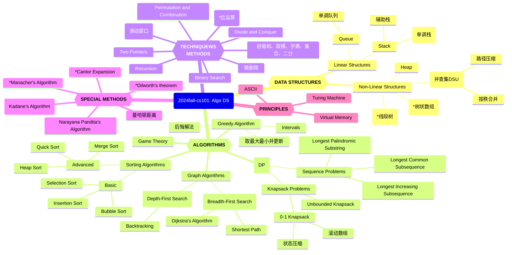

# 20251216-Week15 计概知识图谱

*Updated 2025-12-16 19:45 GMT+8*
 *Compiled by Hongfei Yan (2024 Fall)*


Logs:

> 查看：
>
> https://github.com/chenziliang737/2025fall-CS101/blob/main/Book%20my%20Spacecraft.md
>
> https://github.com/GMyhf/2023fall-cs101/blob/main/cheatsheet/review_and_thoughts-202312-HURuicheng.md  
> https://github.com/GMyhf/2023fall-cs101/blob/main/cheatsheet/cheatsheet-20231226-JIANGZixuan.md  
> https://github.com/GMyhf/2023fall-cs101/blob/main/cheatsheet/DailyOption-202312-DENGJinwen.md
>
> 




<center>Knowledge Graph of 2024fall-cs101: Algo DS</center>


# 1 编程练习

## 474D. Flowers

dp, *1700, https://codeforces.com/contest/474/problem/D

查看中文题面，https://www.luogu.com.cn/problem/CF474D

> 如果想查看某个题目的测试数据（往年可以<mark>看到其他人提交的代码</mark>，2024年10月被屏蔽了，2025年9月解封了），替换链接中数字和最后一个字母，例如查看580C 可以访问
> http://codeforces.com/problemset/status/580/problem/C
>
> Codeforces题目是英文，洛谷提供中文。方法是拿到CF题号，如：1749C，直接编辑这个link的相应题号位置，
> https://www.luogu.com.cn/problem/CF1749C


我们已经看过了旱獭为鼹鼠午餐准备的小游戏。现在轮到旱獭的晚餐时间了，众所周知，旱獭喜欢吃花。在每顿晚餐时，他会吃一些红花和一些白花。因此，一顿晚餐可以表示为一串若干花朵序列，其中有些是白花，有些是红花。

但是，为了让晚餐变得美味，有一个规则：旱獭只想以每组 *k* 朵的形式吃白花。

现在，旱獭想知道，他能以多少种方式吃下 <mark>*a* 到 *b* 朵花</mark>。由于方案总数可能非常大，请输出结果对 1000000007（109+7）取模后的值。

**输入格式**

我们已经看过了旱獭为鼹鼠午餐准备的小游戏。现在轮到旱獭的晚餐时间了，众所周知，旱獭喜欢吃花。在每顿晚餐时，他会吃一些红花和一些白花。因此，一顿晚餐可以表示为一串若干花朵序列，其中有些是白花，有些是红花。

但是，为了让晚餐变得美味，有一个规则：旱獭只想以每组 *k* 朵的形式吃白花。

现在，旱獭想知道，他能以多少种方式吃下 *a* 到 *b* 朵花。由于方案总数可能非常大，请输出结果对 1000000007（109+7）取模后的值。

**输出格式**

我们已经看过了旱獭为鼹鼠午餐准备的小游戏。现在轮到旱獭的晚餐时间了，众所周知，旱獭喜欢吃花。在每顿晚餐时，他会吃一些红花和一些白花。因此，一顿晚餐可以表示为一串若干花朵序列，其中有些是白花，有些是红花。

但是，为了让晚餐变得美味，有一个规则：旱獭只想以每组 *k* 朵的形式吃白花。

现在，旱獭想知道，他能以多少种方式吃下 *a* 到 *b* 朵花。由于方案总数可能非常大，请输出结果对 1000000007（109+7）取模后的值。

> We saw the little game Marmot made for Mole's lunch. Now it's Marmot's dinner time and, as we all know, Marmot eats flowers. At every dinner he eats some red and white flowers. Therefore a dinner can be represented as a sequence of several flowers, some of them white and some of them red.
>
> But, for a dinner to be tasty, there is a rule: Marmot wants to eat white flowers only in groups of size *k*.
>
> Now Marmot wonders in how many ways he can eat between *a* and *b* flowers. As the number of ways could be very large, print it modulo $1000000007 (10^9 + 7)$.
>
> **Input**
>
> Input contains several test cases.
>
> The first line contains two integers *t* and *k* ($1 ≤ t, k ≤ 10^5$), where *t* represents the number of test cases.
>
> The next *t* lines contain two integers $a_i$ and $b_i$ ($1 ≤ a_i ≤ b_i ≤ 10^5$), describing the *i*-th test.
>
> **Output**
>
> Print *t* lines to the standard output. The *i*-th line should contain the number of ways in which Marmot can eat between $a_i$ and $b_i$ flowers at dinner modulo $1000000007 (10^9 + 7)$.
>
> Examples
>
> Input
>
> ```
> 3 2
> 1 3
> 2 3
> 4 4
> ```
>
> Output
>
> ```
> 6
> 5
> 5
> ```
>
> Note
>
> - For *K* = 2 and length 1 Marmot can eat (*R*).
> - For *K* = 2 and length 2 Marmot can eat (*RR*) and (*WW*).
> - For *K* = 2 and length 3 Marmot can eat (*RRR*), (*RWW*) and (*WWR*).
> - For *K* = 2 and length 4 Marmot can eat, for example, (*WWWW*) or (*RWWR*), but for example he can't eat (*WWWR*).
>


思路：题目本身就是一个普通的“上楼梯”，但是这里不用前缀和来查询会超时

```python
MAX = 1000000007
t, k = map(int, input().split())
MOD = int(1e9+7)
MAXN = 100001
dp = [0]*MAXN
s = [0]*MAXN
dp[0] = 1
s[0] = 1
for i in range(1, MAXN):
    if i >= k:
        dp[i] = (dp[i-1]+dp[i-k]) % MOD
    else:
        dp[i] = dp[i-1] % MOD
    s[i] = (s[i-1]+dp[i]) % MOD

for _ in range(t):
    a, b = map(int, input().split())
    print((s[b]-s[a-1]+MOD) % MOD)

```

**加 `MOD` 是为了防止减法出现负数，确保模运算结果始终是非负且正确的。**


## M12029: 水淹七军

bfs, dfs, http://cs101.openjudge.cn/practice/12029/

随着最后通牒的递出，C国的总攻也开始了，由于C国在地形上的优势，C国总司令下令采用水攻，剿灭A国最后的有生力量。 
地形图是一个M*N的矩阵，矩阵上每一个点都对应着当前点的高度。C国总司令将选择若干个点进行放水。根据水往低处流的特性，水可以往四个方向的流动，被淹的地方的水面高度便和放水点的高度一样。然而，A国不是一马平川的，所以总会有地方是淹没不到的。你的任务很简单，判断一下A国司令部会不会被淹没掉。 
我们将给你完整的地形图，然后给出A国司令部所在位置，给出C国将在哪几个点进行放水操作。你所需要的，就是给出A国司令部会不会被水淹。

**输入**

第一行：一个整数K，代表数据组数。 
对于每一组数据： 
第1行：符合题目描述的两个整数，M(0 < M <= 200)、N(0 < N <= 200)。 
第2行至M+1行：每行N个数，以空格分开，代表这个矩阵上的各点的高度值H(0 <= H <= 1000)。 
第M+2行：两个整数I(0 < I <= M)、J(0 < J <= N)，代表司令部所在位置。 
第M+3行：一个整数P(0 < P <= M * N)，代表放水点个数。 
第M+4行至M+P+4行：每行两个整数X(0 < X <= M)、Y(0 < Y <= N)，代表放水点。

**输出**

对于每组数据，输出一行，如果被淹则输出Yes，没有则输出No。

样例输入

```
1
5 5
1 1 1 1 1
1 0 0 0 1
1 0 1 0 1
1 0 0 0 1
1 1 1 1 1
3 3
2
1 1
2 2
```

样例输出

```
No
```

提示

样例中左上角的位置是(1, 1),右上角的位置是(1, 5), 右下角的位置是(5, 5)


<mark>根据样例，可以这样理解：如果司令部与周围水等高，不算淹没。</mark>

不用visited的原因，有的点在某些情况下也需要重新遍历。比如之前淹没的高度为h，之后放水的高度H>h，此时就需要重新淹没。即可以不用visited，直接用water_height矩阵（每次洪泛更新），只要扩展点的高度小于当前water_height_value。


bfs实现

```python
from collections import deque
import sys
input = sys.stdin.read

# 判断坐标是否有效
def is_valid(x, y, m, n):
    return 0 <= x < m and 0 <= y < n

# 广度优先搜索模拟水流
def bfs(start_x, start_y, start_height, m, n, h, water_height):
    dx = [-1, 1, 0, 0]
    dy = [0, 0, -1, 1]
    q = deque([(start_x, start_y, start_height)])
    water_height[start_x][start_y] = start_height

    while q:
        x, y, height = q.popleft()
        for i in range(4):
            nx, ny = x + dx[i], y + dy[i]
            if is_valid(nx, ny, m, n) and h[nx][ny] < height:
                if water_height[nx][ny] < height:
                    water_height[nx][ny] = height
                    q.append((nx, ny, height))

# 主函数
def main():
    data = input().split()  # 快速读取所有输入数据
    idx = 0
    k = int(data[idx])
    idx += 1
    results = []

    for _ in range(k):
        m, n = map(int, data[idx:idx + 2])
        idx += 2
        h = []
        for i in range(m):
            h.append(list(map(int, data[idx:idx + n])))
            idx += n
        water_height = [[0] * n for _ in range(m)]

        i, j = map(int, data[idx:idx + 2])
        idx += 2
        i, j = i - 1, j - 1

        p = int(data[idx])
        idx += 1

        for _ in range(p):
            x, y = map(int, data[idx:idx + 2])
            idx += 2
            x, y = x - 1, y - 1

            bfs(x, y, h[x][y], m, n, h, water_height)

        results.append("Yes" if water_height[i][j] > 0 else "No")

    sys.stdout.write("\n".join(results) + "\n")

if __name__ == "__main__":
    main()
```


**思路是对的**，但性能上有一个明显瓶颈：

> 每一个放水点都单独做一次 BFS，在最坏情况下：$P = MN = 4\times10^4$，每次 BFS 扫全图→ TLE

本质优化版，保持你“water_height 矩阵、不用 visited、可重复淹没”的思想，但把复杂度从
$O(P \cdot MN) \rightarrow O(MN \log MN)$

------

核心优化思路

👉 **多源 + 最大堆 BFS（反向 Dijkstra）**

- 每个放水点是一个“水源”，水位 = 该点高度
- 水只能从 **高 → 低** 流
- 对每个点，只需要知道：
  **它能被淹到的最高水位是多少**

这正是一个：在高度约束下，最大化 water_height 的传播问题

### ✅ 标准 AC 解法（推荐）

```python
import sys
import heapq

input = sys.stdin.read

def main():
    data = list(map(int, input().split()))
    idx = 0
    K = data[idx]
    idx += 1
    out = []

    for _ in range(K):
        M, N = data[idx], data[idx+1]
        idx += 2

        h = []
        for _ in range(M):
            h.append(data[idx:idx+N])
            idx += N

        I, J = data[idx]-1, data[idx+1]-1
        idx += 2

        P = data[idx]
        idx += 1

        water = [[-1]*N for _ in range(M)]
        pq = []  # max-heap: (-water_height, x, y)

        for _ in range(P):
            x, y = data[idx]-1, data[idx+1]-1
            idx += 2
            w = h[x][y]
            if w > water[x][y]:
                water[x][y] = w
                heapq.heappush(pq, (-w, x, y))

        dx = (-1, 1, 0, 0)
        dy = (0, 0, -1, 1)

        flooded = False

        while pq:
            w, x, y = heapq.heappop(pq)
            w = -w

            if w < water[x][y]:
                continue

            if x == I and y == J and w > h[I][J]:
                flooded = True
                break

            for d in range(4):
                nx, ny = x+dx[d], y+dy[d]
                if 0 <= nx < M and 0 <= ny < N:
                    if h[nx][ny] < w and w > water[nx][ny]:
                        water[nx][ny] = w
                        heapq.heappush(pq, (-w, nx, ny))

        out.append("Yes" if flooded else "No")

    print("\n".join(out))


if __name__ == "__main__":
    main()
```

复杂度分析

- 每个点最多被更新几次（堆优化）
- 总复杂度：$O(MN \log MN)$，$200 \times 200$ 轻松过

------

总结

> 这是一个**多源、单调约束、最大值传播**问题
> 用 **最大堆 BFS（反向 Dijkstra）** 是最自然、最稳妥的解法


这是一个经典的搜索问题（BFS/DFS）。

**解题思路**

1.  **题目分析**：
    *   C国在多个点放水，水往低处流（即从高度高的地方流向高度低或相等的地方）。
    *   我们要判断A国司令部（目标点）是否会被淹没。
    *   这意味着我们需要寻找是否存在一条从**任意放水点**到**司令部**的路径，路径上每一步的高度都满足 $H_{curr} \ge H_{next}$（非递增）。

2.  **暴力做法（正向思维）**：
    *   从每一个放水点开始做一次 BFS 或 DFS，看能否流到司令部。
    *   缺点：放水点 $P$ 最多可能达到 $M \times N$ 个。如果对每个点都跑一次全图遍历，时间复杂度是 $O(P \times M \times N)$。在 $200 \times 200$ 的地图下，这会超时。

3.  **优化做法（逆向思维）**：
    *   与其问“水能不能流下来”，不如问“**能不能从司令部逆流而上到达任意一个放水点**”。
    *   我们从**司令部** $(I, J)$ 开始进行一次 BFS/DFS。
    *   **逆流条件**：如果我们要从司令部反推回去，那么路径上的高度必须是**非递减**的（即 $H_{next} \ge H_{curr}$）。
    *   搜索结束后，检查所有放水点的位置。如果某个放水点在我们的“可达（逆流）集合”中，说明水可以从那个点流下来淹没司令部。
    *   时间复杂度：只需要一次遍历，复杂度 $O(M \times N)$，完全符合要求。

###  ✅标准 AC 解法（推荐）

```python
import sys
from collections import deque

# 增加递归深度限制（如果使用DFS的话需要，BFS不需要，但保留是个好习惯）
sys.setrecursionlimit(100000)

def solve():
    # 读取所有输入内容
    #由于输入数据可能分多行，使用 sys.stdin.read().split() 一次性读取并分割成列表处理最方便
    input_data = sys.stdin.read().split()
    
    if not input_data:
        return

    iterator = iter(input_data)
    
    try:
        # 读取测试数据组数 K
        K = int(next(iterator))
        
        for _ in range(K):
            # 读取 M 和 N
            M = int(next(iterator))
            N = int(next(iterator))
            
            # 读取高度矩阵
            # 注意：题目中坐标是 (1~M, 1~N)，我们代码中通常用 (0~M-1, 0~N-1)
            grid = []
            for r in range(M):
                row = []
                for c in range(N):
                    row.append(int(next(iterator)))
                grid.append(row)
            
            # 读取司令部位置 (I, J)，转换为 0-based 索引
            target_r = int(next(iterator)) - 1
            target_c = int(next(iterator)) - 1
            
            # 读取放水点个数 P
            P = int(next(iterator))
            
            # 读取所有放水点坐标，存入列表中
            water_sources = []
            for _ in range(P):
                wr = int(next(iterator)) - 1
                wc = int(next(iterator)) - 1
                water_sources.append((wr, wc))
            
            # === 核心算法：逆向 BFS ===
            # 从司令部出发，寻找所有能够“逆流而上”到达的点。
            # 这里的“逆流”是指：只能走到高度 >= 当前高度的点。
            
            visited = [[False for _ in range(N)] for _ in range(M)]
            queue = deque()
            
            # 起点入队
            queue.append((target_r, target_c))
            visited[target_r][target_c] = True
            
            while queue:
                curr_r, curr_c = queue.popleft()
                curr_h = grid[curr_r][curr_c]
                
                # 检查上下左右四个方向
                directions = [(-1, 0), (1, 0), (0, -1), (0, 1)]
                for dr, dc in directions:
                    next_r, next_c = curr_r + dr, curr_c + dc
                    
                    # 检查边界
                    if 0 <= next_r < M and 0 <= next_c < N:
                        # 检查是否已访问
                        if not visited[next_r][next_c]:
                            next_h = grid[next_r][next_c]
                            # 逆向条件：邻居高度必须 >= 当前高度
                            # (因为水是往低处流，所以反过来找就是往高处爬)
                            if next_h >= curr_h:
                                visited[next_r][next_c] = True
                                queue.append((next_r, next_c))
            
            # === 结果判定 ===
            # 检查是否有任意一个放水点在 visited 集合中
            is_flooded = False
            for wr, wc in water_sources:
                if visited[wr][wc]:
                    is_flooded = True
                    break
            
            if is_flooded:
                print("Yes")
            else:
                print("No")
                
    except StopIteration:
        pass

if __name__ == "__main__":
    solve()
```

代码关键点注释说明：

1.  **输入处理**：使用 `sys.stdin.read().split()` 将所有输入读入内存并转为迭代器。这比一行行 `input()` 读入要快得多，且能很好地处理不同操作系统下的换行符问题。
2.  **坐标转换**：题目给出的是 1-based（从1开始）的坐标，Python 列表是 0-based（从0开始），所以在读取 $I, J, X, Y$ 时都要减 1。
3.  **逆向 BFS**：
    *   如果我们正向模拟水流（从放水点流向低处），需要对每一个放水点做一次搜索，容易超时。
    *   **逆向思路**：如果水能从 A 流到 B（$H_A \ge \dots \ge H_B$），那么一定能从 B 逆着走到 A（$H_B \le \dots \le H_A$）。
    *   我们只从终点（司令部）出发进行一次 BFS，标记所有能通过“爬山”到达的点。
4.  **判定**：最后只需 $O(P)$ 的时间遍历一下放水点列表，看有没有放水点落在了我们标记的区域内即可。


## M542.01 矩阵

dp, bfs, https://leetcode-cn.com/problems/01-matrix/

给定一个由 `0` 和 `1` 组成的矩阵 `mat` ，请输出一个大小相同的矩阵，其中每一个格子是 `mat` 中对应位置元素到最近的 `0` 的距离。

两个相邻元素间的距离为 `1` 。

 

**示例 1：**


```
输入：mat = [[0,0,0],[0,1,0],[0,0,0]]
输出：[[0,0,0],[0,1,0],[0,0,0]]
```

**示例 2：**


```
输入：mat = [[0,0,0],[0,1,0],[1,1,1]]
输出：[[0,0,0],[0,1,0],[1,2,1]]
```

 

**提示：**

- `m == mat.length`
- `n == mat[i].length`
- `1 <= m, n <= 10^4`
- `1 <= m * n <= 10^4`
- `mat[i][j] is either 0 or 1.`
- `mat` 中至少有一个 `0 `

 

 思路：从所有 0 同时出发做多源 BFS，一次性计算出所有 1 到最近 0 的距离。

------

多源 BFS（Multi-source BFS），核心思想：

- 把所有 **0 的位置**作为 BFS 的起点（初始队列）。
- 所有 0 的距离为 0。
- 然后向外一层层扩展，每扩展一层，距离 +1。
- 这样每个格子只被访问一次，**时间复杂度 O(nm)**。

```python
from collections import deque
from typing import List

class Solution:
    def updateMatrix(self, mat: List[List[int]]) -> List[List[int]]:
        n = len(mat)
        m = len(mat[0])
        
        # 初始化结果矩阵，0 的位置为 0，1 的位置设为 -1（表示未访问）
        result = [[-1] * m for _ in range(n)]
        queue = deque()
        
        # 将所有 0 入队，并初始化 result
        for i in range(n):
            for j in range(m):
                if mat[i][j] == 0:
                    result[i][j] = 0
                    queue.append((i, j))
        
        # 四个方向
        directions = [(0, 1), (1, 0), (0, -1), (-1, 0)]
        
        # 多源 BFS
        while queue:
            x, y = queue.popleft()
            for dx, dy in directions:
                nx, ny = x + dx, y + dy
                if 0 <= nx < n and 0 <= ny < m and result[nx][ny] == -1:
                    result[nx][ny] = result[x][y] + 1
                    queue.append((nx, ny))
        
        return result
```


## T02802: 小游戏

bfs, http://cs101.openjudge.cn/practice/02802/ 

一天早上，你起床的时候想：“我编程序这么牛，为什么不能靠这个赚点小钱呢？”因此你决定编写一个小游戏。

游戏在一个分割成w * h个正方格子的矩形板上进行。如图所示，每个正方格子上可以有一张游戏卡片，当然也可以没有。

当下面的情况满足时，我们认为两个游戏卡片之间有一条路径相连：

路径只包含水平或者竖直的直线段。路径不能穿过别的游戏卡片。但是允许路径临时的离开矩形板。下面是一个例子： 


这里在 (1, 3)和 (4, 4)处的游戏卡片是可以相连的。而<mark>在 (2, 3) 和 (3, 4) 处的游戏卡是不相连的</mark>，因为连接他们的每条路径都必须要穿过别的游戏卡片。

你现在要在小游戏里面判断是否存在一条满足题意的路径能连接给定的两个游戏卡片。

**输入**

输入包括多组数据。一个矩形板对应一组数据。每组数据包括的第一行包括两个整数w和h (1 <= w, h <= 75)，分别表示矩形板的宽度和长度。下面的h行，每行包括w个字符，表示矩形板上的游戏卡片分布情况。使用‘X’表示这个地方有一个游戏卡片；使用空格表示这个地方没有游戏卡片。

之后的若干行上每行上包括4个整数x1, y1, x2, y2 (1 <= x1, x2 <= w, 1 <= y1, y2 <= h)。给出两个卡片在矩形板上的位置（注意：矩形板左上角的坐标是(1, 1)）。输入保证这两个游戏卡片所处的位置是不相同的。如果一行上有4个0，表示这组测试数据的结束。

如果一行上给出w = h = 0，那么表示所有的输入结束了。

**输出**

对每一个矩形板，输出一行“Board #n:”，这里n是输入数据的编号。然后对每一组需要测试的游戏卡片输出一行。这一行的开头是“Pair m: ”，这里m是测试卡片的编号（对每个矩形板，编号都从1开始）。接下来，如果可以相连，找到连接这两个卡片的所有路径中包括线段数最少的路径，输出“k segments.”，这里k是找到的最优路径中包括的线段的数目；如果不能相连，输出“impossible.”。

每组数据之后输出一个空行。

样例输入

```
5 4
XXXXX
X   X
XXX X
 XXX 
2 3 5 3
1 3 4 4
2 3 3 4
0 0 0 0
0 0
```

样例输出

```
Board #1:
Pair 1: 4 segments.
Pair 2: 3 segments.
Pair 3: impossible.
```

来源：翻译自Mid-Central European Regional Contest 1999的试题


bfs

这个题目比较麻烦，因为<mark>外圈还可以走</mark>，需要在输入矩阵包一圈。另外，就是行列与我们平时练习<mark>行列刚好反着</mark>。

因为没有走到end之前的线段最短，不能保证总的线段最短。需要穷举队列，找到的最短都append到ans列表，最后min(ans)。

<mark>刘思昊 24工学院。提供了hack数据，会导致很多之前AC的程序WA</mark>。

原因应该是左下那条路先到达终点下面的那个点并且抢占了inq位置，导致后来的左上路线没法进入queue。

使用defaultdict记录seg，以**相同方向到达同一个点是如果seg>=原来的则不值得讨论无需入列，否则还需进一步讨论**

> sample2 input:
>
> ```
> 8 8
> XXXXXXXX
> XX     X
> X XXXX X
> X  XXX X
> XX   X X
> XXXX X X
> XXXX   X
> XXXXXXXX
> 2 2 5 4
> 0 0 0 0
> 0 0
> ```
>
> Sample2 output:
>
> ```
> Board #1:
> Pair 1: 4 segments.
> ```
>
> 
>
> Sample3 input:
>
> ```
> 8 9
> XXXXXXXX
> XX     X
> X XXXX X
> X XXXX X
> X  X X X
> XX   X X
> XXXX X X
> XXXX   X
> XXXXXXXX
> 2 2 5 4
> 0 0 0 0
> 0 0
> ```
>
> Sample3 output:
>
> ```
> Board #1:
> Pair 1: 4 segments.
> ```


bfs

这个题目比较麻烦，因为外圈还可以走，需要在输入矩阵包一圈。另外，就是行列与我们平时练习行列刚好反着。

因为没有走到end之前的线段最短，不能保证总的线段最短。需要穷举队列，找到的最短都append到ans列表，最后min(ans)。

```python
from collections import deque
from collections import defaultdict

def bfs(start, end, grid, h, w):
    queue = deque([start])
    in_queue = defaultdict(lambda: float('inf'))
    dirs = [(0, -1), (-1, 0), (0, 1), (1, 0)]
    min_x = float('inf')
    while queue:
        x, y, d, seg = queue.popleft()

        for i, (dx, dy) in enumerate(dirs):
            nx, ny = x + dx, y + dy

            new_seg = seg if i == d else seg + 1
            if (nx, ny) == end:
                min_x = min(min_x, new_seg)
                continue

            if (0 <= nx < h + 2 and 0 <= ny < w + 2 and new_seg<in_queue[(nx,ny,i)]
                    and grid[nx][ny] != 'X'):
                    in_queue[(nx, ny, i)] = new_seg
                    queue.append((nx, ny, i, new_seg))

    return min_x


board_num = 1
while True:
    w, h = map(int, input().split())
    if w == h == 0:
        break

    grid = [' ' * (w + 2)] + [' ' + input() + ' ' for _ in range(h)] + [' ' * (w + 2)]
    print(f"Board #{board_num}:")
    pair_num = 1
    while True:
        y1, x1, y2, x2 = map(int, input().split())
        if x1 == y1 == x2 == y2 == 0:
            break

        start = (x1, y1, -1, 0)
        end = (x2, y2)

        seg = bfs(start, end, grid, h, w)
        if seg == float('inf'):
            print(f"Pair {pair_num}: impossible.")
        else:
            print(f"Pair {pair_num}: {seg} segments.")
        pair_num += 1

    print()
    board_num += 1
```


其实所有求最短、最长的问题都能用heapq实现，在图搜索中搭配bfs尤其好用。

> 利用heap优先队列的做法，因为每次都取当前队列中线段最小值前进，可以保证最后总的线段最短。这个实际上是Dijkstra。

```python
# 23 工学院 苏王捷
import heapq
from collections import defaultdict

num1 = 1
while True:
    w, h = map(int, input().split())
    if w == 0 and h == 0:
        break
    print(f"Board #{num1}:")
    martix = [[" "] * (w + 2)] + [[" "] + list(input()) + [" "] for _ in range(h)] + [[" "] * (w + 2)]
    dir = [(0, 1), (0, -1), (1, 0), (-1, 0)]
    num2 = 1
    while True:
        x1, y1, x2, y2 = map(int, input().split())
        if x1 == 0 and x2 == 0 and y1 == 0 and y2 == 0:
            break
        queue, flag = [], False
        in_queue = defaultdict(lambda: float("inf"))
        heapq.heappush(queue, (0, x1, y1, -1))
        martix[y2][x2] = " "
        in_queue[(-1, x1, y1)] = 0
        while queue:
            step, x, y, dirs = heapq.heappop(queue)
            if x == x2 and y == y2:
                flag = True
                break
            for i, (dx, dy) in enumerate(dir):
                px, py = x + dx, y + dy
                new_step = step + (dirs != i)
                if 0 <= px <= w + 1 and 0 <= py <= h + 1 and new_step < in_queue[(i, px, py)] and martix[py][px] != "X":
                    in_queue[(i, px, py)] = new_step
                    heapq.heappush(queue, (new_step, px, py, i))
        if flag:
            print(f"Pair {num2}: {step} segments.")
        else:
            print(f"Pair {num2}: impossible.")
        martix[y2][x2] = "X"
        num2 += 1
    print()
    num1 += 1

```


最稳方案：Dijkstra（heapq）

> 上面第二份代码思路，本质上是**标准解**
>  ✔ 不吃 DFS 顺序
>  ✔ 不怕 hack
>  ✔ <mark>不需要枚举答案</mark>

优化后的代码

> ✔ 已通过给出的 **sample2 / sample3** hack数据

### ✅ 标准 AC 解法（推荐）

```python
import heapq
from collections import defaultdict

# 右 左 下 上
DIRS = [(1, 0), (-1, 0), (0, 1), (0, -1)]

def min_segments(grid, w, h, x1, y1, x2, y2):
    pq = []
    dist = defaultdict(lambda: float('inf'))

    # 起点：方向 -1，段数 0
    heapq.heappush(pq, (0, x1, y1, -1))
    dist[(x1, y1, -1)] = 0

    # 终点允许进入
    grid[y2][x2] = ' '

    while pq:
        seg, x, y, d = heapq.heappop(pq)

        if (x, y) == (x2, y2):
            grid[y2][x2] = 'X'
            return seg

        if seg > dist[(x, y, d)]:
            continue

        for i, (dx, dy) in enumerate(DIRS):
            nx, ny = x + dx, y + dy

            # 第一次选方向也算一段
            if d != i:
                nseg = seg + 1
            else:
                nseg = seg

            if 0 <= nx <= w + 1 and 0 <= ny <= h + 1 and grid[ny][nx] != 'X':
                if nseg < dist[(nx, ny, i)]:
                    dist[(nx, ny, i)] = nseg
                    heapq.heappush(pq, (nseg, nx, ny, i))

    grid[y2][x2] = 'X'
    return None


# ================= 主程序 =================

board_id = 1
while True:
    w, h = map(int, input().split())
    if w == h == 0:
        break

    print(f"Board #{board_id}:")

    # 包一圈空白
    grid = (
        [[' '] * (w + 2)] +
        [[' '] + list(input()) + [' '] for _ in range(h)] +
        [[' '] * (w + 2)]
    )

    pair_id = 1
    while True:
        x1, y1, x2, y2 = map(int, input().split())
        if x1 == y1 == x2 == y2 == 0:
            break

        ans = min_segments(grid, w, h, x1, y1, x2, y2)

        if ans is None:
            print(f"Pair {pair_id}: impossible.")
        else:
            print(f"Pair {pair_id}: {ans} segments.")

        pair_id += 1

    print()
    board_id += 1
```

------

总结，必须同时满足 5 点：

1. ✅ 外圈可走（包边）
2. ✅ 状态 = `(x, y, dir)`
3. ✅ 同方向不加段，变方向 +1
4. ✅ **第一次选方向也 +1**
5. ✅ 用 Dijkstra / heap，不能普通 BFS


> 《算法基础。。》上面讲到4.3例题：小游戏，书上给出的是dfs。但是经过同学和助教调试，发现dfs与先沿着哪个邻居出发有关，导致剪枝可能失效。因为可能拿不到一个相对较好的结果，便于比较剪枝。所以最好用bfs完成。
>


## T04129: 变换的迷宫

bfs, http://cs101.openjudge.cn/practice/04129

你现在身处一个R*C 的迷宫中，你的位置用"S" 表示，迷宫的出口用"E" 表示。

迷宫中有一些石头，用"#" 表示，还有一些可以随意走动的区域，用"." 表示。

初始时间为0 时，你站在地图中标记为"S" 的位置上。你每移动一步（向上下左右方向移动）会花费一个单位时间。你必须一直保持移动，不能停留在原地不走。

当前时间是K 的倍数时，迷宫中的石头就会消失，此时你可以走到这些位置上。在其余的时间里，你不能走到石头所在的位置。

求你从初始位置走到迷宫出口最少需要花费多少个单位时间。

如果无法走到出口，则输出"Oop!"。

**输入**

第一行是一个正整数 T，表示有 T 组数据。
每组数据的第一行包含三个用空格分开的正整数，分别为 R、C、K。
接下来的 R 行中，每行包含了 C 个字符，分别可能是 "S"、"E"、"#" 或 "."。
其中，0 < T <= 20，0 < R, C <= 100，2 <= K <= 10。

**输出**

对于每组数据，如果能够走到迷宫的出口，则输出一个正整数，表示最少需要花费的单位时间，否则输出 "Oop!"。

样例输入

```
1
6 6 2
...S..
...#..
.#....
...#..
...#..
..#E#.
```

样例输出

```
7
```


采用**三维 BFS（位置 + 时间取模）**，这是本题在教学与评测中**最稳妥、最不易 WA**的做法。

------

解题核心思想（标准版）

1️⃣ 状态建模

由于 **石头是否可走取决于当前时间是否是 K 的倍数**，而时间是不断增长的，因此：

- 单纯的二维 `visited[x][y]` **不够**
- 到达同一格子，但**时间对 K 的余数不同，后续可行性不同**

正确状态应为：(x, y, t mod K)

------

2️⃣ BFS 合法性判定

从 `(x, y, t)` 走到 `(nx, ny, t+1)`：

- 必须在地图内
- 若 `(t+1) % K == 0` **，石头消失，# 可以走**
- 否则，只能走 `.` / `S` / `E`，⚠️ **S 和 E 都视作空地**

------

### ✅ 标准 AC 解法（推荐）

```python
from collections import deque

def solve():
    T = int(input())
    for _ in range(T):
        R, C, K = map(int, input().split())
        grid = [list(input()) for _ in range(R)]

        for i in range(R):
            for j in range(C):
                if grid[i][j] == 'S':
                    sx, sy = i, j
                elif grid[i][j] == 'E':
                    ex, ey = i, j

        # visited[x][y][t_mod_k]
        visited = [[[False]*K for _ in range(C)] for _ in range(R)]
        q = deque()
        q.append((sx, sy, 0))
        visited[sx][sy][0] = True

        ans = None
        dirs = [(1,0), (-1,0), (0,1), (0,-1)]

        while q:
            x, y, t = q.popleft()
            if (x, y) == (ex, ey):
                ans = t
                break

            nt = t + 1
            mod = nt % K

            for dx, dy in dirs:
                nx, ny = x + dx, y + dy
                if not (0 <= nx < R and 0 <= ny < C):
                    continue
                if visited[nx][ny][mod]:
                    continue

                cell = grid[nx][ny]
                if mod == 0 or cell != '#':  # 石头是否可走
                    visited[nx][ny][mod] = True
                    q.append((nx, ny, nt))

        print(ans if ans is not None else "Oop!")

if __name__ == "__main__":
    solve()
```

------

关键易错点总结（非常重要）

| 易错点                | 正确处理                |
| --------------------- | ----------------------- |
| 只用二维 visited      | ❌ 必须加 `time % K`     |
| 忘记 `S`、`E` 可走    | ❌ 会 WA                 |
| 判断石头用 `time % K` | ❌ 必须是 `(time+1) % K` |
| 到达同一格子直接剪枝  | ❌ 不同余数不可等价      |

------

复杂度

- **时间**：`O(R * C * K)`
- **空间**：`O(R * C * K)`

------

结论

> **本题最稳妥、最通用、最不容易 WA 的标准解法：
> 三维 BFS（x, y, time % K）**


<mark>贪心后悔解法</mark>

思路是无论当前的选项是否最优都接受，然后进行比较，如果选择之后不是最优了，则反悔，舍弃掉这个选项；否则，正式接受。如此往复。

## P4635糖果店（T30204:小P的LLM推理加速）

https://www.luogu.com.cn/problem/P14635

http://cs101.openjudge.cn/practice/30204/


## M02431: Expedition

greedy, heap, http://cs101.openjudge.cn/practice/02431


## M1642.可以到达的最远建筑

greedy, heap, https://leetcode.cn/problems/furthest-building-you-can-reach/


# 2 二分查找（Binary Search）

二分查找的难点在于边界条件。推荐参考 Python 标准库 **bisect** 的源码实现（采用左闭右开区间）：
https://github.com/python/cpython/blob/main/Lib/bisect.py


核心思想：当问题求”最小化最大值“或”最大化最小值“时，二分枚举答案。

- 模版：验证函数 + 二分搜索
- 关键：讲优化问题转化为判定问题（“能否达到？”）
- 应用：袋子分球、预算分配、资源分配类问题

二分不只是查找，更是“缩小解空间”的通用策略。


## M1760.袋子里最少数目的球（binary search）

https://leetcode.cn/problems/minimum-limit-of-balls-in-a-bag/


## M08210: 河中跳房子/石头（binary search）

http://cs101.openjudge.cn/practice/08210


## M04135: 月度开销（binary search）

http://cs101.openjudge.cn/practice/04135


## M02456: Aggressive cows（binary search）

http://cs101.openjudge.cn/practice/02456


# 3 能申请到$10^{18}$内存吗？

我的机器2024fall时候是macOS Sonoma 14.6.1，最大可以申请到 276.00 GB（即接近于$2^{38}$）。计算方法如下所述。


## $10^{18}$有多大

要将 $10^{18}$ 字节转换为更常见的存储单位，如GB（吉字节）或TB（太字节），我们需要了解这些单位之间的换算关系。在二进制表示中，这些单位是基于2的幂来定义的，但在十进制表示中，它们通常基于10的幂来定义。

- 1 GB (Gigabyte, 吉字节) = $10^9$ 字节
- 1 TB (Terabyte, 太字节) = $10^{12}$ 字节

因此，$10^{18}$ 字节可以被直接转换为：

- $10^{18} \div 10^9 = 10^9$ GB
- $10^{18} \div 10^{12} = 10^6$ TB

这表示 $10^{18}$ 字节等于 10亿 GB 或者 1百万 TB。


```python
import math
x = math.log2(10**18)
print(x)  # 输出: 59.79470570797252
```


## 判断使用的Python解释器是否64位

要判断你正在使用的Python解释器是32位还是64位，可以通过几种方法来完成。这里我将展示一种简单的方法，即使用Python内置的`platform`模块或`sys`模块来获取相关信息。

**方法 1: 使用 `platform` 模块**

`platform` 模块提供了很多关于平台的信息，包括体系结构（architecture），可以用来区分32位和64位版本。

```python
import platform

print(platform.architecture())
"""
('64bit', 'Mach-O')
"""
```

这个函数会返回一个元组，其中第一个元素表示Python解释器的位数（例如 '32bit' 或 '64bit'）。

**方法 2: 使用 `sys` 模块**

`sys` 模块中的 `maxsize` 属性也可以用来间接判断Python解释器的位数。对于32位Python，`sys.maxsize` 的值通常为 2^31 - 1 (即 2147483647)，而对于64位Python，这个值通常为 2^63 - 1 (即 9223372036854775807)。

> 因为 maxsize 是有符号整数的最大值，所以 32 位时是 2³¹−1，不是 2³²。

```python
import sys

if sys.maxsize > 2**32:
    print("64-bit Python")
else:
    print("32-bit Python")
```

下面我将执行一段代码来演示如何使用这两种方法之一来确定当前Python环境的位数。

```python
import platform
print(platform.architecture()[0])
```

或者使用 `sys` 模块的方法：

```python
import sys
if sys.maxsize > 2**32:
    print("64-bit Python")
else:
    print("32-bit Python")
```


## 测试Python程序可以申请的最大内存量


**python能够申请到的最大内存**

> Python程序能够申请到的最大内存量主要取决于几个因素，包括操作系统、硬件配置以及Python解释器本身的限制。下面是一些关键点：
>
> 1. **操作系统限制**：
>    - 不同的操作系统对进程可以使用的最大内存有不同的默认限制。例如，在Linux上，可以通过`ulimit -a`命令查看当前用户的资源限制，其中包括了最大虚拟内存大小（`virtual memory`）。
>    - 在Windows上，理论上一个32位进程最多可以访问4GB的地址空间，而64位进程则可以访问更大的地址空间。
>
> 2. **硬件限制**：
>    - 物理内存（RAM）的数量直接限制了程序可用的实际物理内存。即使操作系统允许更大的虚拟内存，实际能使用的内存仍然受限于物理内存加上交换空间（swap space）的总量。
>    - 交换空间可以在一定程度上扩展可用内存，但使用大量交换空间会导致性能显著下降。
>
> 3. **Python解释器限制**：
>    - Python本身并没有设置一个固定的内存上限，但它会受到上述因素的影响。
>    - 在32位Python版本中，由于地址空间的限制，通常最大可分配内存为2-4GB左右。
>    - 64位Python版本理论上可以访问更多内存，但是实际可用量依然受限于操作系统的限制和可用的物理及虚拟内存。
>
> 4. **Python内部机制**：
>    - Python对象的内存管理由Python解释器负责，它使用垃圾回收机制来自动释放不再使用的内存。
>    - 对于非常大的数据集，可能需要考虑使用更高效的数据结构或第三方库（如NumPy, Pandas等），这些库针对大数据处理进行了优化，并且支持在内存之外存储数据（例如，使用磁盘上的文件作为后端）。
>
> 5. **增加内存限制的方法**：
>    - 在Linux上，可以通过修改`/etc/security/limits.conf`文件或使用`ulimit`命令来提高单个进程的内存限制。
>    - 对于需要处理特别大数据集的情况，可以考虑使用分布式计算框架（如Apache Spark）、数据库或者其他专门设计用于处理大规模数据的技术。
>
> 总之，Python程序能够申请到的最大内存量不是一个固定值，而是依赖于运行环境的具体条件。


> % ulimit -a
>
> -t: cpu time (seconds)       unlimited
> -f: file size (blocks)       unlimited
> -d: data seg size (kbytes)     unlimited
> -s: stack size (kbytes)       <mark>8176</mark>
> -c: core file size (blocks)     0
> -v: address space (kbytes)     unlimited
> -l: locked-in-memory size (kbytes) unlimited
> -u: processes            10666
> -n: file descriptors        2560


**虚拟地址空间（计算机原理2/3）**

> 三大计算机原理之一，@Book_my_flight_v0.3.md
>
> ​	计算机的基础架构自从 20 世纪 40 年代起就已经形成规范，包括处理器、存储指令和数据的内存、输入和输出设备。它通常叫作冯·诺依曼架构，以约翰·冯·诺依曼（德語：John Von Neumann，1903 年12 月 28 日－1957 年 2 月 8 日）的名字来命名，他在 1946 年发表的论文里描述了这一架构。论文的开头句，用现在的专门术语来说就是，CPU提供算法和控制，而 RAM 和磁盘则是记忆存储，键盘、鼠标和显示器与操作人员交互。其中需要重点理解的是与存储相关的进程的虚拟地址空间。
>
> 虚拟存储器是一个抽象概念，它为每个进程提供了一个假象，好像每个进程都在独占地使用主存。每个进程看到的存储器都是一致的，称之为虚拟地址空间。如图1-15所示的是 Linux 进程的虚拟地址空间（其他 Unix 系统的设计与此类似）。在 Linux 中，最上面的四分之一的地址空间是预留给操作系统中的代码和数据的，这对所有进程都一样。底部的四分之三的地址空间用来存放用户进程定义的代码和数据。请注意，图中的地址是从下往上增大的。
>
> 
>
> 
>
> 图1-15 进程的虚拟地址空间（Process virtual address space）（注：图片来源为 Randal Bryant[8]，2015年3月）
>
> 
>
> ​	每个进程看到的虚拟地址空间由准确定义的区（area）构成，每个区都有专门的功能。简单看下每一个区，从最低的地址开始，逐步向上研究。
>
> - 程序代码和数据（code and data）。代码是从同一固定地址开始，紧接着的是和全局变量相对应的数据区。代码和数据区是由可执行目标文件直接初始化的，示例中就是可执行文件hello。
>
> - 堆（heap）。紧随代码和数据区之后的是运行时堆（Run-time heap）。代码和数据区是在进程一旦开始运行时就被指定了大小的，与此不同，作为调用像 malloc 和 free 这样的 C 标准库函数的结果，堆可以在运行时动态地扩展和收缩。
>
> - 共享库（shared libraries）。在地址空间的中间附近是一块用来存放像标准库和数学库这样共享库的代码和数据的区域。共享库的概念非常强大。
>
> - 栈（stack）。位于用户虚拟地址空间顶部的是用户栈，编译器用它来实现函数调用。和堆一样，用户栈（User stack）在程序执行期间可以动态地扩展和收缩。特别地，每次我们调用一个函数时，栈就会增长。每次我们从函数返回时，栈就会收缩。
>
> - 内核虚拟存储器（kernal virtal memory）。内核是操作系统总是驻留在存储器中的部分。地址空间顶部是为内核预留的。应用程序不允许读写这个区域的内容或者直接调用内核代码定义的函数。
>
> ​	虚拟存储器的运作需要硬件和操作系统软件间的精密复杂的互相合作，包括对处理器生成的每个地址的硬件翻译。基本思想是把一个进程虚拟存储器的内容存储在磁盘上，然后用主存作为磁盘的高速缓存。


> 全局变量和静态变量通常是在数据段（data segment）中分配的，而常量可能会放置在只读数据段（read-only data segment）。栈内存确实用于存储局部变量，但“动态内存分配”通常是与堆相关联的术语。栈上的分配是静态且自动化的，而堆上的分配是动态的，由程序员控制。


要测试Python程序可以申请的最大内存量，你可以编写一个简单的脚本，该脚本会尝试分配越来越多的内存，直到达到系统限制或Python解释器本身的限制。这个过程通常涉及到创建一个越来越大的列表（或其他数据结构），并填充它，直到内存不足。

请注意，这样的测试可能会导致你的系统变得非常慢，甚至可能崩溃，因为它会消耗大量的RAM。因此，在进行这种测试之前，请确保你了解风险，并且最好在受控环境中执行此操作，例如虚拟机或有足够空闲资源的机器上。

```python
import os
import sys
import gc  # 垃圾回收模块


def allocate_memory(chunk_size=1024 * 1024 * 1024, max_attempts=1000):
    """
    尝试分配内存，每次增加chunk_size字节，直到无法分配更多。

    :param chunk_size: 每次尝试分配的内存大小（以字节为单位）
    :param max_attempts: 最大尝试次数
    """
    data = []
    total_allocated = 0
    for i in range(max_attempts):
        try:
            # 尝试分配额外的内存
            data.append(' ' * chunk_size)
            total_allocated += chunk_size
            print(f"Allocated {total_allocated / (1024 * 1024 * 1024):.2f} GB")
        except MemoryError:
            print("Memory allocation failed.")
            break
        finally:
            # 强制垃圾回收
            gc.collect()

    print(f"Total memory allocated: {total_allocated / (1024 * 1024 * 1024):.2f} GB")


# 运行测试
allocate_memory()
```

> 2025/12/16 运行结果，Mac Studio机器
>
> ...
>
> Allocated 375.00 GB
> Allocated 376.00 GB
> Allocated 377.00 GB
>
> Process finished with exit code 137 (interrupted by signal 9:SIGKILL)


> 2024fall 运行结果，mac机器
>
> Allocated 274.00 GB
> Allocated 275.00 GB
> Allocated 276.00 GB
>
> Process finished with exit code 137 (interrupted by signal 9:SIGKILL)


要找出276GB是2的多少次幂，首先需要将276GB转换为字节，因为通常在计算中使用的是二进制单位。1GB等于2^30字节（在二进制表示中）。因此，276GB可以表示为 276 * 2^30 字节。

接下来，我们需要找到一个指数x，使得 2^x 等于 276 * 2^30。这可以通过对数运算来解决：

$ x = \log_2(276 \times 2^{30}) $

$ \log_2(276 \times 2^{30}) = \log_2(276) + \log_2(2^{30}) $

$ \log_2(276) + 30 \approx 8.1073 + 30 = 38.1073 $

这意味着276GB大约等于 $2^{38.1073}$ 字节。由于幂次通常是一个整数，我们可以认为276GB最接近于 $2^{38}$ 字节，但略大于这个值。如果你需要更精确的结果，可以使用科学计算器来获得更准确的对数值。


# 4 最短路径Dijkstra

## 示例E386: 最短距离

https://sunnywhy.com/sfbj/10/4/386

现有一个共n个顶点（代表城市）、m条边（代表道路）的无向图（假设顶点编号为从`0`到`n-1`），每条边有各自的边权，代表两个城市之间的距离。求从s号城市出发到达t号城市的最短距离。

**输入**

第一行四个整数n、m、s、t（$1 \le n \le 100,0 \le m \le \frac{n(n-1)}2, 0 \le s \le n -1, 0 \le t \le n-1$​），分别表示顶点数、边数、起始编号、终点编号；

接下来m行，每行三个整数u、v、w（$0 \le u \le n-1,0 \le v \le n-1, u \ne v, 1 \le w \le 100$），表示一条边的两个端点的编号及边权距离。数据保证不会有重边。

**输出**

输出一个整数，表示最短距离。如果无法到达，那么输出`-1`。

样例1

输入

```
6 6 0 2
0 1 2
0 2 5
0 3 1
2 3 2
1 2 1
4 5 1
```

输出

```
3
```

解释

对应的无向图如下图所示。

共有`3`条从`0`号顶点到`2`号顶点的路径：

1. `0->3->2`：距离为`3`；
2. `0->2`：距离为`5`；
3. `0->1->2`：距离为`3`。

因此最短距离为`3`。


样例2

输入

```
6 6 0 5
0 1 2
0 2 5
0 3 1
2 3 2
1 2 1
4 5 1
```

输出

```
-1
```

解释

和第一个样例相同的图，终点换成了`5`号顶点，显然从`0`号无法到达`5`号。


需要找到从给定的起始城市到目标城市的最短距离。可以使用Dijkstra算法来解决这个问题。Dijkstra算法是一种用于在图中找到最短路径的算法。它从起始节点开始，然后逐步扩展到所有可达的节点，每次选择当前最短的路径进行扩展。

以下是使用 Python 实现 Dijkstra 算法来解决这个问题的示例代码：

```python
import heapq

def dijkstra(n, edges, s, t):
    graph = [[] for _ in range(n)]
    for u, v, w in edges:
        graph[u].append((v, w))
        graph[v].append((u, w))

    pq = [(0, s)]  # (distance, node)
    visited = set()
    distances = [float('inf')] * n
    distances[s] = 0

    while pq:
        dist, node = heapq.heappop(pq)
        if node == t:
            return dist
        if node in visited:
            continue
        visited.add(node)
        for neighbor, weight in graph[node]:
            if neighbor not in visited:
                new_dist = dist + weight
                if new_dist < distances[neighbor]:
                    distances[neighbor] = new_dist
                    heapq.heappush(pq, (new_dist, neighbor))
    return -1

# Read input
n, m, s, t = map(int, input().split())
edges = [list(map(int, input().split())) for _ in range(m)]

# Solve the problem and print the result
result = dijkstra(n, edges, s, t)
print(result)
```

这段代码实现了 Dijkstra 算法来求解从起点到终点的最短路径。首先构建了一个图，然后使用优先队列来选择下一个要探索的节点，并在探索过程中更新最短距离。最后返回从起点到终点的最短距离。

这个版本的Dijkstra算法使用了一个集合`visited`来记录已经访问过的节点，这样可以避免对同一个节点的重复处理。当我们从优先队列中取出一个节点时，如果这个节点已经在`visited`集合中，那么我们就跳过这个节点，处理下一个节点。这样可以提高算法的效率。

此外，这个版本的<mark>Dijkstra算法还在找到目标节点`t`时就立即返回结果，而不是等到遍历完所有节点</mark>。这是因为Dijkstra算法保证了每次从优先队列中取出的节点就是当前距离最短的节点，所以当我们找到目标节点`t`时，就已经找到了从起始节点`s`到`t`的最短路径，无需再继续搜索。

这个版本的Dijkstra算法的时间复杂度仍然是O((V+E)logV)，其中V是顶点数，E是边数。这是因为每个节点最多会被加入到优先队列中一次（当找到一条更短的路径时），并且每条边都会被处理一次（在遍历节点的邻居时）。优先队列的插入和删除操作的时间复杂度都是O(logV)，所以总的时间复杂度是O((V+E)logV)。


Dijkstra 算法是一种经典的图算法，它<mark>综合运用了多种技术，包括邻接表、集合、优先队列（堆）、贪心算法和动态规划的思想</mark>。例题：最短距离，https://sunnywhy.com/sfbj/10/4/386

- 邻接表：Dijkstra 算法通常使用邻接表来表示图的结构，这样可以高效地存储图中的节点和边。
- 集合：在算法中需要跟踪已经访问过的节点，以避免重复访问，这一般使用集合（或哈希集合）来实现。
- 优先队列（堆）：Dijkstra 算法中需要选择下一个要探索的节点，通常使用优先队列（堆）来维护当前候选节点的集合，并确保每次都能快速找到距离起点最近的节点。
- 贪心算法：Dijkstra 算法每次选择距离起点最近的节点作为下一个要探索的节点，这是一种贪心策略，即每次做出局部最优的选择，期望最终能达到全局最优。
- 动态规划：Dijkstra 算法通过不断地更新节点的最短距离来逐步得到从起点到各个节点的最短路径，这是一种动态规划的思想，即将原问题拆解成若干子问题，并以最优子结构来解决。

综合运用这些技术，Dijkstra 算法能够高效地求解单源最短路径问题，对于解决许多实际问题具有重要意义。


第2种写法，没有用set记录访问过的结点。

```python
import heapq

def dijkstra(n, s, t, edges):
    graph = [[] for _ in range(n)]
    for u, v, w in edges:
        graph[u].append((v, w))
        graph[v].append((u, w))

    distance = [float('inf')] * n
    distance[s] = 0

    queue = [(0, s)]
    while queue:
        dist, node = heapq.heappop(queue)
        if dist != distance[node]:
            continue
        for neighbor, weight in graph[node]:
            if distance[node] + weight < distance[neighbor]:
                distance[neighbor] = distance[node] + weight
                heapq.heappush(queue, (distance[neighbor], neighbor))

    return distance[t] if distance[t] != float('inf') else -1

# 接收数据
n, m, s, t = map(int, input().split())
edges = []
for _ in range(m):
    u, v, w = map(int, input().split())
    edges.append((u, v, w))

# 调用函数
min_distance = dijkstra(n, s, t, edges)
print(min_distance)
```

第15行的判断`if dist != distance[node]: continue`的作用是跳过已经找到更短路径的节点。

在Dijkstra算法中，我们使用优先队列（在Python中是heapq）来存储待处理的节点，每次从队列中取出当前距离最短的节点进行处理。但是在处理过程中，有可能会多次将同一个节点加入到队列中，因为我们可能会通过不同的路径到达同一个节点，每次到达时都会将其加入到队列中。

因此，<mark>当我们从队列中取出一个节点时，需要判断这个节点当前的最短距离是否与队列中存储的距离相同</mark>。如果不同，说明这个节点在队列中等待处理的时候，已经有了一条更短的路径，所以我们可以跳过这个节点，处理下一个节点。


## 练习M20106: 走山路

bfs + heap, Dijkstra, http://cs101.openjudge.cn/practice/20106/

某同学在一处山地里，地面起伏很大，他想从一个地方走到另一个地方，并且希望能尽量走平路。
现有一个m*n的地形图，图上是数字代表该位置的高度，"#"代表该位置不可以经过。
该同学每一次只能向上下左右移动，每次移动消耗的体力为移动前后该同学所处高度的差的绝对值。现在给出该同学出发的地点和目的地，需要你求出他最少要消耗多少体力。

**输入**

第一行是m,n,p，m是行数，n是列数，p是测试数据组数
接下来m行是地形图
再接下来n行每行前两个数是出发点坐标（前面是行，后面是列），后面两个数是目的地坐标（前面是行，后面是列）（出发点、目的地可以是任何地方，出发点和目的地如果有一个或两个在"#"处，则将被认为是无法达到目的地）

**输出**

n行，每一行为对应的所需最小体力，若无法达到，则输出"NO"

样例输入

```
4 5 3
0 0 0 0 0
0 1 1 2 3
# 1 0 0 0
0 # 0 0 0
0 0 3 4
1 0 1 4
3 4 3 0
```

样例输出

```
2
3
NO

解释：
第一组：从左上角到右下角，要上1再下来，所需体力为2
第二组：一直往右走，高度从0变为1，再变为2，再变为3，消耗体力为3
第三组：左下角周围都是"#"，不可以经过，因此到不了
```

来源: cs101-2019 张翔宇


Dijkstra 算法的本质是贪心策略，每次扩展的是当前路径代价最小的节点，要维护该贪心性。

```python
import heapq		#260ms

def find_min_cost_path(n, m, mat, queries):
    directions = [(1, 0), (0, 1), (0, -1), (-1, 0)]
    results = []

    for x, y, xx, yy in queries:
        if mat[x][y] == '#' or mat[xx][yy] == '#':
            results.append("NO")
            continue

        dist = {(x, y): 0}  # Distance dictionary to keep track of minimum cost to each node
        heap = [(0, x, y)]  # Priority queue: (cost, row, col)
        found = False

        while heap:
            cost, i, j = heapq.heappop(heap)

            # If the target is reached, record the result and exit the loop
            if (i, j) == (xx, yy):
                results.append(cost)
                found = True
                break

            # Explore all possible moves
            for di, dj in directions:
                ni, nj = i + di, j + dj

                if 0 <= ni < n and 0 <= nj < m and mat[ni][nj] != '#':
                    new_cost = cost + abs(int(mat[ni][nj]) - int(mat[i][j]))

                    # Update the cost if it's lower than any previously recorded cost
                    if (ni, nj) not in dist or new_cost < dist[(ni, nj)]:
                        dist[(ni, nj)] = new_cost
                        heapq.heappush(heap, (new_cost, ni, nj))

        if not found:
            results.append("NO")

    return results

# Input processing
n, m, p = map(int, input().split())
mat = [input().split() for _ in range(n)]
queries = [tuple(map(int, input().split())) for _ in range(p)]

# Solve the problem and output results
answers = find_min_cost_path(n, m, mat, queries)
print("\n".join(map(str, answers)))

```


这里学会了如何优化进行剪枝，heapq是最小堆，只要是非负权值的最短路径问题，就可以使用Dijkstra算法，不断用全局中最小的进行更新，把含权值的最短路径问题给推出来。**贪心思想**：Dijkstra 的核心是贪心扩展——每次优先访问当前代价最小的节点，并通过该节点更新其他节点的代价，从而保证扩展的节点顺序是代价从小到大的。**剪枝的具体实现**

**1. 劣路径的剪枝**：剪枝可以避免无效的路径计算，从而显著减少搜索空间。

```python
if effort > min_effort[x][y]:
    continue
```

​	•	如果当前路径的累计代价 effort 已经大于记录的最优代价 `min_effort[x][y]`，则说明这条路径已经不是最优的，继续扩展它是没有意义的，直接跳过（剪枝）。**剪枝原理**：节点的最优代价是按贪心原则逐步更新的。一旦 `effort > min_effort[x][y]`，说明当前路径已被更优的路径取代。

**2. 路径更新的剪枝**：

```python
if total_effort < min_effort[nx][ny]:
    min_effort[nx][ny] = total_effort
    heapq.heappush(pq, (total_effort, nx, ny))
```

​	•	只有当新路径的累计代价 total_effort 小于已知的代价 min_effort[nx] [ny] 时，才更新邻居节点的代价并加入堆中。
​	•	如果新路径的代价不优于当前最优代价，则直接忽略，避免对无意义的路径进行扩展。

**3. 起点或终点为阻碍的剪枝**：如果起点或终点是不可通行的（#），直接输出 NO，不再进行路径搜索。

```python
if terrain[sx][sy] == '#' or terrain[ex][ey] == '#':
    results.append('NO')
```

使用 heapq 最小堆管理优先级队列，使得插入和取出操作的时间复杂度为 O(log n) ，保证算法整体高效。

```python
import heapq

def min_effort_dijkstra(terrain, m, n, start, end):
    directions = [(-1, 0), (1, 0), (0, -1), (0, 1)]
    pq = [(0, start[0], start[1])]
    min_effort = [[float('inf')] * n for _ in range(m)]
    min_effort[start[0]][start[1]] = 0

    while pq:
        effort, x, y = heapq.heappop(pq)
        if (x, y) == end:
            return effort
        if effort > min_effort[x][y]:
            continue
        for dx, dy in directions:
            nx, ny = x + dx, y + dy

            if 0 <= nx < m and 0 <= ny < n and terrain[nx][ny] != '#':
                next_effort = abs(int(terrain[nx][ny]) - int(terrain[x][y]))
                total_effort = effort + next_effort

                if total_effort < min_effort[nx][ny]:
                    min_effort[nx][ny] = total_effort
                    heapq.heappush(pq, (total_effort, nx, ny))
    return 'NO'

m, n, p = map(int, input().split())
terrain = [input().strip().split() for _ in range(m)]

results = []
for _ in range(p):
    sx, sy, ex, ey = map(int, input().split())
    if terrain[sx][sy] == '#' or terrain[ex][ey] == '#':
        results.append('NO')
    else:
        results.append(min_effort_dijkstra(terrain, m, n, (sx, sy), (ex, ey)))

print("\n".join(map(str, results)))
```


## *Dijkstra正确性证明 

Proof of Dijkstra's Correctness


### 1 详细解释

Dijkstra算法的正确性证明主要基于贪心选择性质和最优子结构性质。下面是对Dijkstra算法正确性的详细解释：

**贪心选择性质**

Dijkstra算法在每一步中总是选择当前已知最短路径的顶点，并且更新其邻居顶点的距离。这种选择方式确保了每次添加到最终解中的顶点都是当前最优的选择。

**最优子结构**

如果从起点 `s` 到某个顶点 `v` 的最短路径是通过顶点 `u`，那么从 `s` 到 `u` 的部分也必须是最短路径。这保证了局部最优解可以组合成全局最优解。


**证明步骤**

1. **定义**：

   - 让 `S`  表示已经确定了最短路径的顶点集合。
   - 让 `V-S`  表示尚未确定最短路径的顶点集合。
   - `d[v]` 表示从起点 `s` 到顶点 `v` 的当前已知最短距离。
   - $\delta(s, v) $ 表示从起点 `s` 到顶点 `v` 的实际最短距离。

2. **初始状态**：

   - 算法开始时，$S = \{s\}$ ，即只包含起点 `s`。
   - 对于所有顶点 $ v \in V-S $，初始化 `d[v]`  为从 `s` 到 `v` 的直接边的权重（如果存在），否则为无穷大。

3. **不变量**：

   - 在每一步执行之前，对于所有 $ u \in S $，有 $ d[u] = \delta(s, u) $。
   - 对于所有 $ v \in V-S $，有 $ d[v] \geq \delta(s, v) $。

4. **迭代过程**：

   - 在每一步中，选择 `V-S` 中 `d[v]` 最小的顶点 `u` 加入 `S`。
   - 更新 `u` 的所有邻居 `v` 的 `d[v]` 值，如果通过 `u` 到达 `v` 的新路径更短，则更新 `d[v]`。

5. **Dijkstra正确性证明，如何理解？**：

   - 假设在某一步骤中，我们选择了 `u` 加入  `S` ，并且 $ u \neq s $。`s`是起点。

   - 由于 `u`  是  `V-S`  中  `d`  值最小的顶点，因此 $ d[u] \leq d[v] $ 对于所有 $ v \in V-S $ 成立。

   - 根据不变量，$ d[u] \geq \delta(s, u) $。

   - 如果 $ d[u] > \delta(s, u) $，则存在一条从 `s` 到 `u` 的更短路径，但这条路径必须经过  `V-S`  中的某个顶点 `w`（因为 `u` 是第一个被加入  S  的顶点）。

   - 由于$ d[w] \geq \delta(s, w) $，且 $ \delta(s, w) + \text{weight}(w, u) \geq \delta(s, u) $，所以 $ d[u] $ 不可能大于 $ \delta(s, u) $。

     > 由于我们假设了存在一条更短的路径，即d[u] > δ(s, u)，那么按照Dijkstra算法更新规则，d[u]应该被更新为d[w] + weight(w, u)或更小的值。这与d[u] > δ(s, u)相矛盾，因为这样会导致d[u]不大于δ(s, u)。

   - 因此，$ d[u] = \delta(s, u) $。

6. **终止条件**：

   - 当所有顶点都被加入  `S`  时，算法结束。
   - 此时，对于所有顶点  `v` ，$ d[v] = \delta(s, v) $。

**结论**

通过上述证明，我们可以得出结论：Dijkstra算法能够正确地找到从单个源点到图中所有其他顶点的最短路径。该算法依赖于非负权重边的假设，如果图中存在负权重边，Dijkstra算法可能会给出错误的结果。在这种情况下，可以使用Bellman-Ford算法来处理。


### 2 进一步解释

Dijkstra 算法的正确性证明基于以下核心逻辑：**每次将一个顶点 `u` 加入已确定最短路径集合 `S` 时，`d[u]` 必然等于从起点 `s` 到该顶点 `u` 的真实最短路径权值 $\delta(s, u)$**。以下是如何理解这一证明步骤的关键点：

------

**1. `u` 的选择保证了它的最小性**

- 在算法中，每次选择 `u` 时，其 `d[u]` 是所有 `V-S` 中 `d` 值最小的。
- 换句话说，<mark>在尚未被处理的顶点中，`u` 是当前最接近起点 `s` 的顶点</mark>。

因此，$d[u] \leq d[v]$ 对于所有 $v \in V-S$。


**2. 不变量：$d[u] \geq \delta(s, u)$**

- 算法的初始化确保了对所有顶点 $v$，`d[v]` 是从起点 `s` 出发到达该顶点的最短路径的一个上界（初始化时，$d[s]=0$，其余顶点 $d[v]=\infty$）。
- 在算法每一步中，通过松弛操作不断缩小 `d[v]` 的值，但始终保持 $d[v] \geq \delta(s, v)$。


**3. 假设反证法：如果 $d[u] > \delta(s, u)$**

如果 $d[u] > \delta(s, u)$，意味着存在更短的路径从 `s` 到达 `u`。设这条路径为 $s \to w \to u$，其中 $w \in V-S$ 是路径上未处理的某个顶点。

**矛盾点分析**

- 根据不变量，$d[w] \geq \delta(s, w)$。

- 由于 `u` 是当前 `V-S` 中 `d` 最小的顶点，因此 $d[u] \leq d[w]$。

- 另一方面，路径 $s \to w \to u$ 的真实距离为 $\delta(s, w) + \text{weight}(w, u)$，而 $\delta(s, w) + \text{weight}(w, u) \geq \delta(s, u)$。

  > 由于我们假设了存在一条更短的路径，即 d[u] > δ(s, u)，那么按照Dijkstra算法更新规则，d[u]应该被更新为d[w] + weight(w, u)或更小的值。这与d[u] > δ(s, u)相矛盾，因为这样会导致d[u]不大于δ(s, u)。

- 综合以上推导可知，$d[u] \geq \delta(s, u)$。

但 $d[u] > \delta(s, u)$ 的假设与上述结论矛盾。


**4. 结论：$d[u] = \delta(s, u)$**

由于不存在更短路径未被考虑，因此 `d[u]` 必等于从 `s` 到 `u` 的真实最短路径权值 $\delta(s, u)$。


### 3 直观理解

可以将 Dijkstra 算法看作“逐步揭露最短路径”的过程：

1. 每次处理一个顶点 `u`，它已经是离 `s` 最近的、尚未处理的顶点。
2. 对于 `u`，我们确认其最短路径值为 $d[u] = \delta(s, u)$，并将其固定在 `S` 中。
3. 此后更新其邻接顶点的 `d` 值，使得其他顶点的潜在路径长度不断逼近真实最短路径。

这种逐步扩展的方式确保了算法的正确性。


# 5 滑动窗口

## M3.无重复字符的最长子串

sliding window, https://leetcode.cn/problems/longest-substring-without-repeating-characters/

给定一个字符串 `s` ，请你找出其中不含有重复字符的 **最长** **子串**的长度。

子字符串 是字符串中连续的非空字符序列。

 

**示例 1:**

```
输入: s = "abcabcbb"
输出: 3 
解释: 因为无重复字符的最长子串是 "abc"，所以其长度为 3。
```

**示例 2:**

```
输入: s = "bbbbb"
输出: 1
解释: 因为无重复字符的最长子串是 "b"，所以其长度为 1。
```

**示例 3:**

```
输入: s = "pwwkew"
输出: 3
解释: 因为无重复字符的最长子串是 "wke"，所以其长度为 3。
     请注意，你的答案必须是 子串 的长度，"pwke" 是一个子序列，不是子串。
```

 

**提示：**

- `0 <= s.length <= 5 * 10^4`
- `s` 由英文字母、数字、符号和空格组成


**滑动窗口**

是一个队列，比如例题中的 abcabcbb，进入这个队列（窗口）为 abc 满足题目要求，当再进入 a，队列变成了 abca，这时候不满足要求。所以，我们要移动这个队列！如何移动？我们只要把队列的左边的元素移出就行了，直到满足题目要求！

一直维持这样的队列，找出队列出现最长的长度时候！时间复杂度：O(n)


滑动窗口是一种常用的算法技巧，用于解决数组或字符串中的子数组或子字符串问题。在下面的代码中，滑动窗口的概念体现在通过移动两个指针（起始指针和结束指针）来维护一个当前的无重复子串。

**滑动窗口的基本思想**

1. **初始化**：
   - 维护一个窗口 `[start + 1, i]`，表示当前的无重复子串。
   - 使用一个字典 `char_index` 来记录<mark>每个字符最近一次出现的位置</mark>。

2. **扩展窗口**：
   - 遍历字符串，逐个字符地扩展窗口的右边界 `i`。

3. **收缩窗口**：
   - 如果当前字符 `c` 在字典中且其上次出现的位置在当前窗口内，则需要收缩窗口的左边界 `start`，使其不包含重复字符。


```python
class Solution:
    def lengthOfLongestSubstring(self, s: str) -> int:
        # 初始化变量
        start = -1  # 当前无重复子串的起始位置的前一个位置
        max_length = 0  # 最长无重复子串的长度
        char_index = {}  # 字典，记录每个字符最近一次出现的位置
        
        # 遍历字符串
        for i, char in enumerate(s):
            # 如果字符在字典中且上次出现的位置大于当前无重复子串的起始位置
            if char in char_index and char_index[char] > start:
                # 更新起始位置为该字符上次出现的位置
                start = char_index[char]
            
            # 更新字典中字符的位置
            char_index[char] = i
            
            # 计算当前无重复子串的长度，并更新最大长度
            current_length = i - start
            max_length = max(max_length, current_length)
        
        return max_length
```

> **代码解读**
>
> - `k`：记录当前无重复子串的起始位置的前一个位置，初始值为 -1。
> - `res`：记录最长无重复子串的长度，初始值为 0。
> - `c_dict`：一个字典，用于记录每个字符最近一次出现的位置。
>
> **处理字符**
>
> ```python
>             if c in c_dict and c_dict[c] > k:  # 字符c在字典中 且 上次出现的下标大于当前长度的起始下标
>                 k = c_dict[c]
>                 c_dict[c] = i
>             else:
>                 c_dict[c] = i
>                 res = max(res, i - k)
> ```
>
> - 条件判断：
>   - `if c in c_dict and c_dict[c] > k`：检查当前字符 `c` 是否在字典中，并且该字符上次出现的位置是否大于当前无重复子串的起始位置的前一个位置 `k`。
>   - 如果条件成立，说明当前字符 `c` 在之前的子串中已经出现过，且该位置在当前无重复子串的范围内，因此需要更新 `k` 为该字符上次出现的位置。
>   - `k = c_dict[c]`：更新 `k` 为字符 `c` 上次出现的位置。
>   - `c_dict[c] = i`：更新字典中字符 `c` 的位置为当前索引 `i`。
> - 否则：
>   - `c_dict[c] = i`：更新字典中字符 `c` 的位置为当前索引 `i`。
>   - `res = max(res, i - k)`：计算当前无重复子串的长度 `i - k`，并更新 `res` 为当前最大值。


# 6 并查集dsu题目

### M360 学校的班级个数（1）

https://sunnywhy.com/sfbj/9/6/360

现有一个学校，学校中有若干个班级，每个班级中有若干个学生，每个学生只会存在于一个班级中。如果学生`A`和学生`B`处于一个班级，学生`B`和学生`C`处于一个班级，那么我们称学生`A`和学生`C`也处于一个班级。

现已知学校中共 n 个学生（编号为从`1`到`n`），并给出 m 组学生关系（指定两个学生处于一个班级），问总共有多少个班级。

**输入**

第一行两个整数 $m、n (1 \le n \le 100, 1 \le m \le 100)$，分别表示学生个数、学生关系个数；

接下来 m 行，每行两个整数 a 和 b $ (1 \le a \le n, 1 \le b \le n, a \ne b)$，表示编号为`a`的学生和编号为`b`的学生处于一个班级。

**输出**

输出一个整数，表示班级个数。

样例1

输入

```
5 3
4 2
1 3
2 5
```

输出

```
2
```

解释

编号`2`、`4`、`5`的学生在同一个班级，编号`1`、`3`的学生在同一个班级，因此共有两个班级。


To solve this problem, you can use the concept of disjoint sets (also known as union-find). Each student is initially in their own set (or class). When a relationship between two students is given, you unite their sets. The number of disjoint sets at the end will be the number of classes.

Here is a step-by-step plan:

1. Initialize an array `parent` of size `n+1` where `parent[i]` is initially `i`. This means each student is in their own class.
2. For each student relationship, unite their sets using the union operation.
3. Count the number of unique parents. This will be the number of classes.

Here is the Python code that implements this plan:

```python
def find(x):
    if parent[x] != x: # 如果不是根结点，继续循环
        parent[x] = find(parent[x])
    return parent[x]

def union(x, y):
    parent[find(x)] = find(y)

n, m = map(int, input().split())
parent = list(range(n + 1))	# parent[i] == i，则说明元素i是该集合的根结点

for _ in range(m):
    a, b = map(int, input().split())
    union(a, b)

classes = set(find(x) for x in range(1, n + 1))
print(len(classes))
```

This code reads the number of students and relationships from the input, initializes each student to be in their own class, unites the classes of each pair of students that have a relationship, and then counts and prints the number of unique classes.


### M361 学校的班级人数（2）

https://sunnywhy.com/sfbj/9/6/361

现有一个学校，学校中有若干个班级，每个班级中有若干个学生，每个学生只会存在于一个班级中。如果学生`A`和学生`B`处于一个班级，学生`B`和学生`C`处于一个班级，那么我们称学生`A`和学生`C`也处于一个班级。

现已知学校中共 n 个学生（编号为从`1`到`n`），并给出 m 组学生关系（指定两个学生处于一个班级），问总共有多少个班级，并按降序给出每个班级的人数。

**输入**

第一行两个整数 $m、n (1 \le n \le 100, 1 \le m \le 100)$，分别表示学生个数、学生关系个数；

接下来 m 行，每行两个整数 a 和 b $ (1 \le a \le n, 1 \le b \le n, a \ne b)$，表示编号为`a`的学生和编号为`b`的学生处于一个班级。

**输出**

第一行输出一个整数，表示班级个数；

第二行若干个整数，按降序给出每个班级的人数。整数之间用空格隔开，行末不允许有多余的空格。

样例1

输入

```
5 3
4 2
1 3
2 5
```

输出

```
2
3 2
```

解释

编号`2`、`4`、`5`的学生在同一个班级，编号`1`、`3`的学生在同一个班级，因此共有两个班级，人数分别是`3`和`2`。


To solve this problem, you can use the concept of disjoint sets (also known as union-find). Each student is initially in their own set (or class). When a relationship between two students is given, you unite their sets. The number of disjoint sets at the end will be the number of classes. You can also maintain a count of the number of students in each class.

Here is a step-by-step plan:

1. Initialize an array `parent` of size `n+1` where `parent[i]` is initially `i`. This means each student is in their own class.
2. Initialize an array `size` of size `n+1` where `size[i]` is initially `1`. This means each class initially has one student.
3. For each student relationship, unite their sets using the union operation and update the size of the new set.
4. Count the number of unique parents. This will be the number of classes.
5. Print the sizes of the classes in descending order.

Here is the Python code that implements this plan:

```python
def find(x):
    if parent[x] != x:
        parent[x] = find(parent[x])
    return parent[x]

def union(x, y):
    root_x = find(x)
    root_y = find(y)
    if root_x != root_y:
        parent[root_x] = root_y
        size[root_y] += size[root_x]

n, m = map(int, input().split())
parent = list(range(n + 1))
size = [1] * (n + 1)

for _ in range(m):
    a, b = map(int, input().split())
    union(a, b)

#classes = [size[find(x)] for x in range(1, n + 1) if x == parent[x]]
classes = [size[x] for x in range(1, n + 1) if x == parent[x]]
print(len(classes))
print(' '.join(map(str, sorted(classes, reverse=True))))
```

This code reads the number of students and relationships from the input, initializes each student to be in their own class, unites the classes of each pair of students that have a relationship, counts and prints the number of unique classes, and prints the sizes of the classes in descending order.


### M362 是否相同班级

https://sunnywhy.com/sfbj/9/6/362

现有一个学校，学校中有若干个班级，每个班级中有若干个学生，每个学生只会存在于一个班级中。如果学生`A`和学生`B`处于一个班级，学生`B`和学生`C`处于一个班级，那么我们称学生`A`和学生`C`也处于一个班级。

现已知学校中共 n 个学生（编号为从`1`到`n`），并给出 m 组学生关系（指定两个学生处于一个班级）。然后给出 k 个查询，每个查询询问两个学生是否在同一个班级。

**输入**

第一行两个整数 $n、m (1 \le n \le 10^5, 1 \le m \le 10^5)$，分别表示学生个数、学生关系个数；

接下来 m 行，每行两个整数 a 和 b $ (1 \le a \le n, 1 \le b \le n, a \ne b)$，表示编号为`a`的学生和编号为`b`的学生处于一个班级。

然后一个整数 $k (1 \le k \le 10^3)$，表示查询个数；

接下来 k 行，每行两个整数 a 和 b $ (1 \le a \le n, 1 \le b \le n)$，表示询问编号为`a`的学生和编号为`b`的学生是否在同一个班级。

**输出**

每个查询输出一行，如果在同一个班级，那么输出`Yes`，否则输出`No`。

样例1

输入

```
5 3
4 2
1 3
2 5
2
4 5
1 2
```

输出

```
Yes
No
```

解释

编号`2`、`4`、`5`的学生在同一个班级，编号`1`、`3`的学生在同一个班级，因此编号`4`和`5`的学生在同一个班级，编号`1`和`2`的学生不在同一个班级。


To solve this problem, you can use the concept of disjoint sets (also known as union-find). Each student is initially in their own set (or class). When a relationship between two students is given, you unite their sets. For each query, you check if the two students are in the same set.

Here is a step-by-step plan:

1. Initialize an array `parent` of size `n+1` where `parent[i]` is initially `i`. This means each student is in their own class.
2. For each student relationship, unite their sets using the union operation.
3. For each query, check if the two students are in the same set using the find operation.

Here is the Python code that implements this plan:

```python
def find(x):
    if parent[x] != x:
        parent[x] = find(parent[x])
    return parent[x]

def union(x, y):
    parent[find(x)] = find(y)

n, m = map(int, input().split())
parent = list(range(n + 1))

for _ in range(m):
    a, b = map(int, input().split())
    union(a, b)

k = int(input())
for _ in range(k):
    a, b = map(int, input().split())
    if find(a) == find(b):
        print('Yes')
    else:
        print('No')
```

This code reads the number of students and relationships from the input, initializes each student to be in their own class, unites the classes of each pair of students that have a relationship, and then for each query, checks and prints whether the two students are in the same class.


#### M363 迷宫连通性

https://sunnywhy.com/sfbj/9/6/363

现有一个迷宫，迷宫中有 n 个房间（编号为从`1`到`n`），房间与房间之间可能连通。如果房间`A`和房间`B`连通，房间`B`和房间`C`连通，那么我们称房间`A`和房间`C`也连通。给定 m 组连通关系（指定两个房间连通），问迷宫中的所有房间是否连通。

**输入**

第一行两个整数$n、m (1 \le n \le 100, 1 \le m \le 100)$，分别表示房间个数、连通关系个数；

接下来行，每行两个整数 a 和 b $ (1 \le a \le n, 1 \le b \le n)$，表示编号为`a`的房间和编号为`b`的房间是连通的。

**输出**

如果所有房间连通，那么输出`Yes`，否则输出`No`。

样例1

输入

```
5 4
4 2
1 3
2 5
1 5
```

输出

```
Yes
```

解释

所有房间都连通，因此输出`Yes`。

样例2

输入

```
5 3
4 2
1 3
2 5
```

输出

```
No
```

解释

编号`2`、`4`、`5`的房间互相连通，编号`1`、`3`的房间互相连通，因此没有全部互相连通，输出`No`。


To solve this problem, you can use the concept of disjoint sets (also known as union-find). Each room is initially in its own set. When a connection between two rooms is given, you unite their sets. If at the end there is only one set, then all rooms are connected.

Here is a step-by-step plan:

1. Initialize an array `parent` of size `n+1` where `parent[i]` is initially `i`. This means each room is in its own set.
2. For each connection, unite their sets using the union operation.
3. Check if all rooms are in the same set.

Here is the Python code that implements this plan:

```python
def find(x):
    if parent[x] != x:
        parent[x] = find(parent[x])
    return parent[x]

def union(x, y):
    parent[find(x)] = find(y)

n, m = map(int, input().split())
parent = list(range(n + 1))

for _ in range(m):
    a, b = map(int, input().split())
    union(a, b)

sets = set(find(x) for x in range(1, n + 1))
if len(sets) == 1:
    print('Yes')
else:
    print('No')
```

This code reads the number of rooms and connections from the input, initializes each room to be in its own set, unites the sets of each pair of rooms that have a connection, and then checks and prints whether all rooms are in the same set.


这个题目挺像排队的，大家练习下。

### M1202.交换字符串中的元素

dsu, https://leetcode.cn/problems/smallest-string-with-swaps/


# 5 辅助栈、懒删除

## M22067: 快速堆猪

辅助栈, http://cs101.openjudge.cn/practice/22067/

小明有很多猪，他喜欢玩叠猪游戏，就是将猪一头头叠起来。猪叠上去后，还可以把顶上的猪拿下来。小明知道每头猪的重量，而且他还随时想知道叠在那里的猪最轻的是多少斤。

**输入**

有三种输入

1) push n
   n是整数(0<=0 <=20000)，表示叠上一头重量是n斤的新猪
2) pop
   表示将猪堆顶的猪赶走。如果猪堆没猪，就啥也不干
3) min
   表示问现在猪堆里最轻的猪多重。如果猪堆没猪，就啥也不干

输入总数不超过100000条

**输出**

对每个min输入，输出答案。如果猪堆没猪，就啥也不干

样例输入

```
pop
min
push 5
push 2
push 3
min
push 4
min
```

样例输出

```
2
2
```

来源: Guo wei


用辅助栈：用一个单调栈维护最小值，再用另外一个栈维护其余的值。

每次push时，在辅助栈中加入当前最轻的猪的体重，pop时也同步pop，这样栈顶始终是当前猪堆中最轻的体重，查询时直接输出即可。

 

```python
pig, pigmin = [], []
while True:
    try:
        *line, = input().split()
        if "pop" in line:
            if len(pig) == 0:
                continue

            val = pig.pop()
            if len(pigmin) > 0 and val == pigmin[-1]:
                pigmin.pop()
        elif "push" in line:
            val = int(line[1])
            pig.append(val)
            if len(pigmin) == 0 or val <= pigmin[-1]:
                pigmin.append(val)
        elif "min" in line:
            if len(pig) == 0:
                continue
            else:
                print(pigmin[-1])
    except EOFError:
        break
```


字典标记，懒删除

```python
import heapq
from collections import defaultdict

out = defaultdict(int)
pigs_heap = []
pigs_stack = []

while True:
    try:
        s = input()
    except EOFError:
        break

    if s == "pop":
        if pigs_stack:
            out[pigs_stack.pop()] += 1
    elif s == "min":
        if pigs_stack:
            while True:
                x = heapq.heappop(pigs_heap)
                if not out[x]:
                    heapq.heappush(pigs_heap, x)
                    print(x)
                    break
                out[x] -= 1
    else:
        y = int(s.split()[1])
        pigs_stack.append(y)
        heapq.heappush(pigs_heap, y)
```


集合标记，懒删除。如果有重复项就麻烦了，可能刚好赶上题目数据友好。

```python
import heapq

class PigStack:
    def __init__(self):
        self.stack = []
        self.min_heap = []
        self.popped = set()

    def push(self, weight):
        self.stack.append(weight)
        heapq.heappush(self.min_heap, weight)

    def pop(self):
        if self.stack:
            weight = self.stack.pop()
            self.popped.add(weight)

    def min(self):
        while self.min_heap and self.min_heap[0] in self.popped:
            self.popped.remove(heapq.heappop(self.min_heap))
        if self.min_heap:
            return self.min_heap[0]
        else:
            return None

pig_stack = PigStack()

while True:
    try:
        command = input().split()
        if command[0] == 'push':
            pig_stack.push(int(command[1]))
        elif command[0] == 'pop':
            pig_stack.pop()
        elif command[0] == 'min':
            min_weight = pig_stack.min()
            if min_weight is not None:
                print(min_weight)
    except EOFError:
        break
```


## 练习27384:候选人追踪

懒删除，http://cs101.openjudge.cn/practice/27384/

超大型偶像团体HIHO314159总选举刚刚结束了。制作人小Hi正在复盘分析投票过程。 

小Hi获得了N条投票记录，每条记录都包含一个时间戳Ti以及候选人编号Ci，代表有一位粉丝在Ti时刻投了Ci一票。 

给定一个包含K名候选人集合S={S1, S2, ... SK}，小Hi想知道从投票开始(0时刻)，到最后一张票投出的时刻(max{Ti})，期间有多少时间得票最多的前K名候选人恰好是S中的K名候选人。

注意这里对前K名的要求是"严格"的，换句话说，S中的每一名候选人得票都要大于任何一名S之外的候选人。S集合内名次先后不作要求。 

注：HIHO314159这个团体有314159名团员，编号是1~314159。

**输入**

第一行包含两个整数N和K。

第二行包含2N个整数：T1, C1, T2, C2, ... TN, CN。 

第三行包含K个整数：S1, S2, ... SK。 

对于30%的数据，1 ≤ N, K ≤ 100 

对于60%的数据，1 ≤ N, K ≤ 1000 

对于100%的数据, 1 ≤ N, K ≤ 314159 1 ≤ Ti ≤ 1000000 1 ≤ Ci, SK ≤ 314159

**输出**

一个整数，表示前K名恰好是S一共持续了多少时间。

样例输入

```
10 2  
3 1 4 1 5 1 4 3 6 5 8 3 7 5 8 5 9 1 10 5  
1 5
```

样例输出

```
3
```

来源

HC


# 6 DFS + 剪枝

### T30193: 哈密顿激活层

DFS+剪枝, http://cs101.openjudge.cn/practice/30193


## T01011:Sticks

http://cs101.openjudge.cn/pctbook/T01011/


# 7 单调栈、单调队列（之前讲过）

## 示例42.接雨水

monotonic stack, https://leetcode.cn/problems/trapping-rain-water/

给定 `n` 个非负整数表示每个宽度为 `1` 的柱子的高度图，计算按此排列的柱子，下雨之后能接多少雨水。

 

**示例 1：**


```
输入：height = [0,1,0,2,1,0,1,3,2,1,2,1]
输出：6
解释：上面是由数组 [0,1,0,2,1,0,1,3,2,1,2,1] 表示的高度图，在这种情况下，可以接 6 个单位的雨水（蓝色部分表示雨水）。 
```

**示例 2：**

```
输入：height = [4,2,0,3,2,5]
输出：9
```

 

**提示：**

- `n == height.length`
- `1 <= n <= 2 * 10^4`
- `0 <= height[i] <= 10^5`


**单调栈其实就是在栈的基础上，维持一个栈内元素单调。**

> https://github.com/SharingSource/LogicStack-LeetCode
>
> 在这道题，由于需要找某个位置两侧比其高的柱子（只有两侧有比当前位置高的柱子，当前位置才能接下雨水），我们可以维持栈内元素的单调递减。
>
> **PS.找某侧最近一个比其大的值，使用单调栈维持栈内元素递减；找某侧最近一个比其小的值使用单调栈维持栈内元素递增 ….**
>
> 当某个位置的元素弹出栈时，例如位置 a ，我们自然可以得到 a 位置两侧比 a 高的柱子：
>
> - 一个是导致 a位置元素弹出的柱子( a右侧比 a高的柱子)
> - 一个是 a弹栈后的栈顶元素(a 左侧比 a 高的柱子)
>
> 当有了 a 左右两侧比 a 高的柱子后，便可计算 a 位置可接下的雨水量。


```python
class Solution:
    def trap(self, height: List[int]) -> int:
        stack = []
        water = 0
        for i in range(len(height)):
            while stack and height[i] > height[stack[-1]]:
                top = stack.pop()
                if not stack:
                    break
                distance = i - stack[-1] - 1
                bounded_height = min(height[i], height[stack[-1]]) - height[top]
                water += distance * bounded_height
            stack.append(i)
        return water
```


> 这段代码实现了一个算法，用于计算给定高度数组 `height` 中可以 trapping 的雨水总量。这个算法使用了栈来高效地解决这个问题。
>
> **代码解读**
>
> **处理栈中的元素**
>
> ```python
>      while stack and height[i] > height[stack[-1]]:
> ```
>
> - 当栈不为空且当前高度 `height[i]` 大于栈顶元素对应的高度 `height[stack[-1]]` 时，进入循环。
>
> **弹出栈顶元素**
>
> ```python
>             top = stack.pop()
> ```
>
> - 弹出栈顶元素 `top`，`top` 是当前高度较低的柱子的索引。
>
> **检查栈是否为空**
>
> ```python
>             if not stack:
>                 break
> ```
>
> - 如果栈为空，说明没有更高的柱子可以形成积水区域，跳出循环。
>
> **计算积水区域**
>
> ```python
>             distance = i - stack[-1] - 1
>             bounded_height = min(height[i], height[stack[-1]]) - height[top]
>             water += distance * bounded_height
> ```
>
> - `distance`：计算当前柱子 `i` 和栈顶柱子 `stack[-1]` 之间的距离，减去 1 是因为不包括两端的柱子。
> - `bounded_height`：计算当前柱子 `i` 和栈顶柱子 `stack[-1]` 之间的最小高度，减去弹出的柱子 `top` 的高度，得到积水的高度。
> - `water += distance * bounded_height`：计算当前积水区域的水量，并累加到 `water` 中。


双指针

```python
class Solution:
    def trap(self, height: List[int]) -> int:
        ans = left = pre_max = suf_max = 0
        right = len(height) - 1
        while left < right:
            pre_max = max(pre_max, height[left])
            suf_max = max(suf_max, height[right])
            if pre_max < suf_max:
                ans += pre_max - height[left]
                left += 1
            else:
                ans += suf_max - height[right]
                right -= 1
        return ans

```


> 单调栈相当于按行接雨水，双指针相当于按列接雨水？
>
> 确实，单调栈和双指针方法在处理“接雨水”问题时采用了不同的思路，但最终都能正确计算出能够接住的雨水总量。下面简要分析这两种方法的工作原理：
>
> **单调栈（按行接雨水）**
>
> 单调栈方法通过维护一个递减栈来找到每个位置左侧和右侧的第一个更高柱子，进而计算该位置上方能接住的雨水量。这种方法可以看作是逐行计算雨水量，因为每次从栈中弹出一个元素时，实际上是在计算该元素上方的水平层（即一行）的雨水量。具体来说，当遇到一个比栈顶元素高的柱子时，就找到了一个可以蓄水的区域，然后根据左右边界的高度差和距离计算出该行的雨水量。
>
> **双指针（按列接雨水）**
>
> 双指针方法则是通过两个指针从数组的两端向中间移动，同时记录左右两边的最大高度。在每一步中，选择较短的一边进行处理，因为水位总是由较短的一边决定的。如果左边高度小于右边高度，那么左边当前柱子上方能接住的雨水量就是左边最大高度减去当前高度；反之亦然。这种方法可以看作是逐列计算雨水量，因为每次移动指针时，实际上是在计算当前指针所指向柱子上方的雨水量。
>
> **比较**
>
> - **单调栈** 更适合理解为按照行来计算雨水量，因为它关注的是每个局部凹陷处（即两根较高柱子之间的一根或几根较低柱子）的雨水量，这些凹陷处可以想象成一个个水平的水层。
> - **双指针** 则更适合理解为按照列来计算雨水量，因为它直接计算每个柱子上方能接住的雨水量，而不需要显式地找出每个凹陷处。
>
> 两种方法虽然计算方式不同，但是都能有效地解决问题，并且时间复杂度都是 O(n)，其中 n 是高度数组的长度。空间复杂度方面，单调栈方法需要额外的空间来存储栈，而双指针方法只需要常数级别的额外空间。


## 239.滑动窗口最大值

队列, 滑动窗口, 单调队列, https://leetcode.cn/problems/sliding-window-maximum/

给你一个整数数组 `nums`，有一个大小为 `k` 的滑动窗口从数组的最左侧移动到数组的最右侧。你只可以看到在滑动窗口内的 `k` 个数字。滑动窗口每次只向右移动一位。

返回 *滑动窗口中的最大值* 。

 

**示例 1：**

```
输入：nums = [1,3,-1,-3,5,3,6,7], k = 3
输出：[3,3,5,5,6,7]
解释：
滑动窗口的位置                最大值
---------------               -----
[1  3  -1] -3  5  3  6  7       3
 1 [3  -1  -3] 5  3  6  7       3
 1  3 [-1  -3  5] 3  6  7       5
 1  3  -1 [-3  5  3] 6  7       5
 1  3  -1  -3 [5  3  6] 7       6
 1  3  -1  -3  5 [3  6  7]      7
```

**示例 2：**

```
输入：nums = [1], k = 1
输出：[1]
```

 

**提示：**

- `1 <= nums.length <= 105`
- `-104 <= nums[i] <= 104`
- `1 <= k <= nums.length`


```python
from collections import deque
from typing import List

class Solution:
    def maxSlidingWindow(self, nums: List[int], k: int) -> List[int]:
        if not nums or k == 0:
            return []

        n = len(nums)
        if k == 1:
            return nums

        deque_index = deque()  # 存储索引，保持双端队列中的值递减
        res = []

        for i in range(n):
            # 移除滑出窗口的元素（队首元素）
            if deque_index and deque_index[0] < i - k + 1:
                deque_index.popleft()

            # 移除所有小于当前元素的队尾元素
            while deque_index and nums[deque_index[-1]] < nums[i]:
                deque_index.pop()

            # 将当前元素的索引加入队列
            deque_index.append(i)

            # 从第 k 个元素开始记录结果，队首始终是窗口的最大值
            if i >= k - 1:
                res.append(nums[deque_index[0]])

        return res

if __name__ == "__main__":
    sol = Solution()
    print(sol.maxSlidingWindow([1,3,-1,-3,5,3,6,7], 3)) # [3,3,5,5,6,7]

```

> **单调队列的维护**：
>
> - 队列中存储的是元素的索引，并且始终保持从队首到队尾对应的元素值是递减的。
> - 每次滑动窗口时，移除不在窗口范围内的元素（队首检查）和小于当前元素的值（队尾检查）。
>
> **高效计算最大值**：
>
> - 队首元素的索引始终对应当前窗口的最大值，直接添加到结果中，避免了调用 `max` 的重复计算。
>
> **时间复杂度优化**：
>
> - 每个元素最多被加入和移出队列一次，因此总时间复杂度为 O(n)O(n)O(n)。


# 7 概念关联理解（可略）

## 马拉车算法

### 马拉车算法与KMP算法有异曲同工之效

马拉车算法（Manacher's Algorithm）和KMP算法（Knuth-Morris-Pratt Algorithm）都是字符串处理中的经典算法，但它们解决的问题不同，尽管在某些方面有相似之处。

#### 马拉车算法
- **用途**：用于查找一个字符串中最长的回文子串。
- **核心思想**：利用已知的回文信息来避免不必要的重复计算。通过动态规划的思想，它可以在O(n)的时间复杂度内完成任务。
- **特点**：
  - 通过中心扩展法寻找回文，但巧妙地利用了已经找到的回文信息来减少不必要的比较。
  - 使用一个辅助数组来存储每个位置作为中心时的最长回文半径长度。
  - 通过对称性以及最右边界来优化查找过程，从而达到线性时间复杂度。

#### KMP算法
- **用途**：用于在一个文本中查找某个模式串是否存在，并返回其起始位置。
- **核心思想**：利用模式串本身的结构信息来避免不必要的字符比较，即构建一个部分匹配表（也称为“失败函数”或“前缀函数”），这个表记录了模式串的前缀和后缀重合的信息。
- **特点**：
  - 通过预处理模式串，构建出一个能够快速跳过已知不匹配部分的表。
  - 在搜索过程中，如果遇到不匹配的情况，可以根据部分匹配表直接移动到下一个可能匹配的位置，而不是从头开始重新匹配。
  - 时间复杂度为O(n + m)，其中n是文本串的长度，m是模式串的长度。

#### 异曲同工之效
- **预处理**：两者都通过某种形式的预处理来加速后续的操作。马拉车算法通过预处理辅助数组来加速回文子串的查找；KMP算法则通过预处理部分匹配表来加速模式匹配。
- **避免重复工作**：两种算法都试图利用已有信息来避免重复的工作，从而提高效率。马拉车算法利用已知的回文信息来减少不必要的中心扩展；KMP算法利用模式串的部分匹配信息来避免不必要的字符比较。
- **线性时间复杂度**：两者都可以在线性时间内完成各自的任务，这使得它们在处理大规模数据时非常高效。

虽然马拉车算法和KMP算法解决的是不同的问题，但它们都体现了利用已有信息来优化算法执行过程的思想，这是它们共有的“异曲同工之效”。


## 马拉车算法是双指针+dp

马拉车算法（Manacher's Algorithm）是一种用于寻找字符串中最长回文子串的高效算法，其时间复杂度为O(n)。这个算法巧妙地结合了双指针技术和动态规划的思想，但并不直接使用传统的动态规划表来解决问题。

### 双指针
- **中心扩展法**：基本思想是从每一个字符开始，尝试向两边扩展，检查是否构成回文。但是直接这样做会导致效率低下。
- **优化后的双指针**：马拉车算法通过一些技巧避免了重复计算。它利用已经处理过的部分信息来加速后续的查找过程。

### 动态规划的思想
- **状态定义**：在传统动态规划方法中，我们会定义一个二维数组`dp[i][j]`表示从i到j的子串是否为回文。但对于马拉车算法来说，我们并不直接使用这样的二维数组。
- **状态转移**：虽然没有显式地构建dp数组，但马拉车算法隐含地使用了之前计算过的信息来决定当前可以跳过多少个不需要检查的位置，这实际上是一种基于已知信息推导新信息的过程，类似于动态规划中的状态转移。

### 马拉车算法的关键点
1. **预处理**：为了处理奇数长度和偶数长度的回文问题，通常会在每个字符之间插入一个特殊符号（如#），这样所有可能的回文都会变成奇数长度。
2. **P数组**：定义一个数组P，其中P[i]表示以位置i为中心的最大回文半径。这个数组用来记录每个位置作为中心时的最长回文子串信息。
3. **中心和右边界**：维护当前找到的最远的回文子串的中心C以及对应的最右边界的R。这些信息帮助我们快速跳过不必要的检查。
4. **镜像对称性**：对于每一个新的中心，如果它位于当前右边界R内，那么我们可以利用它的对称位置的P值来减少不必要的比较。

综上所述，马拉车算法确实结合了双指针的方法来进行高效的回文判断，并且利用了之前计算的结果来避免重复工作，这体现了动态规划的核心思想之一——即通过保存并利用之前的状态来优化当前问题的解决过程。因此，描述马拉车算法为“双指针+dp”是合理的，这里的dp指的是动态规划的思想而非具体的dp数组实现。


## 单调栈和Greedy关系

单调栈（Monotonic Stack）和贪心算法（Greedy Algorithm）是两种不同的数据结构和技术，它们在解决特定类型问题时有着各自的特点和应用场景。

### 单调栈
- **定义**：单调栈是一种特殊的栈，它保持栈内的元素按照某种顺序（递增或递减）排列。当新元素入栈时，如果破坏了这种顺序，则会弹出栈顶元素，直到可以保持顺序为止。
- **用途**：单调栈常用于解决涉及数组或序列的问题，尤其是那些需要找到某个元素的下一个更大/更小元素、或者需要维护一个窗口内最大/最小值等问题。
- **特点**：通过维护一个有序的栈，可以在O(1)时间内获取某些特定的信息，从而使得整体时间复杂度降低到O(n)。

### 贪心算法
- **定义**：贪心算法是一种在每一步选择中都采取当前状态下最好或最优的选择，从而希望导致结果是全局最好或最优的算法。
- **用途**：适用于那些可以通过局部最优解来达到全局最优解的问题。例如，找零钱问题、活动选择问题等。
- **特点**：贪心算法通常简单直观，但并不总是能够保证得到全局最优解。对于某些问题，贪心算法可能只提供近似解而非精确解。

### 两者之间的关系
虽然单调栈和贪心算法都可以用来优化问题的解决方案，但它们并不是同一类技术。单调栈更多地被看作是一种数据结构，而贪心算法则是一种解决问题的策略。在某些情况下，你可能会结合使用这两种技术来解决一个问题，但它们本身代表了不同的概念：

- **单调栈**：关注的是如何高效地维护和访问一组有序的数据。
- **贪心算法**：关注的是如何通过一系列局部最优决策来尝试达到全局最优。

因此，不能简单地说单调栈就是贪心算法。它们在解决问题时扮演着不同的角色，并且有各自的适用场景。


## 树状数组和线段树关系

树状数组（Binary Indexed Tree, BIT）和线段树（Segment Tree）虽然都是用于高效处理区间查询和更新的数据结构，但它们在实现方式、空间复杂度以及某些操作的效率上有所不同。下面是对这两种数据结构的简要比较：

### 树状数组 (Binary Indexed Tree, BIT)
- **定义**：树状数组是一种可以高效地进行前缀和计算以及单点更新的数据结构。
- **用途**：主要用于解决动态范围求和问题，如区间求和、频繁的点更新等。
- **特点**：
  - 空间复杂度为O(n)，与输入数组大小相同。
  - 支持快速的单点更新和前缀和查询，时间复杂度均为O(log n)。
  - 实现相对简单，易于理解和编码。
  - 不支持区间更新（除非使用更复杂的变种）。

### 线段树 (Segment Tree)
- **定义**：线段树是一种二叉树结构，每个节点代表一个区间，通常用于处理区间查询和更新。
- **用途**：适用于多种区间操作，包括区间求和、区间最大/最小值、区间更新等。
- **特点**：
  - 空间复杂度为O(4n)或O(2n)，因为每个节点可能需要额外的空间来存储信息。
  - 支持快速的区间查询和更新，时间复杂度通常为O(log n)。
  - 可以处理更复杂的区间操作，如区间更新和延迟传播（Lazy Propagation）。
  - 实现相对复杂，需要更多的代码量。

#### 区别
- **功能**：线段树比树状数组功能更强大，能够处理更多类型的区间操作。
- **空间复杂度**：树状数组的空间复杂度更低，而线段树则需要更多的空间。
- **实现难度**：树状数组的实现较为简单，而线段树的实现相对复杂，特别是当涉及到懒惰标记（Lazy Propagation）时。
- **适用场景**：如果只需要处理前缀和或者简单的点更新，树状数组是更好的选择；如果需要处理复杂的区间操作，尤其是区间更新，线段树通常是更好的选择。

总结来说，树状数组和线段树不是同一种数据结构。尽管它们都用于处理区间相关的查询和更新问题，但它们各自有其优势和适用场景。在实际应用中，根据具体需求选择合适的数据结构是很重要的。


## 递归和算法关系

递归（Recursion）本身是一种编程技术或方法，而不是一种具体的算法。它是一种解决问题的策略，通过将问题分解为更小的、相似的子问题来求解。递归通常涉及一个函数直接或间接地调用自身。

### 递归的关键特性：
1. **基准情况（Base Case）**：这是递归终止的条件，确保递归不会无限进行下去。
2. **递归步骤（Recursive Step）**：在这一部分，函数会调用自身，但每次调用都会处理规模更小的问题。

### 递归的应用
递归可以用于实现各种算法，例如：
- **排序算法**：如快速排序（Quick Sort）和归并排序（Merge Sort）。
- **搜索算法**：如深度优先搜索（DFS）、回溯算法等。
- **动态规划**：某些动态规划问题可以通过递归来解决，尽管通常会使用记忆化（Memoization）来优化性能。
- **数学问题**：计算阶乘、斐波那契数列等。

### 递归与算法的关系
虽然递归不是一种特定的算法，但它是一种强大的工具，可以用来构建算法。很多经典算法都是基于递归思想设计的。例如：

- **快速排序**：选择一个基准元素，将数组分成两部分，一部分小于基准，另一部分大于基准，然后对这两部分分别递归排序。
- **归并排序**：将数组分成两个子数组，分别对它们进行排序，然后再合并两个有序的子数组。
- **二叉树遍历**：前序遍历、中序遍历、后序遍历等都可以通过递归方式简洁地实现。

### 递归的优点
- **代码简洁**：递归可以使代码更加简洁易懂。
- **逻辑清晰**：对于一些问题，递归能够自然地表达问题的结构。

### 递归的缺点
- **性能问题**：递归可能导致大量的函数调用开销，尤其是在没有优化的情况下（如尾递归优化）。
- **栈溢出**：如果递归层次太深，可能会导致栈溢出错误。

### 递归的优化
- **尾递归优化**：在某些编程语言中，编译器或解释器可以优化尾递归，使其不占用额外的栈空间。
- **记忆化**：存储已经计算过的结果，避免重复计算，提高效率。

总之，递归是一种重要的编程技术和解决问题的方法，它可以用来实现多种高效的算法。理解递归的思想对于掌握许多高级算法和数据结构非常有帮助。


## 双指针和Greedy关系

双指针（Two Pointers）是一种编程技巧，而不是一种具体的算法。它通常用于解决数组或链表中的问题，特别是在需要同时处理两个位置的数据时。双指针方法可以有效地减少时间复杂度，提高程序的效率。

### 双指针的特点
- **定义**：双指针是指在遍历数据结构时使用两个指针来追踪不同的位置。
- **用途**：常用于数组、链表等线性数据结构中，以优化查找、排序、合并等问题。
- **优点**：
  - 可以在一次遍历中完成多个操作。
  - 通常能将时间复杂度从O(n^2)降低到O(n)。

### 常见应用场景
1. **寻找两数之和**：例如，在一个有序数组中找到两个数使它们的和等于给定的目标值。
2. **合并两个有序数组**：例如，合并两个已排序的数组。
3. **删除重复元素**：例如，在一个数组中移除重复的元素。
4. **反转字符串**：例如，反转一个字符串中的字符。
5. **滑动窗口**：例如，在一个数组中找到满足特定条件的最长子数组。

### 双指针与贪心算法的关系
虽然双指针是一种编程技巧，但它可以被用来实现某些贪心算法。贪心算法是一种在每一步选择中都采取当前状态下最好或最优的选择，从而希望导致结果是全局最好或最优的算法。双指针可以在某些情况下帮助实现这种局部最优选择，从而达到全局最优解。

### 示例
假设我们要在一个有序数组中找到两个数，使它们的和等于给定的目标值。我们可以使用双指针方法：

```python
def two_sum(nums, target):
    left, right = 0, len(nums) - 1
    while left < right:
        current_sum = nums[left] + nums[right]
        if current_sum == target:
            return [left, right]
        elif current_sum < target:
            left += 1
        else:
            right -= 1
    return [-1, -1]

# 示例
nums = [1, 2, 3, 4, 6]
target = 6
print(two_sum(nums, target))  # 输出: [1, 3]
```

在这个例子中，双指针方法通过同时移动左右指针来高效地找到目标值。

### 总结
- **双指针**是一种编程技巧，用于优化数组或链表的操作。
- **贪心算法**是一种解决问题的策略，通过局部最优选择来尝试达到全局最优解。
- 双指针可以作为一种实现贪心算法的方法，但双指针本身并不局限于贪心算法，它可以用于多种类型的算法和问题。

因此，双指针更多地被视为一种编程技巧，而不是一种具体的算法实现方式。它在很多场景下都能提高代码的效率和简洁性。


## 回溯、递归和深搜关系

回溯（Backtracking）是一种算法技术，它通常用于解决那些需要探索所有可能解空间的问题。回溯算法本质上是递归的，并且经常使用深度优先搜索（DFS, Depth-First Search）来实现。因此，回溯可以被看作是递归和搜索的一种结合。

### 回溯与递归
- **递归**：递归是一种编程技术，通过函数调用自身来解决问题。递归的关键在于定义一个基准情况（Base Case），以及如何将问题分解为更小的子问题。
- **回溯**：回溯是一种系统地搜索问题解空间的方法。它通过尝试每一种可能的选择，如果发现当前选择不能得到解，则撤销该选择（即“回溯”），并尝试下一个选择。回溯通常是通过递归来实现的，因为递归提供了一种自然的方式来处理子问题。

### 回溯与深度优先搜索（DFS）
- **深度优先搜索（DFS）**：DFS是一种用于遍历或搜索树或图的算法。它从根节点开始，尽可能深地搜索每个分支，直到无法继续为止，然后回溯到上一个节点，继续搜索其他分支。
- **回溯**：回溯算法在很多情况下使用DFS来实现，因为它需要系统地探索所有可能的解路径。回溯中的“回溯”步骤实际上就是DFS中的回溯过程。

### 归类
1. **递归**：回溯算法本质上是递归的，因为它通过递归调用来探索解空间。因此，回溯可以被视为递归的一种应用。
2. **搜索**：回溯也可以被视为一种搜索方法，特别是当它使用DFS来实现时。回溯算法通过DFS的方式系统地探索解空间，找到所有可能的解。

### 总结
- **回溯**：既可以归类为递归，也可以归类为搜索中的深度优先搜索。
- **递归**：是回溯的基础，提供了实现回溯的技术手段。
- **深度优先搜索（DFS）**：是回溯中常用的具体搜索策略，用于系统地探索解空间。

因此，回溯可以同时归类到递归和搜索中的深度优先搜索。具体归类取决于你关注的是它的实现方式（递归）还是它的搜索策略（DFS）。在实际应用中，这两种视角都是正确的，而且它们是相辅相成的。


## 并查集

并查集（Disjoint Set Union, DSU），也被称为Union-Find结构，是一种用于处理一些不相交集合的合并及查询问题的数据结构。它支持两种主要操作：查找（Find）和合并（Union）。这种数据结构在解决图论中的连通性问题时非常有用，比如判断两个节点是否属于同一个连通块、将两个连通块合并成一个等。

### 基本概念

- **集合**：并查集中的每个元素都属于某个集合。
- **代表元**：每个集合都有一个代表元素，用来唯一标识这个集合。
- **路径压缩**：一种优化手段，通过让查找路径上的所有节点直接指向根节点来减少树的高度，从而加速后续的查找操作。
- **按秩合并**：另一种优化手段，在合并两个集合时总是把较小深度的树挂到较大深度的树上，以保持树的平衡。

### 主要操作

1. **初始化**：为每个元素创建一个单独的集合，此时每个元素都是自己所在集合的代表。
2. **查找** (Find)：确定某元素所属的集合，并返回该集合的代表元素。在此过程中可以实施路径压缩。
3. **合并** (Union)：将两个元素所在的集合合并成一个新的集合。如果两个元素已经在同一个集合中，则无需执行任何操作。此过程可利用按秩合并进行优化。

### 实现细节

- 使用数组或者哈希表来存储每个元素的父节点指针以及集合的大小或秩信息。
- 初始化时，每个元素的父节点设置为其自身。
- 查找操作通常会递归地向上寻找直到找到根节点，并且可能更新路径上的每个节点使其直接指向根节点（路径压缩）。
- 合并操作先找到两者的根节点，然后根据一定的策略（如按秩合并）连接这两个根节点。

### 应用场景
- 网络连接问题：判断网络中任意两点之间是否存在路径。
- 图像处理：在某些图像分割算法中应用。
- 编译器优化：检测循环依赖关系。
- 游戏开发：实现游戏世界中的区域划分等功能。

并查集因其高效性和简洁性，在许多领域都有广泛的应用。希望以上信息对你有所帮助！如果你有更具体的问题或需要进一步的例子，请告诉我。


## Dijkstra

### Dijkstra是bfs+greedy

Dijkstra算法和广度优先搜索（BFS）确实有一些相似之处，但它们解决的问题类型和具体实现方式有所不同。Dijkstra算法用于在加权图中找到从一个起始顶点到所有其他顶点的最短路径，而BFS通常用于无权图中查找最短路径或层次遍历。

可以说Dijkstra算法结合了BFS的一些特性以及贪心算法的思想：

1. **与BFS的相似性**：就像BFS一样，Dijkstra算法也是逐步向外扩展搜索范围，从起点开始，逐步探索离起点最近的未访问节点。这种逐步扩展的方式保证了当某个节点第一次被访问时，所记录的距离就是从起点到该节点的最短距离。

2. **贪心选择**：Dijkstra算法在每一步都选择当前已知距离最小的顶点进行处理，并更新其邻居节点的距离值。这种总是选取“最优”选择来推进的方法体现了贪心算法的特点。通过这种方式，它能够确保一旦确定了一个顶点的最短路径长度，就不会再改变这个值了。

3. **优先队列/堆的应用**：为了高效地选取下一个待处理的节点（即距离最小的节点），Dijkstra算法通常使用优先队列（或者说是二叉堆）来存储待处理节点。这样可以快速获取距离最小的节点并维护数据结构的有序性。

然而，需要注意的是，虽然Dijkstra算法具有上述特点，但它并不完全等同于BFS加上贪心策略。Dijkstra算法适用于边有权重的情况，且这些权重必须是非负的；如果图中存在负权重边，则可能需要使用其他算法如Bellman-Ford算法。此外，Dijkstra算法在处理每个节点时考虑了边上的权重，这一点使得它比简单的BFS更复杂也更强大。因此，将Dijkstra简单地描述为"BFS+greedy"是对其特性的简化理解，但有助于初学者抓住其核心思想。


## "每一步....，并更新其邻居节点的距离值"，更新其邻居节点的距离值也可以理解为dp

确实，Dijkstra算法中的“更新其邻居节点的距离值”这一过程可以被看作是一种动态规划（Dynamic Programming, DP）的思想。在动态规划中，一个问题被分解成更小的子问题来解决，解决方案通常基于先前计算的结果来构建。对于Dijkstra算法而言：

- **状态定义**：每个节点的状态可以定义为从起点到该节点的最短路径长度。
- **状态转移**：当我们处理一个节点时，我们尝试通过当前节点到达它的邻居，并检查是否可以通过这条路径得到更短的总距离。如果可以，我们就更新这个邻居节点的状态（即更新其最短路径长度）。这实际上就是一种状态转移的过程，在这里，新状态是基于旧状态和边的权重计算出来的。

因此，Dijkstra算法中的这种逐步更新最短路径估计的过程体现了动态规划的核心思想——利用已知信息来优化未知信息。不过，与经典的DP方法相比，Dijkstra算法更侧重于图论中的最短路径问题，并且使用了优先队列来高效地选择下一个要处理的节点。

总结来说，虽然Dijkstra算法主要归类为贪心算法的一种应用，但其核心操作确实包含了动态规划的思想。这是因为两者都涉及到了基于已有信息做出决策以达到全局最优解的过程。将Dijkstra算法的部分机制理解为动态规划，可以帮助更好地理解算法如何保证找到最短路径。


## Dijkstra是bfs+greedy+dp。经典

Dijkstra是一种用于计算图中单源最短路径的经典算法。总结一下Dijkstra算法是如何结合BFS（广度优先搜索）、贪心选择以及动态规划思想的：

1. **BFS特性**：在无权图中，BFS可以用来找到从起点到所有其他节点的最短路径。Dijkstra算法在加权图中工作时，也采用了类似逐步扩展的方式，从起点开始逐层向外探索，确保一旦某个节点被确定为已访问状态，其最短路径就已经找到了。

2. **贪心选择**：每一步，Dijkstra算法总是选择当前距离最小且未处理过的节点进行处理，并基于这个节点更新其邻居节点的距离。这种每次都选择局部最优解以期望达到全局最优解的方法体现了贪心策略。

3. **动态规划(DP)思想**：在更新邻居节点的距离时，Dijkstra算法实际上是在执行一种形式的状态转移。每个节点的最短路径长度是基于已经计算出的较近节点的最短路径来更新的。这符合动态规划的核心思想，即通过解决子问题来构建整体问题的解决方案。

因此，说Dijkstra算法融合了BFS、贪心策略和动态规划的思想是非常恰当的。它利用了BFS的基本框架，通过贪心地选择下一步要处理的最佳节点，同时运用了类似于DP的状态更新机制来优化路径长度。不过，需要注意的是，在实际应用中，Dijkstra算法通常使用优先队列来高效管理待处理节点，从而保证算法的整体效率。

综上所述，虽然严格来说Dijkstra是一种贪心算法，但它确实巧妙地结合了上述多种算法思想的优点，使得它成为解决最短路径问题的有效工具。


## heap = queue+ greedy

将堆（Heap）描述为“队列+贪心”是一种简化的表述方式，旨在强调堆在某些算法中的角色和作用。这种说法有助于理解堆如何结合了队列的先进先出（FIFO）特性与优先级选择的概念。具体来说：

- **队列**：标准队列遵循先进先出原则，即最先加入队列的元素也是最先被处理的。这与BFS等算法中逐层扩展节点的方式相吻合。
- **贪心**：贪心算法的核心思想是在每一步都做出局部最优的选择，以期望达到全局最优解。在涉及到优先级或成本的情况下，总是选择当前最佳选项。

当我们将这两个概念结合起来时，可以这样理解堆的作用：

- **优先队列**：堆本质上是一个实现优先队列的数据结构，它允许我们根据元素的优先级来访问它们，而不是简单地按照插入顺序。在最小堆中，每次都能快速获取到具有最小值的元素；而在最大堆中，则是最大值。这种基于优先级的访问方式体现了贪心策略的思想——总是选择当前最好的选项。
- **高效管理**：堆通过其特殊的树形结构保证了插入、删除以及查找最值操作的时间复杂度为O(log n)，这使得它非常适合于需要频繁进行这些操作的应用场景，如Dijkstra算法中的距离更新过程。

因此，说“heap = queue + greedy”实际上是指堆作为优先队列的一种实现，它不仅保持了队列的基本功能，还引入了基于优先级的贪心选择机制。这种组合使得堆成为解决诸如最短路径问题、任务调度等多种问题的强大工具。不过，需要注意的是，这是一种概念上的简化表达，实际中堆有着更丰富的特性和应用范围。
