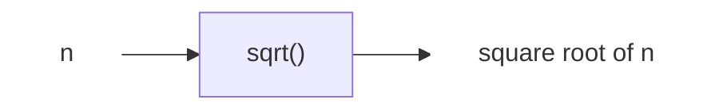

# 202509-Week1-计算概论课程概述

*Updated 2025-09-15 13:29 GMT+8*  
*Compiled by Hongfei Yan (2025 Summer)*    
https://github.com/GMyhf/2025fall-cs101/


> 课程材料
>
> 


# 一、课程安排与内容

学习计算机科学与掌握其他高难度学科并无本质不同。**唯一的成功之道是循序渐进地掌握核心思想。** 初学者需要大量练习以加深理解，为后续的复杂内容打下坚实基础，并逐步建立自信。

<mark>“计算概论”（算法与数据结构导论）是计算机科学的第一门基础课程</mark>。与后续的“数据结构与算法”相比，它更强调算法。课程目标是帮助同学们在解决实际问题的过程中，逐步培养**计算思维**（涵盖数学思维与计算机思维）。

课程整体设计思路：

- **快速上手语法**：通过“阅读说明书式”的学习方法掌握 Python / C++ 基本语法；
- **以练促学**：通过 200+ 道经典习题，结合简洁的参考思路，引导大家体会算法思想与问题求解之美；
- **融会贯通**：逐步理解计算机原理，建立从感性到理性的系统认识。

课程内容分为两大部分：

**第一部分：计算机文化与原理**

- 从计算机发展历史切入，讲解三大基本原理：**图灵机、进程的虚拟地址空间、ASCII 表**；
- 激发学习兴趣，帮助同学们在认知层面建立计算机模型；
- 补充人工智能相关的入门知识。

**第二部分：编程实践与算法训练**

- 学习 Python 与 C++ 语法，掌握与计算机交流的语言；
- 重点使用 Python 进行讲解与练习；
- 在 OJ、LeetCode、Codeforces、洛谷等平台练习算法题，培养解决问题的能力；
- 从贪心、动态规划、递归到搜索，逐步掌握核心算法思想。

Python 以简洁优雅的语法和强大的数据类型，成为讲解算法的理想语言。事实也证明，**投入时间学习算法与数据结构的基本思想，将为后续学习带来长期收益**。


> TIOBE 2025 年 09 月份的编程语言排行榜，https://www.tiobe.com/tiobe-index/
>
> | Sep 2025 | Sep 2024 |Programming Language | Ratings |
> | :------- | :------- | :------------------- | :------ |
> | 1        | 1        |   Python               | 25.98%  |
> | 2        | 2        |   C++                  | 8.80%   |
> | 3        | 4        |   C                    | 8.65%   |
> | 4        | 3        |   Java                 | 8.35%   |
>
> Programming Language
>
> - The language should have an own entry on [Wikipedia](http://en.wikipedia.org/) and Wikipedia should clearly state that it concerns a programming language. 
>
> - The programming language should be [Turing complete](http://en.wikipedia.org/wiki/Turing_completeness).
>  - In [computability theory](https://en.wikipedia.org/wiki/Computability_theory), a system of data-manipulation rules (such as a [model of computation](https://en.wikipedia.org/wiki/Model_of_computation), a computer's [instruction set](https://en.wikipedia.org/wiki/Instruction_set), a [programming language](https://en.wikipedia.org/wiki/Programming_language), or a [cellular automaton](https://en.wikipedia.org/wiki/Cellular_automaton)) is said to be **Turing-complete** or **computationally universal** if it can be used to simulate any [Turing machine](https://en.wikipedia.org/wiki/Turing_machine)[*[citation needed](https://en.wikipedia.org/wiki/Wikipedia:Citation_needed)*] (devised by English mathematician and computer scientist [Alan Turing](https://en.wikipedia.org/wiki/Alan_Turing)). This means that this system is able to recognize or decode other data-manipulation rule sets. Turing completeness is used as a way to express the power of such a data-manipulation rule set. Virtually all programming languages today are Turing-complete. 翻译：在[可计算性理论](https://zh.wikipedia.org/wiki/%E5%8F%AF%E8%AE%A1%E7%AE%97%E6%80%A7%E7%90%86%E8%AE%BA)中，一个数据操作规则系统（如[计算模型](https://zh.wikipedia.org/wiki/%E8%AE%A1%E7%AE%97%E6%A8%A1%E5%9E%8B)、计算机的[指令集](https://zh.wikipedia.org/wiki/%E6%95%88%E6%8C%87%E9%9B%86)、[编程语言](https://zh.wikipedia.org/wiki/%E7%BC%96%E7%A8%8B%E8%AF%AD%E8%A8%80)或[细胞自动机](https://zh.wikipedia.org/wiki/%E7%BB%86%E8%85%BA%E8%87%AA%E5%8A%A8%E6%9C%BA)）如果能够用来模拟任何[图灵机](https://zh.wikipedia.org/wiki/%E5%9B%BE%E7%81%B5%E6%9C%BA)（由英国数学家兼计算机科学家[艾伦·图灵](https://zh.wikipedia.org/wiki/%E8%89%BE%E4%BC%A6%C2%B7%E5%9B%BE%E7%81%B5)发明）则被称为**图灵完备**或**计算通用**。这意味着该系统能够识别或解码其他的数据操作规则集。图灵完备性被用来表示这种数据操作规则集的能力。几乎当今所有的编程语言都是图灵完备的。
>   - 推荐一个电影，The Imitation Game ，是图灵自传。https://pku.instructuremedia.com/embed/6f8ab27f-9485-497e-a8ae-24f8be176f22
>   - 布莱切利园（Bletchley Park） 之旅报告，郭姵妤，2022 年 11 月 23 日，https://github.com/GMyhf/2024fall-cs101/blob/main/Report_on_the_Visit_to_Bletchley_Park.pdf
> 
> - The programming language should have at least 5,000 hits for +"<language> programming" for Google.


## 1.1 答疑安排

1. **AI助教**：小北智学（zx.pku.edu.cn）
2. **线上 7×24 答疑**：课程微信群
   - 提问时请尽量提供：**题目链接**、**清晰截图**、问题描述及源码，以便快速定位问题。
   - 可提出各类课程相关问题：考试、作业、上机、调试等；
   - 群昵称须修改为实名；
   - 助教以 “TA-姓名” 标识，例如 *TA-熊江凯*。
3. **助教现场答疑**：机房上机时间，助教提供面对面指导（自愿参与，无固定任务）。

> **注意**：期末机考以及 10 月、11 月、12 月初的月考期间（因占用机房），不设助教答疑。

机房自第 2 周起开放，配备 PyCharm、VS Code 等常用环境。


同学互助答疑示例


> 几个基础的报错：Compile Error是编译根本不成功；Presentation Error大家可能要考虑是不是结果对了但输出的形式有问题，比如多一个空格少一个空格；Runtime Error运行时错误一般是考虑除0，数组越界，输入为空，递归爆栈这些情况；Time Limit Exceeded和 Memory Limit Exceeded分别是爆时间和爆内存这时候要去考虑算法优化；Wrong Answer是结果错误，这种情况除了考虑正常样例之外可能还要检查设计逻辑，构造corner case，除了尝试题目里的样例还可以自己丢进去试一下。
>
> OJ 是Python 3.8。OJ的pylint是静态检查，有时候报的compile error不对。解决方法有两种，如下：
> 1）第一行加# pylint: skip-file
> 2）方法二：如果函数内使用全局变量（变量类型是immutable，如int），则需要在程序最开始声明一下。如果是全局变量是list类型，则不受影响。


## 1.2 课程内容

课程没有固定教材，而是以经典问题为主线，介绍常见算法与必要数据结构。内容之间存在依赖关系，建议按顺序推进。

总体学习节奏：

- **9 月**：自主学习编程语法（十一假期后需加快进度）；
- **10 月**：贪心、动态规划；
- **11 月**：递归、搜索；
- **12 月**：复习与总结，冲击优秀成绩。

16 周安排如下：

| 1. 课程概述、AI基础             | 2. 计算机文化、AI基础           | 3. 开发环境、程序设计语言、AI基础 |
| ------------------------------- | ------------------------------- | --------------------------------- |
| 4. 计算机原理                   | 5. 语法（1/2）：变量、操作符    | 6. 语法（2/2）：控制结构          |
| 7. 算法（1/6）：贪心和动态规划  | 8. 算法分析                     | 9. 信息传递和二维数组             |
| 10. 算法（2/6）：递归和动态规划 | 11. 算法（3/6）：递归和动态规划 | 12. 算法（4/6）：搜索（1/3）      |
| 13. 算法（5/6）：搜索（2/3）    | 14. 算法（6/6）：搜索（3/3）    | 15~16. 课程总结（1/2、2/2）       |


## 1.3 作业与平台

通常完成时限是一周。

作业周期：**通常为一周**；

提交平台：Canvas（第 2 周选课结束后启用，在此之前请先本地保存作业）；

主要编程平台：OJ（期末机考平台）、LeetCode、Codeforces、洛谷。


### 1.3.1 集成开发环境

Python 开发环境配置指南（Mac 与 Windows）

https://github.com/GMyhf/2025fall-cs101/blob/main/Python_Development_Setup_Mac_Windows.md


在 VS Code 中写第一个 C++ 程序

https://github.com/GMyhf/2025fall-cs101/blob/main/Writing_First_C%2B%2B_Program_in_VS-Code.md


同学A建议： 1）关于机房VS Code的使用：写Python没有pep8习惯的人建议拿到机房的VS Code就去扩展那一栏找到所有名字带数字8（如autopep8,flake8等）的扩展全部禁用，否则一堆的报错很搞人心态； 2）期末机考前一周一定要抽出时间去机房熟悉一下机械键盘的手感（特别是像我这种重度依赖笔记本的用户）否则考试的时候会比较难受。
同学B建议：机房VS Code因插件多不好用，所以还是<mark>PyCharm</mark>


### 1.3.2 编程平台

我们的做题平台主要使用 OJ（http://cs101.openjudge.cn）和 LeetCode（https://leetcode.cn）。


<center>图 http://cs101.openjudge.cn 平台</center>


## 1.4 学习补充说明

### 1.4.1 盲打练习

编程机考时，快速准确的输入是优势。

https://github.com/GMyhf/2025fall-cs101/blob/main/question1_before_class.md


### 1.4.2 题目测试数据

1）常见题号 1000~3256 的数据按需打包提供。当同学们有需求时，将会以单一的zip文件形式单独提供。

> zip文件是mac压缩的，window需要 https://www.7-zip.org 解压缩

2）他人代码：可申请查看优秀提交，用于对比学习。如通过题目统计栏查看，无论是 0ms 的C++代码，还是21ms 的Python3代码，都可以直接在群内提出请求。


### 1.4.4 选课相关

1）访问选课系统（elective.pku.edu.cn）

2） 信息科学技术学院教务：董晓晖，地点：理科1号楼1118，电话：010-62755414，邮箱：dxh@pku.edu.cn

3）即使没有选上我们班的同学，如果愿意，也可以一起探讨编程问题。课程回放链接每次课后发到群内。


### 1.4.5 上机安排和零基础指引

1）一直以来“上机课”0学分，都不录入成绩。可以不选的。但是期末机考一定要参加，是上机时间。
另外有每个月初有一次月考，是在机房进行，尽量参加，熟悉环境。

上机课是助教答疑时间。最后一次上机考试出现是必须的。

> 本班的机房实践时间原则上向所有学生开放（注：期末机考及不计成绩的10月、11月、12月初月考除外；若月考期间有机房空位，其他班级同学可自愿参加）。日常机房开放期间，欢迎同学们前往进行编程练习与自主学习，助教将提供现场答疑支持。参与完全自愿，无固定学习任务或内容要求。

2）零基础学习路径

- 搭建编程环境（1–3天）：安装 Python，配置 VS Code 或 PyCharm。[配置指南](https://github.com/GMyhf/2025fall-cs101/blob/main/Python_Development_Setup_Mac_Windows.md)

- 掌握基础语法（4–10天）：变量与数据类型、条件语句与循环结构、函数定义与使用、常用数据结构（列表、元组、字典、集合等）。建议结合动手练习，巩固理解。

- 持续编程训练（11–100天）：刷 OpenJudge → LeetCode Top 100 / Codeforces / 洛谷。


其中掌握基础语法，可以参考：

- Python 入门：https://www.runoob.com/python3/python3-tutorial.html
- C 入门：https://www.runoob.com/cprogramming/c-tutorial.html
- C++ 入门：https://www.runoob.com/cplusplus/cpp-tutorial.html

语法掌握后，可以在 OJ,  LeetCode 做题。

**编程语言是相通的**。掌握一门语言的基础后，迁移到另一门语言并不困难。课程提供的题目均配有题解，帮助大家在比较与反思中成长。

希望大家在 16 周的学习中，既能收获技能，也能建立起面对复杂问题时的思维方式。


# 二、导论


## 2.1 入门

自从第一台利用转接线和开关来传递计算指令的电子计算机诞生以来，人们对编程的理解与认知经历了多次演变。与社会生活的其他领域类似，计算机技术的变革为计算机科学家提供了愈加丰富的工具与平台，使其能够不断拓展能力与想象力。高效的处理器、高速的网络、以及大容量的存储等新技术层出不穷，这也要求计算机科学家掌握更加复杂与多样的知识体系。

然而，在这一系列快速变革中，仍有一些基本原则始终保持不变。计算机科学的核心始终被认为是一门**利用计算机来解决问题的学科**。


> 使用 https://browser.geekbench.com/ 测试计算设备性能。
>
> 
>
> 图 我的在用设备性能
>
> 
>
> 
>
> 图 以往设备性能
>
> 
>
> 使用 https://www.speedtest.cn 测试网络速度。
>
> 
>
> 图 2024/9/10 理科1号楼有线网络


## 2.2 何谓计算机科学

“计算机科学”并不容易给出一个精准的定义，这或许与“计算机”一词本身有关。事实上，计算机科学并非单纯研究计算机本身。尽管计算机是本学科的重要工具，但它只是工具，而非研究对象的全部。

计算机科学的核心研究对象是**问题、解决问题的过程，以及通过该过程得到的解决方案**。给定一个问题，计算机科学家的目标是构建一个能够逐步解决该问题的**算法**。算法是一种有限步骤的过程，遵循这一过程即可得到问题的解答。换言之，算法就是问题的解决方案。

从这个角度看，可以认为计算机科学就是研究算法的学科。但需要注意的是，并非所有问题都存在解法。尽管这一话题超出了本书的范围，但对学习计算机科学的人来说，认识到某些问题无解是至关重要的。综合来看，计算机科学可以被更完整地定义为：**研究问题及其解决方案，以及研究那些目前无法解决的问题的学科**。

在描述问题及其解决方案时，我们经常使用“**可计算**”一词。如果某个问题存在能够解决它的算法，那么它就是可计算的。因此，计算机科学也可被定义为：**研究可计算与不可计算问题，即算法存在性与不可行性的学科**。无论如何，在这些定义中，“计算机”一词本身并没有出现，因为解决方案并不依赖于具体的计算机。

除了问题与解决方案，计算机科学还强调**抽象**。抽象思维使我们能够分别从逻辑视角和物理视角来理解问题与解决方案。

例如，想象你每天开车去上班或上学。作为司机，你只需会使用方向盘、油门、刹车、档位与点火钥匙，这是从**逻辑视角**（接口）看待汽车。而修车工则必须理解发动机、变速器、温控系统等的细节，这是**物理视角**。

同样地，大多数计算机使用者只需通过界面完成写作、收发邮件、浏览网页、听音乐、存储照片和玩游戏等任务，而无需了解其背后的技术细节。但计算机科学家、程序员、系统管理员等则必须理解操作系统、网络协议、脚本编写等底层机制。

抽象的本质在于：用户只需掌握**接口**的用法，而无需了解实现的细节。举例来说，Python 的 `math` 模块提供了一个计算平方根的函数：

```python
>>> import math
>>> math.sqrt(16)
4.0
>>>
```

这是一个典型的**过程抽象**示例。我们并不需要知道平方根的计算过程，只需了解函数名、输入参数与返回值即可。函数的实现细节被隐藏在“黑盒”中，如图 1-1 所示。




 <center>图1-1 过程抽象</center>


### 2.3.1 何谓编程

**编程**是指通过编程语言将算法编码，使其能被计算机执行的过程。无论使用哪种编程语言、运行在哪种计算机平台上，前提都是必须存在一个可行的算法。

严格来说，计算机科学的研究对象并不是编程本身，但编程却是计算机科学实践中的重要组成部分。它是**算法表达与实现的手段**。通过编程语言，人们定义问题实例所需的数据，以及得到预期结果所需的步骤。

为此，编程语言通常提供两大支撑：

- **控制语句**：顺序、分支、循环，用于清晰地描述算法流程；
- **数据类型**：用于解释和操作计算机内部的二进制数据。

例如，大多数编程语言都提供整数类型，用来表示诸如 23、654、-19 这样的数值，并支持加减乘除等运算。

然而，现实中的问题往往过于复杂。仅靠基础的控制语句和数据类型难以应对，因此我们需要更高级的抽象与结构来管理复杂性。


### 2.3.2 为何学习算法

计算机科学的学习依赖于经验：既要观察他人如何解决问题，也要亲自实践。接触多样化的算法与问题解决方法，有助于在新情境下灵活应对。

不同算法在效率和资源消耗上可能有巨大差异。例如，两个平方根算法都能给出正确答案，但一个可能比另一个快十倍。学习算法分析技巧，能够帮助我们比较算法优劣，并在实践中选择最合适的方案。

有些问题在合理的时间内无法被任何算法解决。这就要求计算机科学家能够区分：

- 可解的问题；
- 无解的问题；
- 有解但代价过高的问题。

算法学习的意义不仅在于“找到解”，更在于**评估解的优劣**。这是一个需要持续练习与经验积累的能力。


## 2.4 Python基础

本节将通过更具体的示例来说明前面介绍的思想。
Python是一门现代化、易于学习的面向对象编程语言。它不仅拥有强大的内建数据类型，还提供了简洁易用的控制语句。作为解释型语言，Python无需编译即可直接运行代码。学习时，只需观察交互式会话的输入与输出即可。解释器会显示提示符 `>>>`，等待输入，并立即执行代码。

例如，以下会话展示了提示符、`print` 函数、运行结果，以及下一个提示符：

```python
>>> print("Algorithms and Data Structures")
>>> Algorithms and Data Structures
>>>
```




### 2.4.1 数据

Python支持**面向对象编程（OOP）**。这意味着在Python中，数据被视为问题求解的核心。
在OOP中，**类（class）**用来描述数据的构成（状态）以及数据可以执行的操作（行为）。通过类实例化得到的对象（object）就是数据的具体表现形式。由于使用者只需关注对象的状态与行为，而无需了解其底层实现，类也可以被看作是一种**抽象数据类型（ADT）**。

#### 1．内建原子数据类型

Python提供了多种基础数据类型：

- **整数与浮点数**：由 `int` 和 `float` 类实现，支持常见的数学运算符：
  `+`、`-`、`*`、`/`、`**`（幂）、`%`（取模）、`//`（整除）。
  注意：两个整数相除时结果为浮点数，而 `//` 会截断小数部分，仅返回整数部分。
- **布尔类型**：由 `bool` 类实现，只有 `True` 和 `False` 两个值。常用逻辑运算符包括：`and`、`or`、`not`。
  布尔值通常作为比较运算（如 `==`、`>`）的结果使用。逻辑运算与关系运算结合，可以表达复杂条件。

表1-1展示了常见的关系与逻辑运算符：

| **Operation Name**    | **Operator** | **Explanation**                                              |
| :-------------------- | :----------- | :----------------------------------------------------------- |
| less than             | <            | Less than operator                                           |
| greater than          | >            | Greater than operator                                        |
| less than or equal    | <=           | Less than or equal to operator                               |
| greater than or equal | >=           | Greater than or equal to operator                            |
| equal                 | ==           | Equality operator                                            |
| not equal             | !=           | Not equal operator                                           |
| logical and           | $and$        | Both operands True for result to be True                     |
| logical or            | $or$         | One or the other operand is True for the result to be True   |
| logical not           | $not$        | Negates the truth value, False becomes True, True becomes False |


**标识符**在程序中用作名字。
在Python中，标识符必须以字母或下划线开头，可以包含字母、数字或下划线，并且区分大小写。采用有意义的命名是良好的编程习惯，有助于代码可读性。

**变量**在首次出现在赋值语句左侧时被创建。赋值语句将名字与数据绑定，变量存储的是数据的引用，而非数据本身。这体现了Python的动态特性：同一个变量在不同时间可以引用不同类型的对象。

#### 2．内建集合数据类型

除数值与布尔类型外，Python还内置了多种集合类。它们可以分为两大类：

- **有序集合**：列表（list）、字符串（string）、元组（tuple）
- **无序集合**：集合（set）、字典（dict）

下面逐一介绍。

------

**（1）列表（list）**
列表是零个或多个数据对象引用的**有序集合**，通过在方括号 `[]` 中用逗号分隔一系列值来表示，例如：

```python
>>> myList = [1, "hello", 3.14]
>>> emptyList = []
```

列表是**异构**的，也就是说，元素可以属于不同的数据类型。由于列表有序，它支持一系列操作（表1-2）。

表1-2 Python序列支持的基本操作

| **Operation Name** | **Operator** | **Explanation**                   |
| ------------------ | ------------ | --------------------------------- |
| indexing           | [ ]          | 访问指定位置的元素（下标从0开始） |
| concatenation      | +            | 拼接两个序列                      |
| repetition         | *            | 重复序列若干次                    |
| membership         | in           | 判断元素是否在序列中              |
| length             | len          | 返回序列长度                      |
| slicing            | [ : ]        | 截取子序列                        |

例如：

```python
>>> myList = [0] * 6
>>> myList
[0, 0, 0, 0, 0, 0]
```

需要注意：重复运算符复制的是引用，而不是数据本身：

```python
>>> myList = [1, 2, 3, 4]
>>> A = [myList] * 3
>>> A
[[1, 2, 3, 4], [1, 2, 3, 4], [1, 2, 3, 4]]
>>> myList[2] = 45
>>> A
[[1, 2, 45, 4], [1, 2, 45, 4], [1, 2, 45, 4]]
```

此时，`A` 中三个子列表实际上都指向同一个 `myList`。

Python还为列表提供了丰富的方法（表1-3）：

表1-3 Python列表常用方法

| **Method Name** | **Use**                | **Explanation**            |
| --------------- | ---------------------- | -------------------------- |
| `append`        | `alist.append(item)`   | 在末尾添加新元素           |
| `insert`        | `alist.insert(i,item)` | 在指定位置插入元素         |
| `pop`           | `alist.pop()`          | 移除并返回最后一个元素     |
| `pop`           | `alist.pop(i)`         | 移除并返回第 `i` 个元素    |
| `sort`          | `alist.sort()`         | 就地排序                   |
| `reverse`       | `alist.reverse()`      | 就地反转顺序               |
| `del`           | `del alist[i]`         | 删除第 `i` 个元素          |
| `index`         | `alist.index(item)`    | 返回首次出现 `item` 的下标 |
| `count`         | `alist.count(item)`    | 返回 `item` 出现次数       |
| `remove`        | `alist.remove(item)`   | 移除首次出现的 `item`      |

------

**（2）字符串（string）**
字符串是由字符（字母、数字、符号等）组成的**有序集合**。
字符串与列表类似，也支持序列操作（如索引、切片、拼接等），但**字符串不可变**。

常见方法示例（表1-4）：

表1-4 Python字符串常用方法

| **Method Name** | **Use**                | **Explanation**                           |
| --------------- | ---------------------- | ----------------------------------------- |
| `center`        | `astring.center(w)`    | 返回宽度为 `w` 的居中字符串               |
| `count`         | `astring.count(item)`  | 返回子串出现次数                          |
| `lower`         | `astring.lower()`      | 转换为小写                                |
| `find`          | `astring.find(item)`   | 返回首次出现子串的下标，若不存在则返回 -1 |
| `split`         | `astring.split(schar)` | 按分隔符拆分为字符串列表                  |

例如：

```python
>>> "CS101".lower()
'cs101'
>>> "a,b,c".split(",")
['a', 'b', 'c']
```

------

**（3）元组（tuple）**
元组与列表类似，也是有序集合，但与字符串一样**不可变**。
语法形式为括号 `()` 内一组逗号分隔的值：

```python
>>> t = (1, "data", 3.14)
```

元组可用于需要不可修改序列的场景，例如作为字典的键。

------

**（4）集合（set）**
集合是零个或多个**不可变对象**的**无序集合**，不允许重复元素。
语法形式为花括号 `{}`，或使用 `set()` 构造函数：

```python
>>> s = {1, 2, 3}
>>> emptySet = set()
```

集合支持数学运算（表1-5）：

表1-5 Python集合的基本运算

| **Operation Name** | **Operator** | **Explanation**      |
| ------------------ | ------------ | -------------------- |
| membership         | in           | 判断元素是否在集合中 |
| union              | ` | `                    |合并|
| intersection       | `&`          | 交集                 |
| difference         | `-`          | 差集                 |
| subset             | `<=`         | 判断是否为子集       |

集合的方法（表1-6）：

表1-6 Python集合常用方法

| **Method Name** | **Use**                       | **Explanation**            |
| --------------- | ----------------------------- | -------------------------- |
| `union`         | `aset.union(otherset)`        | 返回并集                   |
| `intersection`  | `aset.intersection(otherset)` | 返回交集                   |
| `difference`    | `aset.difference(otherset)`   | 返回差集                   |
| `issubset`      | `aset.issubset(otherset)`     | 判断是否为子集             |
| `add`           | `aset.add(item)`              | 添加元素                   |
| `remove`        | `aset.remove(item)`           | 移除元素（若不存在则报错） |
| `pop`           | `aset.pop()`                  | 随机移除并返回一个元素     |
| `clear`         | `aset.clear()`                | 清空集合                   |

------

**（5）字典（dict）**
字典是由**键-值对**组成的无序集合。语法形式为花括号 `{}` 内一系列 `key:value`：

```python
>>> student = {"name": "Alice", "id": 1001}
```

键必须是不可变对象（如字符串、整数、元组），值则没有限制。

常见操作（表1-7）：

表1-7 Python字典的基本操作

| **Operator** | **Use**          | **Explanation**              |
| ------------ | ---------------- | ---------------------------- |
| `[]`         | `myDict[k]`      | 通过键访问值，若不存在则报错 |
| `in`         | `key in adict`   | 判断键是否存在               |
| `del`        | `del adict[key]` | 删除指定键                   |

常见方法（表1-8）：

表1-8 Python字典常用方法

| **Method Name** | **Use**            | **Explanation**                              |
| --------------- | ------------------ | -------------------------------------------- |
| `keys`          | `adict.keys()`     | 返回所有键（dict_keys对象）                  |
| `values`        | `adict.values()`   | 返回所有值（dict_values对象）                |
| `items`         | `adict.items()`    | 返回所有键-值对（dict_items对象）            |
| `get`           | `adict.get(k)`     | 获取键对应的值，不存在时返回 `None`          |
| `get`           | `adict.get(k,alt)` | 获取键对应的值，不存在时返回指定默认值 `alt` |

例如：

```python
>>> student.get("name")
'Alice'
>>> student.get("age", 18)
18
```


### 2.4.2 输入与输出

程序通常需要与用户交互，以便获取输入或输出结果。多数应用使用图形化对话框来收集数据，但在入门阶段，Python 提供了更简洁的方式。

**输入：**
Python 内置函数 `input` 用于从用户处获取输入。它接受一个字符串作为参数，该字符串常被称为**提示字符串**（prompt），用于提示用户输入内容。

```python
aName = input("Please enter your name: ")
```

无论用户输入什么，`input` 都会返回一个字符串。若需要使用其他类型（如整数或浮点数），必须显式进行类型转换：

```python
age = int(input("Please enter your age: "))
```

**输出：**
`print` 函数用于向屏幕输出信息。默认情况下，参数之间以空格分隔，末尾带有换行符。可以通过 `sep` 参数更改分隔符，通过 `end` 参数修改结尾字符：

```python
print("Hello", "World", sep="-", end="!")
# 输出: Hello-World!
```

当需要更精确地控制输出格式时，可以使用**格式化字符串**。格式化字符串将固定文本与占位符结合，后续由变量填充：

```python
name = "Alice"
age = 20
print(f"{name} is {age} years old.")
```


### 2.4.3 控制结构

算法的执行离不开**迭代**和**分支**两类控制结构。Python 提供了多种方式来实现。

**迭代：**

- `while` 语句在条件为真时重复执行：

  ```python
  while count < 5:
      print(count)
      count += 1
  ```

- `for` 语句更为常用，能够直接遍历序列或其他可迭代对象：

  ```python
  for item in [1, 2, 3]:
      print(item)
  ```

**分支：**
`if` 语句用于条件判断。可与 `else` 和 `elif` 组合，实现多分支逻辑：

```python
if x > 0:
    print("Positive")
elif x == 0:
    print("Zero")
else:
    print("Negative")
```

与多数语言类似，Python 允许**嵌套分支**，但推荐使用 `elif` 来减少层次，提高可读性。

**列表解析式：**
除了常规循环，Python 提供了**列表解析式（list comprehension）**，用于基于条件与处理规则快速构建列表：

```python
squares = [x**2 for x in range(10) if x % 2 == 0]
```


### 2.4.4 异常处理

在编程过程中，错误主要分为两类：

1. **语法错误**：编写语句或表达式时出错，解释器无法执行。
2. **逻辑错误**：程序能够运行，但结果错误。例如除以零、访问越界，这些通常会引发**运行时错误**，也称为**异常**。

Python 提供了机制来处理异常，而不是简单地终止程序。可以使用 `try-except` 语句捕获并处理异常：

```python
try:
    result = 10 / 0
except ZeroDivisionError:
    print("Division by zero is not allowed.")
```

此外，程序员还可以在特定情况下主动抛出异常，以便提醒调用者：

```python
raise ValueError("Invalid input!")
```


> 处理不定行输入的常用方法
> 在 Python 中，处理多行输入有以下几种常见方式：
>
> 使用 try...except 捕获输入结束（如 EOFError）
> 利用 sys.stdin 逐行读取
> 通过 sys.stdin.read() 一次性读取所有输入
>
> 
>
> 
>
> 
>
> **04015: 邮箱验证**
>
> strings, http://cs101.openjudge.cn/practice/04015
>
> 这题目输入没有明确结束，需要套在try ...  except里面。测试时候，需要模拟输入结束，看你是window还是mac。If the user hits EOF (*nix: Ctrl-D, Windows: Ctrl-Z+Return), raise EOFError.
>
> ```python
> while True:
>  try:
>      s = input()
>  except EOFError:
>      break
> 
> 		...
>  print('NO' if q==-1 else 'YES')
> ```
>
> 


### 2.4.5 定义函数

函数是一种过程抽象工具，可以将复杂的计算隐藏在简洁的调用中。
在 Python 中，函数定义包含：

- **函数名**
- **参数列表**（可以为空）
- **函数体**
- （可选）**返回值**

示例：

```python
def square(x):
    return x * x

print(square(5))  # 输出 25
```

通过函数，程序员可以将问题分解为更小的部分，提高代码的可读性与复用性。


> 


> 


## 2.5 小结

- 计算机科学的核心是**问题求解**。
- Python 是一门简洁而强大的面向对象语言。
- 列表（list）、元组（tuple）、字符串（string）是顺序集合类型。
- 字典（dict）和集合（set）是非顺序集合类型。
- 输入输出、控制结构、异常处理和函数定义是 Python 编程的基本组成部分。


# 三、其他程序

## 3.1 给选课同学发送邮件

程序示例：https://github.com/GMyhf/2025fall-cs101/blob/main/code/sendEmail.py

由于选课人数超过百人，若直接群发邮件，容易触发邮件服务器的封锁机制。因此需要提前申请白名单。


## 3.2 选课学生的院系分布

为了统计选课学生的院系分布，可以编写程序输出统计结果。若需中文显示，还需额外指定中文字体文件，这在配置上相对繁琐。因此，本课程的程序尽量限制在 **ASCII 范围内**，避免复杂依赖。

在编程中，如果注释也统一使用英文字符，则仅依赖 ASCII 字符集即可。ASCII 中有部分代码被保留作为控制字符（前 32 个），它们并不对应可打印字符，而是用于设备控制（如打印机）。例如：

- 十进制 10 表示换行（newline），
- 十进制 13 表示回车（carriage return），
- 十进制 27 表示转义（escape），键盘左上角的 **Esc** 键即对应该码，
- 十进制 48–57 表示数字 0–9，
- 十进制 65–90 表示大写字母 A–Z，
- 十进制 97–122 表示小写字母 a–z，
- 十进制 127 表示删除（delete）。

如果记不住具体的十进制数值，至少记住 **大写字母的编码在小写字母之前** 即可。


<center>图 ASCII代码表（注：图片来源为 lookuptables.com，已添加横线和矩形框以突出重点）</center>


```python
import pandas as pd
import matplotlib.pyplot as plt

# 读取数据
file_path = '/Users/hfyan/MyPythonApp/studentListInCourse-ADS-20250910.xls'
df = pd.read_excel(file_path)

print("原始数据 df.head():")
print(df.head())
print("原始数据列名:", df.columns.tolist())

# 统计各院系人数并重命名列
df_schools = (
    df['所属院系']
    .value_counts()
    .reset_index()
)

# 确保列名统一为 ['所属院系', 'Count']
old_cols = df_schools.columns.tolist()
if len(old_cols) == 2:
    df_schools = df_schools.rename(columns={old_cols[0]: '所属院系', old_cols[1]: 'Count'})
else:
    raise ValueError(f"意外的列名: {old_cols}")

print("\n统计结果 df_schools.head():")
print(df_schools.head())
print("df_schools 列名:", df_schools.columns.tolist())

# 准备数据
labels = df_schools['所属院系'].tolist()
sizes = df_schools['Count'].tolist()

# 绘图
plt.rcParams['font.family'] = ['Heiti TC']  # 确保中文显示
fig, ax = plt.subplots(figsize=(15, 15))
ax.pie(sizes, labels=labels, autopct='%1.1f%%')

plt.title("2025/9/10 选课院系分布",
          fontsize=20,
          loc="left",
          color="green")
plt.show()

```


运行结果示例：


# 参考

2023/11/5，我使用 [ipaddress.com](https://www.ipaddress.com/) 查询 IP，并将结果写入 hosts 文件后，在移动宽带环境下成功显示了 Markdown 中的图片。

参考文章：
[解决 raw.githubusercontent.com 无法访问的问题（picgo+github 配置图床图片不显示，但仓库已存储成功）](https://blog.51cto.com/reliableyang/6457392)

可根据实际情况，将以下任意一条加入本地 `hosts` 文件：

```
#185.199.108.133  raw.githubusercontent.com
185.199.109.133  raw.githubusercontent.com
185.199.110.133  raw.githubusercontent.com
185.199.111.133  raw.githubusercontent.com
```


